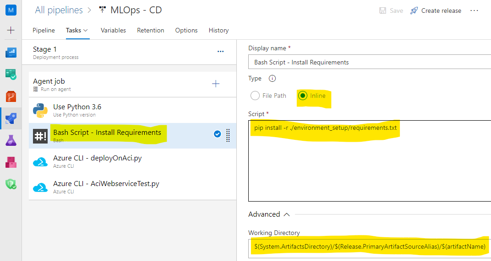

# Challenge 4 – Create a Release Pipeline In Azure DevOps

[< Previous Challenge](./Solution-03.md) - **[Home](./README.md)** - [Next Challenge >](./Solution-05.md)

## Solution

1.  Create a `Release` pipeline with an empty Job
1.  Add `Build` Artifact that you created in the [previous challenge](Solution-03.md)

    

1.  Setup Agent Job
    1.  Set Agent Pool to `Azure Pipelines`
    1.  Set Agent Specification to `ubuntu-18.04`

        

1.  Create a variable to hold the `artifact name` that was set in the `Build` job.

1.  Setup `Release` pipeline – Create a new pipeline, edit the pipeline and add the following tasks (similar to what you have in the Build pipeline)
    1.  Python version – `3.6`.
    1.  `Bash` task to setup environment using `install_environment.sh` file. Make special note of the script path. Artifacts get downloaded to a directory specified by default pipeline variables. You have to specify the path (including the name of the build artifact).

        

    1.  `Azure CLI` task to deploy the scoring image on ACI using `deployOnAci.py` file. Make special note of the `Working Directory`. The script expects to be run from the directory where all the other files are located. By default, the task does not run at this location.

        

    1.  `Azure CLI` task to test the ACI web service using `AciWebserviceTest.py` file.
1.  Verify via the Release pipeline logs that deployment & testing were successful.

    
    

1.  A “healthy” ACI deployment will be created under Azure ML Endpoints. It contains a Scoring URI/Endpoint. Navigate to the `Machine Learning Studio` resource in the [Azure portal](https://portal.azure.com).

    
    