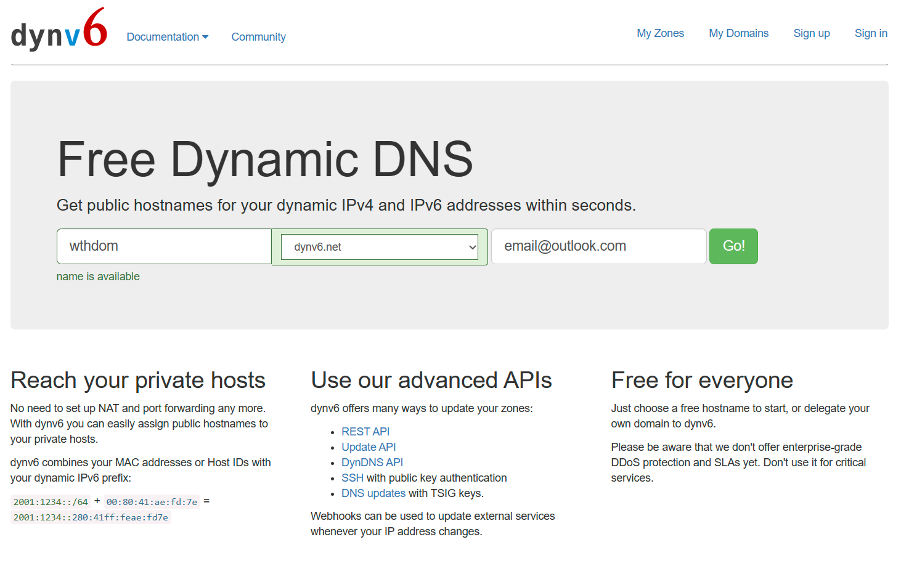
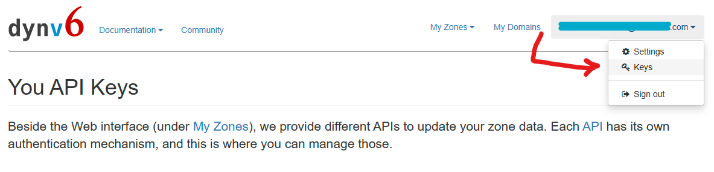
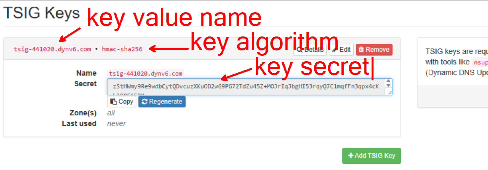
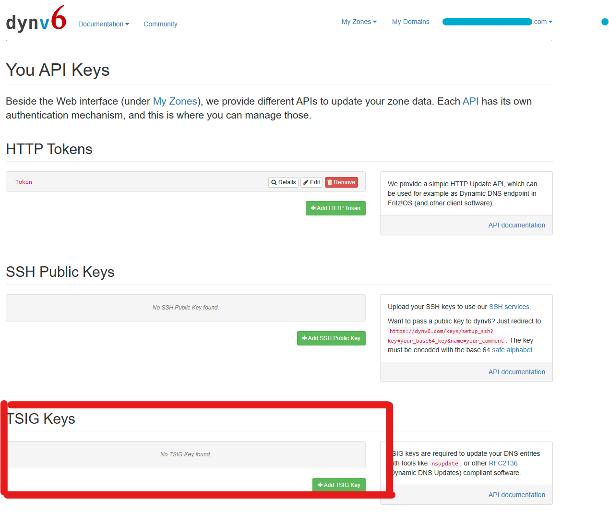
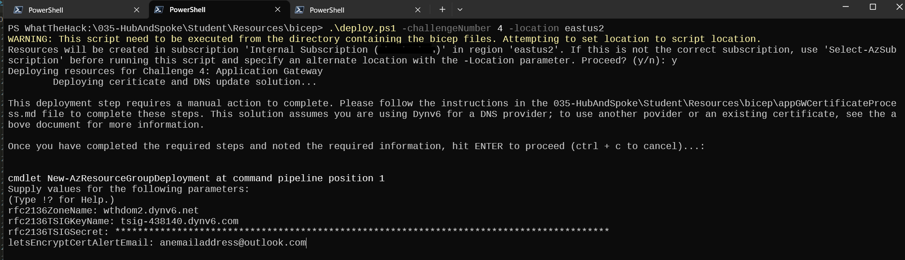

# Process for generating and assigning a certificate to the Application Gateway

The process below describes the steps necessary to utilize automation to generate and publish a new publicly trusted certificate for the Application Gateway used in this lab.

The default process uses Let's Encrypt to generate a publicly trusted certificate. If you already have a certificate and domain you would like to use, see 'Use my own domain and certificate below'. If there are issues with the Let's Encrypt certificate request process, a self-signed certificate can be used

## Register for a Domain Name and Create an API Key

These instructions will use https://dynv6.com to register a free domain name you can use for this lab. Other free DNS providers are likely also compatible, as long as they support updates following the RFC2136 standard (which the lab automation has been written to use); however, you will need to pass a different value for the rfc2136DNSNameserver parameter on the '04-01-hub.bicep' template.

1. Navigate to https://dynv6.com and register a new unique domain name--for example: `wthdom.dynv6.net`
   
1. Complete your registration by confirming your email address
1. After logging in, create a new TSIG Key:
    1. Click your email address at the top right corner of the screen and select the **Keys** link
       
    1. Click the **Add TSIG Key** button
       
    1. In the "Add a new TSIG Key" screen, select Algorithm: **hmac-sha256**
    1. Click **Generate TSIG Key**
    1. Click the **Details** button on the new key, then copy the following values to your notes:
        TSIG Key Name (starts with 'tsig-')
        TSIG Algorithm (should be 'hmac-sha256')
        TSIG Secret (long string, usually ending in '==')
        

## Provide DNS Details During Deployment

When running the deploy.ps1 script to deploy Challenge 4, you will be prompted for the above parameter values, which you can paste into the terminal.



## Troubleshooting

Automating generating a certificate for Application Gateway has three main components to consider:

- **Certificate issuance:** This step requests a certificate from Let's Encrypt using the 'acme-go/lego' container image. The Bicep deployment creates a Container Group/Instance with this image, and requests a certificate. In order to validate that you own the domain name you are requesting a certificate for, Let's Encrypt will complete a 'dns' challenge, where it authenticates to your DNS provider (DynV6, for example). After confirming you have valid credentials for the domain name, a certificate is issued and stored in an Azure Storage Account.
- **Certificate upload to Key Vault:** This step uses a Deployment Script resource to execute an Azure PowerShell script that uploads the above certificate from the Storage Account to an Azure Key Vault. This is necessary because the Application Gateway will access the certificate from the Key Vault.
- **DNS record update:** Lastly, the domain name used for the certificate needs to point to the Application Gateway's Public IP Address, so that when you nagivate to that domain, App Gateway responds to the request and forwards it to your backend pool servers.

Each of the above steps use Azure Container Instances to perform the required automation. The container will typically output logs, viewable in the Portal by navigating to the Container Group resource or Deployment Script resource. In addition to logs, the Container Groups are set to output diagnostic information to the lab Log Analytics Workspace, which may be helpful. 

## Use my own domain and certificate

You can skip this step by passing a Key Vault secret ID in the -challengeParameters parameter of the deploy script. The Application Gateway's identity will need access to this Key Vault to retrieve the certificate secret. For example:

```powershell
./deploy.ps1 -ChallengeNumber 4 -ChallengeParameters @{existingTLSCertKeyVaultSecretID='https://wthotlxegowqsmac.vault.azure.net/secrets/wildcard/0de83a6671604affabc155af5bea1d7f'}
```

If you do this, you will need to perform the following steps yourself:

- Create a certificate for your domain name (wildcard certificates can work)
- Upload a certificate PFX to the KeyVault created in the 'wth-rg-hub' resource group
- Create or update a DNS 'A' record with your DNS provider (ie: GoDaddy, Azure DNS, etc.) that points to the Application Gateway's Public IP Address or a 'CNAME' record pointing to the Application Gateway's DNS name
- Ensure that the Application Gateway identity has permission to access the uploaded certificate's secret
- Pass the certificate secret ID (and version number) as a -challengeParameters, as shown above

## Use a self-signed certificate

If there are issues with the certificate request process from Let's Encrypt, you can alternatively have the Key Vault generate a self-signed certificate for you. Use this option by passing the `@{useSelfSignedCertificate=$true}` challenge parameter when running deploy.ps1. For example:

```powershell
./deploy.ps1 -ChallengeNumber 4 -ChallengeParameters @{useSelfSignedCertificate=$true}
```
