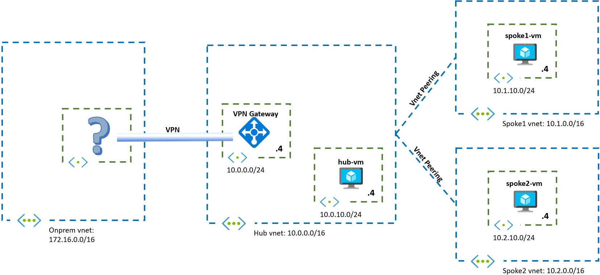

# Challenge 1: Building a Basic Hub And Spoke Topology

[< Previous Challenge](./00-Prereqs.md) - **[Home](../README.md)** - [Next Challenge >](./02-AzFW.md)

## Introduction

In this challenge you will be setting up a basic hub and spoke topology with connectivity to onprem via VPN site-to-site.

## Description

In this challenge you will create the topology described in this diagram:

To simulate the onprem environment (represented as the "onprem vnet" in the diagram above) you have multiple options. See the related documentation and speak to your coach.

## Success Criteria

1. You have a hub and spoke topology with one hub and two spokes.
1. The hub VM can ping the spoke VMs.
1. You have found a way of simulating an onprem environment, and you have connected it via VPN to your Azure hub. An onprem system (either a VM or the onprem VPN device) is able to reach all three Azure VMs.

## Related documentation

* [Virtual Network peering](https://docs.microsoft.com/azure/virtual-network/virtual-network-peering-overview)
* [Hub and Spoke topology in Azure](https://docs.microsoft.com/azure/architecture/reference-architectures/hybrid-networking/hub-spoke)
* [What is Azure Firewall](https://docs.microsoft.com/azure/firewall/overview)
* [What is VPN Gateway](https://docs.microsoft.com/azure/vpn-gateway/vpn-gateway-about-vpngateways)
* [Cisco CSR 1000v Lab Resources](Resources/csr.md)
* [Create a Site-to-Site connection in the Azure portal](https://docs.microsoft.com/azure/vpn-gateway/vpn-gateway-howto-site-to-site-resource-manager-portal)
* [Configure BGP for VPN Gateways](https://docs.microsoft.com/en-us/azure/vpn-gateway/bgp-howto)
* [View BGP status and metrics](https://docs.microsoft.com/en-us/azure/vpn-gateway/bgp-diagnostics)
* [Subnet calculator](https://www.davidc.net/sites/default/subnets/subnets.html)