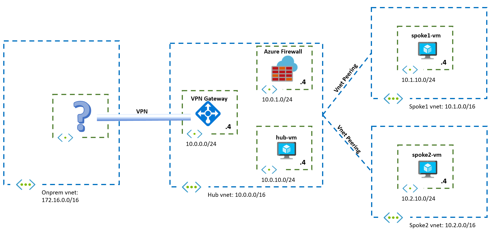

# Challenge 2: Firewalling Traffic

[< Previous Challenge](./01-HubNSpoke-basic.md) - **[Home](../README.md)** - [Next Challenge >](./03-Asymmetric.md)

## Introduction

In this challenge you will be fine-tuning your routing design to send VM traffic through the firewall.

## Description

In this challenge you should deploy an Azure Firewall to the hub VNet, so that you have the topology described here:

You need to make sure that the firewall is inspecting all Internet traffic from the Virtual Machines, as well as traffic going from Azure to onprem.

Additionally, you should install a web server on each Azure VM (`hub-vm`, `spoke1-vm` and `spoke2-vm`), and make sure that the web servers are reachable from the public Internet.

## Success Criteria

1. The spoke VMs can reach each other.
1. The Azure Firewall should inspect traffic from any VM in the hub or the spoke going to the public Internet or to onprem.
1. The Azure Firewall should inspect traffic from any on-premise client going to the hub or any spokes. 
1. The solution should be independent of network administrators adding, changing or removing prefixes in the on-premises network in the future.
1. A web server should be installed on each VM, and it should be reachable from the public Internet.
1. The participants should be able to show Azure Firewall logs, to demonstrate that traffic traverses the firewall.
1. The participants should be able to identify the client source IP as seen by each web server and explain it.

## Related documentation

* [What is Azure Firewall](https://docs.microsoft.com/azure/firewall/overview)
* Example troubleshooting pages that can easily be deployed on the web platform of your choice:
  * [Inspector Gadget](https://github.com/jelledruyts/InspectorGadget) (.netcore)
  * [whoami](https://github.com/erjosito/whoami/tree/master/api-vm) (python/flask)
  * [KUARD](https://github.com/kubernetes-up-and-running/kuard) (container)
* [Azure Routing Cheat Sheet](Resources/routing-cheat-sheet.md)

## Advanced Challenges (Optional)

If you want to dive even deeper in the technology:

- Deploy a second VM in spoke1, in the same subnet that you used for the web server in spoke1, and make sure that intra-subnet VM goes through the Azure Firewall as well. This is what sometimes is called microsegmentation or zero-trust segmentation.
- Configure the Azure Firewall with a combination of Network Rules and Application Rules, and explain the order in which the rules are matched. Are you able to use Application Rules for traffic sent from the public Internet to the web servers over DNAT?
