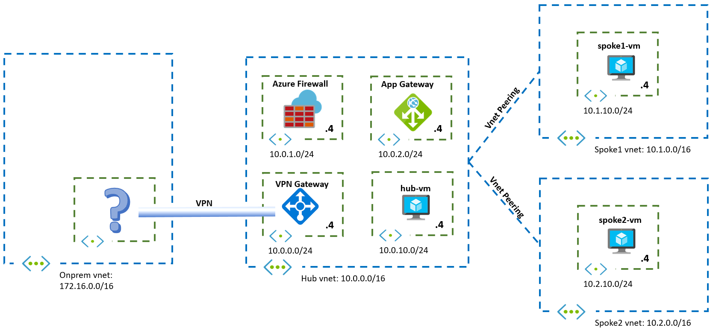

# Challenge 4: Application Gateway

[< Previous Challenge](./03-Asymmetric.md) - **[Home](../README.md)** - [Next Challenge >](./05-PaaS.md)

## Introduction

In this challenge you will integrate an Application Gateway in the design.

## Description

Your security department has decided that you need to put a Web Application Firewall in front of your web workloads, and you decide to go for the Azure Application Gateway.

## Success Criteria

1. You have enabled SSL in the App Gateway to provide HTTPS connectivity to users accessing your site
1. You can access the web sites in each VM in the hub and in the spokes through the Application Gateway via different URLs
1. Can you still see the client IP in the web servers?

## Related documentation

- [What is Azure Application Gateway](https://docs.microsoft.com/azure/application-gateway/overview)
- [How an Application Gateway works](https://docs.microsoft.com/azure/application-gateway/how-application-gateway-works)
- [nip.io](https://nip.io/)

## Advanced Challenges (Optional)

- Configure SSL encryption on the App Gateway. For SSL you can use self-signed certificates or generate them with [LetsEncrypt](https://letsencrypt.org/
- Configure end-to-end SSL (you would need a backend with SSL support). For SSL you can use self-signed certificates or generate them with [LetsEncrypt](https://letsencrypt.org/)
- Make both sites (spoke1 and spoke2) reachable under the same listener, but have a different URL for each site (like `https://appgw.contoso.com/spoke1` and `https://appgw.contoso.com/spoke2`, for example)
- Modify the design so that the Azure Firewall inspects the web traffic, optionally while using end-to-end SSL
