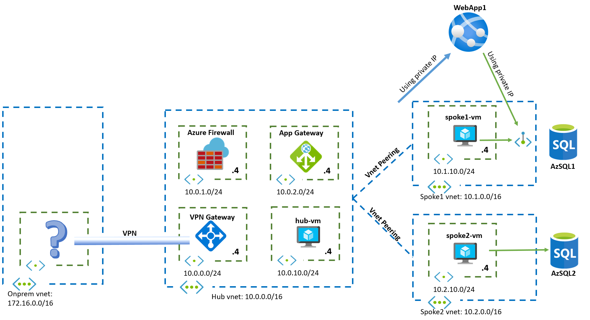

# Challenge 5: PaaS Networking

[< Previous Challenge](./04-AppGW.md) - **[Home](../README.md)**

## Introduction

In this challenge you will have a deep look at ways of integrating Azure PaaS services with your Virtual Network.

## Description

You are charged to integrate Azure PaaS services into the design. First, the web servers in the spokes need to access each an Azure SQL Database, but with different requirements:

- The VM in spoke1 needs to access its database `AzSQL1` using private IP addresses. DB admins onprem should be able to connect to this database using private IP addresses too
- Only VMs in spoke2 subnets should be able to access the database for spoke2, `AzSQL2`
- None of the databases should be accessible from the public Internet

Additionally, there is an Azure Web Application, that needs connectivity to the spoke1 database `AzSQL1`. The Azure Web App should also use private IP addresses when accessing the database. The Azure Web App itself should be accessible to onprem users using private addresses.

The following diagram summarizes these requirements:

## Success Criteria

1. You have created 2 Azure SQL databases, `AzSQL1` and `AzSQL2` (feel free to use different names, since Azure SQL Server names need to be globally unique):
    1. `AzSQL1` needs to be accessible from onprem over site-to-site VPN
    1. `AzSQL2` is only accessible from the spoke2-vm subnet
    1. `AzSQL1` and `AzSQL2` should not be accessible from the public Internet
1. You have created an Azure Web Application
    1. The Azure WebApp should be reachable from all your environment using private IP addresses
    1. The Azure WebApp should reach `AzSQL`1 using private IP addresses

## Related documentation

- [Inspector Gadget](https://github.com/jelledruyts/InspectorGadget) (.netcore)
- [Private Link](https://docs.microsoft.com/azure/private-link/private-link-overview)
- [Virtual Network Service Endpoints](https://docs.microsoft.com/azure/virtual-network/virtual-network-service-endpoints-overview)
- [Azure Private Endpoint DNS Configuration](https://docs.microsoft.com/en-us/azure/private-link/private-endpoint-dns)

## Advanced Challenges (Optional)

If you want to dive even deeper in the technology:

- Force traffic going to the SQL database `AzSQL1` over its private endpoint, coming from `spoke1-vm` and `webapp1`, to traverse the Azure Firewall
- Is the public endpoint still available when you configure a private endpoint?
