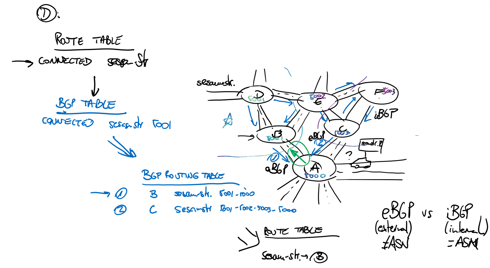

# Challenge 0: Environment Setup - Coach's Guide

**[Home](./README.md)** - [Next Challenge >](./01-lab_exploration.md)

## Before you start

- Try to get participants to use code (PS or CLI)
- Make sure they have a way to share code, ideally via git
- If there is any concept not clear for everybody, try to make participants explain to each other. Intervene only when no participant has the knowledge
- Leave participants try designs even if you know it is not going to work, let them explore on themselves. Stop them only if they consume too much time
- **Make sure no one is left behind**
- For each challenge, you can ask the least participative members to describe what has been done and why
- Feel free to customize scenarios to match your participants' level: if they are too new to Azure, feel free to remove objectives. If they are too advanced, give them additional ones
- A short theoretical introduction to BGP has proven to be useful in previous deliveries of this hack. The method we have used is whiteboarding an analogy of a car trying to find its way to a street in a city, where the roundabouts (the routers) exchange routing information, and the postal codes are the ASNs. Here you can find an example of one of the sessions, but feel free to use your own way of explaining BGP:

## Deploying the environment

Since this Hack is not about deploying VNets or NVAs, you can use a script to deploy the infrastructure that you will be working on. You will find a script called `bgp.sh` in the file resources supplied for this Hack, which you can run to deploy the environment. The script has been tested to run in Azure Cloud Shell. Note that the script takes around 1 hour to complete, and it requires certain dependencies to exist. Therefore, it is recommended to deploy the environment the day before the Hack.

If participants deploy the script during the same day of the event, you can bridge the time it takes to run with a theoretical explanation of BGP (refer to the sample whiteboard of the previous section).

Participants some times struggle with the required dependencies, deploying this in your own subscription in advance might help during the Hack, so you might want to deploy this in your subscription the day before.

The alternative to using the script is creating the resources manually. However, participants often get a "waste of time" feeling when investing a long time in creating Azure resources and configuring IPsec tunnels, which is not relevant for understanding BGP.

Note that there are no licensing costs associated to the Cisco NVAs, but accepting the MarketPlace terms for the Cisco offer is required. The deployment script does that for you, what requires privilege at the subscription scope.

## Solution Guide

### Script Output Sample

Sample output of a deployment with [bgp.sh](../Student/Resources/bgp.sh):

<pre>
❯ ./bgp.sh "1:vng1:65001,2:vng:65002,3:csr:65100,4:csr:65100,5:csr:65100" "1:2:nobgp,1:3:nobgp,1:4:nobgp,2:3:nobgp,2:4:nobgp,3:4:nobgp,3:5,4:5" wthbgp northeurope "supersecretpsk"
All dependencies checked successfully
Azure CLI extension "log-analytics" found with version 0.2.1
Running on BASH
Press any key to start creating Azure resources into Azure subscription "Azure CXP FTA Internal Subscription JOMORE"...

Creating resource group wthbgp...
Accepting image terms for cisco:cisco-csr-1000v:16_12-byol:16.12.120190816...
Creating router of type vng1, id 1, ASN 65001...
Creating vnet vng1...
Creating test virtual machine testvm1 in vnet vng1 in new subnet 10.1.1.0/24...
Creating public IP addresses for gateway vng1...
Creating VNG vng1 in active/passive mode...
Creating router of type vng, id 2, ASN 65002...
Creating vnet vng2...
Creating test virtual machine testvm2 in vnet vng2 in new subnet 10.2.1.0/24...
Creating public IP addresses for gateway vng2...
Creating VNG vng2 in active/active mode...
Creating router of type csr, id 3, ASN 65100...
Creating VM csr3-nva in Vnet 10.3.0.0/16...
CSR created with IP address 52.138.173.126. Creating Local Network Gateway now...
Creating router of type csr, id 4, ASN 65100...
Creating VM csr4-nva in Vnet 10.4.0.0/16...
CSR created with IP address 40.69.71.195. Creating Local Network Gateway now...
Creating router of type csr, id 5, ASN 65100...
Creating VM csr5-nva in Vnet 10.5.0.0/16...
CSR created with IP address 52.164.228.44. Creating Local Network Gateway now...
Verifying 1:vng1:65001...
Gateway vng1 status is Updating
Verifying 2:vng:65002...
Gateway vng2 status is Updating
Verifying 3:csr:65100...
VM csr3-nva status is Creating, public IP is 52.138.173.126
Verifying 4:csr:65100...VM csr4-nva status is Creating, public IP is 40.69.71.195
Verifying 5:csr:65100...
VM csr5-nva status is Creating, public IP is 52.164.228.44
Waiting for CSR3 with IP address 52.138.173.126 to answer over SSH...
IP address 52.138.173.126 is available (wait time 3 minutes and 36 seconds). Answer to SSH command "show version | include uptime":
csr3-nva uptime is 0 minutes
Waiting for CSR4 with IP address 40.69.71.195 to answer over SSH...
IP address 40.69.71.195 is available (wait time 1 minutes and 4 seconds). Answer to SSH command "show version | include uptime":
csr4-nva uptime is 0 minutes
Waiting for CSR5 with IP address 52.164.228.44 to answer over SSH...
IP address 52.164.228.44 is available (wait time 1 minutes and 36 seconds). Answer to SSH command "show version | include uptime":
csr5-nva uptime is 1 minute
Our IP seems to be 109.125.122.99
Configuring CSR 52.138.173.126 for VPN and BGP...
Creating VM testvm3 in vnet csr3...
Enabling IP forwarding for csr3...
Our IP seems to be 109.125.122.99
Configuring CSR 40.69.71.195 for VPN and BGP...
Creating VM testvm4 in vnet csr4...
Enabling IP forwarding for csr4...
Our IP seems to be 109.125.122.99
Configuring CSR 52.164.228.44 for VPN and BGP...
Creating VM testvm5 in vnet csr5...
Enabling IP forwarding for csr5...
Adding RFC1918 prefixes to NSG csr3-nvaNSG...
Adding RFC1918 prefixes to NSG csr4-nvaNSG...
Adding RFC1918 prefixes to NSG csr5-nvaNSG...
Adding RFC1918 prefixes to NSG testvm1NSG...
Adding RFC1918 prefixes to NSG testvm2NSG...
Adding RFC1918 prefixes to NSG testvm3NSG...
Adding RFC1918 prefixes to NSG testvm4NSG...
Adding RFC1918 prefixes to NSG testvm5NSG...
Waiting for resource vng1 to finish provisioning...
Resource vng1 provisioning state is Succeeded, wait time 8 minutes and 14 seconds
Waiting for resource vng2 to finish provisioning...
Resource vng2 provisioning state is Succeeded, wait time 0 minutes and 1 seconds
Creating LA workspace log18471...
Configuring diagnostic settings for gateway vng1
Configuring diagnostic settings for gateway vng2
Creating connection between vng1 1 and vng 2, type "nobgp"...
Connecting vng1 and vng2. Finding out information about the gateways...
Extracted info for vpngw1: ASN 65001, 40.127.161.185, 10.1.0.254.
Creating local network gateways for vng1...
Creating local network gateways for vng2...
Extracted info for vpngw2: ASN 65002 GW0 40.127.161.56, 10.2.0.4. GW1 40.127.161.68, 10.2.0.5.
Connecting vng1 to local gateways for vng2...
Connecting vng2 to local gateways for vng1...
Creating connection between vng1 1 and csr 3, type "nobgp"...
Extracted info for vpngw: ASN 65001, 40.127.161.185, 10.1.0.254.
Configuring tunnels between CSR 3 and VPN GW 1
Configuring tunnel 310 in CSR 52.138.173.126...
No routing protocol configured on 310 in CSR 52.138.173.126...
Creating VPN connections in Azure...
Creating connection between vng1 1 and csr 4, type "nobgp"...
Extracted info for vpngw: ASN 65001, 40.127.161.185, 10.1.0.254.
Configuring tunnels between CSR 4 and VPN GW 1
Configuring tunnel 410 in CSR 40.69.71.195...
No routing protocol configured on 410 in CSR 40.69.71.195...
Creating VPN connections in Azure...
Creating connection between vng 2 and csr 3, type "nobgp"...
Extracted info for vpngw: ASN 65002, GW0 40.127.161.56, 10.2.0.4. GW1 40.127.161.68, 10.2.0.5.
Configuring tunnels between CSR 3 and VPN GW 2
Configuring tunnel 320 in CSR 52.138.173.126...
No routing protocol configured on 320 in CSR 52.138.173.126...
Configuring tunnel 321 in CSR 52.138.173.126...
No routing protocol configured on 321 in CSR 52.138.173.126...
Creating VPN connections in Azure...
Creating connection between vng 2 and csr 4, type "nobgp"...
Extracted info for vpngw: ASN 65002, GW0 40.127.161.56, 10.2.0.4. GW1 40.127.161.68, 10.2.0.5.
Configuring tunnels between CSR 4 and VPN GW 2
Configuring tunnel 420 in CSR 40.69.71.195...
No routing protocol configured on 420 in CSR 40.69.71.195...
Configuring tunnel 421 in CSR 40.69.71.195...
No routing protocol configured on 421 in CSR 40.69.71.195...
Creating VPN connections in Azure...
Creating connection between csr 3 and csr 4, type "ospf"...
Configuring tunnel 34 in CSR 52.138.173.126...
Configuring OSPF on tunnel 34 in CSR 52.138.173.126...
Configuring tunnel 43 in CSR 40.69.71.195...
Configuring OSPF on tunnel 43 in CSR 40.69.71.195...
Creating connection between csr 3 and csr 5, type "ospf"...
Configuring tunnel 35 in CSR 52.138.173.126...
Configuring OSPF on tunnel 35 in CSR 52.138.173.126...
Configuring tunnel 53 in CSR 52.164.228.44...
Configuring OSPF on tunnel 53 in CSR 52.164.228.44...
Creating connection between csr 4 and csr 5, type "ospf"...
Configuring tunnel 45 in CSR 40.69.71.195...
Configuring OSPF on tunnel 45 in CSR 40.69.71.195...
Configuring tunnel 54 in CSR 52.164.228.44...
Configuring OSPF on tunnel 54 in CSR 52.164.228.44...
Getting BGP neighbors for router 1:vng1:65001...
BGP neighbors for vng1:

Getting BGP neighbors for router 2:vng:65002...
BGP neighbors for vng2:
Neighbor    ASN    State      ConnectedDuration    RoutesReceived    MessagesSent    MessagesReceived
----------  -----  ---------  -------------------  ----------------  --------------  ------------------
10.2.0.4    65002  Connected  00:15:13.9595914     3                 40              39
10.2.0.5    65002  Unknown                         0                 0               0
10.2.0.4    65002  Unknown                         0                 0               0
10.2.0.5    65002  Connected  00:15:14.1940440     3                 37              42
Getting BGP neighbors for router 3:csr:65100...
BGP neighbors for csr3-nva (52.138.173.126):

Getting BGP neighbors for router 4:csr:65100...
BGP neighbors for csr4-nva (40.69.71.195):

Getting BGP neighbors for router 5:csr:65100...
BGP neighbors for csr5-nva (52.164.228.44):

Your resources should be ready to use in resource group wthbgp. Enjoy!
</pre>

 
