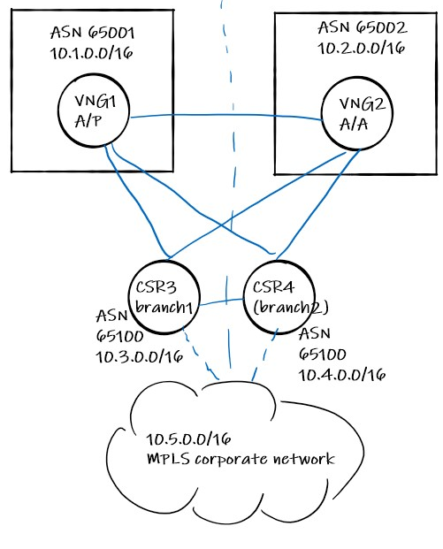

# Challenge 0: Environment Setup

**[Home](../README.md)** - [Next Challenge >](./01-lab_exploration.md)

## Description

Since this Hack is not about deploying VNets or NVAs, you can use a script to deploy the infrastructure that you will be working on. You will find a script called `bgp.sh` in the file resources supplied for this Hack, which you can run to deploy the environment. The script has been tested to run in Azure Cloud Shell. Note that the script takes around 1 hour to complete, and it requires certain dependencies to exist. Therefore, it is recommended to deploy the environment the day before the Hack:

```bash
bash ./bgp.sh '1:vng1:65001,2:vng:65002,3:csr:65100,4:csr:65100,5:csr:65100' '1:2:nobgp,1:3:nobgp,1:4:nobgp,2:3:nobgp,2:4:nobgp,3:4:nobgp,3:5,4:5' wthbgp northeurope 'SuperSecretPsk!0123'
```

The previous command will deploy the topology described in the following diagram without the BGP adjacencies (which you will configure as part of the challenge), including VPN Virtual Network Gateways in VNet 1 (in active/passive mode) and VNet 2 (in active-active mode). The script will take around 1h to run, during which time your coach will give you a theory intro on BGP. The script has been tested to run in Azure Cloud Shell, but it should run in any Linux environments where the dependencies are installed (the script will check for those dependencies and error out if it doesn't find them).



### Note regarding preshared key:
Your preshared key must satisfy the following criteria:
* Must be at least 12 characters long
* Must contain at least one of each of the following character types:
    * Uppercase letters
    * Lowercase letters
    * Digits 0-9
    * Punctuation characters such as .,!(){}[]_

## Success Criteria

- Two VNGs and three Cisco CSRs deployed, each in its own VNet.
- IPsec tunnels created, BGP not configured (except for the onprem adjacencies CSR3-CSR5 and CSR4-CSR5)
