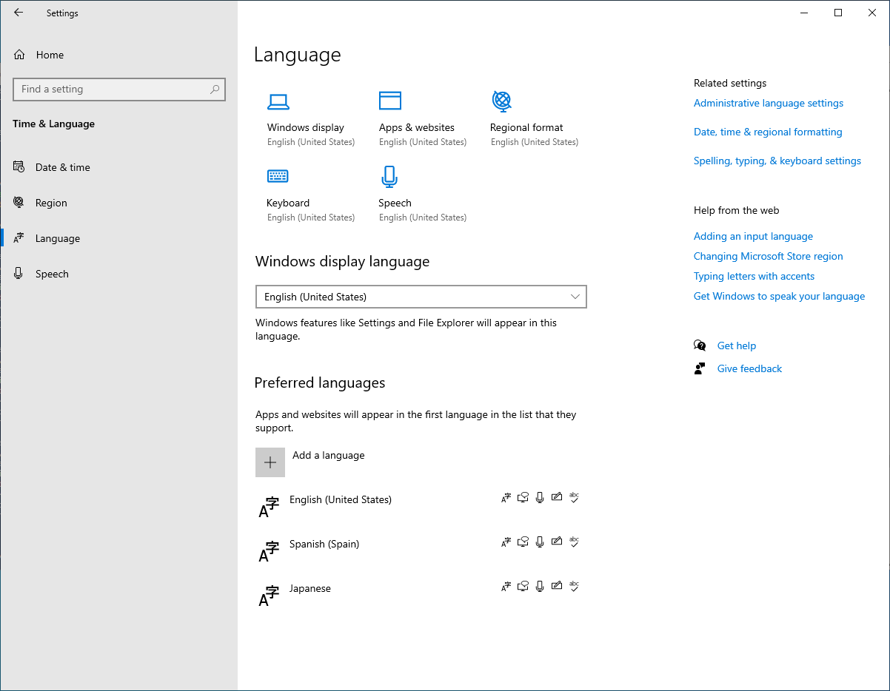

# Challenge 4: Create and Manage Images

[< Previous Challenge](./03-Implement-Manage-Storage.md) - **[Home](./README.md)** - [Next Challenge>](./05-Create-Configure-HostPools.md)

## Notes & Guidance

This is the outline of the images that should be created by the student.
| Persona |  Base Image  | Image Creation Method | Image Location | Regions  |
--- | --- | --- | --- | ---
| Remote Field | Windows Server 2019 Datacenter | Virtual Machine Capture | Custom Image | UK South |
| General Office | Windows 10 Enterprise Multi-session + M365 Apps | Azure Image Builder | Shared Image Gallery | US East<br>Replicas in Japan West, UK South |
| Developer | Windows 10 Enterprise | N/A | Azure Marketplace | Japan West |

* Remote Field
    * Installing Microsoft Office
        * Ensure Office is installed in shared computer activation mode and to skip the installation of Teams and OneDrive as [documented here](https://docs.microsoft.com/en-us/azure/virtual-desktop/install-office-on-wvd-master-image#install-office-in-shared-computer-activation-mode). Teams and OneDrive ill be installed separately.
    * Installing Microsoft OneDrive
        * OneDrive should be installed in per-machine mode instead of the typical per-user mode. OneDrive should be installed separately from the Office suite and following the steps [documented here](https://docs.microsoft.com/en-us/azure/virtual-desktop/install-office-on-wvd-master-image#install-onedrive-in-per-machine-mode).
    * Installing Microsoft Teams
        * Teams is supported on AVD for chat and collaboration. There is a media optimizations for Teams so the AVD client handles the audio and video locally for Teams calls and meetings. Teams should be installed and configured with the media optimizations following the steps [documented here](https://docs.microsoft.com/en-us/azure/virtual-desktop/teams-on-wvd).
    * Installing FSLogix
        * FSLogix can be downloaded [from here](https://aka.ms/fslogix_download). More details on the download and install are [documented here](https://docs.microsoft.com/en-us/fslogix/install-ht).
    * Installing Notepad++ and Adobe Acrobat
        * Install these applications using the downloads available at their respective websites.
    * When they run Sysprep on the machines, make sure they follow the guidelines using the [VM capture](https://docs.microsoft.com/en-us/azure/virtual-machines/windows/capture-image-resource). Specifically follow the options in the screenshot or command line below.
        * 
        * Command line example
            ``` cmd
            C:\Windows\System32\Sysprep\sysprep.exe /oobe /generalize /shutdown
            ```
    * When they update the image, they will deploy a new VM from the snapshot taken before they ran Sysprep when initially creating the image. The goal is to avoid running Sysprep multiple times on the same image.
    * When updating the image template to add the language packs for Spanish and Japanese, there are samples and instructions to add language packs to a Windows 10 multi-session image [here in the docs](https://docs.microsoft.com/en-us/azure/virtual-desktop/language-packs#enable-languages-in-windows-settings-app). To validate the languages are available, navigate to Settings > Time & Language > Language.
        * 
* General Office
    * As of April 2, 2020, AIB does not support creating Gen2 VMs, [documented here](https://docs.microsoft.com/en-us/azure/virtual-machines/image-builder-overview#hyper-v-generation).
    * The [AVD walkthrough in the AIB docs](https://docs.microsoft.com/en-us/azure/virtual-machines/windows/image-builder-virtual-desktop) is very helpful for this scenario. Additionally, the AIM ARM template reference is located [here in the docs](https://docs.microsoft.com/en-us/azure/virtual-machines/linux/image-builder-json).
    * To get started with AIB, the students will have to register for the Microsoft.VirtualMachineImages resource provider and features, as [documented here](https://docs.microsoft.com/en-us/azure/virtual-machines/windows/image-builder-powershell#register-features).
    * The students have to create a managed identity to be used by AIB to create the image, as [documented here](https://docs.microsoft.com/en-us/azure/virtual-machines/windows/image-builder-powershell#create-user-identity-and-set-role-permissions). If the users are in a tenant where you cannot create anymore custom roles for the managed identity for AIB, they can leverage a built-in role with more permissions for the FastHack.
    * The students will create a Shared Image Gallery (SIG) to store the images created by AIB, as [documented here](https://docs.microsoft.com/en-us/azure/virtual-machines/windows/image-builder-powershell#create-a-shared-image-gallery).
    * Installing Microsoft Teams
        * Teams can be installed and configured for a Windows 10 multi-session image with a custom PowerShell script already published in GitHub [in this repo](https://github.com/danielsollondon/azvmimagebuilder/tree/master/solutions/14_Building_Images_WVD). This script can be executed with the [PowerShell customizer in AIB](https://docs.microsoft.com/en-us/azure/virtual-machines/linux/image-builder-json#powershell-customizer).
    * Reboot the VM
        * The VM can be rebooted with the [Windows restart customizer in AIB](https://docs.microsoft.com/en-us/azure/virtual-machines/linux/image-builder-json#windows-restart-customizer).
    * Run Windows Update
        * Windows Update can be run using the [Windows Update customizer in AIB](https://docs.microsoft.com/en-us/azure/virtual-machines/linux/image-builder-json#windows-update-customizer).
    * Installing Language Packs
        * When updating the image template to add the language packs for Spanish and Japanese, there are samples and instructions to add language packs to a Windows 10 multi-session image [here in the docs](https://docs.microsoft.com/en-us/azure/virtual-desktop/language-packs#enable-languages-in-windows-settings-app). The language packs are installed with a custom PowerShell script executed with the [PowerShell customizer in AIB](https://docs.microsoft.com/en-us/azure/virtual-machines/linux/image-builder-json#powershell-customizer).
    * There are two ARM templates to deploy the virtual machine template in AIB. The original image template can be deployed with [04-imageTemplate-original.json](./Solutions/04-imageTemplate-original.json) and the updated image template can be deployed with [04-imageTemplate-update.json](./Solutions/04-imageTemplate-update.json). Several of the PowerShell scripts are referenced from the azvmimagebuilder repo in the section [Building Images for AVD](https://github.com/danielsollondon/azvmimagebuilder/tree/master/solutions/14_Building_Images_WVD) and the PowerShell script to install the language packs are in this repo [located here](./Solutions/04-installLanguagePacks.ps1).
        ```powershell
        $params = @{
            resourceGroupName = "" # Resource group name where AIB exists
            location = "eastus"
            imageTemplateName = "GeneralOfficeImageTemplate"
            identityId = "" # Resource ID of the user assigned managed identity for AIB
            sigImageId = "" # Resource ID of the SIG galllery
        }
        New-AzResourceGroupDeployment -Name "GeneralOfficeAIBDeployment" -TemplateFile .\04-imageTemplate-original.json @params
        ```
    * There are also two bicep files to deploy the virtual machine template in AIB. The original image template can be deployed with [04-imageTemplate-original.bicep](./Solutions/04-imageTemplate-original.bicep) and the updated image template can be deployed with [04-imageTemplate-update.bicep](./Solutions/04-imageTemplate-update.bicep).
        * Azure PowerShell example
        ```powershell
        $params = @{
            resourceGroupName = "" # Resource group name where AIB exists
            location = "eastus"
            imageTemplateName = "GeneralOfficeImageTemplate"
            identityId = "" # Resource ID of the user assigned managed identity for AIB
            sigImageId = "" # Resource ID of the SIG galllery
        }
        New-AzResourceGroupDeployment -Name "GeneralOfficeAIBDeployment" -TemplateFile .\04-imageTemplate-original.bicep @params
        ```
        * AzCLI example
        ```bash
        az deployment group create -f ./04-imageTemplate-original.bicep -g <resourceGroupName> --parameters imageTemplateName=<imageTemplateName> identityId=<managedIdentityId> sigImageId=<sigGalleryId>
        ```
* Developer
    * Since this is leveraging an image from the Azure Marketplace, there should not be any custom images.
