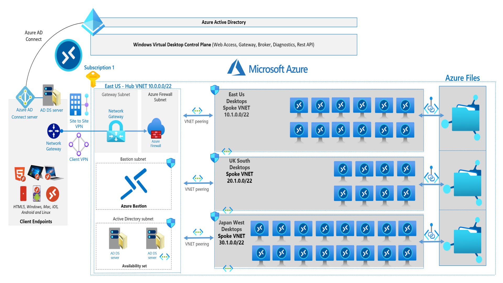

# Challenge 2: Implement and Manage Networking for AVD

[< Previous Challenge](./01-Plan-AVD-Architecture.md) - **[Home](../README.md)** - [Next Challenge >](./03-Implement-Manage-Storage.md)

## Introduction

In this challenge you will be setting up networking resources in order to deploy Azure Virtual Desktop. Your spoke virtual networks will be connected to your HUB vnet. Connectivity would need to be established for each virtual network in its respected region.

## Description

In this challenge you will create the topology described in this diagram:



* Setup HUB virtual network that will consist of the following resources:

    * Virtual Network with four subnets
    * Two Domain Controllers
    * Azure Bastion service and NSG to secure Bastion
    * Deploy Virtual Network Gateway

* Setup a client VPN to your Hub virtual network
* Build three virtual network spokes in each user region

    * Spokes should be peered with Hub and not with each other
    * Configure network security groups on subnets in spoke vnets

* Enable network watcher for all user regions

### Deploy HUB

#### POWERSHELL

```powershell
New-AzSubscriptionDeployment -Location 'eastus' -TemplateUri 'https://raw.githubusercontent.com/microsoft/WhatTheHack/master/037-AzureVirtualDesktop/Student/Resources/challenge-02_Template.json' -Verbose
```

#### AZURE CLI

```shell
az deployment sub create --location 'eastus' --template-uri 'https://raw.githubusercontent.com/microsoft/WhatTheHack/master/037-AzureVirtualDesktop/Student/Resources/challenge-02_Template.json' --verbose
```

## Success Criteria

1. Hub and spoke topology with one hub and three spokes
1. Participants should be able to control inbound and outbound rules on AVD subnets
1. Participants should be able to monitor, diagnose, view metrics, and enable or disable logs for networks

## Advanced Challenges (Optional)

If you would like to dive deeper in AVD networking:

* Setup a site to site VPN to your HUB virtual network
