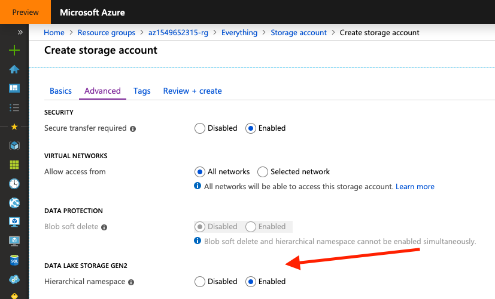

# Challenge 2: Coach's Guide

[< Previous Challenge](./01-Background.md) - **[Home](README.md)** - [Next Challenge >](./03-CloudIngest.md)

The first challenge is designed to establish an enterprise data lake.
The goal of this challenge is to get the team to choose and provision their storage.

### Provisioning an enterprise data lake

In the WhatTheHack, we recommend using ADLS Gen 2.

#### Alternative Setups

We strongly advise you to use ADLS Gen 2, but there are alternative options.

- ADLS Gen 1
- Azure Blob Storage

#### Why Gen 2

The [Introduction to Azure Data Lake Storage Gen2](https://docs.microsoft.com/en-us/azure/storage/blobs/data-lake-storage-introduction) provides even more detail around the key features and supported plaforms.

> Azure Data Lake Storage Gen2 is a set of capabilities dedicated to big data analytics, built on Azure Blob storage. Data Lake Storage Gen2 is the result of converging the capabilities of our two existing storage services, Azure Blob storage and Azure Data Lake Storage Gen1. Features from Azure Data Lake Storage Gen1, such as file system semantics, directory, and file level security and scale are combined with low-cost, tiered storage, high availability/disaster recovery capabilities from Azure Blob storage.

Put another way,

> A Gen2 capability is what is called “multi-modal” which means customers can use either Blob object store APIs or the new Gen2 file system APIs.  The key here is that both blob and file system semantics are now supported over the same data. - [James Serra's Blog](https://www.jamesserra.com/archive/2018/06/azure-data-lake-store-gen2/)

Another resource on this topic is [A closer look at Azure Data Lake Storage Gen2](https://azure.microsoft.com/en-us/blog/a-closer-look-at-azure-data-lake-storage-gen2/).

#### Creating ADLS Gen2 is actually creating a Storage Account

Specially for newcomers to ADLS and/or Azure, it may not be trivial for
attendees to create an ADLS Gen2 through Azure Portal. This is because the
natual path is to use the *New Resource* button on the portal and try typing
`Azure Data Lake Storage` or `Azure Data Lake Storage Gen2`:

If the team does that, they will end up not finding an option to create an ADLS
Gen2. This is because ADLS Gen2 is actually a [set of capabilities](https://docs.microsoft.com/en-us/azure/storage/blobs/data-lake-storage-introduction)
built on top of **Azure Blob Storage**.

Given that, the path is to **create a Storage Account** and, during its
creation, mark the option `Advanced > DATA LAKE STORAGE GEN2 > Enabled`:

Just finish creating the storage and the ADLS Gen2 will be
available as aStorage Account to the team.
