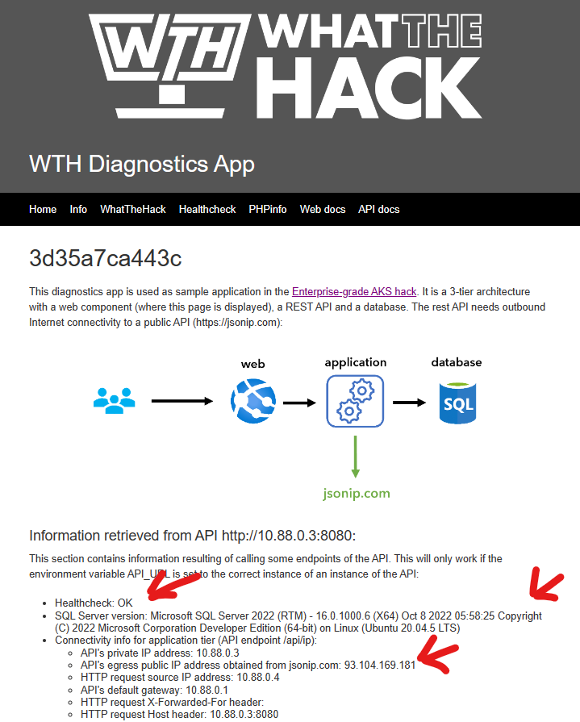

# Challenge 01 - Containers - Coach's Guide 

[< Previous Solution](./Solution-00.md) - **[Home](./README.md)** - [Next Solution >](./Solution-02.md)

## Notes and Guidance

- Participants can build locally and then upload the images (`docker build`, `docker login` and `docker push`), or let ACR Tasks do the build for them (`az acr build`)
- If students had any issues getting WSL or Docker Desktop running on their local workstations during Challenge 0, you should direct them to use ACR to do the container builds for them.
- Students may not be familiar with SQL Server or how to run it as a container, you may need to point them at the documentation in Challenge 1's Learning Resources.
- Remind the students to check the documentation for each of the components. They will find information there on HOW to run the apps locally or via ACI.

## Before you start

If you want to follow along with students, you should unpack the same `Resources.zip` file you provided them, open your PowerShell or WSL/Terminal, and navigate to the folder wherever you unpacked it.

Alternatively, if you have cloned the What The Hack repo, you can navigate to the `039-AKS-EnterpriseGrade/Student/Resources` folder and run the script blocks below.

**NOTE:** Students should **NOT** be given a link to the What The Hack repo before or during a hack. The student guide does **NOT** have any links to the Coach's guide or the What The Hack repo on GitHub.

## Solution Guides

### Local Docker (Option 1)

These commands have been tested on Powershell 7 on Windows 10, with Docker configured for Linux containers, and the utilities `jq` and `curl` installed

```bash
# Running SQL Server locally
$sql_password="Microsoft123!Microsoft123!"
docker run -e "ACCEPT_EULA=Y" -e "SA_PASSWORD=$sql_password" -p 1433:1433 --name sql -d mcr.microsoft.com/mssql/server:latest
$sql_ip=$(docker inspect sql | jq -r '.[0].NetworkSettings.Networks.bridge.IPAddress')
Write-Host "SQL Server running with IP address $sql_ip"
```

```bash
# Building and running SQL API locally
cd api
docker build -t api:1.0 .
docker run -d -p 8080:8080 -e "SQL_SERVER_FQDN=${sql_ip}" -e "SQL_SERVER_USERNAME=sa" -e "SQL_SERVER_PASSWORD=${sql_password}" --name api api:1.0
$api_ip=$(docker inspect api | jq -r '.[0].NetworkSettings.Networks.bridge.IPAddress')
Write-Host "API container running with IP address $api_ip"
curl "127.0.0.1:8080/api/healthcheck"
```

```bash
# Run Web frontend
cd ../web
docker build -t web:1.0 .
docker run -d -p 8081:80 -e "API_URL=http://${api_ip}:8080" --name web web:1.0
$web_ip=$(docker inspect web | jq -r '.[0].NetworkSettings.Networks.bridge.IPAddress')
Write-Host "You can point your browser to http://127.0.0.1:8081 to verify the app"
```

The web GUI should look something like this:



Note the `Healthcheck: OK` and the SQL version retrieved from the SQL database. The links at the bottom of the page (API health status and SQL Server Version are not working yet, they are intended to be used with an ingress controller)

### ACR & ACI (Option 2)

These commands have been tested on a zsh shell:

```bash
# Create RG and ACR
rg=hack$RANDOM
acr_name=$rg
location=westeurope
az group create -n "$rg" -l "$location"
az acr create -n "$acr_name" -g "$rg" --sku Standard
```

```bash
# Build images
cd ./Student/Resources
cd api
az acr build -r "$acr_name" -t hack/sqlapi:1.0 .
cd ../web
az acr build -r "$acr_name" -t hack/web:1.0 .
az acr repository list -n "$acr_name" -o table
cd ../
```

```bash
# Create SQL DB
sql_server_name=sqlserver$RANDOM
sql_db_name=mydb
sql_username=azure
sql_password=Microsoft123!
az sql server create -n "$sql_server_name" -g "$rg" -l "$location" --admin-user "$sql_username" --admin-password "$sql_password"
sql_server_fqdn=$(az sql server show -n "$sql_server_name" -g "$rg" -o tsv --query fullyQualifiedDomainName)
az sql db create -n "$sql_db_name" -s "$sql_server_name" -g "$rg" -e Basic -c 5 --no-wait
```

```bash
# Create API container
aci_name=sqlapi
az acr update -n "$acr_name" --admin-enabled true
acr_usr=$(az acr credential show -n "$acr_name" -g "$rg" --query 'username' -o tsv)
acr_pwd=$(az acr credential show -n "$acr_name" -g "$rg" --query 'passwords[0].value' -o tsv)
az container create -n "$aci_name" -g $rg  -e "SQL_SERVER_USERNAME=${sql_username}" "SQL_SERVER_PASSWORD=${sql_password}" "SQL_SERVER_FQDN=${sql_server_fqdn}" \
    --image "${acr_name}.azurecr.io/hack/sqlapi:1.0" --ip-address public --ports 8080 \
    --registry-username "$acr_usr" --registry-password "$acr_pwd"
sqlapi_ip=$(az container show -n "$aci_name" -g "$rg" --query ipAddress.ip -o tsv)
sqlapi_source_ip=$(curl -s "http://${sqlapi_ip}:8080/api/ip" | jq -r .my_public_ip)
az sql server firewall-rule create -g "$rg" -s "$sql_server_name" -n public_sqlapi_aci-source --start-ip-address "$sqlapi_source_ip" --end-ip-address "$sqlapi_source_ip"
curl "http://${sqlapi_ip}:8080/api/healthcheck"
curl "http://${sqlapi_ip}:8080/api/sqlsrcip"
echo "The output of the previous command should have been ${sqlapi_source_ip}"
```

```bash
# Create Web container
az container create -n web -g $rg -e "API_URL=http://${sqlapi_ip}:8080" --image "${acr_name}.azurecr.io/hack/web:1.0" --ip-address public --ports 80 \
  --registry-username "$acr_usr" --registry-password "$acr_pwd"
web_ip=$(az container show -n web -g "$rg" --query ipAddress.ip -o tsv)
echo "Please connect your browser to http://${web_ip} to test the correct deployment"
```

The web GUI should look something like this:


Note the `Healthcheck: OK` and the SQL version retrieved from the SQL database. The links at the bottom of the page (API health status and SQL Server Version) are not working yet, they are intended to be used with an ingress controller (to be provisioned in further challenges).

