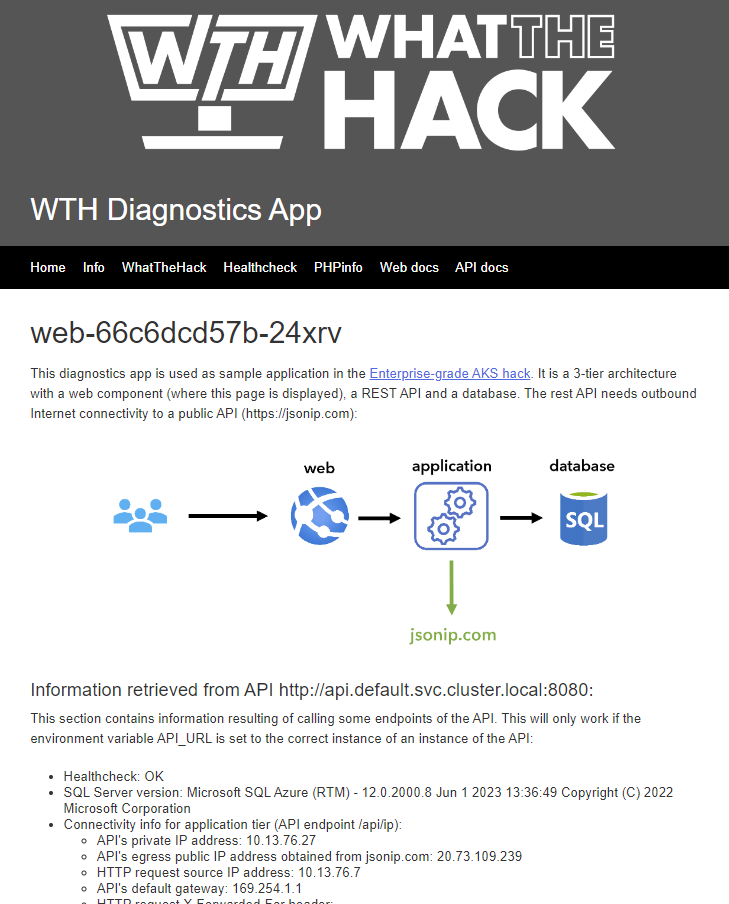

# Challenge 02 - AKS Network Integration and Private Clusters - Coach's Guide 

[< Previous Solution](./Solution-01.md) - **[Home](./README.md)** - [Next Solution >](./Solution-03.md)

## Notes and Guidance

- Make sure the participants understand the IP address allocation requirements of Azure CNI vs kubenet
- Make sure the participants understand how the Azure Load Balancer, NSGs and kubernetes services play together
- Make sure the participants understand why the ingress needs to be deployed with a private IP address when using a private AKS cluster: otherwise the default route to the firewall will cause asymmetric routing
- Coaches should **STRONGLY** encourage students to use infrastructure-as-code (Azure CLI, Bicep, or Terraform) instead of the Azure portal to deploy the AKS cluster. This will make it easier if they need to redeploy the cluster if the solution to a later challenge requires it.
- Participants could go with an off-cluster ingress controller such as AGIC, this would probably make routing easier (and there are no dependencies later on)
- Feel free to leave the participants go with any ingress controller other than nginx, but nginx is probably going to be the easiest one.
- There are two different nginx ingress controllers with similar names:
    - **`nginx-ingress`** - A commercial offering provided by F5
        - Has a "freemium" version that is designed to be upgraded to their paid offering, "`nginx+`".
        - This version bypasses Kubernetes services and route directly to the pods by getting the list of pods from the Kubernetes service definition.
        - This version was not respecting the readiness probes set on Kubernetes services.
    - **`ingress-nginx`** - Free open-source version by the Kubernetes community
        - This version requires a special annotation to set the health probe path for the Azure Load Balancer when installing it into an AKS cluster.
- The Microsoft documentation refers to the `ingress-nginx` version, and WE RECOMMEND STUDENTS USE THIS ONE. However, students may find documentation elsewhere online referring to the `nginx-ingress`. That is okay, but as a coach, be aware of the minor differences between the two.
- Note that configuring a private DNS-zone was not required when creating the private cluster
- If users have their own DNS domain, they could use it instead of `nip.io` as in this guide.
- At the time of this writing, SLA API and private API are mutually exclusive

**NOTE:** If students do not have "Owner" permissions on their Azure subscriptions, they will not have permission to attach their AKS cluster to their ACR.  We have staged the sample application on Docker Hub so that students can use the container images at these locations:
- **API app:** `whatthehackmsft/api`
- **Web app:** `whatthehackmsft/web`

**HINT:** If students decide to use their own ACR with the images for api and web, they must fully qualify the name of their ACR. An image with a non-fully qualified registry name is assumed to be in Docker Hub. 

This challenge has multiple paths:

- [Challenge 02 Accelerator](#challenge-02-accelerator)
- [Public AKS Cluster](#solution-guide---public-clusters-and-no-firewall-egress)
- [Private AKS Cluster](#solution-guide---private-clusters-and-firewall-egress)

## Challenge 02 Accelerator

Some organizations may wish to complete this hack as a follow-on to, or even a continuation of, the [Introduction to Kubernetes](../../001-IntroToKubernetes/) hack.

In the `/Solutions/Challenge-02/Accelerator` folder, you will find a set of YAML files and a bash shell script that will help students quickly deploy the Whoami sample application from pre-staged container images in Docker Hub to an existing AKS cluster.

For students that are already familiar with deploying applications in Kubernetes, but want to focus on the Azure integrations, you may wish to provide these files to "accelerate" them so they can start the hack with Challenge 3.

If you wish to accelerate your students, you should:
- Package the contents of this folder into an `Accelerator.zip` file and distribute it to the students.
- Direct students to the hidden [Challenge 2 Accelerator](../Student/Challenge-02A.md) instructions page in the student guide. The instructions there assume a student has an existing "public" AKS cluster. Students will be instructed to deploy the Nginx Ingress controller to the AKS cluster if it is not already deployed.

**NOTE:** The Challenge 2 student guide specifies that the AKS cluster is deployed with Azure CNI Networking. If a student's existing AKS cluster uses Kubenet for networking, the Whoami application should deploy just fine. Students should be able to complete all of the challenges with the AKS cluster using Kubenet networking.  However, some challenges may lead the students to want to use Azure CNI for a solution, which would require the students to re-deploy a new cluster with Azure CNI Networking.

## Solution Guide - Public Clusters and no Firewall Egress

In the `/Solutions/Challenge-02/Public` folder, you will find a set of YAML files that deploy the Whoami sample application to a public AKS cluster.  These YAML files have multiple placeholders in them that need to be replaced with values in order to deploy them to an AKS cluster.

There are a set of Terraform modules located in the [`/Solutions/Challenge-02/Terraform`](./Solutions/Challenge-02/Terraform/) folder that will deploy the Azure resources needed for a public AKS cluster and an Azure SQL Database. If you use the Terraform modules, you will need to update the YAML files with the appropriate values before applying them to the AKS cluster.

Alternatively, the script blocks below in the collapsible section also demonstrate how to complete all steps of this challenge if you choose to deploy a public AKS cluster. The script blocks use the Azure CLI to deploy and configure the Azure resources. 

The script blocks also replace the placeholders in the YAML files with the actual values to use before then applying the YAML files to the AKS cluster.

<details>
<summary>Click to expand/collapse</summary>

This is a simplified script for this challenge using a public clusters and no egress traffic filtering through a firewall:

```bash
# Get variables from previous labs and build images
rg=$(az group list --query "[?contains(name,'hack')].name" -o tsv 2>/dev/null)
if [[ -n "$rg" ]]
then
    location=$(az group list --query "[?contains(name,'hack')].location" -o tsv)
else
    rg=hack$RANDOM
    location=westeurope
    az group create -n $rg -l $location
fi
acr_name=$(az acr list --query "[?contains(name,'hack')].name" -o tsv 2>/dev/null)
if [[ -z "$acr_name" ]]
then
    acr_name=hack$RANDOM
    az acr create -n $acr_name -g $rg --sku Standard
    # Build images (you should be in the hack-containers home directory)
    cd api
    az acr build -r $acr_name -t hack/sqlapi:1.0 .
    cd ../web
    az acr build -r $acr_name -t hack/web:1.0 .
    az acr repository list -n $acr_name -o table
fi
# Variables for AKS
aks_name=aks
aks_rbac=yes
aks_service_cidr=10.0.0.0/16
vm_size=Standard_B2ms
preview_version=no
vnet_name=aks
vnet_prefix=10.13.0.0/16
aks_subnet_name=aks
aks_subnet_prefix=10.13.76.0/24
vm_subnet_name=vm
vm_subnet_prefix=10.13.1.0/24
db_subnet_name=sql
db_subnet_prefix=10.13.50.0/24
akslb_subnet_name=akslb
akslb_subnet_prefix=10.13.77.0/24

# Create vnet
az network vnet create -g $rg -n $vnet_name --address-prefix $vnet_prefix -l $location
az network vnet subnet create -g $rg -n $aks_subnet_name --vnet-name $vnet_name --address-prefix $aks_subnet_prefix
aks_subnet_id=$(az network vnet subnet show -n $aks_subnet_name --vnet-name $vnet_name -g $rg --query id -o tsv)

# Get latest supported/preview version
k8s_versions=$(az aks get-versions -l $location -o json)
if [[ "$preview_version" == "yes" ]]
then
    k8s_version=$(echo $k8s_versions | jq '.orchestrators[]' | jq -rsc 'sort_by(.orchestratorVersion) | reverse[0] | .orchestratorVersion')
    echo "Latest supported k8s version in $rg_location is $k8s_version (in preview)"
else
    k8s_version=$(echo $k8s_versions | jq '.orchestrators[] | select(.isPreview == null)' | jq -rsc 'sort_by(.orchestratorVersion) | reverse[0] | .orchestratorVersion')
    echo "Latest supported k8s version (not in preview) in $location is $k8s_version"
fi

# User identity
id_name=aksid
id_id=$(az identity show -n $id_name -g $rg --query id -o tsv)
if [[ -z "$id_id" ]]
then
    echo "Identity $id_name not found, creating a new one..."
    az identity create -n $id_name -g $rg -o none
    id_id=$(az identity show -n $id_name -g $rg --query id -o tsv)
else
    echo "Identity $id_name found with ID $id_id"
fi
id_principal_id=$(az identity show -n $id_name -g $rg --query principalId -o tsv)
vnet_id=$(az network vnet show -n $vnet_name -g $rg --query id -o tsv)
sleep 15 # Time for creation to propagate
az role assignment create --scope $vnet_id --assignee $id_principal_id --role Contributor -o none

# Create cluster
az aks create -g "$rg" -n "$aks_name" -l "$location" \
    -c 1 -s "$vm_size" -k $k8s_version --generate-ssh-keys \
    --network-plugin azure --vnet-subnet-id "$aks_subnet_id" \
    --service-cidr "$aks_service_cidr" \
    --network-policy calico --load-balancer-sku Standard \
    --node-resource-group "${aks_name}-iaas-${RANDOM}" \
    --attach-acr "$acr_name" \
    --enable-managed-identity --assign-identity "$id_id"
```

You can now access the cluster and get some info:

```bash
# Cluster-info
az aks get-credentials -n $aks_name -g $rg --overwrite
kubectl get node
kubectl version
```

Create now the Azure SQL database and the private link endpoint (you could use the same database as in challenge 1 though):

```bash
# Variables
db_server_name=$rg
db_db_name=testdb
sql_endpoint_name=sqlPrivateEndpoint
private_zone_name=privatelink.database.windows.net
sql_username=azure
sql_password=Microsoft123!
# Create SQL server and DB
az sql server create -n "$db_server_name" -g "$rg" -l "$location" --admin-user "$sql_username" --admin-password "$sql_password"
db_server_id=$(az sql server show -n "$db_server_name" -g "$rg" -o tsv --query id)
az sql db create -n "$db_db_name" -s "$db_server_name" -g "$rg" -e Basic -c 5
db_server_fqdn=$(az sql server show -n "$sql_server_name" -g "$rg" -o tsv --query fullyQualifiedDomainName)
# Subnet and endpoint
az network vnet subnet create -g "$rg" -n "$db_subnet_name" --vnet-name "$vnet_name" --address-prefix "$db_subnet_prefix"
az network vnet subnet update -n "$db_subnet_name" -g "$rg" --vnet-name "$vnet_name" --disable-private-endpoint-network-policies true
az network private-endpoint create -n "$sql_endpoint_name" -g "$rg" --vnet-name "$vnet_name" --subnet "$db_subnet_name" --private-connection-resource-id "$db_server_id" --group-ids sqlServer --connection-name sqlConnection
endpoint_nic_id=$(az network private-endpoint show -n "$sql_endpoint_name" -g "$rg" --query 'networkInterfaces[0].id' -o tsv)
endpoint_nic_ip=$(az resource show --ids "$endpoint_nic_id" --api-version 2019-04-01 -o tsv --query 'properties.ipConfigurations[0].properties.privateIPAddress')
# DNS
az network private-dns zone create -g "$rg" -n "$private_zone_name"
# Registration-enabled false not required any more!
az network private-dns link vnet create -g "$rg" --zone-name "$private_zone_name" -n MyDNSLink --virtual-network "$vnet_name" --registration-enabled false
az network private-dns record-set a create --name "$db_server_name" --zone-name "$private_zone_name" -g "$rg"
az network private-dns record-set a add-record --record-set-name "$db_server_name" --zone-name "$private_zone_name" -g "$rg" -a "$endpoint_nic_ip"
```

After having the database, we can finally deploy our images.

```bash
# API
cd Coach  # Make sure you are in the `Coach` folder of the WTH repo
tmp_file=/tmp/api-public.yaml
file=api-public.yaml
cp "./Solutions/Challenge-02/Public/$file" $tmp_file
sed -i "s|__sql_username__|${sql_username}|g" $tmp_file
sed -i "s|__sql_password__|${sql_password}|g" $tmp_file
sed -i "s|__sql_server_name__|${db_server_fqdn}|g" $tmp_file
sed -i "s|__acr_name__|${acr_name}|g" $tmp_file
sed -i "s|__sqlserver,mysql,postgres__|sqlserver|g" $tmp_file
sed -i "s|__yes,no__|yes|g" $tmp_file
kubectl apply -f $tmp_file
# Get IP address of service
api_svc_ip=$(kubectl get svc/api -n default -o json | jq -rc '.status.loadBalancer.ingress[0].ip' 2>/dev/null)
while [[ "$api_svc_ip" == "null" ]]
do
    sleep 5
    api_svc_ip=$(kubectl get svc/api -n default -o json | jq -rc '.status.loadBalancer.ingress[0].ip' 2>/dev/null)
done
curl -s "http://${api_svc_ip}:8080/api/healthcheck"
```

```bash
# Web
tmp_file=/tmp/web-public.yaml
file=web-public.yaml
cp ./Solutions/Challenge-02/Public/$file $tmp_file
sed -i "s|__acr_name__|${acr_name}|g" $tmp_file
kubectl apply -f $tmp_file
# Get IP address of service
web_svc_ip=$(kubectl get svc/web -n default -o json | jq -rc '.status.loadBalancer.ingress[0].ip' 2>/dev/null)
while [[ "$web_svc_ip" == "null" ]]
do
    sleep 5
    web_svc_ip=$(kubectl get svc/web -n default -o json | jq -rc '.status.loadBalancer.ingress[0].ip' 2>/dev/null)
done
curl -s "http://${web_svc_ip}" | grep Healthcheck
```

We can now configure the Database firewall to accept connections from our pod:

```bash
# Update firewall rules
sqlapi_source_ip=$(curl -s "http://${api_svc_ip}:8080/api/ip" | jq -r .my_public_ip)
az sql server firewall-rule create -g "$rg" -s "$sql_server_name" -n public_sqlapi_aci-source --start-ip-address "$sqlapi_source_ip" --end-ip-address "$sqlapi_source_ip"
# az sql server firewall-rule create -g "$rg" -s "$sql_server_name" -n public_sqlapi_aci-source --start-ip-address "0.0.0.0" --end-ip-address "255.255.255.255" # Optionally
```

And finally, the ingress controller. You can use any one you want, in this guide we include the option Nginx (see the section on private clusters for Traefik).

```bash
# Nginx installation
helm repo add ingress-nginx https://kubernetes.github.io/ingress-nginx
helm repo update
kubectl create ns nginx
helm install nginx ingress-nginx/ingress-nginx --namespace nginx
# nginx service IP
nginx_svc_name=$(kubectl get svc -n nginx -o json | jq -r '.items[] | select(.spec.type == "LoadBalancer") | .metadata.name')
nginx_svc_ip=$(kubectl get svc/$nginx_svc_name -n nginx -o json | jq -rc '.status.loadBalancer.ingress[0].ip' 2>/dev/null)
while [[ "$nginx_svc_ip" == "null" ]]
do
    sleep 5
    nginx_svc_ip=$(kubectl get svc/$nginx_svc_name -n nginx -o json | jq -rc '.status.loadBalancer.ingress[0].ip' 2>/dev/null)
done
```

And now that we have an ingress controller, we can create an ingress (aka route). You can use either an FQDN associated to the Azure Firewall's PIP or your own public domain. In this case we will use [nip.io](https://nip.io/):

```bash
# Ingress route (using Nginx)
tmp_file=/tmp/ingress.yaml
file=ingress.yaml
cp ./Solutions/Challenge-02/$file $tmp_file
sed -i "s|__ingress_class__|nginx|g" $tmp_file
sed -i "s|__ingress_ip__|${nginx_svc_ip}|g" $tmp_file
kubectl apply -f $tmp_file
echo "You can browse to http://${nginx_svc_ip}.nip.io"
```

At this point you should be able to browse to the web page over the Azure Firewall's IP address, and see something like this:



Make sure that the links to the `API Health Status` and the `SQL Server Version` work.
</details>

## Solution Guide - Private Clusters and Firewall Egress

Deploying a private AKS cluster with no public IP addresses is a complex task and will take students more time to figure out how to do it. This is listed as an "Advanced Challenge" in the Challenge 2 student guide. Using a private cluster will also result in variations of how to solve the other challenges.

If students choose to deploy a private cluster, the coach should be prepared to explain key networking concepts and how a private AKS cluster works differently from a non-private AKS cluster.

Deploying a private AKS cluster requires multiple Azure resources to be deployed and configured BEFORE deploying AKS. These include:
- Hub & Spoke VNets that are peered to each other
- An Azure Firewall with proper egress network rules set on it
- A User Defined Route (UDR)
- A VM jumpbox with Azure CLI & kubectl CLI installed to access the private AKS cluster

In the `/Solutions/Challenge-02/Private` folder, you will find a set of YAML files that deploy the Whoami sample application to a private AKS cluster.  These YAML files have multiple placeholders in them that need to be replaced with values in order to deploy them to an AKS cluster.

The script blocks below in the collapsible section demonstrate how to complete all steps of this challenge if you choose to deploy a private AKS cluster. The script blocks use the Azure CLI to deploy and configure the Azure resources. 

The script blocks also replace the placeholders in the YAML files with the actual values to use before then applying the YAML files to the AKS cluster.

It is unrealistic to expect students to come up with all of the Azure CLI code below from scratch to deploy this configuration. It is likely they will find existing articles on the Internet that describe how to deploy a private AKS cluster and copy/paste from them.

Here's an example reference article: [Fully Private AKS Clusters Without Any Public IPs: Finally!](https://denniszielke.medium.com/fully-private-aks-clusters-without-any-public-ips-finally-7f5688411184)

<details>
<summary>Click to expand/collapse</summary>


This is a possible script for this challenge using private clusters and filtering egress traffic through firewall (check later in the doc for a simplified guide with a public cluster and no firewall egress):

```bash
# Get variables from previous labs and build images
rg=$(az group list --query "[?contains(name,'hack')].name" -o tsv 2>/dev/null)
if [[ -n "$rg" ]]
then
    location=$(az group list --query "[?contains(name,'hack')].location" -o tsv)
else
    rg=hack$RANDOM
    location=westeurope
    az group create -n $rg -l $location
fi
acr_name=$(az acr list --query "[?contains(name,'hack')].name" -o tsv 2>/dev/null)
if [[ -z "$acr_name" ]]
then
    acr_name=hack$RANDOM
    az acr create -n $acr_name -g $rg --sku Standard
    # Build images (you should be in the hack-containers home directory)
    cd api
    az acr build -r $acr_name -t hack/sqlapi:1.0 .
    cd ../web
    az acr build -r $acr_name -t hack/web:1.0 .
    az acr repository list -n $acr_name -o table
fi
# Variables for AKS
aks_name=aks
aks_rbac=yes
aks_service_cidr=10.0.0.0/16
vm_size=Standard_B2ms
preview_version=no
vnet_name=aks
vnet_prefix=10.13.0.0/16
aks_subnet_name=aks
aks_subnet_prefix=10.13.76.0/24
vm_subnet_name=vm
vm_subnet_prefix=10.13.1.0/24
azfw_subnet_name=AzureFirewallSubnet
azfw_subnet_prefix=10.13.2.0/24
db_subnet_name=sql
db_subnet_prefix=10.13.50.0/24
akslb_subnet_name=akslb
akslb_subnet_prefix=10.13.77.0/24
# Create vnet
az network vnet create -g $rg -n $vnet_name --address-prefix $vnet_prefix -l $location
az network vnet subnet create -g $rg -n $aks_subnet_name --vnet-name $vnet_name --address-prefix $aks_subnet_prefix
aks_subnet_id=$(az network vnet subnet show -n $aks_subnet_name --vnet-name $vnet_name -g $rg --query id -o tsv)
# Get latest supported/preview version
k8s_versions=$(az aks get-versions -l $location -o json)
if [[ "$preview_version" == "yes" ]]
then
    k8s_version=$(echo $k8s_versions | jq '.orchestrators[]' | jq -rsc 'sort_by(.orchestratorVersion) | reverse[0] | .orchestratorVersion')
    echo "Latest supported k8s version in $rg_location is $k8s_version (in preview)"
else
    k8s_version=$(echo $k8s_versions | jq '.orchestrators[] | select(.isPreview == null)' | jq -rsc 'sort_by(.orchestratorVersion) | reverse[0] | .orchestratorVersion')
    echo "Latest supported k8s version (not in preview) in $location is $k8s_version"
fi
# Create firewall
az network firewall policy create -n azfwpolicy -g $rg --sku Standard
azfw_subnet_prefix=10.13.2.0/24
az network vnet subnet create -g $rg -n $azfw_subnet_name --vnet-name $vnet_name --address-prefix $azfw_subnet_prefix
az network public-ip create -g $rg -n azfw-pip --sku standard --allocation-method static -l $location
azfw_ip=$(az network public-ip show -g $rg -n azfw-pip --query ipAddress -o tsv)
az network firewall create -n azfw -g $rg -l $location
# az network firewall create -n azfw -g $rg -l $location --policy azfwpolicy
azfw_id=$(az network firewall show -n azfw -g $rg -o tsv --query id)
az network firewall ip-config create -f azfw -n azfw-ipconfig -g $rg --public-ip-address azfw-pip --vnet-name $vnet_name
az network firewall update -n azfw -g $rg
azfw_private_ip=$(az network firewall show -n azfw -g $rg -o tsv --query 'ipConfigurations[0].privateIpAddress')
# Logging
logws_name=$(az monitor log-analytics workspace list -g $rg --query '[0].name' -o tsv)
if [[ -z "$logws_name" ]]
then
    logws_name=log$RANDOM
    az monitor log-analytics workspace create -n $logws_name -g $rg
fi
logws_id=$(az resource list -g $rg -n $logws_name --query '[].id' -o tsv)
logws_customerid=$(az monitor log-analytics workspace show -n $logws_name -g $rg --query customerId -o tsv)
az monitor diagnostic-settings create -n mydiag --resource $azfw_id --workspace $logws_id \
      --metrics '[{"category": "AllMetrics", "enabled": true, "retentionPolicy": {"days": 1, "enabled": false }, "timeGrain": null}]' \
      --logs '[{"category": "AzureFirewallApplicationRule", "enabled": true, "retentionPolicy": {"days": 1, "enabled": false}}, 
              {"category": "AzureFirewallNetworkRule", "enabled": true, "retentionPolicy": {"days": 1, "enabled": false}},
              {"category": "AZFWNetworkRule", "enabled": true, "retentionPolicy": {"days": 1, "enabled": false}},
              {"category": "AZFWApplicationRule", "enabled": true, "retentionPolicy": {"days": 1, "enabled": false}},
              {"category": "AZFWNetworkRuleAggregation", "enabled": true, "retentionPolicy": {"days": 1, "enabled": false}},
              {"category": "AZFWApplicationRuleAggregation", "enabled": true, "retentionPolicy": {"days": 1, "enabled": false}}]'

# Rules (classic)
az network firewall network-rule create -f azfw -g $rg -c VnetTraffic \
    --protocols Any --destination-addresses $vnet_prefix --destination-ports '*' --source-addresses $vnet_prefix -n Allow-VM-to-AKS --priority 210 --action Allow
az network firewall network-rule create -f azfw -g $rg -c WebTraffic \
    --protocols Tcp --destination-addresses $azfw_ip --destination-ports 80 8080 443 --source-addresses '*' -n AllowWeb --priority 300 --action Allow
az network firewall network-rule create -f azfw -g $rg -c AKS-egress \
    --protocols Udp --destination-addresses '*' --destination-ports 123 --source-addresses $aks_subnet_prefix -n NTP --priority 220 --action Allow
az network firewall network-rule create -f azfw -g $rg -c AKS-egress \
    --protocols Udp --destination-addresses '*' --destination-ports 1194 --source-addresses $aks_subnet_prefix -n TunnelTraffic
az network firewall network-rule create -f azfw -g $rg -c AKS-egress \
    --protocols Tcp --destination-addresses '*' --destination-ports 3306 1433 --source-addresses $aks_subnet_prefix -n SQLTraffic
# Application rule: AKS-egress (https://docs.microsoft.com/en-us/azure/aks/limit-egress-traffic):
az network firewall application-rule create -f azfw -g $rg -c Helper-tools \
    --protocols Http=80 Https=443 --target-fqdns ifconfig.co api.snapcraft.io jsonip.com --source-addresses $vnet_prefix -n Allow-ifconfig --priority 200 --action Allow
az network firewall application-rule create -f azfw -g $rg -c Helper-tools \
    --protocols Http=80 Https=443 --target-fqdns kubernaut.io motd.ubuntu.com --source-addresses $vnet_prefix -n ubuntuTools
# Creating rules takes a long time, hence it is better creating one with many FQDNs, than one per FQDN
# If zsh we need to expand the variables with (z)
rule_name="Egress"
target_fqdns="*.azmk8s.io aksrepos.azurecr.io *.blob.core.windows.net mcr.microsoft.com *.cdn.mscr.io management.azure.com login.microsoftonline.com packages.azure.com acs-mirror.azureedge.net *.opinsights.azure.com *.monitoring.azure.com dc.services.visualstudio.com"
if [ -n "$BASH_VERSION" ]; then
    az network firewall application-rule create -f azfw -g $rg -c AKS-egress \
        --protocols Https=443 --target-fqdns "$target_fqdns" --source-addresses $aks_subnet_prefix -n $rule_name --priority 220 --action Allow
elif [ -n "$ZSH_VERSION" ]; then
      az network firewall application-rule create -f azfw -g $rg -c AKS-egress \
        --protocols Https=443 --target-fqdns "${(z)target_fqdns}" --source-addresses $aks_subnet_prefix -n $rule_name --priority 220 --action Allow
fi
rule_name="Registries"
target_fqdns="$location.data.mcr.microsoft.com $acr_name.azurecr.io *.gcr.io gcr.io storage.googleapis.com *.docker.io quay.io *.quay.io *.cloudfront.net production.cloudflare.docker.com"
if [ -n "$BASH_VERSION" ]; then
    az network firewall application-rule create -f azfw -g $rg -c AKS-egress \
        --protocols Https=443 --target-fqdns "$target_fqdns" --source-addresses $aks_subnet_prefix -n $rule_name
elif [ -n "$ZSH_VERSION" ]; then
    az network firewall application-rule create -f azfw -g $rg -c AKS-egress \
        --protocols Https=443 --target-fqdns "${(z)target_fqdns}" --source-addresses $aks_subnet_prefix -n $rule_name
fi
# The next rules might be consolidated together (as the rules above) so that it takes shorter to configure them
az network firewall application-rule create -f azfw -g $rg -c AKS-egress \
    --protocols Https=443 --target-fqdns grafana.net grafana.com stats.grafana.org --source-addresses $aks_subnet_prefix -n Grafana
az network firewall application-rule create -f azfw -g $rg -c AKS-egress \
    --protocols Https=443 --target-fqdns github.com raw.githubusercontent.com --source-addresses $aks_subnet_prefix -n Github
az network firewall application-rule create -f azfw -g $rg -c AKS-egress \
    --protocols Http=80 Https=443 --target-fqdns security.ubuntu.com security.ubuntu.com packages.microsoft.com azure.archive.ubuntu.com --source-addresses $aks_subnet_prefix -n Packages
az network firewall application-rule create -f azfw -g $rg -c AKS-egress \
    --protocols Http=80 Https=443 --target-fqdns security.ubuntu.com hack32003.vault.azure.net --source-addresses $aks_subnet_prefix -n KeyVault
az network firewall application-rule create -f azfw -g $rg -c AKS-egress \
    --protocols Http=80 Https=443 --target-fqdns '*.letsencrypt.org' --source-addresses $aks_subnet_prefix -n letsencrypt
az network firewall application-rule create -f azfw -g $rg -c AKS-egress \
    --protocols Http=80 Https=443 --target-fqdns usage.projectcalico.org --source-addresses $aks_subnet_prefix -n calico
az network firewall application-rule create -f azfw -g $rg -c AKS-egress \
    --protocols Http=80 Https=443 --target-fqdns gov-prod-policy-data.trafficmanager.net --source-addresses $aks_subnet_prefix -n AzPolicy
az network firewall application-rule create -f azfw -g $rg -c AKS-egress \
    --protocols Http=80 Https=443 --target-fqdns vortex.data.microsoft.com --source-addresses $aks_subnet_prefix -n SqlServer
az network firewall application-rule create -f azfw -g $rg -c AKS-egress \
    --protocols Http=80 Https=443 --target-fqdns '*.github.io' --source-addresses $aks_subnet_prefix -n nginxRepo
az network firewall application-rule create -f azfw -g $rg -c AKS-egress \
    --protocols Http=80 Https=443 --target-fqdns 'registry.k8s.io' --source-addresses $aks_subnet_prefix -n k8sRegistry

# Rules (policy) - TBD!
# Test rule to allow everything - THIS IS A SHORTCUT
az network firewall policy rule-collection-group create -n AKSrules --policy-name azfwpolicy -g $rg --priority 100
az network firewall policy rule-collection-group collection add-filter-collection --policy-name azfwpolicy --rule-collection-group-name AKSrules -g $rg \
    --name NetworkTraffic --collection-priority 150 --action Allow --rule-name permitAny --rule-type NetworkRule --description "Permit all traffic - TEST" \
    --destination-addresses '*' --destination-ports '*' --source-addresses '*' --ip-protocols Tcp Udp Icmp

# Route table
az network route-table create -n aks -g $rg -l $location
az network route-table route create -n defaultRoute --route-table-name aks -g $rg \
    --next-hop-type VirtualAppliance --address-prefix "0.0.0.0/0" --next-hop-ip-address $azfw_private_ip
aks_rt_id=$(az network route-table show -n aks -g $rg -o tsv --query id)
az network vnet subnet update -g $rg --vnet-name $vnet_name -n $aks_subnet_name --route-table $aks_rt_id
# User identity
id_name=aksid
id_id=$(az identity show -n $id_name -g $rg --query id -o tsv)
if [[ -z "$id_id" ]]
then
    echo "Identity $id_name not found, creating a new one..."
    az identity create -n $id_name -g $rg -o none
    id_id=$(az identity show -n $id_name -g $rg --query id -o tsv)
else
    echo "Identity $id_name found with ID $id_id"
fi
id_principal_id=$(az identity show -n $id_name -g $rg --query principalId -o tsv)
vnet_id=$(az network vnet show -n $vnet_name -g $rg --query id -o tsv)
sleep 15 # Time for creation to propagate
az role assignment create --scope $vnet_id --assignee $id_principal_id --role Contributor -o none
# Create cluster
az aks create -g "$rg" -n "$aks_name" -l "$location" \
    -c 1 -s "$vm_size" -k $k8s_version --generate-ssh-keys \
    --network-plugin azure --vnet-subnet-id "$aks_subnet_id" \
    --service-cidr "$aks_service_cidr" \
    --network-policy calico --load-balancer-sku Standard \
    --node-resource-group "${aks_name}-iaas-${RANDOM}" \
    --attach-acr "$acr_name" \
    --enable-private-cluster \
    --outbound-type userDefinedRouting \
    --enable-managed-identity --assign-identity "$id_id"
```

You can query the Azure Firewall logs and look for denied packets by the firewall, in case you have forgotten to add any URL. For example, use this query for application rule logs:

```bash
# App rule logs
query_apprule='AzureDiagnostics 
| where ResourceType == "AZUREFIREWALLS" 
| where Category == "AzureFirewallApplicationRule" 
| where TimeGenerated >= ago(30m) 
| project TimeGenerated, Protocol=split(msg_s, " ")[0], From=split(msg_s, " ")[iif(split(msg_s, " ")[0]=="HTTPS",3,4)], To=split(msg_s, " ")[iif(split(msg_s, " ")[0]=="HTTPS",5,6)], Action=trim_end(".", tostring(split(msg_s, " ")[iif(split(msg_s, " ")[0]=="HTTPS",7,8)])), Rule_Collection=iif(split(msg_s, " ")[iif(split(msg_s, " ")[0]=="HTTPS",10,11)]=="traffic.", "AzureInternalTraffic", iif(split(msg_s, " ")[iif(split(msg_s, " ")[0]=="HTTPS",10,11)]=="matched.","NoRuleMatched",trim_end(".",tostring(split(msg_s, " ")[iif(split(msg_s, " ")[0]=="HTTPS",10,11)])))), Rule=iif(split(msg_s, " ")[11]=="Proceeding" or split(msg_s, " ")[12]=="Proceeding","DefaultAction",split(msg_s, " ")[12])
| where Rule_Collection != "AzureInternalTraffic" 
| where Action == "Deny" 
| take 100'
az monitor log-analytics query -w "$logws_customerid" --analytics-query "$query_apprule" -o tsv
```

And this one for network rule logs:

```bash
# Net rule logs
query_netrule='AzureDiagnostics
| where ResourceType == "AZUREFIREWALLS"
| where Category == "AzureFirewallNetworkRule" and OperationName == "AzureFirewallNetworkRuleLog"
| where TimeGenerated >= ago(5m)
| project Protocol=split(msg_s, " ")[0], From=split(msg_s, " ")[3], To=trim_end(".", tostring(split(msg_s, " ")[5])), Action=split(msg_s, " ")[7]
| extend From_IP=split(From, ":")[0], From_Port=split(From, ":")[1], To_IP=split(To, ":")[0], To_Port=split(To, ":")[1]
| where Action == "Deny" 
| take 100'
az monitor log-analytics query -w "$logws_customerid" --analytics-query "$query_netrule" -o tsv
```

You can install a VM in the same vnet and install kubectl to have access to the API.

```bash
# Variables
vm_name=vm
vm_nsg_name="${vm_name}-nsg"
vm_pip_name="${vm_name}-pip"
vm_disk_name="${vm_name}-disk0"
vm_sku=Standard_B2ms
publisher=Canonical
offer=UbuntuServer
sku=18.04-LTS
image_urn=$(az vm image list -p "$publisher" -f "$offer" -s "$sku" -l "$location" --query '[0].urn' -o tsv)
az network vnet subnet create -n "$vm_subnet_name" --vnet-name "$vnet_name" -g "$rg" --address-prefixes "$vm_subnet_prefix"
az vm create -n "$vm_name" -g "$rg" -l "$location" --image $image_urn --size $vm_sku --generate-ssh-keys \
  --os-disk-name "$vm_disk_name" --os-disk-size-gb 32 \
  --vnet-name $vnet_name --subnet "$vm_subnet_name" \
  --nsg $vm_nsg_name --nsg-rule SSH --public-ip-address "$vm_pip_name"
vm_pip_ip=$(az network public-ip show -n "$vm_pip_name" -g "$rg" --query ipAddress -o tsv)
ssh -n -o BatchMode=yes -o StrictHostKeyChecking=no "$vm_pip_ip" "ip a"
# Managed identity
vm_identity_name="${vm_name}-identity"
az identity create -g "$rg" -n "$vm_identity_name"
az vm identity assign -n "$vm_name" -g "$rg" --identities "${vm_name}-identity"
vm_identity_clientid=$(az identity show -n "${vm_name}-identity" -g "$rg" --query clientId -o tsv)
vm_identity_principalid=$(az identity show -n "${vm_name}-identity" -g "$rg" --query principalId -o tsv)
vm_identity_id=$(az identity show -n "${vm_name}-identity" -g "$rg" --query id -o tsv)
rg_id=$(az group show -n "$rg" --query id -o tsv)
az role assignment create --assignee "$vm_identity_principalid" --role Contributor --scope "$rg_id"
# Install Azure CLI
alias remote="ssh -n -o BatchMode=yes -o StrictHostKeyChecking=no $vm_pip_ip"
remote "curl -sL https://aka.ms/InstallAzureCLIDeb | sudo bash"
# Install kubectl
# remote "sudo apt-get update && sudo apt-get install -y apt-transport-https"
# remote "curl -s https://packages.cloud.google.com/apt/doc/apt-key.gpg | sudo apt-key add -"
# remote 'echo "deb https://apt.kubernetes.io/ kubernetes-xenial main" | sudo tee -a /etc/apt/sources.list.d/kubernetes.list'
# remote "sudo apt-get update"
# remote "sudo apt-get install -y kubectl"
remote "sudo az aks install-cli"
remote "kubectl version"
# Install helm
remote "curl https://baltocdn.com/helm/signing.asc | sudo apt-key add -"
remote "sudo apt-get install apt-transport-https --yes"
remote 'echo "deb https://baltocdn.com/helm/stable/debian/ all main" | sudo tee /etc/apt/sources.list.d/helm-stable-debian.list'
remote 'sudo apt-get update && sudo apt-get install helm'
# Install additional utilities
remote "sudo apt-get install -y jq"
linkerd_version=stable-2.8.1
remote "curl -sLO \"https://github.com/linkerd/linkerd2/releases/download/${linkerd_version}/linkerd2-cli-${linkerd_version}-linux\""
remote "sudo cp ./linkerd2-cli-${linkerd_version}-linux /usr/local/bin/linkerd"
remote "sudo chmod +x /usr/local/bin/linkerd"

# Cluster-info
remote "az login --identity -u $vm_identity_id"
remote "az aks get-credentials -n $aks_name -g $rg"
remote "kubectl get node"
```

Create now the Azure SQL database and the private link endpoint (you could use the same database as in challenge 1 though):

```bash
# Variables
db_server_name=$rg
db_db_name=testdb
sql_endpoint_name=sqlPrivateEndpoint
private_zone_name=privatelink.database.windows.net
sql_username=azure
sql_password=Microsoft123!
# Create SQL server and DB
az sql server create -n "$db_server_name" -g "$rg" -l "$location" --admin-user "$sql_username" --admin-password "$sql_password"
db_server_id=$(az sql server show -n "$db_server_name" -g "$rg" -o tsv --query id)
az sql db create -n "$db_db_name" -s "$db_server_name" -g "$rg" -e Basic -c 5
db_server_fqdn=$(az sql server show -n "$sql_server_name" -g "$rg" -o tsv --query fullyQualifiedDomainName)
# Subnet and endpoint
az network vnet subnet create -g "$rg" -n "$db_subnet_name" --vnet-name "$vnet_name" --address-prefix "$db_subnet_prefix"
az network vnet subnet update -n "$db_subnet_name" -g "$rg" --vnet-name "$vnet_name" --disable-private-endpoint-network-policies true
az network private-endpoint create -n "$sql_endpoint_name" -g "$rg" --vnet-name "$vnet_name" --subnet "$db_subnet_name" --private-connection-resource-id "$db_server_id" --group-ids sqlServer --connection-name sqlConnection
endpoint_nic_id=$(az network private-endpoint show -n "$sql_endpoint_name" -g "$rg" --query 'networkInterfaces[0].id' -o tsv)
endpoint_nic_ip=$(az resource show --ids "$endpoint_nic_id" --api-version 2019-04-01 -o tsv --query 'properties.ipConfigurations[0].properties.privateIPAddress')
# DNS
az network private-dns zone create -g "$rg" -n "$private_zone_name"
# Registration-enabled false not required any more!
az network private-dns link vnet create -g "$rg" --zone-name "$private_zone_name" -n MyDNSLink --virtual-network "$vnet_name" --registration-enabled false
az network private-dns record-set a create --name "$db_server_name" --zone-name "$private_zone_name" -g "$rg"
az network private-dns record-set a add-record --record-set-name "$db_server_name" --zone-name "$private_zone_name" -g "$rg" -a "$endpoint_nic_ip"
```

After having the database, we can finally deploy our images.

```bash
# API
cd Coach  # Make sure you are in the `Coach` folder of the WTH repo
tmp_file=/tmp/api.yaml
file=api.yaml
cp ./Solutions/$file $tmp_file
sed -i "s|__sql_username__|${sql_username}|g" $tmp_file
sed -i "s|__sql_password__|${sql_password}|g" $tmp_file
sed -i "s|__sql_server_name__|${db_server_fqdn}|g" $tmp_file
sed -i "s|__acr_name__|${acr_name}|g" $tmp_file
sed -i "s|__sqlserver,mysql,postgres__|sqlserver|g" $tmp_file
sed -i "s|__yes,no__|yes|g" $tmp_file
scp $tmp_file $vm_pip_ip:$file
remote "kubectl apply -f ./$file"
# Get IP address of service
api_svc_ip=$(remote "kubectl get svc/api -n default -o json | jq -rc '.status.loadBalancer.ingress[0].ip' 2>/dev/null")
while [[ "$api_svc_ip" == "null" ]]
do
    sleep 5
    api_svc_ip=$(remote "kubectl get svc/api -n default -o json | jq -rc '.status.loadBalancer.ingress[0].ip' 2>/dev/null")
done
remote "curl -s http://${api_svc_ip}:8080/api/healthcheck"
```

```bash
# Web
tmp_file=/tmp/web.yaml
file=web.yaml
cp ./Solutions/$file $tmp_file
sed -i "s|__acr_name__|${acr_name}|g" $tmp_file
scp $tmp_file $vm_pip_ip:$file
remote "kubectl apply -f ./$file"
# Get IP address of service
web_svc_ip=$(remote "kubectl get svc/web -n default -o json | jq -rc '.status.loadBalancer.ingress[0].ip' 2>/dev/null")
while [[ "$web_svc_ip" == "null" ]]
do
    sleep 5
    web_svc_ip=$(remote "kubectl get svc/web -n default -o json | jq -rc '.status.loadBalancer.ingress[0].ip' 2>/dev/null")
done
remote "curl -s http://${web_svc_ip} | grep Healthcheck"
```

We can now configure the Database firewall to accept connections from our pod:

```bash
# Update firewall rules
sqlapi_source_ip=$(remote "curl -s \"http://${api_svc_ip}:8080/api/ip\" | jq -r .my_public_ip")
az sql server firewall-rule create -g "$rg" -s "$sql_server_name" -n public_sqlapi_aci-source --start-ip-address "$sqlapi_source_ip" --end-ip-address "$sqlapi_source_ip"
# az sql server firewall-rule create -g "$rg" -s "$sql_server_name" -n public_sqlapi_aci-source --start-ip-address "0.0.0.0" --end-ip-address "255.255.255.255" # Optionally
```

And finally, the ingress controller. You can use any one you want, in this guide we include the options for Traefik and Nginx (the nginx option is more battle-tested, and hence recommended).

If you still want to use Traefik:

```bash
# Traefik Installation
remote "helm repo add traefik https://containous.github.io/traefik-helm-chart"
remote "helm repo update"
remote "kubectl create ns traefik"
remote 'helm install traefik traefik/traefik --namespace traefik --set kubernetes.ingressClass=traefik --set rbac.enabled=true --set kubernetes.ingressEndpoint.useDefaultPublishedService=true --set service.annotations."service\.beta\.kubernetes\.io/azure-load-balancer-internal"=true --version 1.85.0'
# Traefik IP
traefik_svc_ip=$(remote "kubectl get svc/traefik -n default -o json | jq -rc '.status.loadBalancer.ingress[0].ip' 2>/dev/null")
while [[ "$traefik_svc_ip" == "null" ]]
do
    sleep 5
    traefik_svc_ip=$(remote "kubectl get svc/traefik -n default -o json | jq -rc '.status.loadBalancer.ingress[0].ip' 2>/dev/null")
done
ingress_svc_ip=$traefik_svc_ip
```

Alternatively, the recommended option for this lab is Nginx:

```bash
# Nginx installation
remote 'helm repo add ingress-nginx https://kubernetes.github.io/ingress-nginx'
remote 'helm repo update'
remote 'kubectl create ns nginx'
remote 'helm install nginx ingress-nginx/ingress-nginx --namespace nginx --set controller.service.annotations."service\.beta\.kubernetes\.io/azure-load-balancer-internal"=true'
# nginx service IP
nginx_svc_name=$(remote "kubectl get svc -n nginx -o json | jq -r '.items[] | select(.spec.type == \"LoadBalancer\") | .metadata.name'")
nginx_svc_ip=$(remote "kubectl get svc/$nginx_svc_name -n nginx -o json | jq -rc '.status.loadBalancer.ingress[0].ip' 2>/dev/null")
while [[ "$nginx_svc_ip" == "null" ]]
do
    sleep 5
    nginx_svc_ip=$(remote "kubectl get svc/$nginx_svc_name -n nginx -o json | jq -rc '.status.loadBalancer.ingress[0].ip' 2>/dev/null")
done
ingress_svc_ip=$nginx_svc_ip
```

We need DNAT at the Azure Firewall to send inbound traffic on certain ports (TCP 80) to the nginx instances.

```bash
# DNAT rule
az network firewall nat-rule create -f azfw -g "$rg" -n nginx \
    --source-addresses '*' --protocols TCP \
    --destination-addresses "$azfw_ip" --translated-address "$ingress_svc_ip" \
    --destination-ports 80 --translated-port 80 \
    -c IngressController --action Dnat --priority 100
```

And now that we have an ingress controller, we can create an ingress (aka route). You can use either an FQDN associated to the Azure Firewall's PIP or your own public domain. In this case we will use [nip.io](https://nip.io/):

```bash
# Ingress route (using Nginx)
tmp_file=/tmp/ingress.yaml
file=ingress.yaml
cp ./Solutions/$file $tmp_file
sed -i "s|__ingress_class__|nginx|g" $tmp_file
sed -i "s|__ingress_ip__|${azfw_ip}|g" $tmp_file
scp $tmp_file $vm_pip_ip:$file
remote "kubectl apply -f ./$file"
echo "You can browse to http://${azfw_ip}.nip.io"
```

At this point you should be able to browse to the web page over the Azure Firewall's IP address, and see something like this:


Make sure that the links to the `API Health Status` and the `SQL Server Version` work.
</details>

