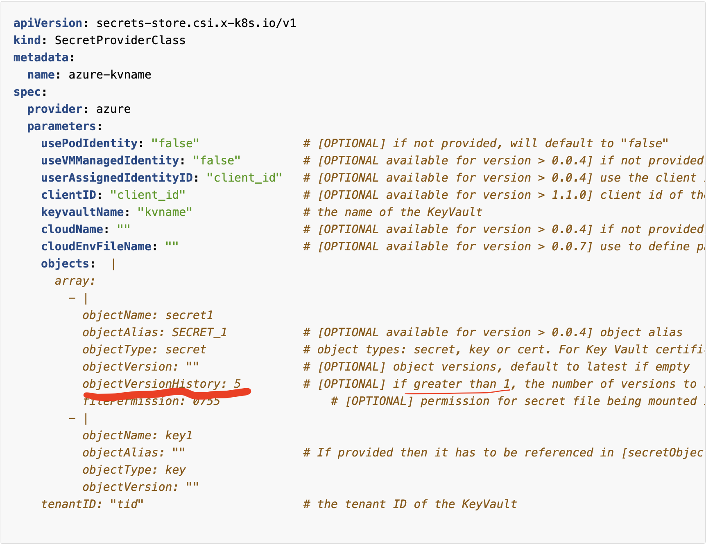

# Challenge 04 - Secrets and Configuration Management - Coach's Guide 

[< Previous Solution](./Solution-03.md) - **[Home](./README.md)** - [Next Solution >](./Solution-05.md)

## Notes and Guidance

The goals of this challenge focus on managing configuration settings and secrets for the ["Whoami"](../Student/Resources/) sample application in Kubernetes. 

There are two non-secret configuration settings:
  - Database server name
  - Database user name

There is one secret value:
  - Database password

## Solution Guide

There are multiple ways to solve this challenge. Depending on the organization's learning goals, you should encourage the students to complete it each of the ways so that they are familiar with the options and pros/cons of each one.

For the non-secret configuration settings, this challenge can be solved using either of the following:
- [Kubernetes ConfigMaps](https://kubernetes.io/docs/concepts/configuration/configmap/)
  - This link explains the ConfigMap concept and has examples that should guide students on how to get this to work.
- Azure App Configuration Service

For the secret value, this challenge can be solved using any of the following:
- [Kubernetes Secrets](https://kubernetes.io/docs/concepts/configuration/secret/) (not ideal)
  - **Warning:** Kubernetes Secrets are, by default, stored unencrypted in the API server's underlying data store (etcd). Anyone with API access can retrieve or modify a Secret, and so can anyone with access to etcd. Additionally, anyone who is authorized to create a Pod in a namespace can use that access to read any Secret in that namespace; this includes indirect access such as the ability to create a Deployment.
- Azure Key Vault CSI Driver for Kubernetes
  - Pull secrets from Key Vault and store in Kubernetes Secrets (and keep them in sync)
    - Pro: Enables applications that look for secrets in Environment Variables to run without application modification.
    - Con: This is subject to the same warning above for Kubernetes Secrets themselves.
    - Con: Need to configure synchronization scheduled to keep Key Vault secrets in-sync with Kubernetes Secrets.
  - Pull secrets from Key Vault and mount them as a storage volume on the pod(s). **RECOMMENDED OPTION**
    - Pro: Secrets can only be accessed by the pod requesting the secret.
    - Con: Multiple identity options can lead to confusion when configuring Azure Key Vault CSI driver to pull secrets from Azure Key Vault. See below for more details.

The challenge states that no static passwords should be used or stored on the cluster.  This implies a managed identity is needed to access Azure Key Vault.

When retrieving secret values from Azure Key Vault, there are multiple options for the Azure identity that will be used to access Key Vault.  
- **System-assigned managed identity** assigned to the AKS Control Plane (not recommended as it's too broad)
- **User-assigned managed identity** assigned to the VMSS of the nodepool (current recommended method)
- **Pod-managed identity** (this feature was in preview and has been deprecated.)  
- **Workload Identity** (this feature is currently in preview and should be available in Spring 2023)

**NOTE:** This is an area where the technology is in flux today. You should check the Azure documentation as the details on how to do this may change.

**NOTE:** We have listed Pod-managed identity as a solution above for historical reference. Coaches should strongly advise students NOT to do go down this path and avoid any documentation, blog posts, etc, that that feature pod-managed identity.

### Secrets Lecture

For help explaining how secrets are managed in Kubernetes, you can present the optional lecture for this challenge in the [AKS Enterprise-Grade Lectures](Lectures.pptx) presentation deck.

- The presentation slides have several animations that build out the complexity of each option for handling secrets in Kubernetes.
- The presentation has speaker notes that should help you speak to each slide.

### Sample Solution YAML Files

We have included two sample YAML files that demonstrate how to solve this challenge:

`secretproviderclass.yaml` - This file configures:
  - The Azure Key Vault CSI Driver to retrieve a secret named `sqlpassword` from Key Vault, and map it to secret named `SQL_SERVER_PASSWORD`
  - This file has placeholders that must be replaced with the proper Azure identity used to access Key Vault, as well as the Key Vault details itself.

`api_akv.yaml` - This file configures:
  - A Kubernetes ConfigMap to store the database name and database admin name.
  - The API pod to retrieve the database name and admin name from the Kubernetes Config Map
  - The CSI Driver volume for consumption
  - The API pod to mount the CSI Driver volume at a `mountPath` named `/secrets`

You can find the `api_akv.yaml` and `secretproviderclass.yaml` files in the [`/Solutions/Challenge-04`](./Solutions/Challenge-04/) folder of this hack's coach guide.

## Azure Key Vault CSI Driver Documentation

Here are links to relevant documentation:
- [Using the Azure Key Vault Provider](https://azure.github.io/secrets-store-csi-driver-provider-azure/docs/getting-started/usage/)
  - This link has the definitive guide to all of the settings in the `SecretProviderClass.yaml` file
- [Use the Azure Key Vault Provider for Secrets Store CSI Driver in an AKS cluster](https://learn.microsoft.com/en-us/azure/aks/csi-secrets-store-driver)
  - This is a good overview of the whole process, but then has you switch context midway through the document to the link below regarding how to choose one of the different identity types for access to Azure Key Vault.
- [Provide an identity to access the Azure Key Vault Provider for Secrets Store CSI Driver](https://learn.microsoft.com/en-us/azure/aks/csi-secrets-store-identity-access)
  - This document covers how to use each of the four identities mentioned above.
- [Troubleshoot Azure Key Vault Provider for Secrets Store CSI Driver](https://learn.microsoft.com/en-us/troubleshoot/azure/azure-kubernetes/troubleshoot-key-vault-csi-secrets-store-csi-driver)

### Gotchas!

Below are some common hang ups that we have encountered with students completing this challenge.

#### Creating the Azure Key Vault

Students may create an Azure Key Vault using either the Azure Portal or the Azure CLI.  Coaches should always encourage students to use the CLI and save the commands they run so that they end up with a re-usable script which is infrastructure-as-code.

It is common that students forget that they need to create an access policy to grant the Azure Identity they choose to use for the CSI Driver access to the Key Vault.

#### Choosing the Correct Azure Identity

Students may get hung up on choosing the correct identity to use for accessing Azure Key Vault from the CSI Driver on the AKS cluster.

Coaches should take the time to review the different identity options and help the students decide which type to choose.

As of February 2023, the recommended way is to use a managed identity (system or user) assigned to the VMSS of the nodepool.

Going forward, students should consider Workload Identity when it is out of preview.

#### Mounting Azure Key Vault Secrets as a File Volume

When using the CSI Driver to mount secrets as a File Volume, the default behavior is that files named with the secret names are placed in the mount path, with the content of each file being the value of the secret.

For example, if the CSI Driver is configured to bring back secrets named `secretname1`, `secretname2`, and `secretnameX`, you will observe the following on the pod's file system:

```
/mountpath/secretname1
/mountpath/secretname2
/mountpath/secretnameX

cat secretname1
Pa55w0rd123!
```
In the `SecretProviderClass.yaml` manifest for the CSI Driver, you can optionally specify to bring back multiple versions of a secret (if there are multiple versions in Azure Key Vault).

For example:



When bringing back multiple versions of a secret, the CSI Driver will create a sub-folder named with the secret name in the mount path. The sub-folder will then contain one or more files named with numbers 0 through the number of versions returned.

For example, if the CSI Driver is configured to bring back 3 versions of a secret named `secretname1`, you will observe the following on the pod's file system:

```
/mountpath/secretname1/0
/mountpath/secretname1/1
/mountpath/secretname1/2

cd /secretname1

cat 0
Pa55w0rd123!
cat 1
myDogzName2008
cat 2
myKidzName2020
```

This behavior requires the application to know to look in different locations for the secret value if there are multiple versions of the secret supplied.

**NOTE:** The sample "whoami" application is NOT coded to handle this difference. If students accidentally configure the CSI Driver to bring back multiple versions of a secret, the application will not find it. Coaches should be on the look out for this scenario, advise students of this behavior, and how to fix it.

## OLD Notes & Guidance

**NOTE:** The Solution Guide below was written to demonstrate how to solve the challenge using Pod-managed identity to access Azure Key Vault. This solution has been deprecated and you should advise students against going down this path!

We will be updating this coach guide soon to describe the future recommended solution of using Workload Identity.

<details>
<summary>Click to expand/collapse</summary>

* Note that Pod identity is in flux today. Make sure to understand the related documentation
* The fact that no static passwords can be used implies that AAD Pod Identity is a prerequisite
* Note that with the nginx ingress controller injecting certificates as files is not possible. The new CSI driver can inject secrets as files **and** variables. However, since certificates are not a must in this challenge, you can ignore this point
* Note that Flexvol is deprecated in favor of CSI. Steer participants towards the CSI implementation
* The identity space in AKS is quite dynamic, consider that there might a way of fulfilling this challenge without using pod identity
* Pod identity is now an addon for AKS, it would be recommended using that addon instead of the helm installation
* Along this lab a large number of pods will be created. Chances are that the number of pods will exceed 30, the maximum per node for Azure CNI. If the participant has deployed one single node, some pods will not start. One possible solution is enable the cluster autoscaler
* Make sure to check the latest documentation in [https://azure.github.io/aad-pod-identity/docs/getting-started/](https://azure.github.io/aad-pod-identity/docs/getting-started/)

## OLD Solution Guide 

```bash
# Cluster autoscaler
az aks update -n $aks_name -g $rg --enable-cluster-autoscaler --min-count 1 --max-count 3
```

See this link for more details on Pod Identity: [https://github.com/Azure/aad-pod-identity](https://github.com/Azure/aad-pod-identity).

### Common components

The goal of this challenge will be retrieving the SQL Server password from an Azure Key Vault. Let's create it first:

```bash
# Create Azure Key Vault and store SQL Server password
akv_name=$rg
akv_secret_name=sqlpassword
az keyvault create -n $akv_name -g $rg
az keyvault secret set --vault-name $akv_name -n $akv_secret_name --value $sql_password
```

Pod identity is a technology that is still evolving, hence there are multiple ways of deploying it. Following there are some approaches:

### Option 1: legacy installation

```bash
# Pod Identity
identity_name=apiid
node_rg=$(az aks show -n $aks_name -g $rg --query nodeResourceGroup -o tsv)
az identity create -g $node_rg -n $identity_name
identity_client_id=$(az identity show -g $node_rg -n $identity_name --query clientId -o tsv)
identity_principal_id=$(az identity show -g $node_rg -n $identity_name --query principalId -o tsv)
identity_id=$(az identity show -g $node_rg -n $identity_name --query id -o tsv)
subscription_id=$(az account show --query id -o tsv)
az role assignment create --role Reader --assignee $identity_principal_id --scope $rg_id
# Install
remote "kubectl apply -f https://raw.githubusercontent.com/Azure/aad-pod-identity/master/deploy/infra/deployment-rbac.yaml"
remote "kubectl apply -f https://raw.githubusercontent.com/Azure/aad-pod-identity/master/deploy/infra/mic-exception.yaml"
remote "cat <<EOF | kubectl apply -f -
apiVersion: \"aadpodidentity.k8s.io/v1\"
kind: AzureIdentity
metadata:
  name: $identity_name
spec:
  type: 0
  resourceID: $identity_id
  clientID: $identity_client_id
EOF"
remote "cat <<EOF | kubectl apply -f -
apiVersion: \"aadpodidentity.k8s.io/v1\"
kind: AzureIdentityBinding
metadata:
  name: $identity_name-binding
spec:
  azureIdentity: $identity_name
  selector: $identity_name
EOF"
# Demo pod
remote "cat << EOF | kubectl apply -f -
apiVersion: v1
kind: Pod
metadata:
  name: demo
  labels:
    aadpodidbinding: $identity_name
spec:
  containers:
  - name: demo
    image: mcr.microsoft.com/k8s/aad-pod-identity/demo:1.2
    args:
      - --subscriptionid=$subscription_id
      - --clientid=$identity_client_id
      - --resourcegroup=$rg
    env:
      - name: MY_POD_NAME
        valueFrom:
          fieldRef:
            fieldPath: metadata.name
      - name: MY_POD_NAMESPACE
        valueFrom:
          fieldRef:
            fieldPath: metadata.namespace
      - name: MY_POD_IP
        valueFrom:
          fieldRef:
            fieldPath: status.podIP
  nodeSelector:
    kubernetes.io/os: linux
EOF"
remote "kubectl get azureidentity"
remote "kubectl get azureidentitybinding"
az role assignment list --assignee $identity_client_id --all -o table
remote "kubectl get pod/demo --show-labels"
remote "kubectl logs demo"
```

See [https://github.com/Azure/secrets-store-csi-driver-provider-azure](https://github.com/Azure/secrets-store-csi-driver-provider-azure):

```bash
# Azure Key Vault secret provider
remote "helm repo add csi-secrets-store-provider-azure https://raw.githubusercontent.com/Azure/secrets-store-csi-driver-provider-azure/master/charts"
remote "helm install csi-secrets-store-provider-azure/csi-secrets-store-provider-azure --generate-name"
tmp_file=/tmp/secretproviderclass.yaml
file=secretproviderclass.yaml
cp ./Solutions/$file $tmp_file
tenant_id=$(az account show --query 'tenantId' -o tsv)
subscription_id=$(az account show --query 'id' -o tsv)
sed -i "s|__subscription_id__|${subscription_id}|g" $tmp_file
sed -i "s|__tenant_id__|${tenant_id}|g" $tmp_file
sed -i "s|__identity_client_id__|${identity_client_id}|g" $tmp_file
sed -i "s|__akv_name__|${akv_name}|g" $tmp_file
sed -i "s|__akv_rg__|${rg}|g" $tmp_file
scp $tmp_file $vm_pip_ip:$file
remote "kubectl apply -f ./$file"
```

After having our identity ready, we can add a policy in the Azure Key Vault:

```bash
# Add Azure Key Vault policy
az keyvault set-policy -n $akv_name --spn $identity_client_id \
    --secret-permissions get \
    --key-permissions get \
    --certificate-permissions get
```

Redeploy API pod:

```bash
# Redeploy API
tmp_file=/tmp/api_akv.yaml
file=api_akv.yaml
cp ./Solutions/$file $tmp_file
sed -i "s|__sql_username__|${sql_username}|g" $tmp_file
sed -i "s|__sql_server_name__|${db_server_name}|g" $tmp_file
sed -i "s|__acr_name__|${acr_name}|g" $tmp_file
sed -i "s|__identity_name__|${identity_name}|g" $tmp_file
sed -i "s|__akv_name__|${akv_name}|g" $tmp_file
scp $tmp_file $vm_pip_ip:$file
remote "kubectl apply -f ./$file"
# Get IP address of service
api_svc_ip=$(remote "kubectl get svc/api -n default -o json | jq -rc '.status.loadBalancer.ingress[0].ip' 2>/dev/null")
remote "curl -s http://${api_svc_ip}:8080/api/healthcheck"
```

### Option 2: AKV secret provider add-on and pod identity (WORK IN PROGRESS)

You could use the `azure-keyvault-secrets-provider` addon:

```bash
# Install components
az aks update -g $rg -n $aks_name --enable-pod-identity
az aks enable-addons -n $aks_name -g $rg -a azure-keyvault-secrets-provider
# Create identity
identity_name=apiid
az identity create -g $rg -n $identity_name
identity_client_id=$(az identity show -g $rg -n $identity_name --query clientId -o tsv)
identity_principal_id=$(az identity show -g $rg -n $identity_name --query principalId -o tsv)
identity_id=$(az identity show -g $rg -n $identity_name --query id -o tsv)
subscription_id=$(az account show --query id -o tsv)
# az role assignment create --role Reader --assignee $identity_principal_id --scope $rg_id
# Add Azure Key Vault policy to grant access to the identity
az keyvault set-policy -n $akv_name --spn $identity_client_id \
    --secret-permissions get \
    --key-permissions get \
    --certificate-permissions get
```

Then you need to create a secret provider class:

```bash
tmp_file=/tmp/spc.yaml
file=spc.yaml
tenant_id=$(az account show -o tsv --query tenantId)
cat > $tmp_file <<EOF
# This is a SecretProviderClass example using aad-pod-identity to access the key vault
apiVersion: secrets-store.csi.x-k8s.io/v1
kind: SecretProviderClass
metadata:
  name: $akv_name
spec:
  provider: azure
  parameters:
    usePodIdentity: "true"               # Set to true for using aad-pod-identity to access your key vault
    keyvaultName: $akv_name              # Set to the name of your key vault
    objects:  |
      array:
        - |
          objectName: $akv_secret_name
          objectAlias: SQL_PASSWORD
          objectType: secret             # object types: secret, key, or cert
          objectVersion: ""              # [OPTIONAL] object versions, default to latest if empty
    tenantId: $tenant_id                # The tenant ID of the key vault
---
apiVersion: "aadpodidentity.k8s.io/v1"
kind: AzureIdentity
metadata:
  name: $identity_name
spec:
  type: 0
  resourceID: $identity_id
  clientID: $identity_client_id
---
apiVersion: "aadpodidentity.k8s.io/v1"
kind: AzureIdentityBinding
metadata:
  name: $identity_name-binding
spec:
  azureIdentity: $identity_name
  selector: $identity_name
EOF
aks_is_private=$(az aks show -n "$aks_name" -g "$rg" --query apiServerAccessProfile.enablePrivateCluster -o tsv)
# If cluster is private, go over jump host
if [[ "$aks_is_private" == "true" ]]; then
  vm_pip_ip=$(az network public-ip show -n "$vm_pip_name" -g "$rg" --query ipAddress -o tsv)
  scp $tmp_file $vm_pip_ip:$file
  ssh -n -o BatchMode=yes -o StrictHostKeyChecking=no $vm_pip_ip "kubectl apply -f ./$file"
# If cluster is not private, just deploy the yaml file
else
  kubectl apply -f $tmp_file
fi
```

And redeploy the API pod:

```bash
tmp_file=/tmp/api_akv.yaml
file=api_akv.yaml
cat > $tmp_file <<EOF
apiVersion: apps/v1
kind: Deployment
metadata:
  labels:
    run: api
  name: api
spec:
  replicas: 1
  selector:
    matchLabels:
      run: api
  strategy:
    type: RollingUpdate
  template:
    metadata:
      labels:
        run: api
        aadpodidbinding: "${identity_name}-binding"
    spec:
      containers:
      - image: __acr_name__.azurecr.io/hack/sqlapi:1.0
        imagePullPolicy: Always
        name: api
        ports:
        - containerPort: 8080
          protocol: TCP
        env:
        - name: SQL_SERVER_FQDN
          valueFrom:
            configMapKeyRef:
              name: sqlconfig
              key: sql_fqdn
        - name: SQL_SERVER_USERNAME
          valueFrom:
            configMapKeyRef:
              name: sqlconfig
              key: sql_user
        volumeMounts:
        - name: secrets-store-inline
          mountPath: "/secrets"
          readOnly: true
      restartPolicy: Always
      volumes:
      - name: secrets-store-inline
        csi:
          driver: secrets-store.csi.k8s.io
          readOnly: true
          volumeAttributes:
            secretProviderClass: "${akv_name}"
---
apiVersion: v1
kind: ConfigMap
metadata:
  name: sqlconfig
data:
  sql_fqdn: "${db_server_fqdn}.database.windows.net"
  sql_user: "${sql_username}"
EOF
aks_is_private=$(az aks show -n "$aks_name" -g "$rg" --query apiServerAccessProfile.enablePrivateCluster -o tsv)
# If cluster is private, go over jump host
if [[ "$aks_is_private" == "true" ]]; then
  vm_pip_ip=$(az network public-ip show -n "$vm_pip_name" -g "$rg" --query ipAddress -o tsv)
  scp $tmp_file $vm_pip_ip:$file
  ssh -n -o BatchMode=yes -o StrictHostKeyChecking=no $vm_pip_ip "kubectl apply -f ./$file"
# If cluster is not private, just deploy the yaml file
else
  kubectl apply -f $tmp_file
fi
```

### Option 3: AAD Workload Identity (WORK IN PROGRESS)

Note this is still work in progress. Besides, I am not sure if 

```bash
# Enable feature
function enableAksFeature () {
    feature_name=$1
    state=$(az feature list -o table --query "[?contains(name, 'microsoft.containerservice/$feature_name')].properties.state" -o tsv)
    if [[ "$state" == "Registered" ]]
    then
        echo "$feature_name is already registered"
    else
        echo "Registering feature $feature_name..."
        az feature register --name "$feature_name" --namespace microsoft.containerservice
        state=$(az feature list -o table --query "[?contains(name, 'microsoft.containerservice/$feature_name')].properties.state" -o tsv)
        echo "Waiting for feature $feature_name to finish registering..."
        wait_interval=15
        until [[ "$state" == "Registered" ]]
        do
            sleep $wait_interval
            state=$(az feature list -o table --query "[?contains(name, 'microsoft.containerservice/$feature_name')].properties.state" -o tsv)
            echo "Current registration status for feature $feature_name is $state"
        done
        echo "Registering resource provider Microsoft.ContainerService now..."
        az provider register --namespace Microsoft.ContainerService
    fi
}
enableAksFeature "EnableOIDCIssuerPreview"
az extension update --name aks-preview
# Update cluster
az aks update -n $aks_name -g $rg --enable-oidc-issuer
cluster_issuer_url=$(az aks show -n $aks_name -g $rg  --query "oidcIssuerProfile.issuerUrl" -otsv) && echo $cluster_issuer_url

# Create App and SP and assign permissions
aad_app_name="aad-workload-identity-${rg}"
aad_app_id=$(az ad app create --display-name $aad_app_name --query appId -o tsv)
az ad sp create --id $aad_app_id
aad_app_appid=$(az ad sp list --display-name $aad_app_name --query '[].appId' -o tsv)
akv_id=$(az keyvault show -n $akv_name -g $rg --query id -o tsv)
az role assignment create --role "Reader" --assignee $aad_app_appid --scope $akv_id
az keyvault set-policy -n $akv_id --spn $aad_app_appid --secret-permissions get

# Create service account
service_account_name="sqlapi"
namespace=default
cat <<EOF | kubectl apply -f -
apiVersion: v1
kind: ServiceAccount
metadata:
  annotations:
    azure.workload.identity/client-id: $aad_app_appid
  labels:
    azure.workload.identity/use: "true"
  name: $service_account_name
  namespace: $namespace
EOF

# Create mutating admission webhook
tenant_id="$(az account show --query tenantId -o tsv)"
helm repo add azure-workload-identity https://azure.github.io/azure-workload-identity/charts
helm repo update
helm install workload-identity-webhook azure-workload-identity/workload-identity-webhook \
   --namespace azure-workload-identity-system \
   --create-namespace \
   --set azureTenantID=$tenant_id
kubectl get all -n azure-workload-identity-system
kubectl describe mutatingwebhookconfigurations.admissionregistration.k8s azure-wi-webhook-mutating-webhook-configuration
```

Now on to the Azure portal:

- Navigate to Azure Active Directory, in `App registrations` find your app (make sure you are in the tab `All applications`), go to the application `Certificate & secrets` blade. Then choose Federated credentials and click Add Credential button.
- After this select `Kubernetes accessing Azure resources`, fill the required fields with appropriate values and click Save button.

Or alternatively:

```bash
# Send a request to the Azure AD Application to configure federation
az login --scope https://graph.microsoft.com//.default 
credential_name=sqlapi-federated-credential
cat <<EOF > body.json
{
  "name": "$credential_name",
  "issuer": "$cluster_issuer_url",
  "subject": "system:serviceaccount:$namespace:$service_account_name",
  "description": "Kubernetes service account federated credential",
  "audiences": [
    "api://AzureADTokenExchange"
  ]
}
EOF
az rest --method POST --uri "https://graph.microsoft.com/beta/applications/$aad_app_objectid/federatedIdentityCredentials" --body @body.json
```
</details>