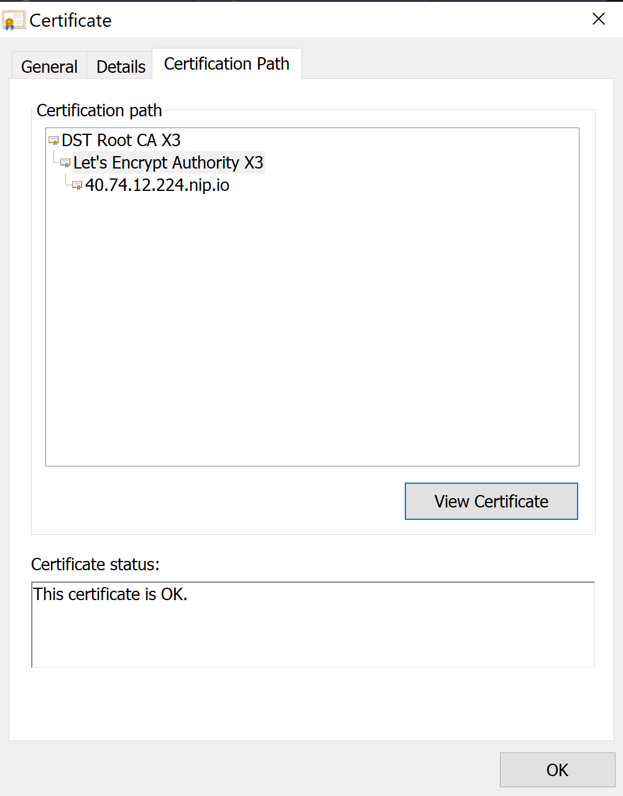

# Challenge 05 - AKS Security  - Coach's Guide 

[< Previous Solution](./Solution-04.md) - **[Home](./README.md)** - [Next Solution >](./Solution-06.md)

## Notes and Guidance

- Dedicated subnets per nodepool in preview at the time of this writing
- Understand how taints/tolerations work for nodepool scheduling
- When using Kubenet networking, only Calico networking policy is currently available in AKS (this may change in the future)
- When using Azure CNI networking, you may use either Calico or Azure networking policy.
- Switching between kubenet and Azure CNI networking is not possible after a cluster has been deployed. 
  - Students will need to re-deploy a new cluster to change the networking type OR apply a networking policy!
  - If the students have used "infrastructure as code" and created their cluster from the Azure CLI using the "az aks create" command, this should not be a "painful" event.
  - It is a good lesson for students to see that with a combination of Azure CLI commands, YAML files, and/or Helm charts, that re-deploying a new cluster is easy.
- AKS will have the ability for users to "bring their own" networking policy in the future. This may change the possible solutions for this challenge.
- To demonstrate that the network policies work:
  - Students can create a jumpbox VM on the VNet where the AKS cluster is deployed
  - curl both the Web & API pods from the VM. 
  - curling the API pod should fail after the proper network policy is in place.
- It might take some time for the Azure Policy to propagate to the AKS cluster (up to 20 mins on average)
  - To verify that no LoadBalancer services with a public IP address can be created, students will should get an error message when trying to deploy a new service.
  - Students should be taught how to enable the service to be available external from the cluster without the use of a public IP address.
    - This involves creating an internal Load Balancer in Azure that receives a private IP address from the VNet that the cluster is deployed into.
    - This article is a good reference: [Use an internal load balancer with Azure Kubernetes Service (AKS)](https://learn.microsoft.com/en-us/azure/aks/internal-lb)

## Solution Guide

### AAD integration

Note that you will not need AAD Global Admin privilege to be able to complete this section if using the new AAD managed experience.

```bash
# AAD group
tenant_id=$(az account show --query 'tenantId' -o tsv)
aad_group_name=AKSadmins
aad_group_oid=$(az ad group show -g $aad_group_name --query objectId -o tsv 2>/dev/null)
if [[ -z "$aad_group_oid" ]]
then
    az ad group create --display-name "$aad_group_name" --mail-nickname "$aad_group_name"
    aad_group_oid=$(az ad group show -g "$aad_group_name" --query objectId -o tsv 2>/dev/null)
fi
# User in the group
az_user=$(az account show --query 'user.name' -o tsv)
az_user_oid=$(az ad user show --id $az_user --query objectId -o tsv)
user_in_group=$(az ad group member check -g $aad_group_name --member-id $az_user_oid --query value -o tsv)
if [[ "$user_in_group" == "false" ]]
then
    az ad group member add -g $aad_group_name --member-id $az_user_oid
fi
# Create "operator" user
if [ -n "$BASH_VERSION" ]; then
    IFS='@' read -ra az_user_split <<< "$az_user"
    tenant_domain=${az_user_split[1]}
elif [ -n "$ZSH_VERSION" ]; then
    IFS='@' read -rA az_user_split <<< "$az_user"
    tenant_domain=${az_user_split[2]}
fi
az_opuser_name="aksop@"${tenant_domain}
az_opuser_password='P@ssw0rd1'
az_opuser_oid=$(az ad user create \
  --display-name "AKS Operator" \
  --user-principal-name $az_opuser_name \
  --password $az_opuser_password \
  --query objectId -o tsv)
# az ad group member add -g $aad_group_name --member-id $az_opuser_oid
# az ad group member remove -g $aad_group_name --member-id $az_opuser_oid
# az ad group member list -g $aad_group_name -o table
# Enable AAD
az aks update -n $aks_name -g $rg --enable-aad --aad-admin-group-object-ids $aad_group_oid --aad-tenant-id $tenant_id
# ClusterRoleBinding
remote "cat <<EOF | kubectl apply -f -
apiVersion: rbac.authorization.k8s.io/v1
kind: ClusterRoleBinding
metadata:
  name: aksoperator
roleRef:
  apiGroup: rbac.authorization.k8s.io
  kind: ClusterRole
  name: view
subjects:
- apiGroup: rbac.authorization.k8s.io
  kind: User
  name: $az_opuser_name
EOF"
```

```bash
# Test
remote "az aks get-credentials -n $aks_name -g $rg --overwrite"
remote "kubectl get pod"
remote "kubectl create ns aksoptest"
```

Go back to admin user:

```bash
# Login again
remote "az aks get-credentials -n $aks_name -g $rg --overwrite"
remote "kubectl get node"
```

### Network policies

Network policy to protect the web pod:

```bash
# Network policy
remote "kubectl label ns/nginx name=nginx"
scp ./Solutions/netpol.yaml $vm_pip_ip:netpol.yaml
remote "kubectl apply -f ./netpol.yaml"
```

You can verify that there is no access from the test VM to the API any more:

```bash
# netpol test
remote "curl http://$api_svc_ip:8080/api/healthcheck"
```

### TLS

```bash
# cert-manager
remote "kubectl apply --validate=false -f https://raw.githubusercontent.com/jetstack/cert-manager/release-0.13/deploy/manifests/00-crds.yaml"
remote "kubectl label namespace nginx cert-manager.io/disable-validation=true"
remote "helm repo add jetstack https://charts.jetstack.io"
remote "helm repo update"
remote "helm install cert-manager --namespace nginx \
--version v0.13.0 jetstack/cert-manager"
```

```bash
# Cluster issuer
az_user=$(az account show --query 'user.name' -o tsv)
remote "cat <<EOF | kubectl apply -f -
apiVersion: cert-manager.io/v1alpha2
kind: ClusterIssuer
metadata:
  name: letsencrypt
spec:
  acme:
    server: https://acme-v02.api.letsencrypt.org/directory
    email: $az_user
    privateKeySecretRef:
      name: letsencrypt
    solvers:
    - http01:
        ingress:
          class: nginx
EOF"
```

```bash
# Redeploy ingress
tmp_file=/tmp/ingress_tls.yaml
file=ingress_tls.yaml
cp ./Solutions/$file $tmp_file
sed -i "s|__ingress_class__|nginx|g" $tmp_file
sed -i "s|__ingress_ip__|${azfw_ip}|g" $tmp_file
scp $tmp_file $vm_pip_ip:$file
remote "kubectl apply -f ./$file"
echo "You can browse to https://${azfw_ip}.nip.io"
```

```bash
# See certificates
remote "kubectl get secret \
  -n default tls-secret \
  -o json -o=jsonpath=\"{.data.tls\.crt}\" | base64 -d"
```

```bash
# TLS CRDs
remote "kubectl describe clusterissuer"
remote "kubectl describe certificate"
remote "kubectl describe secret/tls-secret"
```

And create a new DNAT rule in the firewall for port 443:

```bash
# FW DNAT rule for 443
az network firewall nat-rule create -f azfw -g $rg -n nginxTLS \
    --source-addresses '*' --protocols TCP \
    --destination-addresses $azfw_ip --translated-address $nginx_svc_ip \
    --destination-ports 443 --translated-port 443 \
    -c IngressController
```

You can inspect the certificates in your browser. If required, you can install the root authority (see [LetsEncrypt Chain of Trust](https://letsencrypt.org/certificates/)).



### Nodepools

We can add the second nodepool to the cluster:

```bash
# Create user node pool
az aks nodepool add --cluster-name $aks_name -g $rg \
    --name user --node-count 1 -s $vm_size \
    --enable-cluster-autoscaler --min-count 1 --max-count 3 \
    -k $k8s_version --mode User --vnet-subnet-id $aks_subnet_id \
    --no-wait
```

### OPA

If using the AKS add-on, you might have to join the preview. See [here](https://docs.microsoft.com/azure/governance/policy/concepts/policy-for-kubernetes#install-azure-policy-add-on-for-aks) for more details.

```bash
# Register feature
az provider register --namespace Microsoft.ContainerService
az provider register --namespace Microsoft.PolicyInsights
az feature register --namespace Microsoft.ContainerService --name AKS-AzurePolicyAutoApprove
feature_status=$(az feature list -o tsv --query "[?contains(name, 'Microsoft.ContainerService/AKS-AzurePolicyAutoApprove')].{State:properties.state}")
while [[ "$feature_status" != "Registered" ]]
do
    sleep 30
    feature_status=$(az feature list -o tsv --query "[?contains(name, 'Microsoft.ContainerService/AKS-AzurePolicyAutoApprove')].{State:properties.state}")
done
az provider register -n Microsoft.ContainerService
az aks enable-addons --addons azure-policy -n $aks_name -g $rg
az aks show -n $aks_name -g $rg --query 'addonProfiles.azurepolicy'
```

You can see logs in the `azure-policy` container:

```bash
# Logs
pod_name=$(remote "kubectl -n kube-system get pods -l app=azure-policy -o custom-columns=:metadata.name" | awk NF)
remote "kubectl -n kube-system logs $pod_name"
```

```bash
# Azure Policy
subscription_id=$(az account show --query id -o tsv)
az policy definition list --subscription $subscription_id --query "[?metadata.category=='Kubernetes']" -o table
az policy definition list --subscription $subscription_id --query "[?metadata.category=='Kubernetes']" -o table
policy_name=$(az policy definition list --subscription $subscription_id --query "[?contains(displayName,'internal load balancers in Kubernetes')].name" -o tsv)
```

```bash
# Inspect policy
az policy definition show -n $policy_name --subscription $subscription_id --query parameters
az policy definition show -n $policy_name --subscription $subscription_id --query policyRule
constraint=$(az policy definition show -n $policy_name --subscription $subscription_id --query 'policyRule.then.details.constraint' -o tsv)
constraint_template=$(az policy definition show -n $policy_name --subscription $subscription_id --query 'policyRule.then.details.constraintTemplate' -o tsv)
curl -s $constraint
curl -s $constraint_template
```

```bash
# Assign policy (we will go with the default parameters)
rg_id=$(az group show -n $rg --query id -o tsv)
aks_id=$(az aks show -n $aks_name -g $rg --query id -o tsv)
az policy assignment create -n noPublicLB --policy $policy_name --scope $rg_id
# az policy assignment create -n noPublicLBresource --policy $policy_name --scope $aks_id
remote "kubectl describe constraints"
```

```bash
# Verify
remote "kubectl get svc"
az policy state list --policy-assignment noPublicLB -o table
remote "cat <<EOF | kubectl apply -f -
apiVersion: v1
kind: Service
metadata:
  name: publicweb
spec:
  type: LoadBalancer
  ports:
  - port: 80
    targetPort: 80
  selector:
    run: web
EOF"
echo "The previous command should not have worked (the policy should have forbidden it). If it did, you might want to wait some seconds and retry again."
remote "kubectl get svc"
remote "kubectl delete svc/publicweb"
```

The creation of the public Load Balancer should have given an error similar to this one:

```
Error from server ([denied by azurepolicy-load-balancer-no-public-ips-5770c529e14827a6045a751c63c417c0e1d27b4d9169f8c297c820a652e2aa54] Load Balancers should not have public IPs. azure-load-balancer-internal annotation is required for publicweb): error when creating "STDIN": admission webhook "validation.gatekeeper.sh" denied the request: [denied by azurepolicy-load-balancer-no-public-ips-5770c529e14827a6045a751c63c417c0e1d27b4d9169f8c297c820a652e2aa54] Load Balancers should not have public IPs. azure-load-balancer-internal annotation is required for publicweb
```

* OPA and LBs: [Open Policy Agent: Quota on LoadBalancer service types](https://github.com/raffaelespazzoli/openshift-opa#quota-on-loadbalancer-service-types)
* [Ahmet's network policy examples](https://github.com/ahmetb/kubernetes-network-policy-recipes)

