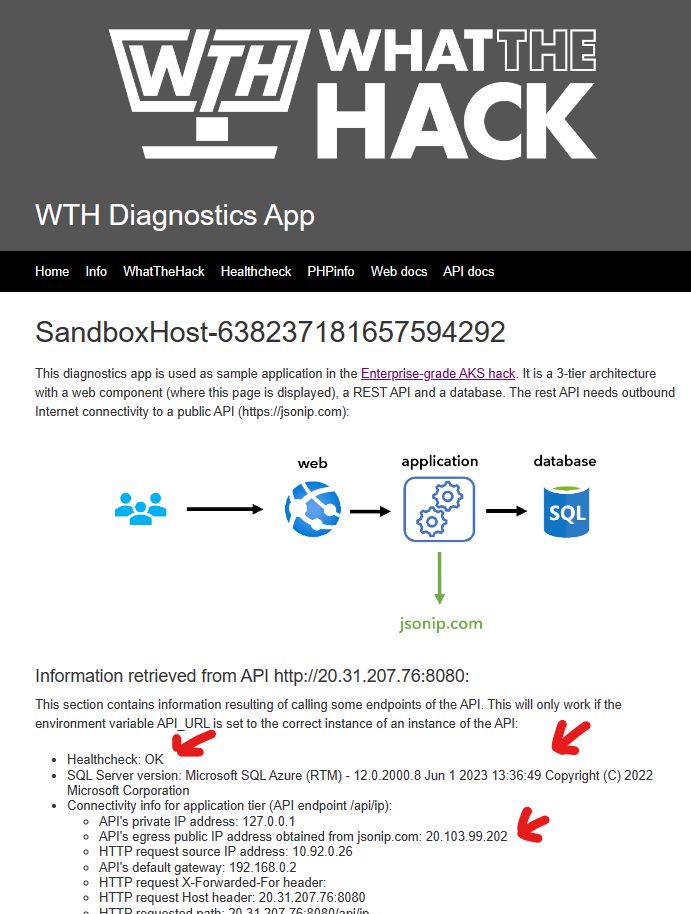

# Challenge 01 - Containers

[< Previous Challenge](./Challenge-00.md) - **[Home](../README.md)** - [Next Challenge >](./Challenge-02.md)

## Introduction

This challenge will cover the basics of containers and a container runtime, and get you familiar with the components of the sample application we will use throughout this hack.

## Description

The sample application we will use in this hack has three components, as the following picture describes: 

The web & API components are documented at the links below. Use this documentation for hints on how to deploy them and how they work:
- A [Web](./Resources/web) component that offers an HTML portal that shows the information.
- An [API](./Resources/api) component that accesses a backend database.
- A **database** which is only used to return a simple query that shows the database version.

### Build & Publish Containers to Azure Container Register

Look in the `/api` and `/web` folders of the `Resources.zip` package provided by your coach to find the source code for the sample application we will use for this hack. You will find a Dockerfile in each folder that you can use to build container images for the API and Web components.

- Create an Azure Container Registry. 
- Build the API and Web container images and store them in your new ACR.

**HINT:** You do not need to have Docker installed on your workstation to build containers. 

### Run the Sample Application

You can complete the challenge with either one of these two options:

#### Option 1: Using your local Docker installation:
  - Deploy the **database** as a SQL Server as container in your local machine
  - Deploy the **API** image in your local machine out of your ACR (you will need a container runtime in your local machine).
  - Make sure that the API can access the database (you can test calling the API endpoints)
  - Deploy the **web** frontend that will connect to the API.
#### Option 2: Using Azure Container Instances 
**Note:** Use this option if you do not have a local Docker installation.
  - Deploy the **database** as an Azure SQL Database
  - Deploy the **API** image as Azure Container Instance in Azure
  - Make sure that the API can connect to the database
  - Deploy the **web** frontend that will connect to the API

For either option, you should be able to access the web frontend in a browser and view it like the screenshot below. If the frontend is able to get the database version through the API it means that the whole chain is working (web -> api -> database):

**NOTE:** The two links at the bottom of the page in the picture above will not work at this stage yet.

## Success Criteria

- Verify you can access the web component
- Verify the web container can access the API container
- Verify the API can access the database, and the database version is correctly displayed in the frontend

## Advanced Challenges (Optional)

- Use an open source database (such as MySQL, MariaDB or Postgres)
- If you used your local Docker installation, complete the challenge using Azure Container Instances
- If you used Azure Container Instances, complete the challenge using your local Docker installation

## Learning Resources

These docs might help you achieving these objectives:

- [API image documentation](./Resources/api/README.md)
- [Web image documentation](./Resources/web/README.md)
- [Run SQL Server container images with Docker](https://docs.microsoft.com/sql/linux/quickstart-install-connect-docker)
- [Azure Container Registry](https://docs.microsoft.com/azure/container-registry/container-registry-intro)
- [Quickstart: Build and run a container image using Azure Container Registry Tasks](https://learn.microsoft.com/en-us/azure/container-registry/container-registry-quickstart-task-cli)
- [Azure Container Instances](https://docs.microsoft.com/azure/container-instances/)
