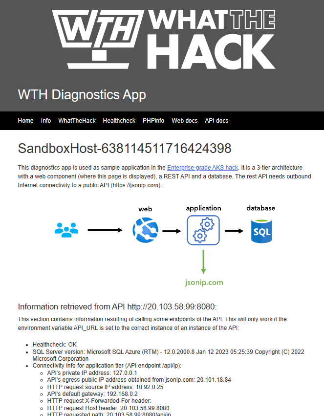

# Challenge 2 - Accelerator: Deploy Sample Application

**[Home](./README.md)** - [Next Challenge >](./Challenge-03.md)

## Introduction

This hack has a sample application called "Whoami" which you will use to complete the challenges of this hack. The app is derived from the ["Whoami" app](https://github.com/erjosito/whoami) by [Jose Moreno](https://github.com/erjosito).

If you have just completed the [Introduction to Kubernetes](../../001-IntroToKubernetes/) or [Advanced Kubernetes](../../023-AdvancedKubernetes/) hacks, and have an existing AKS cluster already deployed, we have put this package together to make it easy to deploy the "Whoami" sample application and continue on with the [AKS Enterprise-Grade](../README.md) hack.

## Description

Your coach will provide you with a `Accelerator.zip` file that contains a set of YAML files and a bash shell script you will use to deploy the "Whoami" app to your existing AKS cluster.   

If you plan to use the Azure Cloud Shell, you should upload the `Accelerator.zip` file to your cloud shell first and then unpack it there.

These files assume you have ALREADY deployed an AKS cluster with the Nginx Ingress Controller that is currently running in Azure. 

### Install NGINX Ingress Controller using Helm

If your AKS cluster already has the Nginx Ingress Controller installed, skip to [Deploy the Whoami App](#deploy-the-whoami-app).

If your AKS cluster does not have the Nginx Ingress Controller installed, please install it by running the following commands:

``` bash
# Create a namespace for your ingress resources
kubectl create namespace ingress-basic

# Add the ingress-nginx repository
helm repo add ingress-nginx https://kubernetes.github.io/ingress-nginx

# Use Helm to deploy an NGINX ingress controller
helm install nginx-ingress ingress-nginx/ingress-nginx \
    --namespace ingress-basic \
    --set controller.replicaCount=2 \
    --set controller.nodeSelector."kubernetes\.io/os"=linux \
    --set defaultBackend.nodeSelector."kubernetes\.io/os"=linux \
    --set controller.admissionWebhooks.patch.nodeSelector."kubernetes\.io/os"=linux \
    --set controller.service.annotations."service\.beta\.kubernetes\.io/azure-load-balancer-health-probe-request-path"=/healthz
```
### Deploy the Whoami App

Follow these steps to deploy the "Whoami" app:

1. From WSL/Terminal/Cloud Shell, navigate to the folder where `Accelerator.zip` file has been un-zipped.
2. Set permissions on the `deployAzureSQL.sh` script file so that it can be executed: 
    ```chmod 755 deployAzureSQL.sh```
3. Run the script from the bash shell in WSL/Terminal (this will NOT work in PowerShell): 
    `./deployAzureSQL.sh`
    - The script will prompt you to enter a resource group name, Azure region location, and a password for the SQL administrator account.
    - The script will deploy an Azure SQL Database server which is used by the sample app.
    - FYI... when running the SQL deployment script, your password must meet the [Azure VM password requirements](https://learn.microsoft.com/en-us/azure/virtual-machines/windows/faq#what-are-the-password-requirements-when-creating-a-vm-).
    - After the Azure SQL Database is deployed, you will need to adjust its firewall rules to [allow Azure services and resources to access it](https://learn.microsoft.com/en-us/azure/azure-sql/database/network-access-controls-overview?view=azuresql).
4. Edit the `api-deploy.yaml` file:
    - Modify line 27 with the DNS name of your newly created Azure SQL Database server.
    - Modify line 29 with the password you provided to the script in Step 3.
        - **NOTE:** This is a terrible ANTI-PATTERN of what NOT to do in the real world (hard code a password!)  Don't worry, you will fix this later during the hack.
5. Deploy the api file: `kubectl apply -f api-deploy.yaml`
6. Deploy the web file: `kubectl apply -f web-deploy.yaml`
7. EDIT the `ingress.yaml` file and modify line 11 with the Public IP address of your Ingress controller.
8. Deploy the ingress file: `kubectl apply -f ingress.yaml`

## Success Criteria

- Verify that you are able to view the sample app in a web browser by going to the address you put in line 11 of the `ingress.yaml` file!
- Verify that the links to the `API Health Status` and the `SQL Server Version` work.

The sample application should look similar to the screenshot below:

