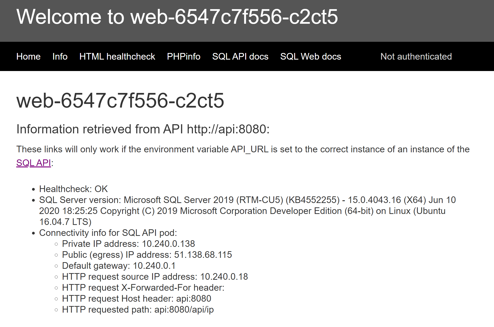

# 8. Arc for Kubernetes

[< Previous Challenge](./07-aks_mesh.md) - **[Home](./README.md)**

## Notes and Guidance

* Participants can choose multiple options to deploy their own non-AKS cluster, the easiest is probably aks-engine.
* Using gitops, consider not exposing secrets in the repo as something optional. Alternatives to fix this are Sealed Secrets or AKV integration
* The Arc for Data part is optional, if participants do not have access to the preview (it is private at the time of this writing) replace that with a PaaS database

## Solution Guide

Create an AKS engine cluster:

<details><summary>Code</summary>

```bash
# Variables
rg=aksengine
location=westeurope
az group create -n $rg -l $location

# Option 1: Create Service Principal (First time)
purpose=aksengine
sp_name=$purpose
sp_output=$(az ad sp create-for-rbac --name $sp_name --skip-assignment 2>/dev/null)
sp_app_id=$(echo $sp_output | jq -r '.appId')
sp_app_secret=$(echo $sp_output | jq -r '.password')
# Optionally store the created app ID and secret in an AKV
keyvault_name=<your_akv>
keyvault_appid_secret_name=$purpose-sp-appid
keyvault_password_secret_name=$purpose-sp-secret
az keyvault secret set --vault-name $keyvault_name -n $keyvault_appid_secret_name --value $sp_app_id
az keyvault secret set --vault-name $keyvault_name -n $keyvault_password_secret_name --value $sp_app_secret

# Option 2: Retrieve Service Principal form AKV (After first time)
purpose=aksengine
keyvault_name=<your_akv>
keyvault_appid_secret_name=$purpose-sp-appid
keyvault_password_secret_name=$purpose-sp-secret
sp_app_id=$(az keyvault secret show --vault-name $keyvault_name -n $keyvault_appid_secret_name --query 'value' -o tsv)
sp_app_secret=$(az keyvault secret show --vault-name $keyvault_name -n $keyvault_password_secret_name --query 'value' -o tsv)

# Grant access to the SP to the new RG
scope=$(az group show -n $rg --query id -o tsv)
assignee=$(az ad sp show --id $sp_app_id --query objectId -o tsv)
az role assignment create --scope $scope --role Contributor --assignee $assignee

# Retrieve example JSON file describing a basic cluster
url=https://raw.githubusercontent.com/Azure/aks-engine/master/examples/kubernetes.json
aksengine_cluster_file="./aksengine_cluster.json" 
wget $url -O $aksengine_cluster_file
# You can modify the kubernetes.json file, for example with smaller VM sizes such as Standard_B2ms

# Optionally we can create a cluster file from scratch:
aksengine_vm_size=Standard_B2ms
cat <<EOF > $aksengine_cluster_file
{
  "apiVersion": "vlabs",
  "properties": {
    "orchestratorProfile": {
      "orchestratorType": "Kubernetes"
    },
    "masterProfile": {
      "count": 1,
      "dnsPrefix": "",
      "vmSize": "$aksengine_vm_size"
    },
    "agentPoolProfiles": [
      {
        "name": "agentpool1",
        "count": 3,
        "vmSize": "$aksengine_vm_size"
      }
    ],
    "linuxProfile": {
      "adminUsername": "azureuser",
      "ssh": {
        "publicKeys": [
          {
            "keyData": ""
          }
        ]
      }
    },
    "servicePrincipalProfile": {
      "clientId": "",
      "secret": ""
    }
  }
}
EOF

# Create AKS-engine cluster
# You might need to install aks-engine from https://github.com/Azure/aks-engine/blob/master/docs/tutorials/quickstart.md
subscription=$(az account show --query id -o tsv)
domain=abc$RANDOM
rm -rf _output   # The output directory cannot exist
aks-engine deploy --subscription-id $subscription \
    --dns-prefix $domain \
    --resource-group $rg \
    --location $location \
    --api-model $aksengine_cluster_file \
    --client-id $sp_app_id \
    --client-secret $sp_app_secret \
    --set servicePrincipalProfile.clientId=$sp_app_id \
    --set servicePrincipalProfile.secret="$sp_app_secret"

# There are different ways to access the cluster
# Exporting the KUBECONFIG variable is required by the command "az k8sconfiguration create"
export KUBECONFIG="./_output/$domain/kubeconfig/kubeconfig.$location.json" 
kubectl get node
# The alias is a little dirty trick for lazy persons like me
# alias ke="kubectl --kubeconfig ./_output/$domain/kubeconfig/kubeconfig.$location.json" 
```
</details>
<br>

Now we have a kubernetes cluster and access to it, we can connect it to Arc

<details><summary>Code</summary>

```shell
# Now we can create the ARC resource
arc_rg=k8sarc
az group create -n $arc_rg -l $location
arcname=myaksengine
az connectedk8s connect --name $arcname -g $arc_rg

# Create a cluster-level operator
repo_url="https://github.com/erjosito/arc-k8s-test/" # Use your own repo here
cfg_name=gitops-config
namespace=$cfg_name
az k8sconfiguration create \
    --name $cfg_name \
    --cluster-name $arcname --resource-group $arc_rg \
    --operator-instance-name $cfg_name \
    --operator-namespace $namespace \
    --repository-url $repo_url \
    --scope cluster \
    --cluster-type connectedClusters
# cluster-type can be either "connectedClusters" (for ARC clusters) or "managedClusters" (for AKS)

# Diagnostics
az k8sconfiguration show -n $cfg_name -c $arcname -g $arc_rg --cluster-type connectedClusters
kubectl -n $namespace get deploy -o wide

# Optional: update operator to enable helm or change the repo URL
az k8sconfiguration update -n $cfg_name -c $arcname -g $arc_rg --cluster-type connectedClusters --enable-helm-operator
az k8sconfiguration update -n $cfg_name -c $arcname -g $arc_rg --cluster-type connectedClusters -u $repo_url

# Optional: delete configuration
az k8sconfiguration delete -n $cfg_name -c $arcname -g $arc_rg --cluster-type connectedClusters
```

</details>
<br>

You will find sample apps in [this repo](https://github.com/erjosito/arc-k8s-test/), including a deployment with the web and api containers we have used in previous exercises ([this](https://github.com/erjosito/arc-k8s-test/blob/master/sqlapi/fullapp.yaml)). Note that in that repo there is a secret stored, and that is **very bad** practice. There are ways of using gitops with secrets, but those have been left out of scope for this challenge for simplicity reasons. If you would like including this aspect, you can look at two options:

* Using integration with a secret store such as Azure Key Vault: configure AKV integration in your cluster and store the secret there instead of in the git repo
* Using [Sealed Secrets](https://www.weave.works/blog/storing-secure-sealed-secrets-using-gitops)

If you are using a PaaS database to test, do not forget to add the IP address of your cluster.

In the second part of this challenge, we will deploy a database into our cluster using Azure Arc for Data. The first thing participants should do is installing the `azdata` tool. Details can be found in [Install Azdata](https://docs.microsoft.com/sql/azdata/install/deploy-install-azdata). For example, for Ubuntu 20.04 this are the instructions:

<details><summary>Code</summary>

```shell
# Install azdata
apt-get update
apt-get install -y curl apt-transport-https unixodbc libkrb5-dev libssl1.1
curl -SL https://private-repo.microsoft.com/python/azure-arc-data/private-preview-aug-2020-new/ubuntu-focal/azdata-cli_20.1.1-1~focal_all.deb -o azdata-cli_20.1.1-1~focal_all.deb
dpkg -i azdata-cli_20.1.1-1~focal_all.deb
apt-get -f install
```

</details>
<br>

Now the Data Controller can be installed in the cluster (see [here](https://docs.microsoft.com/azure/azure-arc/data/create-data-controller-using-azdata) for more information):

<details><summary>Code</summary>

```shell
# Create ARC data controller in the cluster
password=Microsoft123! # Using the same password as in other challenges
export AZDATA_USERNAME=jose
export AZDATA_PASSWORD=$password
export ACCEPT_EULA=yes
export REGISTRY_USERNAME="22cda7bb-2eb1-419e-a742-8710c313fe79"  # Fix MCR username
export REGISTRY_PASSWORD="cb892016-5c33-4135-acbf-7b15bc8cb0f7"  # Fix MCR password
subscription_id=$(az account show --query id -o tsv)
azdata arc dc create --profile-name azure-arc-aks-premium-storage \
                     --namespace arcdc --name arcdc \
                     --subscription $subscription_id \
                     --resource-group $arc_rg --location $location \
                     --connectivity-mode indirect
# Login
azdata login --namespace arcdc
```

</details>
<br>

There are some things you can look at now:

<details><summary>Code</summary>

```shell
# Verifying DC deployment
azdata arc dc status show
azdata arc dc endpoint list -o table  # Notice the Grafana and Kibana endpoints
kubectl -n arcdc get statefulset
kubectl -n arcdc get svc
kubectl -n arcdc get ds
# Verify the available storage classes (we will use managed-premium for the DB)
kubectl get sc
# Verify the created CRDs
kubectl get crd
```

</details>
<br>

Now we can create a database. You can either use azdata, or yaml posted to your gitops repo. Here the azdata way:

<details><summary>Code</summary>

```shell
# Deploy Azure Database for Postgres (will take around 30-40 minutes)
arc_db_name=mypgdb
azdata arc postgres server create -n $arc_db_name --workers 1 --storage-class-data managed-premium --storage-class-logs managed-premium
# Option with Azure Files instead of Managed Disks:
# azdata arc postgres server create -n $arc_db_name --workers 1 --storage-class-data azurefile --storage-class-logs azurefile
# Option with an Azure SQL MI instead of Postgres
# azdata arc sql mi create -n $arc_db_name --storage-class-data managed-premium --storage-class-logs managed-premium
# Verify
azdata arc postgres server list
azdata arc postgres server show -n $arc_db_name
azdata arc postgres server endpoint list -n $arc_db_name
kubectl -n arcdc get postgresql-12s.arcdata.microsoft.com
kubectl -n arcdc get postgresql-12s.arcdata.microsoft.com/$arc_db_name -o yaml
kubectl -n arcdc get svc
# Danger zone
# azdata arc postgres server delete -n $arc_db_name
```

</details>
<br>

Some gotchas:

* If you are getting connection timeout errors when creating the database, you might want to login again (`azdata login --namespace arcdc`).
* If your deployment takes longer than 15 minutes, you might want to stop it, delete, and increase the size of your cluster before retrying

You might want to change `SQL_SERVER_FQDN` variable in the API container to the Kubernetes service where the database is listening (`mypgdb-svc.arcdc` in the previous example), and the `SQL_ENGINE` variable to `postgres`. You can use the `sql` endpoint of the SQL API to test reachability to the database:


<details><summary>Code</summary>

```shell
# Get public IP of SQL API service
api_svc_ip=$(kubectl get svc/api -n sqlapi -o json | jq -rc '.status.loadBalancer.ingress[0].ip' 2>/dev/null)
# Check environment variables of SQL API container (focus on SQL_xxxx variables)
curl -s "http://$api_svc_ip:8080/api/printenv"
# Check correct resolution for the database FQDN (using the service name)
curl -s "http://$api_svc_ip:8080/api/dns?fqdn=$arc_db_name-svc.arcdc"
# Check access to the database, overriding the required environment variables for the SQL API
# For example, for a SQL MI database overriding all parameters but the password
curl http://$api_svc_ip:8080/api/sql\?SQL_SERVER_FQDN\=$arc_db_name-svc.arcdc\&SQL_ENGINE\=sqlserver\&SQL_SERVER_USERNAME\=sa
```

</details>
<br>

If the environment variables are properly set in the API and Web containers, you should be able to access all the way through the database (notice the database version is SQL Server on Linux):

