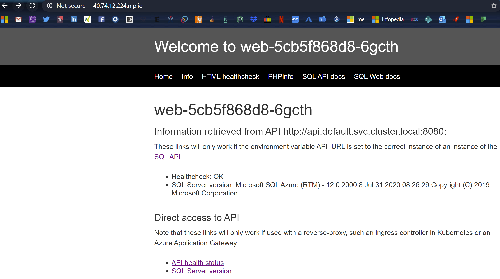
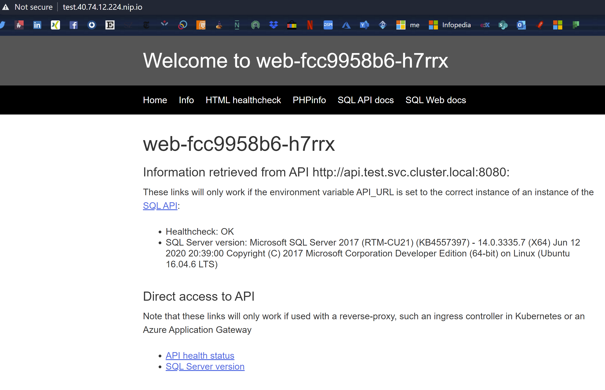

# Notes for AKS FastHack

> [!NOTE] We are in the process of migrating this content to the [What The Hack](https://aka.ms/wthhome) platform. This repo will be active until we complete the migration, after the migration it will no longer maintained.

## Coaching FastHacks

Some thoughts:

* Let participants find their own solutions, even if they are wrong. Let them hit walls and learn from their mistakes, unless you see them investing too much time and effort. Give them hints that put them on the right track, but not solutions
* Most challenges can be solved in multiple ways, all of them correct solutions
* Feel free to customize scenarios to match your participants' level: if they are too new to Azure, feel free to remove objectives. If they are too advanced, give them additional ones
* If there is any concept not clear for everybody, try to make participants explain to each other. Intervene only when no participant has the knowledge
* **Make sure no one is left behind**

## The Kubernetes FastHack

These repo has notes for coaches of the [containers hackathon](https://azurefasttrack.visualstudio.com/hackathons/_git/hacks-containers?path=%2FREADME.md&_a=preview).

### Technologies covered

The following table summarizes the technologies covered by the exercises:

| Challenge ID | Challenge | Topics covered | Estimated time |
| :----------: | :------- | :------------- | :---: |
| 1 | [Containers and images](#challenge1) | Docker, ACI, ACR | 1h |
| 2 | [AKS Networking](#challenge2) | Private cluster, egress filtering, private link, ingress controllers | 4h |
| 3 | [Monitoring](#challenge3) | Azure Monitor, Prometheus/Grafana, K8s secrets and config maps, cluster autoscaler, HPA | 3h |
| 4 | [Secrets](#challenge4) | AKV CSI integration, pod identity | 2h |
| 5 | [Security](#challenge5) | AAD Integration, Azure Policy for k8s, SSL on ingress controller | 2h |
| 6 | [Storage](#challenge6) | Disk-based and File-based PVs | 1h |
| 7 | [Service mesh](#challenge7) | Service Mesh (this doc uses Linkerd) | 2h |
| 8 | [Arc](#challenge8) | aks-engine, arc for k8s, gitops, arc for data | 3h |

### Possible delivery formats

You can deliver this content in multiple ways, here some examples:

* **Standard**: go sequentially to the challenges until participants run out of time. Note that they will need 4-5 days to finish all challenges, so you might to fall back to "semi-custom"
* **Semi-custom**: challenges 1-3, plus let the participants choose from 4-8 if they have time and energy for more
* **Half-day**:
    * Arc: challenge 8
* **Single-day**:
    * Security: challenges 2, 4, 5

As coach you can guide your participants to the best flow depending on their preferences, prior knowledge and available time (all of the objectives would probably take 3-4 days). Here some example flows:

1. Common: Go through the basics (challenges 1-3), making sure the ground concepts are well understood. Proceed through challenges 4-5 as time allows, ignoring the most advanced ones.
2. Advanced: for the advanced users you can start directly in challenge 2. Afterwards, most of the other challenges are pretty self-contained, so you can let the participants choose their preferred topic. For example, if they wish to jump straight to challenge 7 (ingress controllers) let them do so.
3. Custom: feel free to add/remove challenges. For example, if private clusters / egress filtering is not as interesting as other topics, feel free to remove that requirement from challenge 2, which will considerably ease interacting with the cluster in later challenges.

## FastHack Roadmap

The following challenges will be added to this course in the future. Feel free to add them to your participants experience if you think they are relevant:

* Log into a cluster with SP credentials using [kubelogin](https://github.com/Azure/kubelogin)
* Investigate modifications to the cluster with kube-audit logs ([Master node logs](https://docs.microsoft.com/azure/aks/view-master-logs))

## 0. Before you start<a id="challenge0"></a>

* Make sure participants have a way to share code, ideally git-based
* Most challenges involve some level of subscription ownership to create identities or service principals, or for the AAD integration challenge.
* If there is any concept not clear for everybody, try to make participants explain to each other. Intervene only when no participant has the knowledge
* Leave participants try designs even if you know it is not going to work, let them explore on themselves. Stop them only if they consume too much time
* **Make sure no one is left behind**
* For each challenge, you can ask the least participative members to describe what has been done and why

As very first thing, the participants should clone the repo to their local machines:

```bash
git clone https://azurefasttrack.visualstudio.com/hackathons/_git/hacks-network-coaches
```

> :warning: Note that the code snippets provided here are just an orientation for you as a coach, and might not work 100% in your particular environment. They have been tested, but the rapid nature of Azure CLI versions, Kubernetes, AKS, helm, etc makes it very difficult constantly reviewing them on a regular basis. If you find errors in the code, please send a PR to this repo with the correction.

## 1. Docker and ACI<a id="challenge1"></a>

* Participants can build locally and then upload the images (`docker build`, `docker login` and `docker push`), or let ACR do the build for them (`az acr build`)

### Local Docker (option 1)


These commands have been tested on Powershell 7 on Windows 10, with Docker configured for Linux containers, and the utilities `jq` and `curl` installed

<details><summary>Code</summary>

```bash
# Running SQL Server locally
$sql_password="Microsoft123!Microsoft123!"
docker run -e "ACCEPT_EULA=Y" -e "SA_PASSWORD=$sql_password" -p 1433:1433 --name sql -d mcr.microsoft.com/mssql/server:latest
$sql_ip=$(docker inspect sql | jq -r '.[0].NetworkSettings.Networks.bridge.IPAddress')
Write-Host "SQL Server running with IP address $sql_ip"
```

```bash
# Building and running SQL API locally
cd api
docker build -t api:1.0 .
docker run -d -p 8080:8080 -e "SQL_SERVER_FQDN=${sql_ip}" -e "SQL_SERVER_USERNAME=sa" -e "SQL_SERVER_PASSWORD=${sql_password}" --name api api:1.0
$api_ip=$(docker inspect api | jq -r '.[0].NetworkSettings.Networks.bridge.IPAddress')
Write-Host "API container running with IP address $api_ip"
curl "127.0.0.1:8080/api/healthcheck"
```

```bash
# Run Web frontend
cd ../web
docker build -t web:1.0 .
docker run -d -p 8081:80 -e "API_URL=http://${api_ip}:8080" --name web web:1.0
$web_ip=$(docker inspect web | jq -r '.[0].NetworkSettings.Networks.bridge.IPAddress')
Write-Host "You can point your browser to http://127.0.0.1:8081 to verify the app"
```

</details>
<br>

The web GUI should look something like this:


Note the `Healthcheck: OK` and the SQL version retrieved from the SQL database. The links at the bottom of the page (API health status and SQL Server Version are not working yet, they are intended to be used with an ingress controller)

### ACR & ACI (option 2)

These commands have been tested on a zsh shell:

<details><summary>Code</summary>

```azurecli
# Create RG and ACR
rg=hack$RANDOM
acr_name=$rg
location=westeurope
az group create -n $rg -l $location
az acr create -n $acr_name -g $rg --sku Standard
```

```azurecli
# Build images
cd api
az acr build -r $acr_name -t hack/sqlapi:1.0 .
cd ../web
az acr build -r $acr_name -t hack/web:1.0 .
az acr repository list -n $acr_name -o table
```

```bash
# Create SQL DB
sql_server_name=sqlserver$RANDOM
sql_db_name=mydb
sql_username=azure
sql_password=Microsoft123!
az sql server create -n $sql_server_name -g $rg -l $location --admin-user $sql_username --admin-password $sql_password
sql_server_fqdn=$(az sql server show -n $sql_server_name -g $rg -o tsv --query fullyQualifiedDomainName)
az sql db create -n $sql_db_name -s $sql_server_name -g $rg -e Basic -c 5 --no-wait
```

```azurecli
# Create ACIs
aci_name=sqlapi
az acr update -n $acr_name --admin-enabled true
acr_usr=$(az acr credential show -n $acr_name -g $rg --query 'username' -o tsv)
acr_pwd=$(az acr credential show -n $acr_name -g $rg --query 'passwords[0].value' -o tsv)
az container create -n $aci_name -g $rg  -e "SQL_SERVER_USERNAME=$sql_username" "SQL_SERVER_PASSWORD=$sql_password" "SQL_SERVER_FQDN=$sql_server_fqdn" \
    --image $acr_name.azurecr.io/hack/sqlapi:1.0 --ip-address public --ports 8080 \
    --registry-username $acr_usr --registry-password $acr_pwd
sqlapi_ip=$(az container show -n $aci_name -g $rg --query ipAddress.ip -o tsv)
sqlapi_source_ip=$(curl -s http://${sqlapi_ip}:8080/api/ip | jq -r .my_public_ip)
az sql server firewall-rule create -g $rg -s $sql_server_name -n public_sqlapi_aci-source --start-ip-address $sqlapi_source_ip --end-ip-address $sqlapi_source_ip
curl "http://${sqlapi_ip}:8080/api/healthcheck"
curl "http://${sqlapi_ip}:8080/api/sqlsrcip"
echo "The output of the previous command should have been $sqlapi_source_ip"
```

```azurecli
az container create -n web -g $rg -e "API_URL=http://${sqlapi_ip}:8080" --image $acr_name.azurecr.io/hack/web:1.0 --ip-address public --ports 80 \
  --registry-username $acr_usr --registry-password $acr_pwd
web_ip=$(az container show -n web -g $rg --query ipAddress.ip -o tsv)
echo "Please connect your browser to http://${web_ip} to test the correct deployment"
```

</details>
<br>

The web GUI should look something like this:


Note the `Healthcheck: OK` and the SQL version retrieved from the SQL database. The links at the bottom of the page (API health status and SQL Server Version are not working yet, they are intended to be used with an ingress controller)

### Follow-up questions

* Describe the different SKUs for ACR
* Describe how authentication works for ACR with SP, and the built-in roles required for that ([AcrPull](https://docs.microsoft.com/azure/role-based-access-control/built-in-roles#acrpull), [AcrPush](https://docs.microsoft.com/azure/role-based-access-control/built-in-roles#acrpush))

## 2. Network integration<a id="challenge2"></a>

Remarks:

* Make sure the participants understand the IP address allocation requirements of Azure CNI vs kubenet
* Make sure the participants understand how the Azure Load Balancers, NSGs and kubernetes services play together
* Make sure the participants understand why the ingress needs to be deployed with a private IP address: otherwise the default route to the firewall will cause asymmetric routing
* Participants could go with an off-cluster ingres controller such as AGIC, this would probably make routing easier (and there are no dependencies later on)
* Feel free to leave the participants go with any ingress controller other than nginx, but nginx is probably going to be the easiest one.
* Note that configuring a private DNS-zone was not required when creating the private cluster
* If users have their own DNS domain, they could use it instead of `nip.io` as in this guide.
* At the time of this writing, SLA API and private API are mutually exclusive


This is a possible script for this challenge:

<details><summary>Code</summary>

```bash
# Get variables from previous labs and build images if required
rg=$(az group list --query "[?contains(name,'hack')].name" -o tsv 2>/dev/null)
if [[ -n "$rg" ]]
then
    location=$(az group list --query "[?contains(name,'hack')].location" -o tsv)
else
    rg=hack$RANDOM
    location=westeurope
    az group create -n $rg -l $location
fi
acr_name=$(az acr list --query "[?contains(name,'hack')].name" -o tsv 2>/dev/null)
if [[ -z "$acr_name" ]]
then
    acr_name=hack$RANDOM
    az acr create -n $acr_name -g $rg --sku Standard
    # Build images (you should be in the hack-containers home directory)
    cd api
    az acr build -r $acr_name -t hack/sqlapi:1.0 .
    cd ../web
    az acr build -r $acr_name -t hack/web:1.0 .
    az acr repository list -n $acr_name -o table
fi
# Variables for AKS
aks_name=aks
aks_rbac=yes
aks_service_cidr=10.0.0.0/16
vmsize=Standard_B2ms
vm_size=Standard_B2ms
preview_version=no
vnet_name=aks
vnet_prefix=10.13.0.0/16
aks_subnet_name=aks
aks_subnet_prefix=10.13.76.0/24
vm_subnet_name=vm
vm_subnet_prefix=10.13.1.0/24
azfw_subnet_name=AzureFirewallSubnet
azfw_subnet_prefix=10.13.2.0/24
db_subnet_name=sql
db_subnet_prefix=10.13.50.0/24
akslb_subnet_name=akslb
akslb_subnet_prefix=10.13.77.0/24
# Create vnet
az network vnet create -g $rg -n $vnet_name --address-prefix $vnet_prefix -l $location
az network vnet subnet create -g $rg -n $aks_subnet_name --vnet-name $vnet_name --address-prefix $aks_subnet_prefix
aks_subnet_id=$(az network vnet subnet show -n $aks_subnet_name --vnet-name $vnet_name -g $rg --query id -o tsv)
# Get latest supported/preview version
k8s_versions=$(az aks get-versions -l $location -o json)
if [[ "$preview_version" == "yes" ]]
then
    k8s_version=$(echo $k8s_versions | jq '.orchestrators[]' | jq -rsc 'sort_by(.orchestratorVersion) | reverse[0] | .orchestratorVersion')
    echo "Latest supported k8s version in $rg_location is $k8s_version (in preview)"
else
    k8s_version=$(echo $k8s_versions | jq '.orchestrators[] | select(.isPreview == null)' | jq -rsc 'sort_by(.orchestratorVersion) | reverse[0] | .orchestratorVersion')
    echo "Latest supported k8s version (not in preview) in $location is $k8s_version"
fi
# Create firewall
azfw_subnet_name=Firewall
azfw_subnet_prefix=10.13.2.0/24
az network vnet subnet create -g $rg -n $azfw_subnet_name --vnet-name $vnet_name --address-prefix $azfw_subnet_prefix
az network public-ip create -g $rg -n azfw-pip --sku standard --allocation-method static -l $location
azfw_ip=$(az network public-ip show -g $rg -n azfw-pip --query ipAddress -o tsv)
az network firewall create -n azfw -g $rg -l $location
azfw_id=$(az network firewall show -n azfw -g $rg -o tsv --query id)
az network firewall ip-config create -f azfw -n azfw-ipconfig -g $rg --public-ip-address azfw-pip --vnet-name $vnet_name
az network firewall update -n azfw -g $rg
azfw_private_ip=$(az network firewall show -n azfw -g $rg -o tsv --query 'ipConfigurations[0].privateIpAddress')
# Logging
logws_name=log$RANDOM
az monitor log-analytics workspace create -n $logws_name -g $rg
logws_id=$(az resource list -g $rg -n $logws_name --query '[].id' -o tsv)
logws_customerid=$(az monitor log-analytics workspace show -n $logws_name -g $rg --query customerId -o tsv)
az monitor diagnostic-settings create -n mydiag --resource $azfw_id --workspace $logws_id \
      --metrics '[{"category": "AllMetrics", "enabled": true, "retentionPolicy": {"days": 0, "enabled": false }, "timeGrain": null}]' \
      --logs '[{"category": "AzureFirewallApplicationRule", "enabled": true, "retentionPolicy": {"days": 0, "enabled": false}}, 
              {"category": "AzureFirewallNetworkRule", "enabled": true, "retentionPolicy": {"days": 0, "enabled": false}}]'
# Rules
az network firewall network-rule create -f azfw -g $rg -c VnetTraffic \
    --protocols Any --destination-addresses $vnet_prefix --destination-ports '*' --source-addresses $vnet_prefix -n Allow-VM-to-AKS --priority 210 --action Allow
az network firewall network-rule create -f azfw -g $rg -c WebTraffic \
    --protocols Tcp --destination-addresses $azfw_ip --destination-ports 80 8080 443 --source-addresses '*' -n AllowWeb --priority 300 --action Allow
az network firewall network-rule create -f azfw -g $rg -c AKS-egress \
    --protocols Udp --destination-addresses '*' --destination-ports 123 --source-addresses $aks_subnet_prefix -n NTP --priority 220 --action Allow
az network firewall network-rule create -f azfw -g $rg -c AKS-egress \
    --protocols Udp --destination-addresses '*' --destination-ports 1194 --source-addresses $aks_subnet_prefix -n TunnelTraffic
# Application rule: AKS-egress (https://docs.microsoft.com/en-us/azure/aks/limit-egress-traffic):
az network firewall application-rule create -f azfw -g $rg -c Helper-tools \
    --protocols Http=80 Https=443 --target-fqdns ifconfig.co api.snapcraft.io jsonip.com --source-addresses $vnet_prefix -n Allow-ifconfig --priority 200 --action Allow
az network firewall application-rule create -f azfw -g $rg -c Helper-tools \
    --protocols Http=80 Https=443 --target-fqdns kubernaut.io motd.ubuntu.com --source-addresses $vnet_prefix -n ubuntuTools
# Creating rules takes a long time, hence it is better creating one with many FQDNs, than one per FQDN
# If zsh we need to expand the variables with (z)
rule_name="Egress"
target_fqdns="*.azmk8s.io aksrepos.azurecr.io *.blob.core.windows.net mcr.microsoft.com *.cdn.mscr.io management.azure.com login.microsoftonline.com packages.azure.com acs-mirror.azureedge.net *.opinsights.azure.com *.monitoring.azure.com dc.services.visualstudio.com"
if [ -n "$BASH_VERSION" ]; then
    az network firewall application-rule create -f azfw -g $rg -c AKS-egress \
        --protocols Https=443 --target-fqdns "$target_fqdns" --source-addresses $aks_subnet_prefix -n $rule_name --priority 220 --action Allow
elif [ -n "$ZSH_VERSION" ]; then
      az network firewall application-rule create -f azfw -g $rg -c AKS-egress \
        --protocols Https=443 --target-fqdns "${(z)target_fqdns}" --source-addresses $aks_subnet_prefix -n $rule_name --priority 220 --action Allow
fi
rule_name="Registries"
target_fqdns="$location.data.mcr.microsoft.com $acr_name.azurecr.io *.gcr.io gcr.io storage.googleapis.com *.docker.io quay.io *.quay.io *.cloudfront.net production.cloudflare.docker.com"
if [ -n "$BASH_VERSION" ]; then
    az network firewall application-rule create -f azfw -g $rg -c AKS-egress \
        --protocols Https=443 --target-fqdns "$target_fqdns" --source-addresses $aks_subnet_prefix -n $rule_name
elif [ -n "$ZSH_VERSION" ]; then
    az network firewall application-rule create -f azfw -g $rg -c AKS-egress \
        --protocols Https=443 --target-fqdns "${(z)target_fqdns}" --source-addresses $aks_subnet_prefix -n $rule_name
fi
# The next rules might be consolidated together (as the rules above) so that it takes shorter to configure them
az network firewall application-rule create -f azfw -g $rg -c AKS-egress \
    --protocols Https=443 --target-fqdns grafana.net grafana.com stats.grafana.org --source-addresses $aks_subnet_prefix -n Grafana
az network firewall application-rule create -f azfw -g $rg -c AKS-egress \
    --protocols Https=443 --target-fqdns github.com raw.githubusercontent.com --source-addresses $aks_subnet_prefix -n Github
az network firewall application-rule create -f azfw -g $rg -c AKS-egress \
    --protocols Http=80 Https=443 --target-fqdns security.ubuntu.com security.ubuntu.com packages.microsoft.com azure.archive.ubuntu.com --source-addresses $aks_subnet_prefix -n Packages
az network firewall application-rule create -f azfw -g $rg -c AKS-egress \
    --protocols Http=80 Https=443 --target-fqdns security.ubuntu.com hack32003.vault.azure.net --source-addresses $aks_subnet_prefix -n KeyVault
az network firewall application-rule create -f azfw -g $rg -c AKS-egress \
    --protocols Http=80 Https=443 --target-fqdns '*.letsencrypt.org' --source-addresses $aks_subnet_prefix -n letsencrypt
az network firewall application-rule create -f azfw -g $rg -c AKS-egress \
    --protocols Http=80 Https=443 --target-fqdns usage.projectcalico.org --source-addresses $aks_subnet_prefix -n calico
az network firewall application-rule create -f azfw -g $rg -c AKS-egress \
    --protocols Http=80 Https=443 --target-fqdns gov-prod-policy-data.trafficmanager.net --source-addresses $aks_subnet_prefix -n AzPolicy
az network firewall application-rule create -f azfw -g $rg -c AKS-egress \
    --protocols Http=80 Https=443 --target-fqdns vortex.data.microsoft.com --source-addresses $aks_subnet_prefix -n SqlServer
# Route table
az network route-table create -n aks -g $rg -l $location
az network route-table route create -n defaultRoute --route-table-name aks -g $rg \
    --next-hop-type VirtualAppliance --address-prefix "0.0.0.0/0" --next-hop-ip-address $azfw_private_ip
aks_rt_id=$(az network route-table show -n aks -g $rg -o tsv --query id)
az network vnet subnet update -g $rg --vnet-name $vnet_name -n $aks_subnet_name --route-table $aks_rt_id
# Create cluster
az aks create -g $rg -n $aks_name -l $location \
    -c 1 -s $vm_size -k $k8s_version --generate-ssh-keys \
    --network-plugin azure --vnet-subnet-id $aks_subnet_id \
    --service-cidr $aks_service_cidr \
    --network-policy calico --load-balancer-sku Standard \
    --node-resource-group "$aks_name"-iaas-"$RANDOM" \
    --attach-acr $acr_name \
    --enable-private-cluster \
    --outbound-type userDefinedRouting \
    --no-wait
```

</details>
<br>

You can query the FW logs and look for denied packets by the firewall, in case you have forgotten to add any URL:


<details><summary>Code</summary>

Application rules:

```bash
query_apprule='AzureDiagnostics 
| where ResourceType == "AZUREFIREWALLS" 
| where Category == "AzureFirewallApplicationRule" 
| where TimeGenerated >= ago(30m) 
| project TimeGenerated, Protocol=split(msg_s, " ")[0], From=split(msg_s, " ")[iif(split(msg_s, " ")[0]=="HTTPS",3,4)], To=split(msg_s, " ")[iif(split(msg_s, " ")[0]=="HTTPS",5,6)], Action=trim_end(".", tostring(split(msg_s, " ")[iif(split(msg_s, " ")[0]=="HTTPS",7,8)])), Rule_Collection=iif(split(msg_s, " ")[iif(split(msg_s, " ")[0]=="HTTPS",10,11)]=="traffic.", "AzureInternalTraffic", iif(split(msg_s, " ")[iif(split(msg_s, " ")[0]=="HTTPS",10,11)]=="matched.","NoRuleMatched",trim_end(".",tostring(split(msg_s, " ")[iif(split(msg_s, " ")[0]=="HTTPS",10,11)])))), Rule=iif(split(msg_s, " ")[11]=="Proceeding" or split(msg_s, " ")[12]=="Proceeding","DefaultAction",split(msg_s, " ")[12])
| where Rule_Collection != "AzureInternalTraffic" 
| where Action == "Deny" 
| take 100'
az monitor log-analytics query -w $logws_customerid --analytics-query $query_apprule -o tsv
```

Network rules:

```bash
query_netrule='AzureDiagnostics
| where ResourceType == "AZUREFIREWALLS"
| where Category == "AzureFirewallNetworkRule" and OperationName == "AzureFirewallNetworkRuleLog"
| where TimeGenerated >= ago(5m)
| project Protocol=split(msg_s, " ")[0], From=split(msg_s, " ")[3], To=trim_end(".", tostring(split(msg_s, " ")[5])), Action=split(msg_s, " ")[7]
| extend From_IP=split(From, ":")[0], From_Port=split(From, ":")[1], To_IP=split(To, ":")[0], To_Port=split(To, ":")[1]
| where Action == "Deny" 
| take 100'
az monitor log-analytics query -w $logws_customerid --analytics-query $query_netrule -o tsv
```

</details>
<br>

You can install a VM in the same vnet and install kubectl to have access to the API.

<details><summary>Code</summary>

```bash
# Variables
vm_name=vm
vm_nsg_name=${vm_name}-nsg
vm_pip_name=${vm_name}-pip
vm_disk_name=${vm_name}-disk0
vm_sku=Standard_B2ms
publisher=Canonical
offer=UbuntuServer
sku=18.04-LTS
image_urn=$(az vm image list -p $publisher -f $offer -s $sku -l $location --query '[0].urn' -o tsv)
az network vnet subnet create -n $vm_subnet_name --vnet-name $vnet_name -g $rg --address-prefixes $vm_subnet_prefix
az vm create -n $vm_name -g $rg -l $location --image $image_urn --size $vm_sku --generate-ssh-keys \
  --os-disk-name $vm_disk_name --os-disk-size-gb 32 \
  --vnet-name $vnet_name --subnet $vm_subnet_name \
  --nsg $vm_nsg_name --nsg-rule SSH --public-ip-address $vm_pip_name
vm_pip_ip=$(az network public-ip show -n $vm_pip_name -g $rg --query ipAddress -o tsv)
ssh -n -o BatchMode=yes -o StrictHostKeyChecking=no $vm_pip_ip "ip a"
# Managed identity
vm_identity_name=$vm_name-identity
az identity create -g $rg -n $vm_identity_name
az vm identity assign -n $vm_name -g $rg --identities $vm_name-identity
vm_identity_clientid=$(az identity show -n $vm_name-identity -g $rg --query clientId -o tsv)
vm_identity_principalid=$(az identity show -n $vm_name-identity -g $rg --query principalId -o tsv)
vm_identity_id=$(az identity show -n $vm_name-identity -g $rg --query id -o tsv)
rg_id=$(az group show -n $rg --query id -o tsv)
az role assignment create --assignee $vm_identity_principalid --role Contributor --scope $rg_id
# Install Azure CLI
alias remote="ssh -n -o BatchMode=yes -o StrictHostKeyChecking=no $vm_pip_ip"
remote "curl -sL https://aka.ms/InstallAzureCLIDeb | sudo bash"
# Install kubectl
remote "sudo apt-get update && sudo apt-get install -y apt-transport-https"
remote "curl -s https://packages.cloud.google.com/apt/doc/apt-key.gpg | sudo apt-key add -"
remote 'echo "deb https://apt.kubernetes.io/ kubernetes-xenial main" | sudo tee -a /etc/apt/sources.list.d/kubernetes.list'
remote "sudo apt-get update"
remote "sudo apt-get install -y kubectl"
remote "kubectl version"
# Note that in order to install kubectl the az aks command is preferred, since it will install kubelogin too:
remote "az aks install-cli"
# Install helm
remote "curl https://baltocdn.com/helm/signing.asc | sudo apt-key add -"
remote "sudo apt-get install apt-transport-https --yes"
remote 'echo "deb https://baltocdn.com/helm/stable/debian/ all main" | sudo tee /etc/apt/sources.list.d/helm-stable-debian.list'
remote 'sudo apt-get update && sudo apt-get install helm'
# Install additional utilities
remote "sudo apt-get install -y jq"
linkerd_version=stable-2.8.1
remote "curl -sLO \"https://github.com/linkerd/linkerd2/releases/download/${linkerd_version}/linkerd2-cli-${linkerd_version}-linux\""
remote "sudo cp ./linkerd2-cli-${linkerd_version}-linux /usr/local/bin/linkerd"
remote "sudo chmod +x /usr/local/bin/linkerd"

# Cluster-info
remote "az login --identity -u $vm_identity_id"
remote "az aks get-credentials -n $aks_name -g $rg"
remote "kubectl get node"
```

</details>
<br>

Create now the Azure SQL database and the private link endpoint:

<details><summary>Code</summary>

```bash
# Variables
db_server_name=$rg
db_db_name=testdb
sql_endpoint_name=sqlPrivateEndpoint
private_zone_name=privatelink.database.windows.net
sql_username=azure
sql_password=Microsoft123!
# Create SQL server and DB
az sql server create -n $db_server_name -g $rg -l $location --admin-user $sql_username --admin-password $sql_password
db_server_id=$(az sql server show -n $db_server_name -g $rg -o tsv --query id)
az sql db create -n $db_db_name -s $db_server_name -g $rg -e Basic -c 5
# Subnet and endpoint
az network vnet subnet create -g $rg -n $db_subnet_name --vnet-name $vnet_name --address-prefix $db_subnet_prefix
az network vnet subnet update -n $db_subnet_name -g $rg --vnet-name $vnet_name --disable-private-endpoint-network-policies true
az network private-endpoint create -n $sql_endpoint_name -g $rg --vnet-name $vnet_name --subnet $db_subnet_name --private-connection-resource-id $db_server_id --group-ids sqlServer --connection-name sqlConnection
endpoint_nic_id=$(az network private-endpoint show -n $sql_endpoint_name -g $rg --query 'networkInterfaces[0].id' -o tsv)
endpoint_nic_ip=$(az resource show --ids $endpoint_nic_id --api-version 2019-04-01 -o tsv --query 'properties.ipConfigurations[0].properties.privateIPAddress')
# DNS
az network private-dns zone create -g $rg -n "$private_zone_name"
az network private-dns link vnet create -g $rg --zone-name "$private_zone_name" -n MyDNSLink --virtual-network $vnet_name --registration-enabled false
az network private-dns record-set a create --name $db_server_name --zone-name $private_zone_name -g $rg
az network private-dns record-set a add-record --record-set-name $db_server_name --zone-name $private_zone_name -g $rg -a $endpoint_nic_ip
```

</details>
<br>

After having the database, we can finally deploy our images.

<details><summary>Code</summary>

```bash
# API
tmp_file=/tmp/api.yaml
file=api.yaml
cp ./yaml/$file $tmp_file
sed -i "s|__sql_username__|${sql_username}|g" $tmp_file
sed -i "s|__sql_password__|${sql_password}|g" $tmp_file
sed -i "s|__sql_server_name__|${db_server_name}|g" $tmp_file
sed -i "s|__acr_name__|${acr_name}|g" $tmp_file
scp $tmp_file $vm_pip_ip:$file
remote "kubectl apply -f ./$file"
# Get IP address of service
api_svc_ip=$(remote "kubectl get svc/api -n default -o json | jq -rc '.status.loadBalancer.ingress[0].ip' 2>/dev/null")
while [[ "$api_svc_ip" == "null" ]]
do
    sleep 5
    api_svc_ip=$(remote "kubectl get svc/api -n default -o json | jq -rc '.status.loadBalancer.ingress[0].ip' 2>/dev/null")
done
remote "curl -s http://${api_svc_ip}:8080/api/healthcheck"
```

```bash
# Web
tmp_file=/tmp/web.yaml
file=web.yaml
cp ./yaml/$file $tmp_file
sed -i "s|__acr_name__|${acr_name}|g" $tmp_file
scp $tmp_file $vm_pip_ip:$file
remote "kubectl apply -f ./$file"
# Get IP address of service
web_svc_ip=$(remote "kubectl get svc/web -n default -o json | jq -rc '.status.loadBalancer.ingress[0].ip' 2>/dev/null")
while [[ "$web_svc_ip" == "null" ]]
do
    sleep 5
    web_svc_ip=$(remote "kubectl get svc/web -n default -o json | jq -rc '.status.loadBalancer.ingress[0].ip' 2>/dev/null")
done
remote "curl -s http://${web_svc_ip} | grep Healthcheck"
```

And finally, the ingress controller. You can use any one you want, we will use Traefik:

```bash
# Traefik Installation
remote "helm repo add traefik https://containous.github.io/traefik-helm-chart"
remote "helm repo update"
remote "kubectl create ns traefik"
remote 'helm install traefik traefik/traefik --namespace traefik --set kubernetes.ingressClass=traefik --set rbac.enabled=true --set kubernetes.ingressEndpoint.useDefaultPublishedService=true --set service.annotations."service\.beta\.kubernetes\.io/azure-load-balancer-internal"=true --version 1.85.0'
# Traefik IP
traefik_svc_ip=$(remote "kubectl get svc/traefik -n default -o json | jq -rc '.status.loadBalancer.ingress[0].ip' 2>/dev/null")
while [[ "$traefik_svc_ip" == "null" ]]
do
    sleep 5
    traefik_svc_ip=$(remote "kubectl get svc/traefik -n default -o json | jq -rc '.status.loadBalancer.ingress[0].ip' 2>/dev/null")
done
```

```bash
# nginx
remote 'helm repo add stable https://kubernetes-charts.storage.googleapis.com/'
remote 'kubectl create ns nginx'
remote 'helm install nginx stable/nginx-ingress --namespace nginx --set controller.service.annotations."service\.beta\.kubernetes\.io/azure-load-balancer-internal"=true --version 1.27.0'
# nginx service IP
nginx_svc_name=$(remote "kubectl get svc -n nginx -o json | jq -r '.items[] | select(.spec.type == \"LoadBalancer\") | .metadata.name'")
nginx_svc_ip=$(remote "kubectl get svc/$nginx_svc_name -n nginx -o json | jq -rc '.status.loadBalancer.ingress[0].ip' 2>/dev/null")
while [[ "$traefik_svc_ip" == "null" ]]
do
    sleep 5
    nginx_svc_ip=$(remote "kubectl get svc/$nginx_svc_name -n nginx -o json | jq -rc '.status.loadBalancer.ingress[0].ip' 2>/dev/null")
done
```

</details>
<br>

We need DNAT at the AzFW.

<details><summary>Code</summary>

```bash
# NAT rule
az network firewall nat-rule create -f azfw -g $rg -n nginx \
    --source-addresses '*' --protocols TCP \
    --destination-addresses $azfw_ip --translated-address $nginx_svc_ip \
    --destination-ports 80 --translated-port 80 \
    -c IngressController --action Dnat --priority 100
```

```bash
# Ingress
tmp_file=/tmp/ingress.yaml
file=ingress.yaml
cp ./yaml/$file $tmp_file
sed -i "s|__ingress_class__|nginx|g" $tmp_file
sed -i "s|__ingress_ip__|${azfw_ip}|g" $tmp_file
scp $tmp_file $vm_pip_ip:$file
remote "kubectl apply -f ./$file"
echo "You can browse to http://${azfw_ip}.nip.io"
```

</details>
<br>

At this point you should be able to browse to the web page over the Azure Firewall's IP address, and see something like this:



Make sure that the links to the `API Health Status` and the `SQL Server Version` work.

## 3. Monitoring<a id="challenge3"></a>

### Remarks

* Participants will have to decide when installing Prometheus whether using the Prometheus Operator or installing Prometheus and Grafana manually, both approaches should work.
* This is just an introductory level. Make participants understand the overall structure of each tool (Azure Monitor and Prometheus/Grafana), and some pros/cons of both of them.

<details><summary>Code</summary>

```bash
# Azure Monitor
az aks enable-addons -n $aks_name -g $rg -a monitoring --workspace-resource-id $logws_id
```

```bash
remote "helm install prometheus stable/prometheus"
remote "helm install grafana stable/grafana"
remote "kubectl patch svc grafana -p '{\"spec\": {\"type\": \"LoadBalancer\"}}'"
remote "kubectl patch svc grafana -p '{\"metadata\": {\"annotations\": {\"service.beta.kubernetes.io/azure-load-balancer-internal\": \"true\"}}}'"
grafana_admin_password=$(remote "kubectl get secret --namespace default grafana -o jsonpath=\"{.data.admin-password}\" | base64 --decode")
sleep 60 # Wait 60 secs until the svc chnages from public to private
grafana_ip=$(remote "kubectl get svc/grafana -n default -o json | jq -rc '.status.loadBalancer.ingress[0].ip' 2>/dev/null")
```

```bash
# NAT rule
az network firewall nat-rule create -f azfw -g $rg -n nginx \
    --source-addresses '*' --protocols TCP \
    --destination-addresses $azfw_ip --translated-address $grafana_ip \
    --destination-ports 8080 --translated-port 80 \
    -c Grafana --action Dnat --priority 110
echo "You can browse now to http://${azfw_ip}:8080 and use the password $grafana_admin_password"
```

</details>
<br>

We will now connect Grafana with Prometheus, and add a dashboard (credits to Mel Cone, more info in her gist [here](https://gist.github.com/melmaliacone/c5d2ef9e390ec3f2d4e510c304fe7bb0)):

1. Add a data source

    a. Once you login you will be taken to the Grafana homepage. Click `Create your first data source`.

    b. This will take you to a page with a list of data sources. Hover over `Prometheus` under the `Time series databases` section and click `Select`.

    c. Under `HTTP` type in the DNS name for your Prometheus Server into the `URL` textbox. The DNS name for you Prometheus server should be something like `http://prometheus-server.default.svc.cluster.local`

    If you've added the correct URL, you should see a green pop-up that says `Data source is working`.

    > Note: If you leave out `http://` or try to use `http://localhost:9090`, you will see a red `HTTP Error Bad Gateway` pop-up.

2. Add a Kubernetes Cluster Grafana dashboard

    a. Hover over the plus sign in the panel on the left hand side and click `Import`.

    b. In the `Grafana.com Dashboard` text box enter `7249` and then click `Load` next to the text box. This will import [this Grafana dashboard](https://grafana.com/grafana/dashboards/7249) and take you to a new page titled `Import`.

    > If you have a firewall filtering AKS egress traffic, you need to allow HTTPS to grafana.net.

    c. Under the `Options` section click the `Select a Prometheus data source` and select the data source, which should only have one option.

    Now you should see your dashboard!

### CPU utilization

You can create CPU utilization with these commands, that leverage the `pi` endpoint of the API (calculate pi number with x digits).

<details><summary>Code</summary>

```bash
digits=20000
namespace=test
# Tests
curl -k "https://${namespace}.${azfw_ip}.nip.io/api/healthcheck"
curl -k "https://${namespace}.${azfw_ip}.nip.io/api/pi?digits=5"
function test_load {
  if [[ -z "$1" ]]
  then
    seconds=60
  else
    seconds=$1
  fi
  echo "Calculating $digits digits of pi for $seconds seconds"
  for ((i=1; i <= $seconds; i++))
  do
    curl -s -k "https://${namespace}.${azfw_ip}.nip.io" >/dev/null 2>&1
    curl -s -k "https://${namespace}.${azfw_ip}.nip.io/api/pi?digits=${digits}" >/dev/null 2>&1
    sleep 1
  done
}
test_load 120 &
```

</details>
<br>

You can check the increased CPU utilization in Container Insights, for example:


You can deploy an HPA.

<details><summary>Code</summary>

```bash
# Create HPA
remote "cat <<EOF | kubectl -n test apply -f -
apiVersion: autoscaling/v2beta2
kind: HorizontalPodAutoscaler
metadata:
  name: api
spec:
  scaleTargetRef:
    apiVersion: apps/v1
    kind: Deployment
    name: api
  minReplicas: 1
  maxReplicas: 5
  metrics:
  - type: Resource
    resource:
      name: cpu
      target:
        type: Utilization
        averageUtilization: 50
EOF"
```

Check that your deployment has requests and limits:

```bash
# Verify deployment
remote "kubectl -n test get deploy/api -o yaml"
remote "kubectl -n test describe deploy/api"
```

And verify how many API pods exist after generating some load with the bash function `test_load` defined above:

```bash
remote "kubectl -n test get hpa"
remote "kubectl -n test describe hpa/api"
remote "kubectl -n test top pod"
remote "kubectl -n test get pod"
```

</details>
<br>

If you are doing this after the service mesh lab, you might need to uninject the linkerd containers (see [https://github.com/linkerd/linkerd2/issues/2596](https://github.com/linkerd/linkerd2/issues/2596)).

<details><summary>Code</summary>

```bash
# Uninject linkerd, re-inject using --proxy-cpu-request/limit:
remote "kubectl get -n test deploy -o yaml | linkerd uninject - | kubectl apply -f -"
remote "kubectl get -n test deploy -o yaml | linkerd inject --proxy-cpu-request 25m --proxy-cpu-limit 500m  - | kubectl apply -f -"
remote "kubectl rollout restart deploy/api"
remote "kubectl rollout restart deploy/web"
```

</details>
<br>

## 4. Secrets<a id="challenge4"></a>

### Remarks

* The fact that no static passwords can be used implies that AAD Pod Identity is a prerequisite
* Note that with the nginx ingress controller injecting certificates as files is not possible. The new CSI driver can inject secrets as files **and** variables. However, since certificates are not a must in this challenge, you can ignore this point
* Note that Flexvol is deprecated in favor of CSI. Steer participants towards the CSI implementation
* Along this lab a large number of pods will be created. Chances are that the number of pods will exceed 30, the maximum per node for Azure CNI. If the participant has deployed one single node, some pods will not start. One possible solution is enable the cluster autoscaler:

```bash
# Cluster autoscaler
az aks update -n $aks_name -g $rg \
    --enable-cluster-autoscaler --min-count 1 --max-count 3
```

See this link for more details on Pod Identity: [https://github.com/Azure/aad-pod-identity](https://github.com/Azure/aad-pod-identity).

<details><summary>Code</summary>

```bash
# Pod Identity
identity_name=apiid
node_rg=$(az aks show -n $aks_name -g $rg --query nodeResourceGroup -o tsv)
az identity create -g $node_rg -n $identity_name
identity_client_id=$(az identity show -g $node_rg -n $identity_name --query clientId -o tsv)
identity_principal_id=$(az identity show -g $node_rg -n $identity_name --query principalId -o tsv)
identity_id=$(az identity show -g $node_rg -n $identity_name --query id -o tsv)
subscription_id=$(az account show --query id -o tsv)
az role assignment create --role Reader --assignee $identity_principal_id --scope $rg_id
# Install
remote "kubectl apply -f https://raw.githubusercontent.com/Azure/aad-pod-identity/master/deploy/infra/deployment-rbac.yaml"
remote "kubectl apply -f https://raw.githubusercontent.com/Azure/aad-pod-identity/master/deploy/infra/mic-exception.yaml"
remote "cat <<EOF | kubectl apply -f -
apiVersion: \"aadpodidentity.k8s.io/v1\"
kind: AzureIdentity
metadata:
  name: $identity_name
spec:
  type: 0
  resourceID: $identity_id
  clientID: $identity_client_id
EOF"
remote "cat <<EOF | kubectl apply -f -
apiVersion: \"aadpodidentity.k8s.io/v1\"
kind: AzureIdentityBinding
metadata:
  name: $identity_name-binding
spec:
  azureIdentity: $identity_name
  selector: $identity_name
EOF"
# Demo pod
remote "cat << EOF | kubectl apply -f -
apiVersion: v1
kind: Pod
metadata:
  name: demo
  labels:
    aadpodidbinding: $identity_name
spec:
  containers:
  - name: demo
    image: mcr.microsoft.com/k8s/aad-pod-identity/demo:1.2
    args:
      - --subscriptionid=$subscription_id
      - --clientid=$identity_client_id
      - --resourcegroup=$rg
    env:
      - name: MY_POD_NAME
        valueFrom:
          fieldRef:
            fieldPath: metadata.name
      - name: MY_POD_NAMESPACE
        valueFrom:
          fieldRef:
            fieldPath: metadata.namespace
      - name: MY_POD_IP
        valueFrom:
          fieldRef:
            fieldPath: status.podIP
  nodeSelector:
    kubernetes.io/os: linux
EOF"
remote "kubectl get azureidentity"
remote "kubectl get azureidentitybinding"
az role assignment list --assignee $identity_client_id --all -o table
remote "kubectl get pod/demo --show-labels"
remote "kubectl logs demo"
```

</details>
<br>

See [https://github.com/Azure/secrets-store-csi-driver-provider-azure](https://github.com/Azure/secrets-store-csi-driver-provider-azure):

<details><summary>Code</summary>

```bash
# akv secret provider
remote "helm repo add csi-secrets-store-provider-azure https://raw.githubusercontent.com/Azure/secrets-store-csi-driver-provider-azure/master/charts"
remote "helm install csi-secrets-store-provider-azure/csi-secrets-store-provider-azure --generate-name"
tmp_file=/tmp/secretproviderclass.yaml
file=secretproviderclass.yaml
cp ./yaml/$file $tmp_file
tenant_id=$(az account show --query 'tenantId' -o tsv)
subscription_id=$(az account show --query 'id' -o tsv)
sed -i "s|__subscription_id__|${subscription_id}|g" $tmp_file
sed -i "s|__tenant_id__|${tenant_id}|g" $tmp_file
sed -i "s|__identity_client_id__|${identity_client_id}|g" $tmp_file
sed -i "s|__akv_name__|${akv_name}|g" $tmp_file
sed -i "s|__akv_rg__|${rg}|g" $tmp_file
scp $tmp_file $vm_pip_ip:$file
remote "kubectl apply -f ./$file"
```

</details>
<br>

After having our identity ready, we can create an Azure Key Vault and store the SQL password there:

<details><summary>Code</summary>

```bash
# AKV
akv_name=$rg
akv_secret_name=sqlpassword
az keyvault create -n $akv_name -g $rg
az keyvault secret set --vault-name $akv_name -n $akv_secret_name --value $sql_password
# policy
az keyvault set-policy -n $akv_name --spn $identity_client_id \
    --secret-permissions get \
    --key-permissions get \
    --certificate-permissions get
```

</details>
<br>

Redeploy API pod:

<details><summary>Code</summary>

```bash
# Redeploy API
tmp_file=/tmp/api_akv.yaml
file=api_akv.yaml
cp ./yaml/$file $tmp_file
sed -i "s|__sql_username__|${sql_username}|g" $tmp_file
sed -i "s|__sql_server_name__|${db_server_name}|g" $tmp_file
sed -i "s|__acr_name__|${acr_name}|g" $tmp_file
sed -i "s|__identity_name__|${identity_name}|g" $tmp_file
sed -i "s|__akv_name__|${akv_name}|g" $tmp_file
scp $tmp_file $vm_pip_ip:$file
remote "kubectl apply -f ./$file"
# Get IP address of service
api_svc_ip=$(remote "kubectl get svc/api -n default -o json | jq -rc '.status.loadBalancer.ingress[0].ip' 2>/dev/null")
remote "curl -s http://${api_svc_ip}:8080/api/healthcheck"
```

</details>
<br>

## 5. Security<a id="challenge5"></a>

### Remarks

* Dedicated subnets per nodepool in preview at the time of this writing
* Understand how taints/tolerations work for nodepool scheduling
* It might take some time for the Azure Policy to propagate to the AKS cluster

### AAD integration

Note that you will not need AAD Global Admin privilege to be able to complete this section if using the new AAD managed experience.

<details><summary>Code</summary>

```bash
# AAD group
tenant_id=$(az account show --query 'tenantId' -o tsv)
aad_group_name=AKSadmins
aad_group_oid=$(az ad group show -g $aad_group_name --query objectId -o tsv 2>/dev/null)
if [[ -z "$aad_group_oid" ]]
then
    az ad group create --display-name "$aad_group_name" --mail-nickname "$aad_group_name"
    aad_group_oid=$(az ad group show -g "$aad_group_name" --query objectId -o tsv 2>/dev/null)
fi
# User in the group
az_user=$(az account show --query 'user.name' -o tsv)
az_user_oid=$(az ad user show --id $az_user --query objectId -o tsv)
user_in_group=$(az ad group member check -g $aad_group_name --member-id $az_user_oid --query value -o tsv)
if [[ "$user_in_group" == "false" ]]
then
    az ad group member add -g $aad_group_name --member-id $az_user_oid
fi
# Create "operator" user
if [ -n "$BASH_VERSION" ]; then
    IFS='@' read -ra az_user_split <<< "$az_user"
    tenant_domain=${az_user_split[1]}
elif [ -n "$ZSH_VERSION" ]; then
    IFS='@' read -rA az_user_split <<< "$az_user"
    tenant_domain=${az_user_split[2]}
fi
az_opuser_name="aksop@"${tenant_domain}
az_opuser_password='P@ssw0rd1'
az_opuser_oid=$(az ad user create \
  --display-name "AKS Operator" \
  --user-principal-name $az_opuser_name \
  --password $az_opuser_password \
  --query objectId -o tsv)
# az ad group member add -g $aad_group_name --member-id $az_opuser_oid
# az ad group member remove -g $aad_group_name --member-id $az_opuser_oid
# az ad group member list -g $aad_group_name -o table
# Enable AAD
az aks update -n $aks_name -g $rg --enable-aad --aad-admin-group-object-ids $aad_group_oid --aad-tenant-id $tenant_id
# ClusterRoleBinding
remote "cat <<EOF | kubectl apply -f -
apiVersion: rbac.authorization.k8s.io/v1
kind: ClusterRoleBinding
metadata:
  name: aksoperator
roleRef:
  apiGroup: rbac.authorization.k8s.io
  kind: ClusterRole
  name: view
subjects:
- apiGroup: rbac.authorization.k8s.io
  kind: User
  name: $az_opuser_name
EOF"
```

</details>
<br>

```bash
# Test
remote "az aks get-credentials -n $aks_name -g $rg --overwrite"
remote "kubectl get pod"
remote "kubectl create ns aksoptest"
```

Go back to admin user:

```bash
# Login again
remote "az aks get-credentials -n $aks_name -g $rg --overwrite"
remote "kubectl get node"
```

### Network policies

Network policy to protect the web pod:

<details><summary>Code</summary>

```bash
# Network policy
remote "kubectl label ns/nginx name=nginx"
scp ./yaml/netpol.yaml $vm_pip_ip:netpol.yaml
remote "kubectl apply -f ./netpol.yaml"
```

</details>
<br>

You can verify that there is no access from the test VM to the API any more:

```bash
# netpol test
remote "curl http://$api_svc_ip:8080/api/healthcheck"
```

### TLS

<details><summary>Code</summary>

```bash
# cert-manager
remote "kubectl apply --validate=false -f https://raw.githubusercontent.com/jetstack/cert-manager/release-0.13/deploy/manifests/00-crds.yaml"
remote "kubectl label namespace nginx cert-manager.io/disable-validation=true"
remote "helm repo add jetstack https://charts.jetstack.io"
remote "helm repo update"
remote "helm install cert-manager --namespace nginx \
--version v0.13.0 jetstack/cert-manager"
```

```bash
# Cluster issuer
az_user=$(az account show --query 'user.name' -o tsv)
remote "cat <<EOF | kubectl apply -f -
apiVersion: cert-manager.io/v1alpha2
kind: ClusterIssuer
metadata:
  name: letsencrypt
spec:
  acme:
    server: https://acme-v02.api.letsencrypt.org/directory
    email: $az_user
    privateKeySecretRef:
      name: letsencrypt
    solvers:
    - http01:
        ingress:
          class: nginx
EOF"
```

```bash
# Redeploy ingress
tmp_file=/tmp/ingress_tls.yaml
file=ingress_tls.yaml
cp ./yaml/$file $tmp_file
sed -i "s|__ingress_class__|nginx|g" $tmp_file
sed -i "s|__ingress_ip__|${azfw_ip}|g" $tmp_file
scp $tmp_file $vm_pip_ip:$file
remote "kubectl apply -f ./$file"
echo "You can browse to https://${azfw_ip}.nip.io"
```

```bash
# See certificates
remote "kubectl get secret \
  -n default tls-secret \
  -o json -o=jsonpath=\"{.data.tls\.crt}\" | base64 -d"
```

```bash
# TLS CRDs
remote "kubectl describe clusterissuer"
remote "kubectl describe certificate"
remote "kubectl describe secret/tls-secret"
```

</details>
<br>

And create a new DNAT rule in the firewall for port 443:

<details><summary>Code</summary>
```bash
# FW DNAT rule for 443
az network firewall nat-rule create -f azfw -g $rg -n nginxTLS \
    --source-addresses '*' --protocols TCP \
    --destination-addresses $azfw_ip --translated-address $nginx_svc_ip \
    --destination-ports 443 --translated-port 443 \
    -c IngressController
```
</details>
<br>

You can inspect the certificates in your browser. If required, you can install the root authority (see [LetsEncrypt Chain of Trust](https://letsencrypt.org/certificates/)).


### Nodepools

We can add the second nodepool to the cluster:

<details><summary>Code</summary>

```bash
# Create user node pool
az aks nodepool add --cluster-name $aks_name -g $rg \
    --name user --node-count 1 -s $vm_size \
    --enable-cluster-autoscaler --min-count 1 --max-count 3 \
    -k $k8s_version --mode User --vnet-subnet-id $aks_subnet_id \
    --no-wait
```
</details>
<br>

### OPA

If using the AKS add-on, you might have to join the preview. See [here](https://docs.microsoft.com/azure/governance/policy/concepts/policy-for-kubernetes#install-azure-policy-add-on-for-aks) for more details.

<details><summary>Code</summary>

```bash
# Register feature
az provider register --namespace Microsoft.ContainerService
az provider register --namespace Microsoft.PolicyInsights
az feature register --namespace Microsoft.ContainerService --name AKS-AzurePolicyAutoApprove
feature_status=$(az feature list -o tsv --query "[?contains(name, 'Microsoft.ContainerService/AKS-AzurePolicyAutoApprove')].{State:properties.state}")
while [[ "$feature_status" != "Registered" ]]
do
    sleep 30
    feature_status=$(az feature list -o tsv --query "[?contains(name, 'Microsoft.ContainerService/AKS-AzurePolicyAutoApprove')].{State:properties.state}")
done
az provider register -n Microsoft.ContainerService
az aks enable-addons --addons azure-policy -n $aks_name -g $rg
az aks show -n $aks_name -g $rg --query 'addonProfiles.azurepolicy'
```
</details>
<br>

You can see logs in the `azure-policy` container:

```bash
# Logs
pod_name=$(remote "kubectl -n kube-system get pods -l app=azure-policy -o custom-columns=:metadata.name" | awk NF)
remote "kubectl -n kube-system logs $pod_name"
```

<details><summary>Code</summary>

```bash
# Azure Policy
subscription_id=$(az account show --query id -o tsv)
az policy definition list --subscription $subscription_id --query "[?metadata.category=='Kubernetes']" -o table
az policy definition list --subscription $subscription_id --query "[?metadata.category=='Kubernetes']" -o table
policy_name=$(az policy definition list --subscription $subscription_id --query "[?contains(displayName,'internal load balancers in Kubernetes')].name" -o tsv)
```

```bash
# Inspect policy
az policy definition show -n $policy_name --subscription $subscription_id --query parameters
az policy definition show -n $policy_name --subscription $subscription_id --query policyRule
constraint=$(az policy definition show -n $policy_name --subscription $subscription_id --query 'policyRule.then.details.constraint' -o tsv)
constraint_template=$(az policy definition show -n $policy_name --subscription $subscription_id --query 'policyRule.then.details.constraintTemplate' -o tsv)
curl -s $constraint
curl -s $constraint_template
```

```bash
# Assign policy (we will go with the default parameters)
rg_id=$(az group show -n $rg --query id -o tsv)
aks_id=$(az aks show -n $aks_name -g $rg --query id -o tsv)
az policy assignment create -n noPublicLB --policy $policy_name --scope $rg_id
# az policy assignment create -n noPublicLBresource --policy $policy_name --scope $aks_id
remote "kubectl describe constraints"
```

```bash
# Verify
remote "kubectl get svc"
az policy state list --policy-assignment noPublicLB -o table
remote "cat <<EOF | kubectl apply -f -
apiVersion: v1
kind: Service
metadata:
  name: publicweb
spec:
  type: LoadBalancer
  ports:
  - port: 80
    targetPort: 80
  selector:
    run: web
EOF"
echo "The previous command should not have worked (the policy should have forbidden it). If it did, you might want to wait some seconds and retry again."
remote "kubectl get svc"
remote "kubectl delete svc/publicweb"
```

</details>
<br>

The creation of the public Load Balancer should have given an error similar to this one:

```
Error from server ([denied by azurepolicy-load-balancer-no-public-ips-5770c529e14827a6045a751c63c417c0e1d27b4d9169f8c297c820a652e2aa54] Load Balancers should not have public IPs. azure-load-balancer-internal annotation is required for publicweb): error when creating "STDIN": admission webhook "validation.gatekeeper.sh" denied the request: [denied by azurepolicy-load-balancer-no-public-ips-5770c529e14827a6045a751c63c417c0e1d27b4d9169f8c297c820a652e2aa54] Load Balancers should not have public IPs. azure-load-balancer-internal annotation is required for publicweb
```

* OPA and LBs: [https://github.com/raffaelespazzoli/openshift-opa#quota-on-loadbalancer-service-types](https://github.com/raffaelespazzoli/openshift-opa#quota-on-loadbalancer-service-types)
* [Ahmet's network policy examples](https://github.com/ahmetb/kubernetes-network-policy-recipes)

## 6. Storage<a id="challenge6"></a>

* Challenges might arise when using disks and AZs
* Make sure participants understand storage limitations of the VMs (disk size, VM size)
* Note that the SQL Server YAML is taken from the docs, without integration with AKV. Integrating it with AKV left as optional. Participants are allowed to use secrets for this challenge for simplicity reasons.
* Explain the dependencies between AZs, disks and nodes, and how this can lead to problems
* Following guide in [https://docs.microsoft.com/sql/linux/tutorial-sql-server-containers-kubernetes?view=sql-server-ver15](https://docs.microsoft.com/sql/linux/tutorial-sql-server-containers-kubernetes?view=sql-server-ver15)


<details><summary>Code</summary>

```bash
# SQL pwd in secret. AKV integration not required for this challenge
sql_password='Microsoft123!Microsoft123!'
remote "kubectl create namespace sql"
remote "kubectl -n sql create secret generic mssql --from-literal=SA_PASSWORD=\"$sql_password\""
```

```bash
# disk-backed Storage class and PVC
remote "cat <<EOF | kubectl -n sql apply -f -
kind: StorageClass
apiVersion: storage.k8s.io/v1beta1
metadata:
     name: azure-disk-retain
provisioner: kubernetes.io/azure-disk
reclaimPolicy: Retain
parameters:
  storageaccounttype: Standard_LRS
  kind: Managed
remote "kubectl get sc"
```
</details>
<br>

We will deploy a StatefulSet with `replicas=1`. Configuring HA with AlwaysOn Availability Groups or any other SQL technology is not a goal of this challenge:

<details><summary>Code</summary>

```bash
# SQL Server as StatefulSet
remote "cat <<EOF | kubectl -n sql apply -f -
apiVersion: apps/v1
kind: StatefulSet
metadata:
  name: mssql-statefulset
spec:
  selector:
    matchLabels:
      app: mssql
  serviceName: \"sqlservice\"
  replicas: 1
  template:
    metadata:
      labels:
        app: mssql
    spec:
      terminationGracePeriodSeconds: 10
      containers:
        - name: sqlinux
          image: mcr.microsoft.com/mssql/server:2017-latest
          env:
          - name: MSSQL_PID
            value: \"Developer\"
          - name: SA_PASSWORD
            valueFrom:
              secretKeyRef:
                name: mssql
                key: SA_PASSWORD 
          - name: ACCEPT_EULA
            value: \"Y\"
          ports:
            - containerPort: 1433
          volumeMounts:
          - name: mssqldb
            mountPath: /var/opt/mssql
  volumeClaimTemplates:
  - metadata:
      name: mssqldb
    spec:
      accessModes: [ \"ReadWriteOnce\" ]
      storageClassName: \"azure-disk-retain\"
      resources:
        requests:
          storage: 8Gi
---
apiVersion: v1
kind: Service
metadata:
  name: mssql
spec:
  selector:
    app: mssql
  ports:
    - protocol: TCP
      port: 1433
      targetPort: 1433
  type: ClusterIP
EOF"
```

```bash
# Redirect SQL API to the SQL Server service in AKS
akv_name=$rg
akv_secret_name=sqlpassword
az keyvault secret set --vault-name $akv_name -n $akv_secret_name --value $sql_password # In case the password is different
namespace=test
remote "cat <<EOF | kubectl apply -f -
apiVersion: v1
kind: ConfigMap
metadata:
  name: sqlconfig
  namespace: $namespace
data:
  sql_fqdn: \"mssql.sql.svc.cluster.local\"
  sql_user: \"SA\"
EOF"
remote "kubectl rollout restart deploy/api -n $namespace"
remote "kubectl -n $namespace get pod"
```
</details>
<br>

If everything goes as it should, you should see the version of the Linux-based SQL Server, instead of the Azure SQL.



```bash
curl "https://test.${azfw_ip}.nip.io/api/healthcheck"
```

We can run performance tests in the SQL container to measure the performance of the disk:

<details><summary>Code</summary>

```bash
# Performance test example
pod_name=mssql-statefulset-0
remote "kubectl -n sql exec -it $pod_name -- ls /var/opt/mssql"
remote "kubectl -n sql exec -it $pod_name -- dd if=/dev/zero of=/var/opt/mssql/testfile bs=1G count=1 oflag=direct"
#remote "kubectl -n sql exec -it $pod_name -- ls /var/opt/mssql"
remote "kubectl -n sql exec -it $pod_name -- rm /var/opt/mssql/testfile"
```
</details>
<br>

This is a example output of the `dd` command:

```
1073741824 bytes (1.1 GB, 1.0 GiB) copied, 50.4886 s, 21.3 MB/s 
```

Note the bandwidth, 21.3 MB/s, roughly matching the maximum performance of a P2 disk (check [Azure Managed Disks Pricing](https://azure.microsoft.com/pricing/details/managed-disks/)).

You can check the disks created and how they match the PVCs in Kubernetes:

```bash
remote "kubectl get pvc -A"
az disk list -g $node_rg -o table
```

In case you want to redirect the app back to the Azure SQL server so that you can delete the SQL Server pods:

<details><summary>Code</summary>

```bash
# Redirect SQL API to the SQL Server service in AKS
akv_name=$rg
akv_secret_name=sqlpassword
sql_password=Microsoft123!
sql_username=azure
sql_server_name=$(az sql server list -g $rg --query '[0].name' -o tsv)
sql_server_fqdn=$(az sql server show -n $sql_server_name -g $rg -o tsv --query fullyQualifiedDomainName)
az keyvault secret set --vault-name $akv_name -n $akv_secret_name --value $sql_password # In case the password is different
namespace=test
remote "cat <<EOF | kubectl apply -f -
apiVersion: v1
kind: ConfigMap
metadata:
  name: sqlconfig
  namespace: $namespace
data:
  sql_fqdn: \"$sql_server_fqdn\"
  sql_user: \"$sql_username\"
EOF"
remote "kubectl rollout restart deploy/api -n $namespace"
remote "kubectl -n $namespace get pod"
```
</details>
<br>

### Optional: PV with Large File Shares

You can create a storage account with an Azure Files Share, and then a container that mounts that share.

<details><summary>Code</summary>

```bash
# Create Storage Account with Large File Shares
storage_account_name=$rg
share_name=${rg}share
# At this time the --enable-large-file-share does not work with the storage-preview extension
az extension remove -n storage-preview
az storage account create -n $storage_account_name -g $rg \
  --sku Standard_LRS --kind StorageV2 --enable-large-file-share
storage_account_key=$(az storage account keys list --account-name $storage_account_name -g $rg --query '[0].value' -o tsv)
az storage share create --account-name $storage_account_name \
  --account-key $storage_account_key --name $share_name
remote "kubectl -n sql create secret generic azure-storage \
  --from-literal=azurestorageaccountname=$storage_account_name \
  --from-literal=azurestorageaccountkey=$storage_account_key"
```

We can now create a SQL Server deployment mounting that share. We will not use Stateful Sets, becase SS dynamically create the required PVCs, but we want to use the existing share we have just created:

```bash
remote "cat <<EOF | kubectl -n sql apply -f -
apiVersion: apps/v1
kind: Deployment
metadata:
  name: mssqlnfs
spec:
  replicas: 1
  selector:
     matchLabels:
       app: mssqlnfs
  template:
    metadata:
      labels:
        app: mssqlnfs
    spec:
      terminationGracePeriodSeconds: 10
      containers:
      - name: mssql
        image: mcr.microsoft.com/mssql/server:2017-latest
        ports:
        - containerPort: 1433
        env:
        - name: MSSQL_PID
          value: \"Developer\"
        - name: ACCEPT_EULA
          value: \"Y\"
        - name: SA_PASSWORD
          valueFrom:
            secretKeyRef:
              name: mssql
              key: SA_PASSWORD 
        volumeMounts:
        - name: mssqldb
          mountPath: /var/opt/mssql
      volumes:
      - name: mssqldb
        azureFile:
          secretName: azure-storage
          shareName: $share_name
          readOnly: false
---
apiVersion: v1
kind: Service
metadata:
  name: mssqlnfs
spec:
  selector:
    app: mssqlnfs
  ports:
    - protocol: TCP
      port: 1433
      targetPort: 1433
  type: ClusterIP
EOF"
```
</details>
<br>

After verifying that the pod has ben created successfully, we can now run the same performance test in the new pod:

<details><summary>Code</summary>

```bash
# Verfiy pod is up
sql_pod_name=$(remote "kubectl -n sql get pods -l app=mssqlnfs -o custom-columns=:metadata.name" | awk NF)
remote "kubectl -n sql describe pod $sql_pod_name"
```

```bash
# Performance test
remote "kubectl -n sql exec -it $sql_pod_name -- ls /var/opt/mssql"
remote "kubectl -n sql exec -it $sql_pod_name -- dd if=/dev/zero of=/var/opt/mssql/testfile bs=1G count=1 oflag=direct"
remote "kubectl -n sql exec -it $sql_pod_name -- rm /var/opt/mssql/testfile"
```

</details>
<br>

You should get a result like this:

```
1073741824 bytes (1.1 GB, 1.0 GiB) copied, 10.2392 s, 105 MB/s
```

You can verify the Azure Files untilization in the metrics:


You can comment the results and compare them to the disk performance. Make the participants describe the different limits that might be at play here, and how to work around them:

* [Azure File limits](https://docs.microsoft.com/azure/storage/files/storage-files-scale-targets#file-share-and-file-scale-targets): 300 MB/s for Large Shares
* [Network limits for B-series VMs](https://docs.microsoft.com/azure/virtual-machines/sizes-b-series-burstable?toc=/azure/virtual-machines/linux/toc.json): not documented

## 7. Service mesh<a id="challenge7"></a>

Remarks:

* No specific service mesh preferred, linkerd is typically the easiest to start with.

### Linkerd

Pre-flight check. The warnings on the PSPs (inserted by Grafana in previous labs) are OK and can be safely ignored, since we did not use Pod Security Policies in the lab so far.

<details><summary>Code</summary>

```bash
remote "linkerd check --pre"
```

</details>
<br>

Install Linkerd (note that gcr.io needs to be in the list of your allowed prefixes):

<details><summary>Code</summary>

```bash
remote "linkerd install | kubectl apply -f -"
remote "kubectl get svc --namespace linkerd --output wide"
remote "kubectl get pod --namespace linkerd --output wide"
remote "linkerd check"
```

</details>
<br>

Linkerd uses their own version of Grafana, it could be patched and exposed over the Azure Firewall if required, but we are not going to do it here. Plumbing the existing Prometheus/Grafana setup with the linkerd-prometheus svc would be an extra here:

* Adding a new data source in grafana pointing to `http://linkerd-prometheus.linkerd.svc.cluster.local:9090`
* Adding a linkerd dashboard (for example `11868`)

Exposing the linkerd dashboard:

<details><summary>Code</summary>

```bash
remote "kubectl -n linkerd patch svc linkerd-web -p '{\"spec\": {\"type\": \"LoadBalancer\"},\"metadata\": {\"annotations\": {\"service.beta.kubernetes.io/azure-load-balancer-internal\": \"true\"}}}'"
remote "kubectl get svc --namespace linkerd --output wide"
linkerd_svc_ip=$(remote "kubectl -n linkerd get svc/linkerd-web -o json | jq -rc '.status.loadBalancer.ingress[0].ip' 2>/dev/null")
while [[ "$linkerd_svc_ip" == "null" ]]
do
    sleep 5
    linkerd_svc_ip=$(remote "kubectl -n linkerd get svc/linkerd-web -o json | jq -rc '.status.loadBalancer.ingress[0].ip' 2>/dev/null")
done
az network firewall nat-rule create -f azfw -g $rg -n linkerd \
    --source-addresses '*' --protocols TCP \
    --destination-addresses $azfw_ip --translated-address $linkerd_svc_ip \
    --destination-ports 8084 --translated-port 8084 \
    -c linkerd --action Dnat --priority 120
echo "You can check the Linkerd dashboard here: http://$azfw_ip:8084"
```

Note the previous does not work, and you would get an error like this:

```
It appears that you are trying to reach this service with a host of '40.74.12.224:8084'. This does not match /^(localhost|127\.0\.0\.1|linkerd-web\.linkerd\.svc\.cluster\.local|linkerd-web\.linkerd\.svc|\[::1\])(:\d+)?$/ and has been denied for security reasons.
Please see https://linkerd.io/dns-rebinding for an explanation of what is happening and how to fix it.
```

</details>
<br>

You can check for [https://linkerd.io/dns-rebinding](https://linkerd.io/dns-rebinding), or you can just use a Chrome extension such as ModHeader to supply an allowed Host header, such as `localhost`. Note that this might not work everywhere in the portal, and you might get webSocket errors.

### Emojivoto

In order to get familiar with Linkerd, you can play with Linkerd's demo app in this lab, emojivoto:

<details><summary>Code</summary>

```bash
# Demo app
remote "curl -sL https://run.linkerd.io/emojivoto.yml | kubectl apply -f -"
remote "cat <<EOF | kubectl apply -f -
apiVersion: extensions/v1beta1
kind: Ingress
metadata:
  name: emojivoto
  namespace: emojivoto
  annotations:
    kubernetes.io/ingress.class: nginx
    ingress.kubernetes.io/ssl-redirect: \"true\"
spec:
  tls:
  - hosts:
    - emojivoto.$azfw_ip.nip.io
    secretName: tls-secret
  rules:
  - host: emojivoto.$azfw_ip.nip.io
    http:
      paths:
      - path: /
        backend:
          serviceName: web-svc
          servicePort: 80
EOF"
remote "kubectl get -n emojivoto deploy -o yaml | linkerd inject - | kubectl apply -f -"
remote "linkerd -n emojivoto stat deploy"
# remote "linkerd -n emojivoto top deploy"  # You need to run this in a TTY
```

</details>
<br>

### Ingress controllers

We can inject linkerd in the nginx ingress controller. Make sure to read [Linkerd - Using Ingress](https://linkerd.io/2/tasks/using-ingress/). TL;DR: you need to use the annotation `nginx.ingress.kubernetes.io/configuration-snippet` in your ingress definitions.

<details><summary>Code</summary>

```bash
# Inject linkerd in ingress controllers
remote "kubectl get -n nginx deploy -o yaml | linkerd inject - | kubectl apply -f -"
remote "kubectl -n default patch ingress web -p '{\"metadata\": {\"annotations\": {\"nginx.ingress.kubernetes.io/configuration-snippet\": \"proxy_set_header l5d-dst-override \$service_name.\$namespace.svc.cluster.local:\$service_port;\\n\"}}}'"
remote "kubectl -n test patch ingress web -p '{\"metadata\": {\"annotations\": {\"nginx.ingress.kubernetes.io/configuration-snippet\": \"proxy_set_header l5d-dst-override \$service_name.\$namespace.svc.cluster.local:\$service_port;\\n\"}}}'"
remote "kubectl -n nginx rollout restart deploy/nginx-nginx-ingress-controller"
```

</details>
<br>

### Dedicated namespace

<details><summary>Code</summary>

```bash
# Redeploy app in a new namespace
namespace=test
identity_name=apiid
node_rg=$(az aks show -n $aks_name -g $rg --query nodeResourceGroup -o tsv)
identity_id=$(az identity show -g $node_rg -n $identity_name --query id -o tsv)
identity_client_id=$(az identity show -g $node_rg -n $identity_name --query clientId -o tsv)
tmp_file=/tmp/fullapp.yaml
file=fullapp.yaml
cp ./yaml/$file $tmp_file
sed -i "s|__ingress_class__|nginx|g" $tmp_file
sed -i "s|__ingress_ip__|${azfw_ip}|g" $tmp_file
sed -i "s|__akv_name__|${akv_name}|g" $tmp_file
sed -i "s|__identity_id__|${identity_id}|g" $tmp_file
sed -i "s|__identity_client_id__|${identity_client_id}|g" $tmp_file
sed -i "s|__sql_username__|${sql_username}|g" $tmp_file
sed -i "s|__sql_server_name__|${db_server_name}|g" $tmp_file
sed -i "s|__acr_name__|${acr_name}|g" $tmp_file
sed -i "s|__identity_name__|${identity_name}|g" $tmp_file
sed -i "s|__namespace__|${namespace}|g" $tmp_file
scp $tmp_file $vm_pip_ip:$file
remote "kubectl apply -f ./$file"
remote "kubectl get -n $namespace deploy -o yaml | linkerd inject - | kubectl apply -f -"
echo "You can browse to https://${namespace}.${azfw_ip}.nip.io"
```

```bash
# Test new app deployment
remote "linkerd -n $namespace stat deploy"
```

</details>
<br>

You should see something like this:

```
NAME   MESHED   SUCCESS      RPS   LATENCY_P50   LATENCY_P95   LATENCY_P99   TCP_CONN
api       1/1   100.00%   0.6rps         100ms       49000ms       49800ms          5
web       1/1   100.00%   0.2rps           0ms           0ms           0ms          1
```

If you send a request from the browser to the web page, and you have the `top` command going, you will see information about the requests

```bash
remote "linkerd -n test top deploy/web"
```

You might have to run the `top` command directly on the Azure VM, instead of over the `remote` alias.

You should see the requests going on in the background: from the ingress controller to the web pods, and from the web pods to the API pods:

```
(press q to quit)
(press a/LeftArrowKey to scroll left, d/RightArrowKey to scroll right)

Source                                           Destination           Method      Path               Count    Best   Worst    Last  Success Rate
web-648d999fd9-5v55l                             api-754f9cd75b-mwt6h  GET         /api/healthcheck       1     5ms     5ms     5ms       100.00%
web-648d999fd9-5v55l                             api-754f9cd75b-mwt6h  GET         /api/sqlversion        1   243ms   243ms   243ms       100.00%
web-648d999fd9-5v55l                             api-754f9cd75b-mwt6h  GET         /api/ip                1   873ms   873ms   873ms       100.00%
nginx-nginx-ingress-controller-6b746b87cf-n67l2  web-648d999fd9-5v55l  GET         /                      1      1s      1s      1s       100.00%
nginx-nginx-ingress-controller-6b746b87cf-n67l2  web-648d999fd9-5v55l  GET         /favicon.ico           1   665µs   665µs   665µs       100.00%
```

If you want more information, you can use the `tap` command:

```bash
jose@vm:~$ linkerd -n test tap deploy/api
req id=2:0 proxy=in  src=10.13.76.71:51450 dst=10.13.76.100:8080 tls=not_provided_by_remote :method=GET :authority=10.13.76.100:8080 :path=/api/healthcheck
rsp id=2:0 proxy=in  src=10.13.76.71:51450 dst=10.13.76.100:8080 tls=not_provided_by_remote :status=200 latency=2197µs
end id=2:0 proxy=in  src=10.13.76.71:51450 dst=10.13.76.100:8080 tls=not_provided_by_remote duration=21µs response-length=21B
req id=2:1 proxy=in  src=10.13.76.71:51690 dst=10.13.76.100:8080 tls=not_provided_by_remote :method=GET :authority=10.13.76.100:8080 :path=/api/healthcheck
rsp id=2:1 proxy=in  src=10.13.76.71:51690 dst=10.13.76.100:8080 tls=not_provided_by_remote :status=200 latency=2034µs
end id=2:1 proxy=in  src=10.13.76.71:51690 dst=10.13.76.100:8080 tls=not_provided_by_remote duration=25µs response-length=21B
req id=2:2 proxy=in  src=10.13.76.95:51800 dst=10.13.76.100:8080 tls=true :method=GET :authority=test.40.74.12.224.nip.io :path=/api/ip
rsp id=2:2 proxy=in  src=10.13.76.95:51800 dst=10.13.76.100:8080 tls=true :status=200 latency=245728µs
end id=2:2 proxy=in  src=10.13.76.95:51800 dst=10.13.76.100:8080 tls=true duration=50µs response-length=464B
req id=2:3 proxy=in  src=10.13.76.71:51942 dst=10.13.76.100:8080 tls=not_provided_by_remote :method=GET :authority=10.13.76.100:8080 :path=/api/healthcheck
rsp id=2:3 proxy=in  src=10.13.76.71:51942 dst=10.13.76.100:8080 tls=not_provided_by_remote :status=200 latency=2005µs
end id=2:3 proxy=in  src=10.13.76.71:51942 dst=10.13.76.100:8080 tls=not_provided_by_remote duration=41µs response-length=21B
req id=2:4 proxy=in  src=10.13.76.95:51800 dst=10.13.76.100:8080 tls=true :method=GET :authority=test.40.74.12.224.nip.io :path=/api/pi
rsp id=2:4 proxy=in  src=10.13.76.95:51800 dst=10.13.76.100:8080 tls=true :status=200 latency=2620µs
end id=2:4 proxy=in  src=10.13.76.95:51800 dst=10.13.76.100:8080 tls=true duration=34µs response-length=28B
```

### Alternative: use existing pods in the default namespace

If participants have deployed their app in default, they might encounter some problems. Here follow some instructions for update an existing web/api deployement in the default namespace. First we need to convert our services in ClusterIP (this might not be required):

<details><summary>Code</summary>

```bash
# Change services to ClusterIP
remote "kubectl delete svc/api"
remote "kubectl delete svc/web"
remote "cat <<EOF | kubectl apply -f -
apiVersion: v1
kind: Service
metadata:
  name: api
spec:
  type: ClusterIP
  ports:
  - port: 8080
    targetPort: 8080
  selector:
    run: api
---
apiVersion: v1
kind: Service
metadata:
  name: web
spec:
  type: ClusterIP
  ports:
  - port: 80
    targetPort: 80
  selector:
    run: web
EOF"
```

```bash
# Inject linkerd
remote "kubectl get deploy/web -o yaml | linkerd inject --enable-debug-sidecar - | kubectl apply -f -"
remote "kubectl get deploy/api -o yaml | linkerd inject --enable-debug-sidecar - | kubectl apply -f -"
remote "kubectl rollout restart deploy/api"
remote "kubectl rollout restart deploy/web"
```
</details>
<br>

If you needed to uninject the containers you can do it with the linkerd CLI as well:

<details><summary>Code</summary>

```bash
# Uninject linkerd
remote "kubectl get deploy/api -o yaml | linkerd uninject - | kubectl apply -f -"
remote "kubectl rollout restart deploy/api"
remote "kubectl get deploy/web -o yaml | linkerd uninject - | kubectl apply -f -"
remote "kubectl rollout restart deploy/web"
```

</details>
<br>

**NOTE**: for HPA to keep working, you would need to use the `--proxy-cpu-request` and `--proxy-cpu-limit` flags, but we will ignore it for the moment. See the Monitoring challenge for more details.

Have a look at the pods to see the linkerd containers running:

```bash
# Inspect pods
api_pod_name=$(remote "kubectl get pods -l run=api -o custom-columns=:metadata.name" | awk NF)
remote "kubectl get pod $api_pod_name -o yaml"
remote "kubectl describe pod $api_pod_name"
web_pod_name=$(remote "kubectl get pods -l run=web -o custom-columns=:metadata.name" | awk NF)
remote "kubectl get pod $web_pod_name -o yaml"
remote "kubectl describe pod $web_pod_name"
```

You can generate some traffic with a modified `test_load` bash function (see the Monitoring challenge):

<details><summary>Code</summary>

```bash
digits=10000
function test_load2 {
  if [[ -z "$1" ]]
  then
    seconds=60
  else
    seconds=$1
  fi
  echo "Sending test traffic for $seconds seconds"
  for ((i=1; i <= $seconds; i++))
  do
    curl -s -k "https://${azfw_ip}.nip.io" >/dev/null 2>/dev/null
    sleep 1
    curl -s -k "https://${azfw_ip}.nip.io/api/healthcheck" >/dev/null 2>/dev/null
    sleep 1
    curl -s -k "https://${azfw_ip}.nip.io/api/pi?digits=${digits}" >/dev/null 2>/dev/null
  done
}
test_load2 300
```
</details>
<br>

We can verify that Linkerd sees the traffic.

## 8. Arc for Kubernetes<a id="challenge8"></a>

Remarks:

* Participants can choose multiple options to deploy their own non-AKS cluster, the easiest is probably aks-engine.
* Using gitops, consider not exposing secrets in the repo as something optional. Alternatives to fix this are Sealed Secrets or AKV integration
* The Arc for Data part is optional, if participants do not have access to the preview (it is private at the time of this writing) replace that with a PaaS database

<details><summary>Code</summary>

```bash
# Variables
rg=aksengine
location=westeurope
az group create -n $rg -l $location

# Option 1: Create Service Principal (First time)
purpose=aksengine
sp_name=$purpose
sp_output=$(az ad sp create-for-rbac --name $sp_name --skip-assignment 2>/dev/null)
sp_app_id=$(echo $sp_output | jq -r '.appId')
sp_app_secret=$(echo $sp_output | jq -r '.password')
# Optionally store the created app ID and secret in an AKV
keyvault_name=<your_akv>
keyvault_appid_secret_name=$purpose-sp-appid
keyvault_password_secret_name=$purpose-sp-secret
az keyvault secret set --vault-name $keyvault_name -n $keyvault_appid_secret_name --value $sp_app_id
az keyvault secret set --vault-name $keyvault_name -n $keyvault_password_secret_name --value $sp_app_secret

# Option 2: Retrieve Service Principal form AKV (After first time)
purpose=aksengine
keyvault_name=<your_akv>
keyvault_appid_secret_name=$purpose-sp-appid
keyvault_password_secret_name=$purpose-sp-secret
sp_app_id=$(az keyvault secret show --vault-name $keyvault_name -n $keyvault_appid_secret_name --query 'value' -o tsv)
sp_app_secret=$(az keyvault secret show --vault-name $keyvault_name -n $keyvault_password_secret_name --query 'value' -o tsv)

# Grant access to the SP to the new RG
scope=$(az group show -n $rg --query id -o tsv)
assignee=$(az ad sp show --id $sp_app_id --query objectId -o tsv)
az role assignment create --scope $scope --role Contributor --assignee $assignee

# Retrieve example JSON file describing a basic cluster
url=https://raw.githubusercontent.com/Azure/aks-engine/master/examples/kubernetes.json
aksengine_cluster_file="./aksengine_cluster.json" 
wget $url -O $aksengine_cluster_file
# You can modify the kubernetes.json file, for example with smaller VM sizes such as Standard_B2ms

# Optionally we can create a cluster file from scratch:
aksengine_vm_size=Standard_B2ms
cat <<EOF > $aksengine_cluster_file
{
  "apiVersion": "vlabs",
  "properties": {
    "orchestratorProfile": {
      "orchestratorType": "Kubernetes"
    },
    "masterProfile": {
      "count": 1,
      "dnsPrefix": "",
      "vmSize": "$aksengine_vm_size"
    },
    "agentPoolProfiles": [
      {
        "name": "agentpool1",
        "count": 3,
        "vmSize": "$aksengine_vm_size"
      }
    ],
    "linuxProfile": {
      "adminUsername": "azureuser",
      "ssh": {
        "publicKeys": [
          {
            "keyData": ""
          }
        ]
      }
    },
    "servicePrincipalProfile": {
      "clientId": "",
      "secret": ""
    }
  }
}
EOF

# Create AKS-engine cluster
# You might need to install aks-engine from https://github.com/Azure/aks-engine/blob/master/docs/tutorials/quickstart.md
subscription=$(az account show --query id -o tsv)
domain=abc$RANDOM
rm -rf _output   # The output directory cannot exist
aks-engine deploy --subscription-id $subscription \
    --dns-prefix $domain \
    --resource-group $rg \
    --location $location \
    --api-model $aksengine_cluster_file \
    --client-id $sp_app_id \
    --client-secret $sp_app_secret \
    --set servicePrincipalProfile.clientId=$sp_app_id \
    --set servicePrincipalProfile.secret="$sp_app_secret"

# There are different ways to access the cluster
# Exporting the KUBECONFIG variable is required by the command "az k8sconfiguration create"
export KUBECONFIG="./_output/$domain/kubeconfig/kubeconfig.$location.json" 
kubectl get node
# The alias is a little dirty trick for lazy persons like me
# alias ke="kubectl --kubeconfig ./_output/$domain/kubeconfig/kubeconfig.$location.json" 
```
</details>
<br>

Now we have a kubernetes cluster and access to it, we can connect it to Arc

<details><summary>Code</summary>

```shell
# Now we can create the ARC resource
arc_rg=k8sarc
az group create -n $arc_rg -l $location
arcname=myaksengine
az connectedk8s connect --name $arcname -g $arc_rg

# Create a cluster-level operator
repo_url="https://github.com/erjosito/arc-k8s-test/" # Use your own repo here
cfg_name=gitops-config
namespace=$cfg_name
az k8sconfiguration create \
    --name $cfg_name \
    --cluster-name $arcname --resource-group $arc_rg \
    --operator-instance-name $cfg_name \
    --operator-namespace $namespace \
    --repository-url $repo_url \
    --scope cluster \
    --cluster-type connectedClusters
# cluster-type can be either "connectedClusters" (for ARC clusters) or "managedClusters" (for AKS)

# Diagnostics
az k8sconfiguration show -n $cfg_name -c $arcname -g $arc_rg --cluster-type connectedClusters
kubectl -n $namespace get deploy -o wide

# Optional: update operator to enable helm or change the repo URL
az k8sconfiguration update -n $cfg_name -c $arcname -g $arc_rg --cluster-type connectedClusters --enable-helm-operator
az k8sconfiguration update -n $cfg_name -c $arcname -g $arc_rg --cluster-type connectedClusters -u $repo_url

# Optional: delete configuration
az k8sconfiguration delete -n $cfg_name -c $arcname -g $arc_rg --cluster-type connectedClusters
```

</details>
<br>

You will find sample apps in [this repo](https://github.com/erjosito/arc-k8s-test/), including a deployment with the web and api containers we have used in previous exercises ([this](https://github.com/erjosito/arc-k8s-test/blob/master/sqlapi/fullapp.yaml)). Note that in that repo there is a secret stored, and that is **very bad** practice. There are ways of using gitops with secrets, but those have been left out of scope for this challenge for simplicity reasons. If you would like including this aspect, you can look at two options:

* Using integration with a secret store such as Azure Key Vault: configure AKV integration in your cluster and store the secret there instead of in the git repo
* Using [Sealed Secrets](https://www.weave.works/blog/storing-secure-sealed-secrets-using-gitops)

If you are using a PaaS database to test, do not forget to add the IP address of your cluster.

In the second part of this challenge, we will deploy a database into our cluster using Azure Arc for Data. The first thing participants should do is installing the `azdata` tool. Details can be found in [Install Azdata](https://docs.microsoft.com/sql/azdata/install/deploy-install-azdata). For example, for Ubuntu 20.04 this are the instructions:

<details><summary>Code</summary>

```shell
# Install azdata
apt-get update
apt-get install -y curl apt-transport-https unixodbc libkrb5-dev libssl1.1
curl -SL https://private-repo.microsoft.com/python/azure-arc-data/private-preview-aug-2020-new/ubuntu-focal/azdata-cli_20.1.1-1~focal_all.deb -o azdata-cli_20.1.1-1~focal_all.deb
dpkg -i azdata-cli_20.1.1-1~focal_all.deb
apt-get -f install
```

</details>
<br>

Now the Data Controller can be installed in the cluster (see [here](https://docs.microsoft.com/azure/azure-arc/data/create-data-controller-using-azdata) for more information):

<details><summary>Code</summary>

```shell
# Create ARC data controller in the cluster
password=Microsoft123! # Using the same password as in other challenges
export AZDATA_USERNAME=jose
export AZDATA_PASSWORD=$password
export ACCEPT_EULA=yes
export REGISTRY_USERNAME="22cda7bb-2eb1-419e-a742-8710c313fe79"  # Fix MCR username
export REGISTRY_PASSWORD="cb892016-5c33-4135-acbf-7b15bc8cb0f7"  # Fix MCR password
subscription_id=$(az account show --query id -o tsv)
azdata arc dc create --profile-name azure-arc-aks-premium-storage \
                     --namespace arcdc --name arcdc \
                     --subscription $subscription_id \
                     --resource-group $arc_rg --location $location \
                     --connectivity-mode indirect
# Login
azdata login --namespace arcdc
```

</details>
<br>

There are some things you can look at now:

<details><summary>Code</summary>

```shell
# Verifying DC deployment
azdata arc dc status show
azdata arc dc endpoint list -o table  # Notice the Grafana and Kibana endpoints
kubectl -n arcdc get statefulset
kubectl -n arcdc get svc
kubectl -n arcdc get ds
# Verify the available storage classes (we will use managed-premium for the DB)
kubectl get sc
# Verify the created CRDs
kubectl get crd
```

</details>
<br>

Now we can create a database. You can either use azdata, or yaml posted to your gitops repo. Here the azdata way:

<details><summary>Code</summary>

```shell
# Deploy Azure Database for Postgres (will take around 30-40 minutes)
arc_db_name=mypgdb
azdata arc postgres server create -n $arc_db_name --workers 1 --storage-class-data managed-premium --storage-class-logs managed-premium
# Option with Azure Files instead of Managed Disks:
# azdata arc postgres server create -n $arc_db_name --workers 1 --storage-class-data azurefile --storage-class-logs azurefile
# Option with an Azure SQL MI instead of Postgres
# azdata arc sql mi create -n $arc_db_name --storage-class-data managed-premium --storage-class-logs managed-premium
# Verify
azdata arc postgres server list
azdata arc postgres server show -n $arc_db_name
azdata arc postgres server endpoint list -n $arc_db_name
kubectl -n arcdc get postgresql-12s.arcdata.microsoft.com
kubectl -n arcdc get postgresql-12s.arcdata.microsoft.com/$arc_db_name -o yaml
kubectl -n arcdc get svc
# Danger zone
# azdata arc postgres server delete -n $arc_db_name
```

</details>
<br>

Some gotchas:

* If you are getting connection timeout errors when creating the database, you might want to login again (`azdata login --namespace arcdc`).
* If your deployment takes longer than 15 minutes, you might want to stop it, delete, and increase the size of your cluster before retrying

You might want to change `SQL_SERVER_FQDN` variable in the API container to the Kubernetes service where the database is listening (`mypgdb-svc.arcdc` in the previous example), and the `SQL_ENGINE` variable to `postgres`. You can use the `sql` endpoint of the SQL API to test reachability to the database:


<details><summary>Code</summary>

```shell
# Get public IP of SQL API service
api_svc_ip=$(kubectl get svc/api -n sqlapi -o json | jq -rc '.status.loadBalancer.ingress[0].ip' 2>/dev/null)
# Check environment variables of SQL API container (focus on SQL_xxxx variables)
curl -s "http://$api_svc_ip:8080/api/printenv"
# Check correct resolution for the database FQDN (using the service name)
curl -s "http://$api_svc_ip:8080/api/dns?fqdn=$arc_db_name-svc.arcdc"
# Check access to the database, overriding the required environment variables for the SQL API
# For example, for a SQL MI database overriding all parameters but the password
curl http://$api_svc_ip:8080/api/sql\?SQL_SERVER_FQDN\=$arc_db_name-svc.arcdc\&SQL_ENGINE\=sqlserver\&SQL_SERVER_USERNAME\=sa
```

</details>
<br>

If the environment variables are properly set in the API and Web containers, you should be able to access all the way through the database (notice the database version is SQL Server on Linux):

