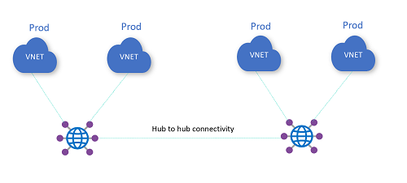

# Challenge 1: Any to Any connectivity

[< Previous Challenge](./00-lab_setup.md) - **[Home](../README.md)** - [Next Challenge >](./02-vpn.md)

## Description

Deploy an Azure Virtual WAN with 2 hubs. Deploy and connect 2 VNets on each hub. Especially for deploying VMs and VNets, it is recommended using the Azure CLI ([az vm create](https://docs.microsoft.com/cli/azure/vm?view=azure-cli-latest#az_vm_create)) or Azure PowerShell ([New-AzVM](https://docs.microsoft.com/powershell/module/az.compute/new-azvm)). For example, in the scripts folder in this repo you can find a script that can create a batch of VNets with predefined prefixes.

Make sure your deployment meets these requirements:

* Confirm connectivity is working between VNets on the same hub and across hubs

Sample topology:

## Success Criteria

## Learning Resources

- [VWAN any-to-any across hubs](https://docs.microsoft.com/azure/virtual-wan/scenario-any-to-any)
