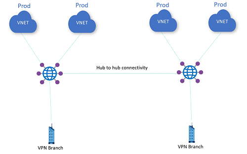

# Challenge 2: VPN connections

[< Previous Challenge](./01-any_to_any.md) - **[Home](../README.md)** - [Next Challenge >](./03-isolated_vnet.md)

## Description

Deploy two VNets with a virtual machine in each able to terminate VPN tunnels (for example Cisco CSR) and connect them as branches to the VWAN hubs. If you choose to use the Cisco CSR, there are some sample configs and deployment commands in [this cheatsheet for Cisco CSR](./Resources/csr_cheatsheet.md).

Verify with your coach whether the CSR VMs have been predeployed in your environment.

Sample topology:

Note that the Cisco CSR Virtual Machines do not add any extra cost to the Azure subscription (other than the cost for the actual virtual machines)

## Success Criteria

- Confirm connectivity between branches as well as between branches and VNets (same hub and across hubs)

## Learning Resources

- [Create S2S connection with Virtual WAN](https://docs.microsoft.com/azure/virtual-wan/virtual-wan-site-to-site-portal)
- [Cisco CSR Cheatsheet](./Resources/csr_cheatsheet.md)