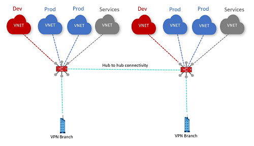

# Challenge 4: Secured Virtual Hub

[< Previous Challenge](./03-isolated_vnet.md) - **[Home](../README.md)** - [Next Challenge >](./05-nva.md)

## Introduction

This challenge will introduce you to secured virtual hubs. These are Virtual WAN hubs where an Azure Firewall is deployed into. Routing can then be configured to ensure Azure Firewall can be leveraged to restrict traffic.

## Description

Convert both of your Virtual WAN hubs to secured hubs. Configure routing and ensure the following flows go through Azure Firewall:

- VNet-to-VNet in the same hub (aka VHV)
- VNet-to-Branch in the same hub (aka VHB)
- VNet-to-Internet (aka V2I)

**Note**: today secured hubs don't support VHHV or VHHB traversing the firewall

Sample topology:

## Success Criteria

- Prove that certain traffic (e.g. ping, SSH or HTTP) is either blocked by the firewall or allowed through. Confirm this for each of the configured flows (VHV, VHB and V2I)

## Learning Resources

- [Virtual WAN routing through NVA VNet](https://docs.microsoft.com/azure/virtual-wan/scenario-route-through-nva)
- [Virtual WAN secured virtual hub](https://docs.microsoft.com/azure/virtual-wan/scenario-route-between-vnets-firewall)