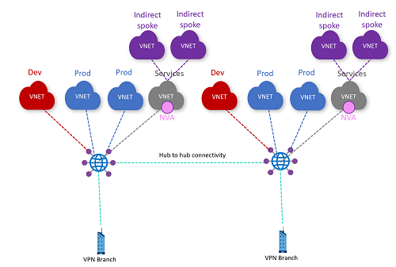

# Challenge 5: Network Virtual Appliances

[< Previous Challenge](./04-secured_hub.md) - **[Home](../README.md)**

## Introduction

In this exercise a Network Virtual Appliance (NVA) or an Azure Firewall will be deployed in a VNet connected to Virtual WAN. This is a pattern frequently used to allow customers to leverage their own NVA of choice instead of using an Azure Firewall in the hub. In this pattern the workloads are configured as indirect spokes to Virtual WAN. This means they're VNet peered to the VNet containing the NVA and have no network connection to the Virtual WAN hub itself.

## Description

Deploy an NVA or an Azure Firewall instance in each Common Services VNet. Create two additional VNets in each region and peer them to the Common Services VNet.

Make sure that the traffic is not going through the Azure Firewall deployed in the virtual hub from the previous challenge. Traffic should only go through the NVA deployed in the Common Services VNet.

Configure routing in such a way that:

- The indirect spokes in one hub can reach the indirect spokes in the other hub.
- The indirect spokes can reach all branches
- Verify if the indirect spokes can reach the Development and Production VNets of both regions

Try configuring routing in such a way that:

- Send traffic between the Dev and Production VNets of one region through the NVA. Is it working?
- Send Internet traffic from the Dev/Prod VNets through the NVA in Common Services. Is it working?

Sample topology:

## Success Criteria

- The indirect spokes in one hub can reach the indirect spokes in the other hub.
- The indirect spokes can reach all branches
- Verify if the indirect spokes can reach the Development and Production VNets of both regions
- Send traffic between the Dev and Production VNets of one region through the NVA. Is it working?
- Confirm traffic from the Dev/Prod VNets to the Internet passes through the NVA in Common Services.

## Learning Resources

- [Virtual WAN routing through NVA - Indirect spokes](https://docs.microsoft.com/azure/virtual-wan/scenario-route-through-nva)
- [Virtual WAN routing through NVA - Custom routing](https://docs.microsoft.com/en-us/azure/virtual-wan/scenario-route-through-nvas-custom)
