# Challenge 7: Analytical Dashboard Using SAP S/4 Hana DB - Coach's Guide

[< Previous Challenge](./06-Start-Stop-Automation.md) - **[Home](README.md)** 

# Notes & Guidance 

There are few  actvities for the PowerBI APP intergation with SAP HANA DB,
at the high level steps can be summerized into three activities.

#### Contact your Microsoft team for the deployment files like SAP HANA studio, HANA client.

### Activity 1:  

Make sure that   SAP S/4 appliance is installed and have access details to correct SAP client. 

### Activity 2:   

Download  and install  the Power BI client, SAP Hana client  and SAP HANA studio on SAP  windows jump box to configure the DB connection and create the direct query using power BI desktop, 
 
### Activity 3:  

Configure the poweBI app connection to SAP HANA DB using steps from documenations (both SAP and Azure).
steps include --
   1. Create the additional SAP schema user , Assign appropriate previleges and roles to newly created users in HANA studio to conenct to SAP S/4 schema.
   3. In power BI clinet GUI add the user name / password of HANA db user and connection strings with tables name to extract the data.
   4. Once the data is extracted into power BI client, use appropariate column, row and filter criteria to create the query to show vistulaization using PIE and BAR chart.
   5. Publish the power BI app for the end user so they can use on their desktop for future use.

Login into SAP HANA Database using HANA Studio: 

 
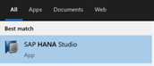
 

Initial screen of SAP HANA studio will pop up  

  

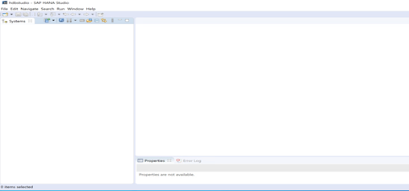
 

 

Right click on the left space under systems and select “Add System” 

  
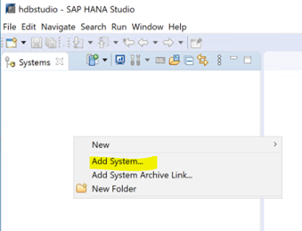
  

 

Enter  the system information as below  

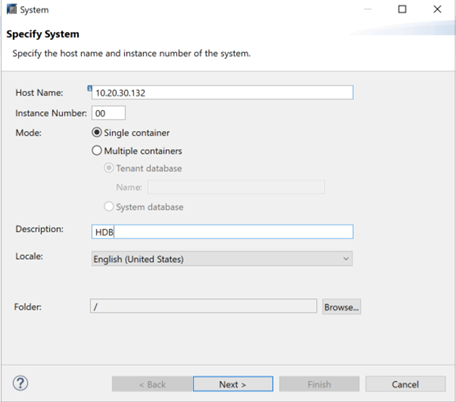
 

Enter system user ID and  password for SAP HANA DB  

 

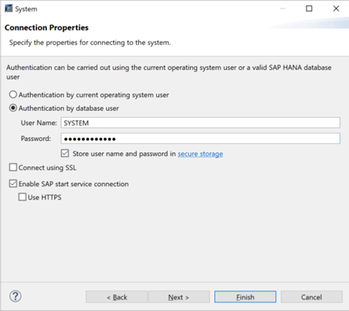
 

 

Add SAP system S4P 

 

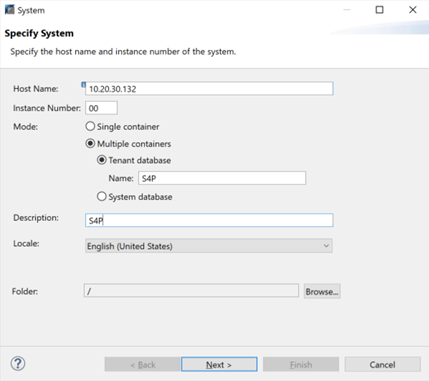
 

 

Enter the "SYSTEM" DB user and password  

 

 
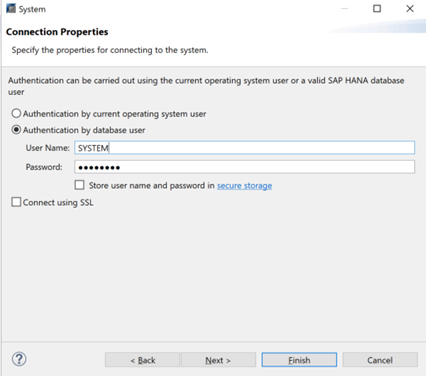
 

Setup new User ID in SAP HANA Database: 

Create a new user ID SAPOPENHACK in SAP HANA, this user will be used to connect Power BI to SAP HANA Database 

 

 

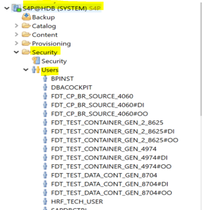
 

 

Create new user  SAPOPENHACK 

 
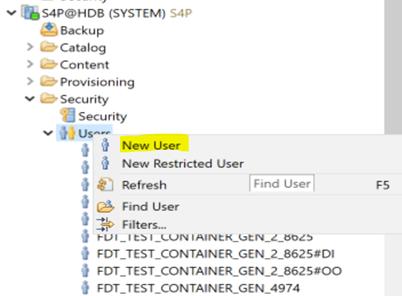
 

Enter  "SAPOPENHACK" ID and Password -- 

Add " ABAP admin" "content admin" public" roles  

 

 
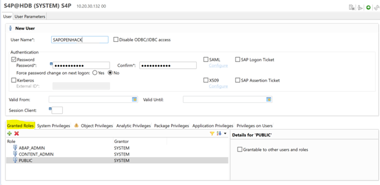
 

Add "catalog read",  "data admin" and "export" system privileges .. 

 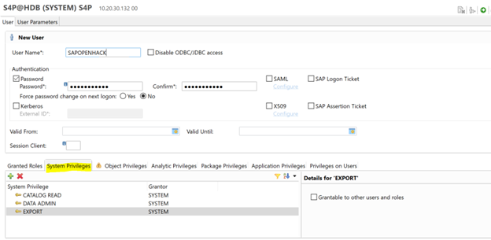

 
Add following object privileges ---  create and select 

 
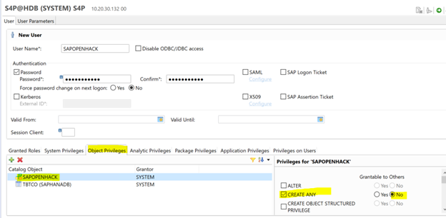
 
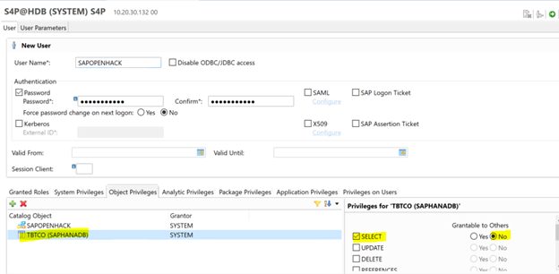

Save the configuration  

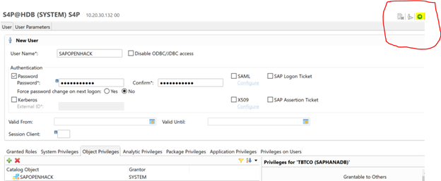

 

 

When we update the “Object Privileges” with TBTCO and granter is SYSTEM it won’t save it and gives an error. So remove that object and login into S4P with SAPHANADB  ( User ID) and then goto securityàUsers-àSAPOPENHACK and add the object privileges with TBTCO. 

 

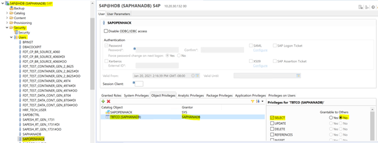

Follow the steps above and add an entry for SAPOPENHACK user also in HANA Studio.

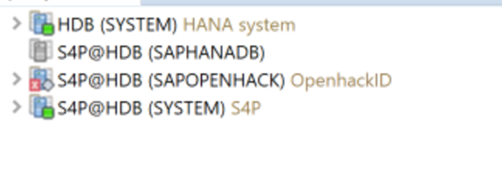

HANA configuration is complete … now Let's work on Power BI connection and report... 

Setup the connection in Power BI desktop to SAP HANA Database: 

Install Power BI Desktop 

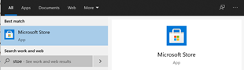

 

Open Power BI desktop 

 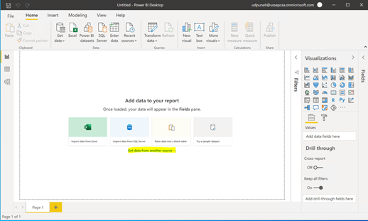

Click on “Get data from another source” and select “ Connect” 

 

 
On following screen, type SAP Keyword 

 

 

Enter SAP DB information on following screen  

 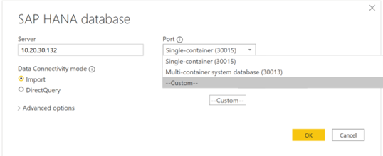

Enter port information as follows  

 
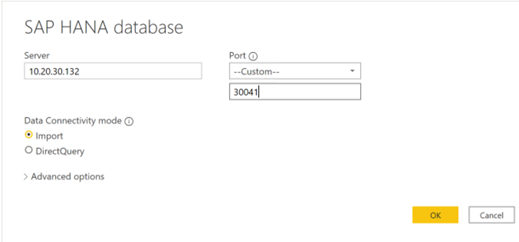 

How to find the right SQL port in SAP HANA

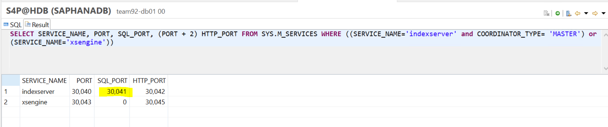

* [Port Assignment in Tenant Databases in SAP HANA Database](https://help.sap.com/viewer/78209c1d3a9b41cd8624338e42a12bf6/2.0.01/en-US/7a9343c9f2a2436faa3cfdb5ca00c052.html)

Select custom and SQL query as follows  

 
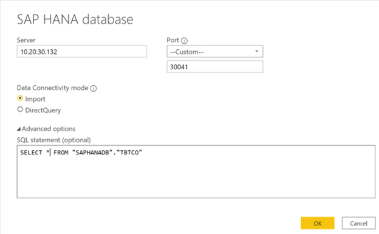

Note: When entering User credentials please make sure you select "Database" not "Windows" on left hanad side as highlighted on the below image.

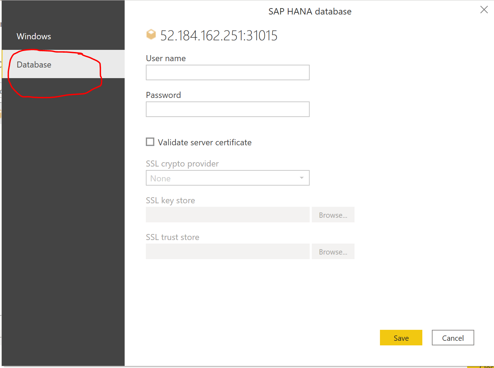

Will pop up with information about SAP table TBTCO as follows  

 

Select “Load” after the screen appears 

 
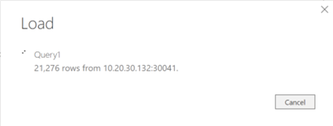
 

 

Select "transform data " on opo up screen as shwon in following screen  

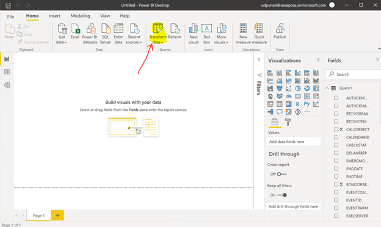

Creating visualization in Power BI using the SAP table TBTCO 

Create a Matrix. 

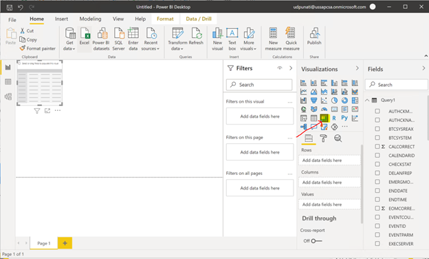

 

 

Add fields “JOBNAME” and “AUTHCKMAN” in Rows 

Add field “STATUS” in Columns 

Add “EVENTID” in Values 

 

 

Create a new Table in the visualization 

  

Drag and drop fields "JOBNAME", "JOBCLASS", "JOBLOG", "REAXSERVER" and "ENDDATE" under values 

 

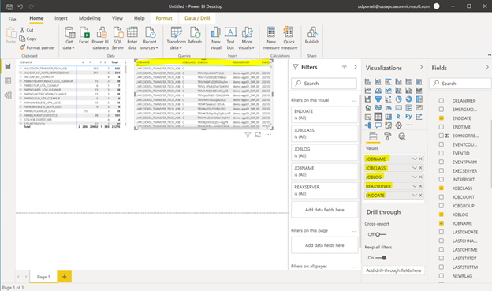

Create a Pie chart: 

  

Drag and drop field “AUTHCKMAN” under Legend and  field “JOBCOUNT” under Values ( with count). 

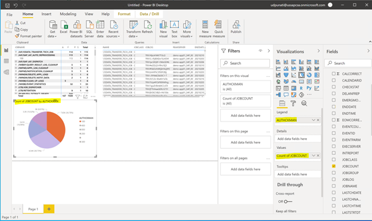
 

Create a Filter or Slicer 

Drag and drop field “AUTHCKMAN” under Field. 

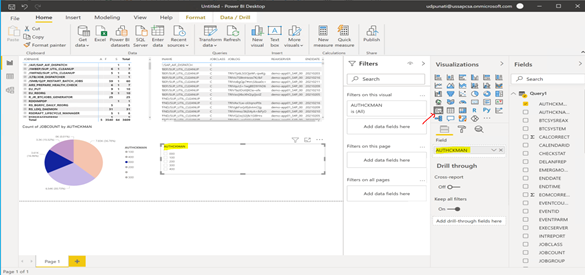
 
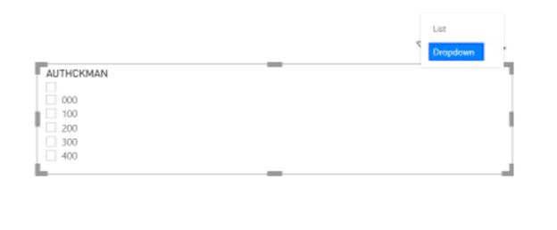

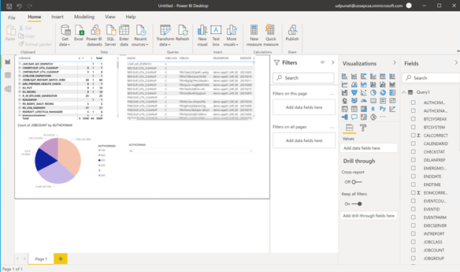

Save the report 

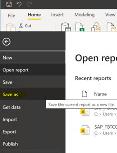
 

Once the report is saved need to publish to Power Apps 
