# Challenge 2: Advanced Migration at Scale - Coach's Guide

[< Previous Challenge](./Solution01.md) - **[Home](README.md)** - [Next Challenge>](./Solution03.md)

## Notes & Guidance

This optional challenge focuses on performing On-prem SQL Server migration to SQL Server on Azure VM (IaaS). The challenge involves step by step approach on managing the migration using new capabilities of "Azure Migrate". The new capabilities include creation of migration project with two main phases. Phase 1 is discovery and assessment, while phase 2 is using the assessment recommendations to perform actual migration of the VM.   

Although this challenge only includes migrating from SQL Server VM to IaaS, the new capabilities include migrating from SQL Server VM to Azure SQL DB (PaaS). Please refer to additional documentation -  https://docs.microsoft.com/en-us/azure/migrate/how-to-create-azure-sql-assessment.

### Environment Setup

The challenge environment setup includes creating a Azure SQL Server VM in a source virtual network to mimic on premises scenario.  The SQL Server VM will be in Virtual Network and have the HammerDB (SQL traffic benchmarking tool) running on it. The tool could be downloaded from here - https://www.hammerdb.com/HammerDB. The tool will continuously generate the traffic for 'n' virtual users to mimic the real life scenario. The HammerDB is a handy tool to not only build the database but also generate the traffic patterns, The assessment phase of the challenge takes this traffic pattern into consideration, while recommending the right solution.

### Discovery and Assessment 

1. Login to Azure Portal and create a Resource Group, to host subsequent resources as described below.
2. Create Azure Migrate Project. https://docs.microsoft.com/en-us/azure/migrate/tutorial-discover-physical#set-up-a-project
    
3. Setup Discovery Appliance. 
    - Create/Deploy Windows Server 2016 (Datacenter) VM.

    - RDP to the VM as an administrator and download the AzureMigrateINstallerServer-Public. 
    
    - Login to Azure Portal and navigate to "Azure Migrate". If the previously created project is not selected   
      select it on the top right corner.
    
    - Under "Windows, Linux and SQL Server" -> Assessment tools -> Click "Discover". This will take you to setup   
      screen for discover appliance.
     
    - Select the "Physical or other (AWS, GCP, Xen etc." dropdown option for "Are your servers virtualized?".  
    
    - Generate project key, by giving a appliance name and keep it handy. It will be required when associating the 
      appliance with Azure migrate project. 
    
    - Download and extract the "Azure Migrate Appliance". Navigate to the folder where extracted

    - Open a Powershell session and run the Azure migrate installer script - .\AzureMigrateInstaller.ps1.

      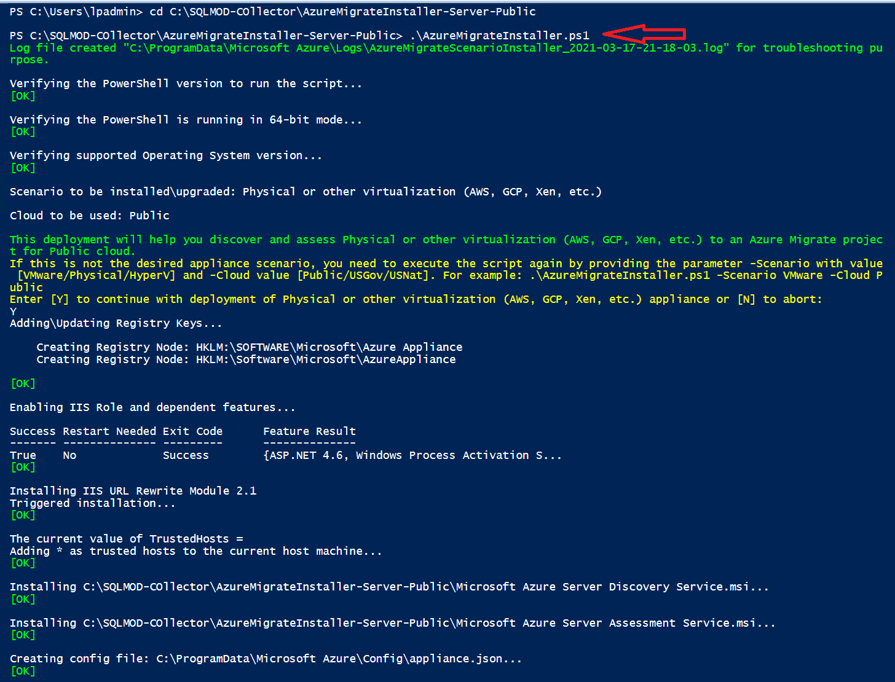

4. Verify that the Appliance can access the public URLs
    - Ensure windows firewall is allowing outbound traffic to Azure.

5. Configure the appliance
    - Navigate to the URL - https://appliancename:44368
    - Let the step 1 of the set up prerequisite finish.

      

    - Register the appliance with Azure migrate by logging in. The key "Project key" obtained in step above will 
      be validated automatically.

      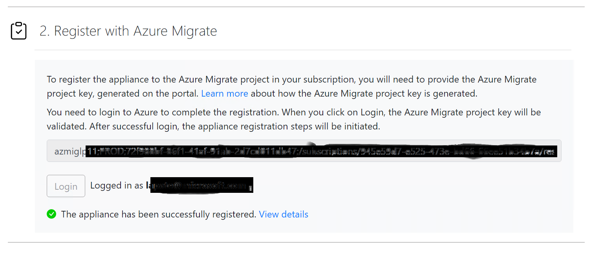

6. Start continuous discovery.

    - Add Credentials. This is the default server login admin credentials (one used during VM creation)

      

    - Add discovery source. This a friendly name representation of the Source. 

      

    - Validate/re-validate connection and start the discovery. This will start a job and discover the servers to 
      be migrated. 

      

8. Validate/verify the discovered servers in the Azure migrate project.

      

9. Create and review an assessment. More details are here. https://docs.microsoft.com/en-us/azure/migrate/tutorial-assess-physical

    - Click on "Create Assessment".

    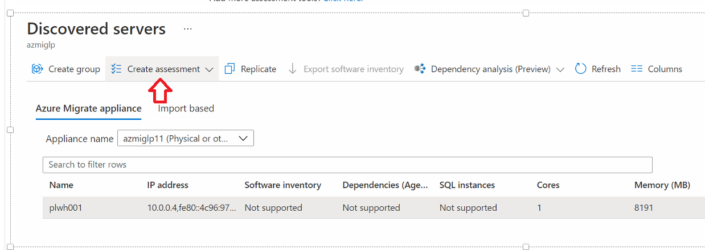

    - Assessments are organized by groups. You could run multiple assessment if needed. Every time you create a new 
      assessment, newly collected metric data is used for the recommendations that are generated. In production scenarios, it is recommended that you let the discovery run for few days, before creating an assessment.

    

    - Review assessments and if required export it.

    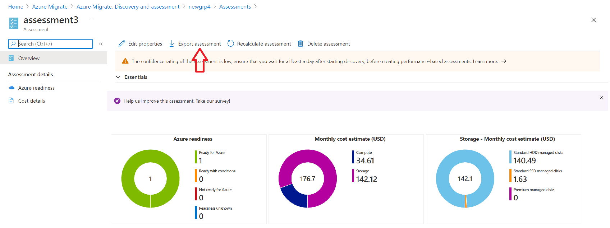

    - Check on the exported assessment.

    

10. Review the recommendation before moving to phase 2 below.

    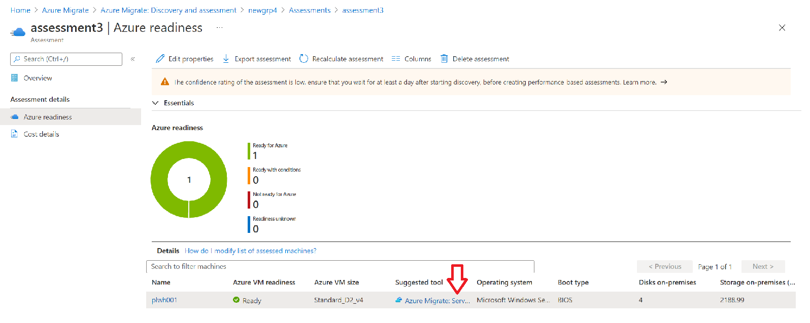

### Replicate, Test and Migrate 

1. Review the recommendations in phase 1 above by navigating to Azure migrate project.
2. Prepare replication Appliance
   Azure Migrate: Server Migration uses a replication appliance to replicate machines to Azure. First step to enable replication is to build and configure a replication appliance. Follow below steps:

    - Create/Deploy Windows Server 2016 (Datacenter) VM, within previously created "source" resource group. In 
      addition create a target resource group with Virtual network created in it. We'll use the "default" subnet in this target Virtual network as our landing spot for migrated SQL server VM. Lets call this a "target" resource group. 

    - Add a new data disk to the VM (1TB), which will be used by the replication agent (ASR agent). More details 
      below.

    - RDP to the VM as an administrator and ensure the newly attached data disk is attached and active by 
      configuring it in the "disk management" system utility. A new volume letter is allocated for this new volume. This volume is used latter during the installation process.
    
    - Login to Azure Portal and navigate to "Azure Migrate". If the previously created project is not selected select it on the top right corner.
    
    - Under "Windows, Linux and SQL Server" -> Migration tools -> Click "Discover". This will take you to setup screen for replication appliance.   

    - Select Target Region. 

    - Select the "Physical or other (AWS, GCP, Xen etc." dropdown option for "Are your servers virtualized?"

    - Select the "Install a replication appliance" dropdown option for "do you want to install a new replication appliance or scale out existing setup".
    
    - Download the replication appliance software (AzureSiteREcoveryUnifiedSetup.exe) and the registration key file. Run the setup and select the downloaded "registration key" in the wizzard. For install path, select the newly attached data disk volume.
      
    - Once the installation is completed, validate that the "hostconfigwxcommon" and "cspsconfigtool" shortcuts are seen on the desktop. These are the programs to setup configuration and process server.

    - Open "cspsconfigtool" and add a new account to be used for replication. Ensure this is the local account on the target machine.

    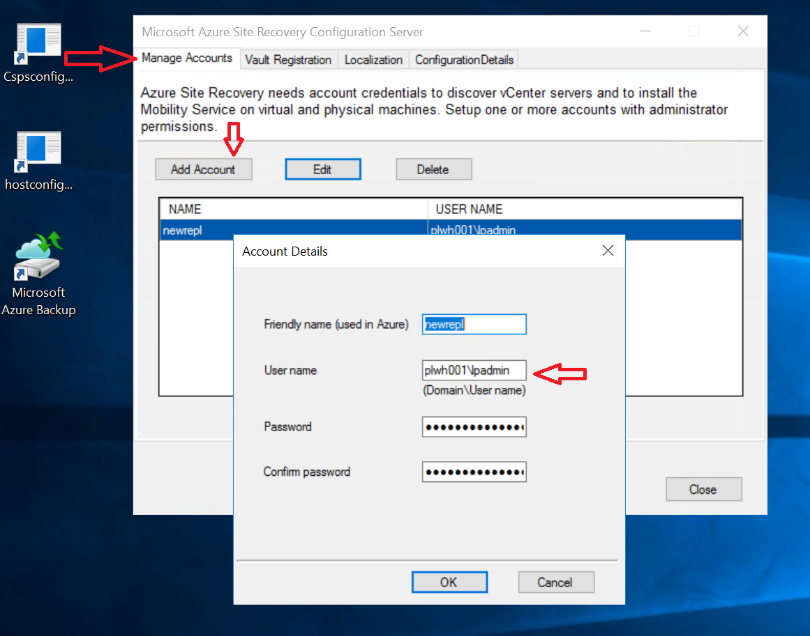

    - Access "vault registration" tab and complete ASR registration process.

    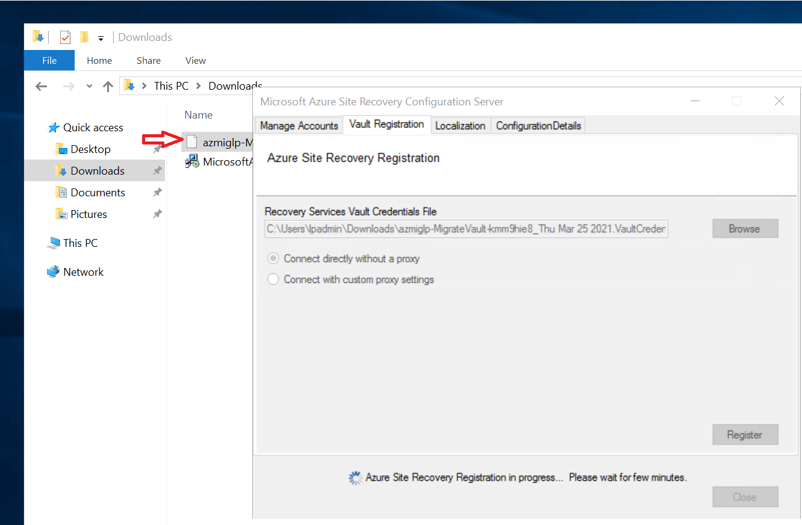

    - Validate completion of ASR registration process.

    

3. Setup Mobility Service
    - Before replication could start, the mobility service agent must be installed on the source SQL Server machine that needs to be replicated. This is required for non-virtualized VMs which are on-premises or in other clouds (GCP, AWS). Please refer to this link for details - https://docs.microsoft.com/en-us/azure/migrate/tutorial-migrate-physical-virtual-machines#install-the-mobility-service.

      Follow the instructions on the link and start the installation on the source SQL Server VM.

    

    - Once extraction is complete run below commands to do the registration (details on the link above).

    

    - Validate successful registration.

    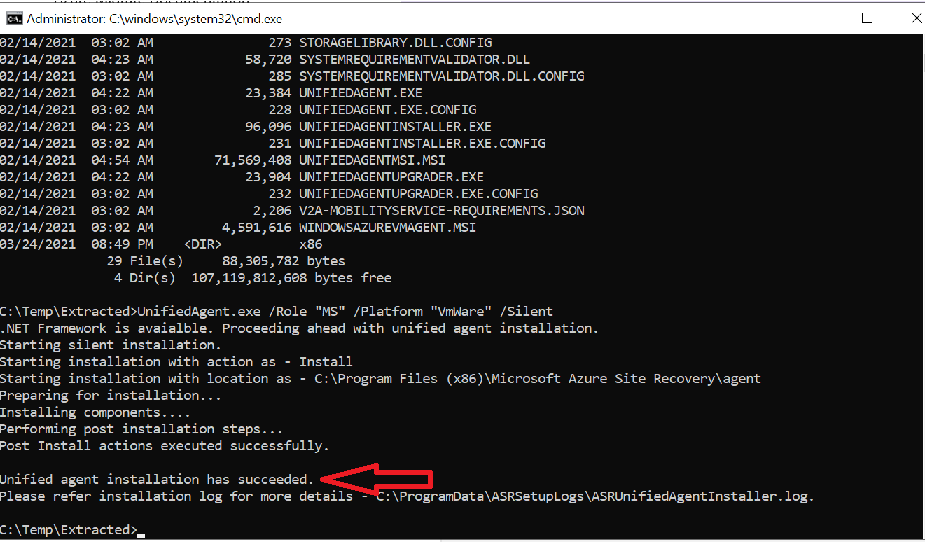

4. Ensure the Azure migrate project reflects the successful replication appliance registration.
    
    

4. Start replication.

    - Login to Azure Portal and navigate to "Azure Migrate". If the previously created project is not selected select it on the top right corner.
    
    - Under "Windows, Linux and SQL Server" -> Migration tools -> Click "Replicate". This will take you to setup screen to begin replication. Run through the wizard by selecting the source settings. Select the previously created replication appliance and the user account that was created in the previous step. Click Next.

    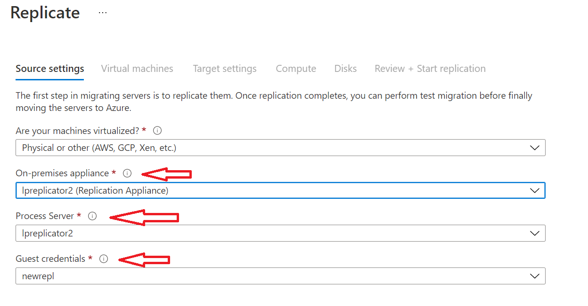

    - Select the virtual machine that was discovered in the discovery step. You could select multiple of them in production scenario. Click Next

    

    - Select the target environment settings. This includes target subscription, resource group, virtual network and subnet. The migrated SQL Server VM will be landing here. Click Next.

    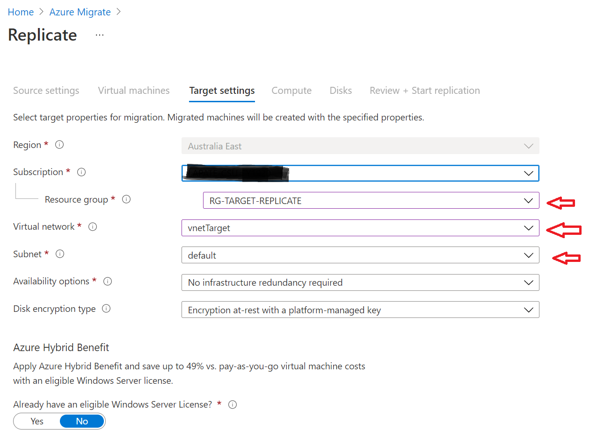

    - Select the target VM compute settings. Click Next.

    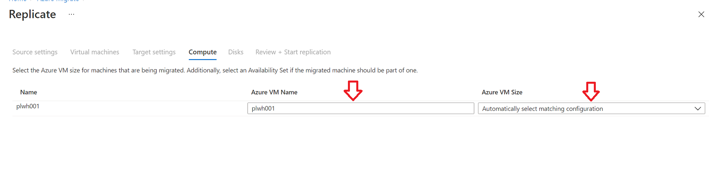

    - Select the target VM disk settings. Ensure number of disks match the discovered disks. Click Next.

    

    - Review and start replication. This action will initiate a job to replicate the VM. Wait for the job to finish typically it takes 8-10 hrs. for completion.

    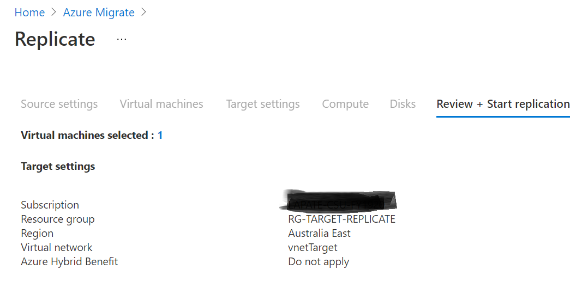

    - Validate job completion status as below.

    

    - Review the topology of the replication model to understand the actions taken in the background.

    

5. Before you initiate migration, it is a best practice to test it. Test Migration allows to test the replicated server failover and uncover any issues. 
    - Start Test migration.

    

    - Check status.

    

    - Validate completion.

    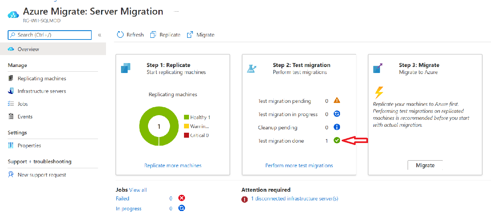

6. Now that the testing is complete proceed with actual Migration of the VM to the target resource group
    - Start Migration.
    
    

    - Validate completion.

    

7. Congratulations!! At this point you have successfully migrated an on-prem VM to Azure using the Azure migrate automation and took advantage of the scale and Machine learning based migration recomendations. Validate migrated VM in the target resource group by logging into the VM and see the databases. Left is source and right is the migrated target VM below

    

