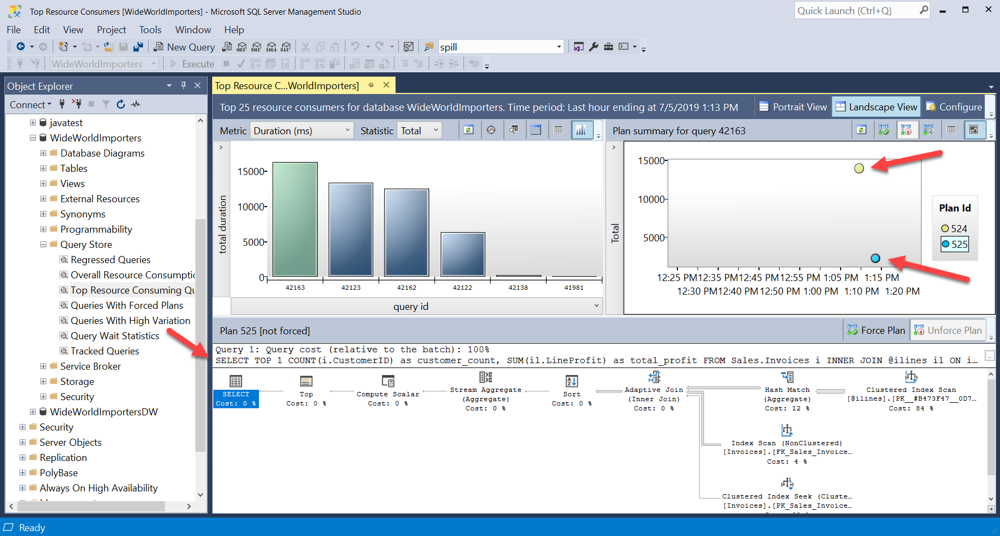
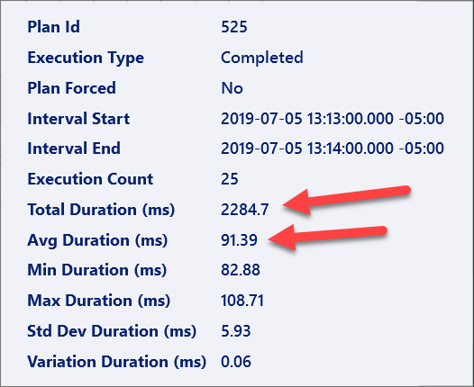
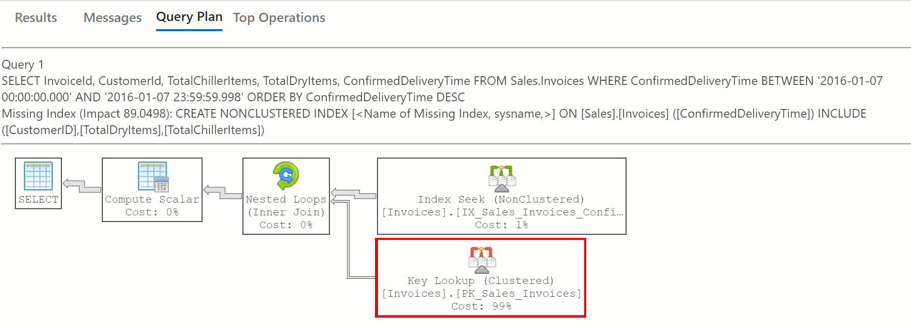

# Challenge 3: Performance & Tuning - Coach's Guide

[< Previous Challenge](./Solution02.md) - **[Home](README.md)** - [Next Challenge>](./Solution04.md)

## Notes & Guidance 

This challenge requires attendees to use a Jupyter Notebook and Azure Data Studio and Azure Monitor SQL Insights to run/experiment with SQL Server performance and evaluating performance.

The purpose of this challenge is threefold:

1. Explore new features of SQL Server that may improve performance intrinsically
1. Ensure would-be data engineers and DBAs are comfortable evaluating performance
1. Leverage newer tools like Azure Data Studio Notebooks and Azure Monitor SQL Insights

In addition to getting hands on with troubleshooting and exploring new features of SQL Server, this challenge will help those purpsuing DP-300 or related certifications that evaluate these skills.

### Explore New Features 

This notebook walks through two queries that perform quite differently in pre-SQL Server 2019 versions compared to SQL Server 2019+. The Notebook walks through setting up the test, and effectively changing the way the query is run by altering the database compatability level.

The chart of compatability levels is as follows:

|SQL Version|Compat Level|Software Version|Notable Changes|
|-----------|------------|----------------|-------|
|SQL Server 2019|150|15|Intelligent Query Processing|
|SQL Server 2017|140|14||
|SQL Server 2016|130|13|New Query Plan and Execution features, Query Store|
|SQL Server 2014|120|12|New Cardinality Estimator|
|SQL Server 2012|110|11||
|SQL Server 2008|100|10||

If the attendees need more direction, have them read up on [Intelligent Query Processing](https://docs.microsoft.com/en-us/sql/relational-databases/performance/intelligent-query-processing?view=sql-server-ver15) to get a better sense of what is being asked for.

Once the queries have been run for each compatability level, the Query Store should reveal the difference in performance (this is most easily done using SQL Server Enterprise Management Studio). Under the Top Resource Consuming Queries, teams should see something similar to:



Typically when evaluating performance using the execution plan, you'd focus on the big ticket items in the plan -- what index is being used? In this case, the clustered index scan estimates a single row for the output:


The query looks different when running under SQL Server 2019. The clustered index scan remains, but is much more accurate in its estimate:



By leveraging *table variable deferred compilation*, the compilation of the statement is deferred until the first execution. Cardinality estimates can then be based on the actual table row counts, allowing for better downstream operation choices.  

Similarly, *adaptive joins* delays the selection of the type of join until after the first input has been scanned, so either a Hash Join or Nested Loop Join can be selected.

Lastly, *batch mode for rowstore*, previously exclusive to columnstore indexes, now exists for rowstore and can greatly increase the efficiency the processing of multiple rows as batches instead of a single row at a time. Compare the stats for the slower vs longer plan -- the slower Estimated Execution Mode is Row, while the faster has an Extimated Execution Mode as Batch.

## Understand Key Blockers

Depending on the team's ability to read/process query plans, this may either an instant answer or may take some research. An execution plan similar to the following should be displayed when running the provided query: 



In this case, the tuning advisor shows a missing index at the top of the execution plan that would make this query run faster, so the answer is (somewhat unfortunately) in plain site. But why? Be sure the team understands the reasons before blindly creating indexes.

The 'key' is in the key lookup; because it uses the most time, it makes sense to focus here. A key lookup occurs when SQL doesn't have all of the information in an index to satisfy its predicates. The result is the clustered index is referenced for the missing information, as shown in the image.

To fix this issue, a new index can be created that covers the predicates required by the query; in this case, it is considered to be a *covering index* because the index itself contains all of the information needed to answer the query. But, indexes can be expensive to maintain, so need to be chosen carefully. Every time a new record is inserted into Sales.Invoices, all indexes require updating, too.

The following helper queries will create and drop the needed index:

```sql
CREATE NONCLUSTERED INDEX [IX_Sales_Invoices_ConfirmedDelivery_TotalDry_TotalChiller] 
ON Sales.Invoices (ConfirmedDeliveryTime) 
INCLUDE (CustomerId, TotalDryItems, TotalChillerItems)

DROP INDEX IX_Sales_Invoices_ConfirmedDelivery_TotalDry_TotalChiller
ON Sales.Invoices
```

Depending on the skill level of the group, it may be needed to discuss the basics of indexing (clustered vs nonclustered), relationships, contraints, and similar topics.

## Install and Monitor Databases with SQL Insights

[Azure Monitor SQL insights](https://docs.microsoft.com/en-us/azure/azure-monitor/insights/sql-insights-overview) is a comprehensive solution for monitoring any product in the Azure SQL family. SQL insights uses dynamic management views to expose the data you need to monitor health, diagnose problems, and tune performance.

The steps to set it up are detailed on [this article](https://docs.microsoft.com/en-us/azure/azure-monitor/insights/sql-insights-enable).

By using this tool users will have a comprehensive overview of their environment post migration.