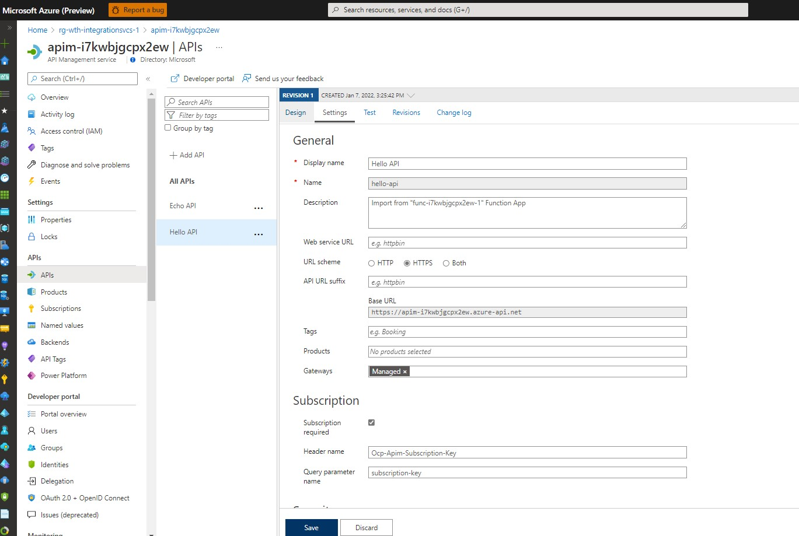

# Solution 03 - Create backend API

[<Previous Solution](./Solution-02.md) - **[Home](../readme.md)** - [Next Solution>](./Solution-04.md)

## Introduction

The students should be able to create upload the Bicep files to a repo and create a CI/CD pipeline that deploys the environment.


## Description
- Students can add the functions via the Azure Portal by following the steps in this [document](https://docs.microsoft.com/en-us/azure/azure-functions/functions-create-serverless-api)
    - The first function should have a HTTP Trigger that takes a name parameter and returns a simple message via a GET call. 
        

    - The second function should also have a HTTP Trigger that sends name as a JSON payload and returns a simple message via a POST call. 
        

- Then, import the Functions in API Management and name it Hello API, as per the steps [here](https://docs.microsoft.com/en-us/azure/api-management/import-function-app-as-api)
  The settings would be similar to the one below:
  
  
- To test API calls, students are free to use whatever tool they prefer, e.g. Powershell ```Invoke-WebRequest``` or Postman
    - If using Postman, here's the GET and POST calls to the APIM endpoint:
        
- Update your Function App and APIM Bicep modules with the changes above.