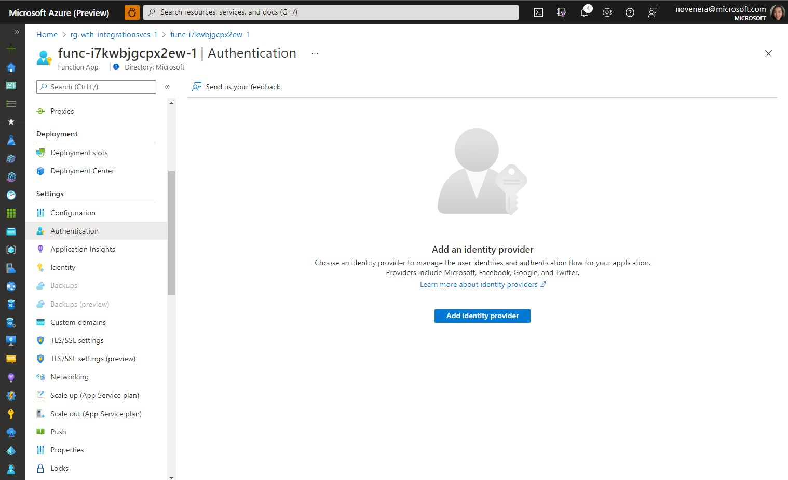
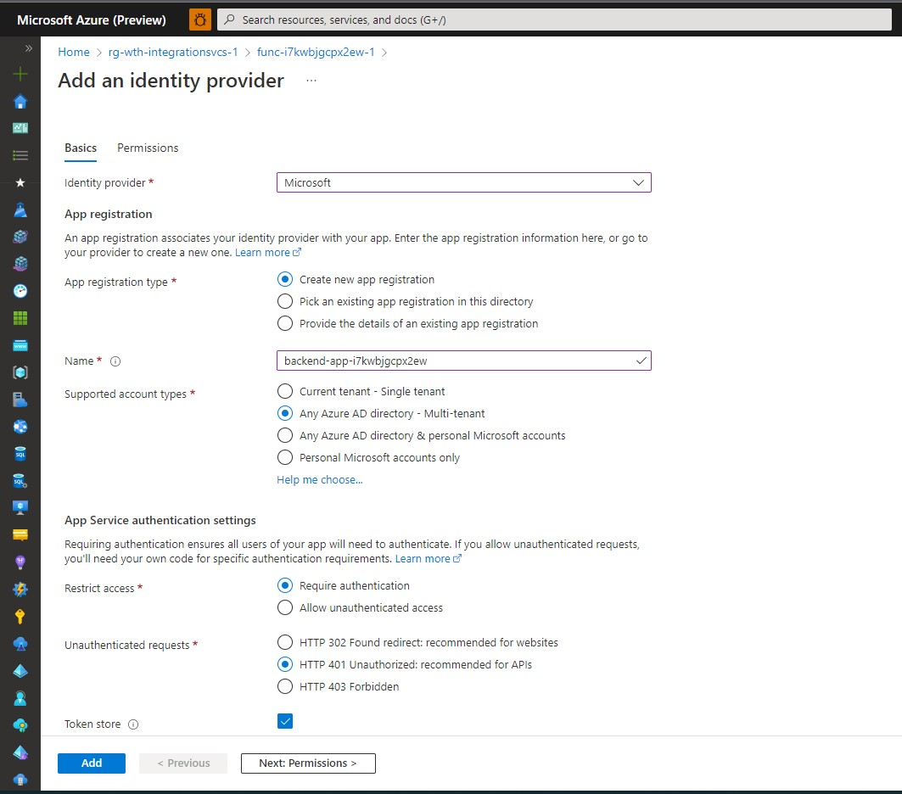
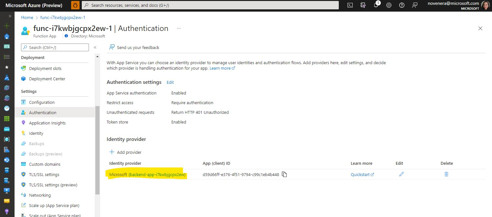
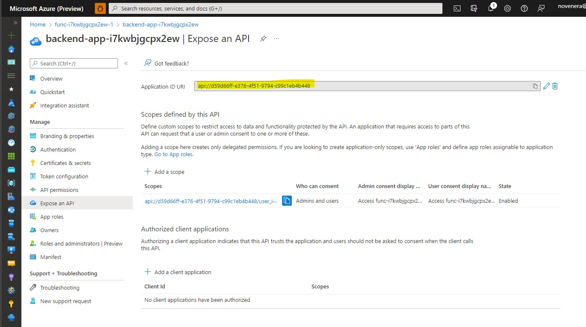
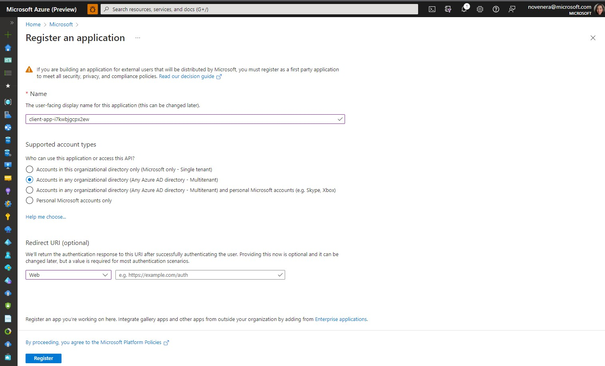
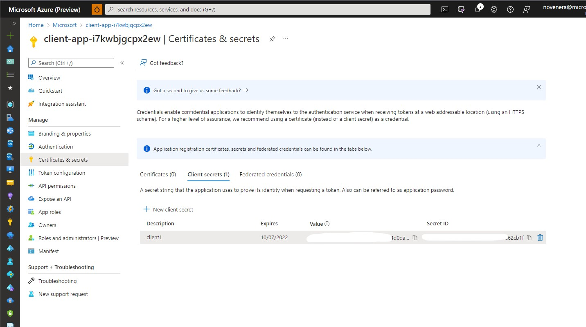

# Solution 04 - Securing backend API via OAuth

[<Previous Solution](./Solution-03.md) - **[Home](../readme.md)** - [Next Solution>](./Solution-05.md)

## Introduction

The students should be able configure OAuth2 authorization when calling Hello API.

## Description
- First, the student should register Hello API Function app as an AD application.  The students can just follow the steps for registering the API as an AAD application from the doc [Protect a web API backend in Azure API Management using OAuth 2.0 authorization with Azure Active Directory](https://docs.microsoft.com/en-us/azure/api-management/api-management-howto-protect-backend-with-aad).  However, just for kicks, the following steps merges instructions from configuring an Azure App Service/Function App using EasyAuth and the steps from the section in the same doc "[1. Register an application in Azure AD to represent the API](https://docs.microsoft.com/en-us/azure/api-management/api-management-howto-protect-backend-with-aad#1-register-an-application-in-azure-ad-to-represent-the-api)".    
    - In the Azure portal, open Function App.  Under the Settings section, select Authentication and then click "Add Identity Provider".
        
    - Next, in the "Add an identity provider" blade, configure the settings per below.  Click Add when done.
        
    - You will be redirected back to the Authentication page, now showing the authentication settings for your Function app.  Click AD application link (highlighted) to proceed to the next step.  Record the Application (client) ID of the API app for later.
        
    - You will now be redirected to the AD Application page.  Under the Manage section of the side menu, select Expose an API and find the Application ID URI. Record this value for later.
        
    - Click the scope link.  Student does not have to do anything here since the settings have already been pre-filled.  Though, they have the liberty to change any of these (e.g. Consent to Admins only), as long as the scope has been enabled.  
        

- Second, choose a client application, and for this example Postman will be used.  Follow the steps in [2. Register another application in Azure AD to represent a client application](https://docs.microsoft.com/en-us/azure/api-management/api-management-howto-protect-backend-with-aad#2-register-another-application-in-azure-ad-to-represent-a-client-application) 
    - In the Register an application page, configure the setings per below.  Click Register when done.
        
    -  You will now be redirected to the AD Application page.  Find the Application (client) ID value and record it later.  
    -  Create a client secret and note the key value which will be used in the next step.
         

- Third, follow the steps in [3. Grant permissions in Azure AD] (https://docs.microsoft.com/en-us/azure/api-management/api-management-howto-protect-backend-with-aad#3-grant-permissions-in-azure-ad) to grant permissions to allow the client app (Postman) to call the backend app (Hello API)
        