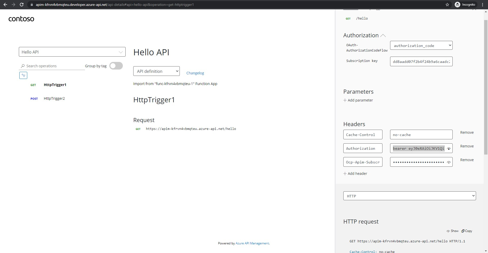
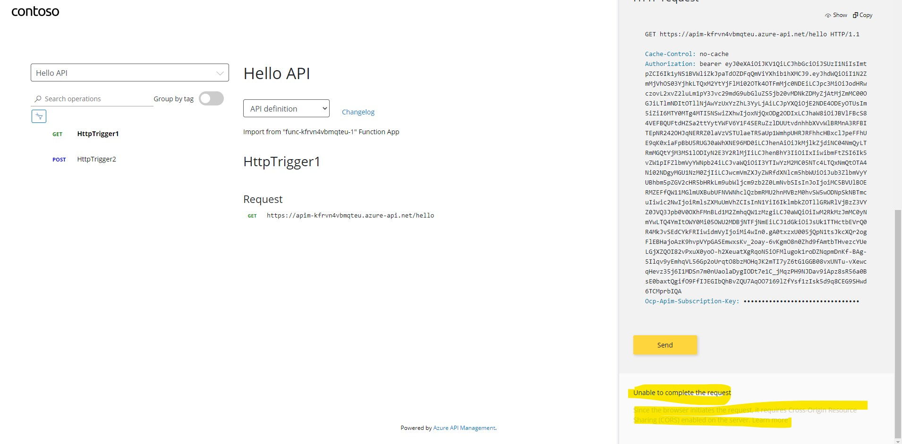
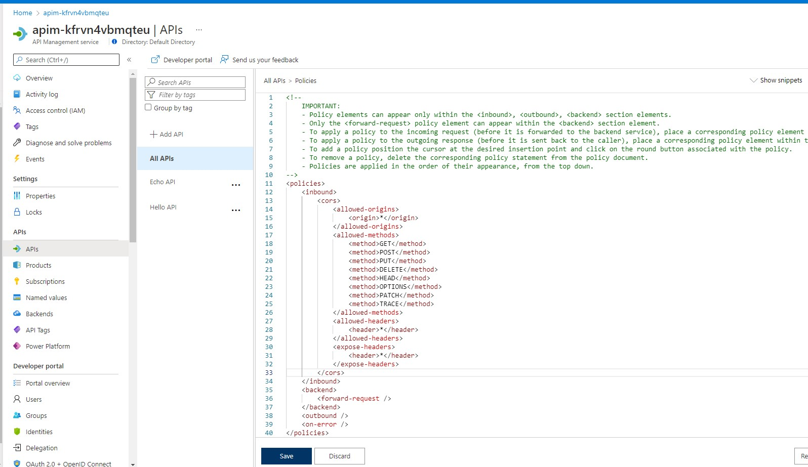
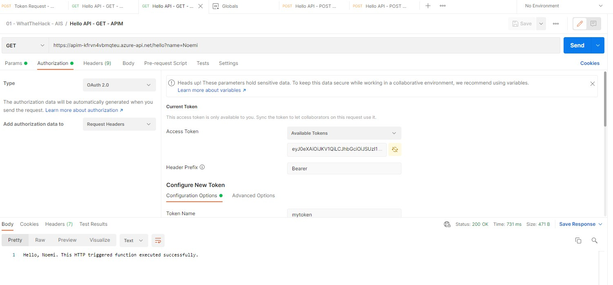

# Solution 04 - Securing backend API via OAuth

[<Previous Solution](./Solution-03.md) - **[Home](../readme.md)** - [Next Solution>](./Solution-05.md)

## Introduction

The students should be able configure OAuth2 authorization when calling Hello API.

## Description
- First, the student should follow the steps [Protect a web API backend in Azure API Management using OAuth 2.0 authorization with Azure Active Directory](https://docs.microsoft.com/en-us/azure/api-management/api-management-howto-protect-backend-with-aad).    
    - In Step [1. Register an application in Azure AD to represent the API](https://docs.microsoft.com/en-us/azure/api-management/api-management-howto-protect-backend-with-aad#1-register-an-application-in-azure-ad-to-represent-the-api), the backend-app AAD registration should look like below:
        
        
        
        
    - In Steps [2. Register another application in Azure AD to represent a client application](https://docs.microsoft.com/en-us/azure/api-management/api-management-howto-protect-backend-with-aad#2-register-another-application-in-azure-ad-to-represent-a-client-application) to [3. Grant permissions in Azure AD](https://docs.microsoft.com/en-us/azure/api-management/api-management-howto-protect-backend-with-aad#3-grant-permissions-in-azure-ad), the client app registration would look like below:
        
        
        
             
    - In Step [4. Enable OAuth 2.0 user authorization in the Developer Console](https://docs.microsoft.com/en-us/azure/api-management/api-management-howto-protect-backend-with-aad#4-enable-oauth-20-user-authorization-in-the-developer-console), the OAuth2 settings in the Developer portal should look something like below:
        
        
    - In Step [5. Successfully call the API from the developer portal](https://docs.microsoft.com/en-us/azure/api-management/api-management-howto-protect-backend-with-aad#5-successfully-call-the-api-from-the-developer-portal), you should be able to successfully call Hello API from the APIM Developer Portal. 
               
      You may get the following CORS error after clicking Send.
        
      To fix this, just add the APIM CORS policy scoped for all APIs, as follows:
        
      After saving the policy, re-try calling the API again and it should succeed this time.
        
    - In Step [6. Configure a JWT validation policy to pre-authorize requests](https://docs.microsoft.com/en-us/azure/api-management/api-management-howto-protect-backend-with-aad#6-configure-a-jwt-validation-policy-to-pre-authorize-requests), configure the validate-jwt policy scoped to Hello API.
        
      To test, call Hello API from the Dev Portal again.  Try returning a failure by modifying the Authorization header value.
        

    - Click the scope link.  Student does not have to do anything here since the settings have already been pre-filled.  Though, they have the liberty to change any of these (e.g. Consent to Admins only), as long as the scope has been enabled.  
        

- If using Postman as your client application, you need to [specifiying the Authorization details using OAuth2](https://learning.postman.com/docs/sending-requests/authorization/#oauth-20) which will ask you to log in and consent before sending the generated Access Token.  Ensure that you specify Authorization Code as the grant type.
    - Token Name: The name you want to use for the token.
    - Grant Type: A dropdown list of options. Choose Authorization code.
    - Callback URL: The client application callback URL redirected to after auth, and that should be registered with the API provider. If not provided, Postman will use a default empty URL and attempt to extract the code or access token from it. If this does not work for your API, you can use the following URL: https://oauth.pstmn.io/v1/browser-callback, but you need to add this to the list of Redirect URLs for your client-app AAD registration.
        - Authorize using browser: You can enter your credentials in your web browser, instead of the pop-up that appears in Postman by default when you use the Authorization code or Implicit grant type. Checking this box will set the Callback URL to return to Postman. If you opt to authorize using the browser, make sure pop-ups are disabled for the callback URL, otherwise it won't work.
    - Auth URL: The endpoint for the API provider authorization server, to retrieve the auth code. (e.g. https://login.microsoftonline.com/organizations/   oauth2/v2.0/authorize)
    - Access Token URL: The provider's authentication server, to exchange an authorization code for an access token. (e.g. https://login.microsoftonline.com/organizations/oauth2/v2.0/token)
    - Client ID: The ID for your client application registered with the API provider. (e.g. the Application ID of the client app AAD registration created [earlier](https://docs.microsoft.com/en-us/azure/api-management/api-management-howto-protect-backend-with-aad#2-register-another-application-in-azure-ad-to-represent-a-client-application#:~:text=On%20the%20app%20Overview%20page%2C%20find%20the%20Application%20(client)%20ID%20value%20and%20record%20it%20for%20later.))
    - Client Secret: The client secret given to you by the API provider. (e.g. the Client secret of the client app AAD registration created [earlier](https://docs.microsoft.com/en-us/azure/api-management/api-management-howto-protect-backend-with-aad#2-register-another-application-in-azure-ad-to-represent-a-client-application##:~:text=Create%20a%20client%20secret%20for%20this%20application%20to%20use%20in%20a%20subsequent%20step.))
    - Scope: The scope of access you are requesting, which may include multiple space-separated values. (e.g. This is the [backend app scope](https://docs.microsoft.com/en-us/azure/api-management/api-management-howto-protect-backend-with-aad#2-register-another-application-in-azure-ad-to-represent-a-client-application###:~:text=Use%20the%20back-end%20app%20scope%20you%20created%20in%20the%20Default%20scope%20field) granted to the client app)
    - State: An opaque value to prevent cross-site request forgery. 
    - Client Authentication: A dropdown list: send a Basic Auth request in the header, or client credentials in the request body. After upgrading to a new  version, change the value in this dropdown menu to avoid problems with client authentication.

    
    

  Click Get New Access Token which will pop-up another browser window prompting you to log-in.  Once successful, you will redirected back to Postman, with the generated access token.  Click Use Token to add that to the request header.
    
  Then, click Send to execute GET request to Hello API.
    

 by  [2. Register another application in Azure AD to represent a client application](https://docs.microsoft.com/en-us/azure/api-management/api-management-howto-protect-backend-with-aad#2-register-another-application-in-azure-ad-to-represent-a-client-application) 
    - In the Register an application page, configure the setings per below.  Click Register when done.
        
    -  You will now be redirected to the AD Application page.  Find the Application (client) ID value and record it later.  
    -  Create a client secret and note the key value which will be used in the next step.
         

- Third, follow the steps in [3. Grant permissions in Azure AD] (https://docs.microsoft.com/en-us/azure/api-management/api-management-howto-protect-backend-with-aad#3-grant-permissions-in-azure-ad) to grant permissions to allow the client app (Postman) to call the backend app (Hello API)
        
        

- [TODO: Will need to figure out if we get the token using client credentials or auth code flow] 
    In the fourth step [4. Enable OAuth 2.0 user authorization in the Developer Console](https://docs.microsoft.com/en-us/azure/api-management/api-management-howto-protect-backend-with-aad#4-enable-oauth-20-user-authorization-in-the-developer-console), you will slightly digress from the step in the sense that you will need to request for the client's AAD bearer token using Postman.
    
    (you will need to configure your client app to authenticate and get the AAD bearer token (which will be needed when you make calls to the secured Hello API) using [OAuth 2.0 authorization code grant](https://docs.microsoft.com/en-us/azure/active-directory/develop/v2-oauth2-auth-code-flow).)

    - If using Postman, just follow the steps in this [tip](https://docs.microsoft.com/en-us/azure/active-directory/develop/v2-oauth2-auth-code-flow#:~:text=Try%20executing%20this%20request%20and%20more%20in%20Postman%20--%20don't%20forget%20to%20replace%20tokens%20and%20IDs!).