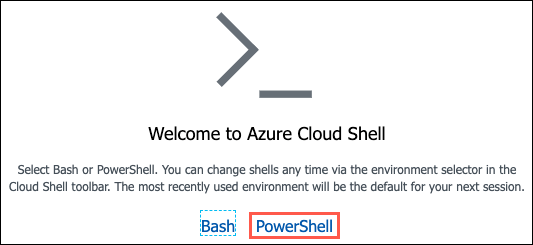

### Task 1: Add application settings to your Function App

In this task, you prepare your Azure Function App to work with your new Function by adding your storage account policies container URL and SAS token values to the Application Settings of your Function App, using the Azure Cloud Shell and Azure CLI.

1. In the [Azure portal](https://portal.azure.com), select the Azure Cloud Shell icon from the menu at the top right of the screen.

   

2. In the Cloud Shell window that opens at the bottom of your browser window, select **PowerShell**.

   

3. After a moment, you should receive a message that you have successfully requested a Cloud Shell, and be presented with a PS Azure prompt.

   

4. At the prompt, retrieve your Function App name by running the following command at the Cloud Shell prompt, replacing `<your-resource-group-name>` with your resource group name:

   ```powershell
   $resourceGroup = "<your-resource-group-name>"
   az functionapp list -g $resourceGroup --output table
   ```

   > **Note**: If you have multiple Azure subscriptions, and the account you are using for this hands-on lab is not your default account, you may need to run `az account list --output table` at the Azure Cloud Shell prompt to output a list of your subscriptions, then copy the Subscription Id of the account you are using for this lab, and then run `az account set --subscription <your-subscription-id>` to set the appropriate account for the Azure CLI commands.

5. In the output, copy the **Name** value for use in the next step.

   

6. For the next command, you need the URL of your `policies` container and the `SAS token` values you added to your text editor previously. Replace the tokenized values in the following command, and then run it from the Azure Cloud Shell command prompt.

   - `<your-function-app-name>`: Replace with your Function App name, which you copied in the previous step.
   - `<your-policies-container-url>`: Replace with the `policies` container URL you copied into a text editor previously.
   - `<your-storage-account-sas-token>`: Replace with the `SAS Token` of your Storage account, which you copied into a text editor previously.

   ```powershell
   $functionAppName = "<your-function-app-name>"
   $storageUrl = "<your-policies-container-url>"
   $storageSas = "<your-storage-account-sas-token>"
   az functionapp config appsettings set -n $functionAppName -g $resourceGroup --settings "PolicyStorageUrl=$storageUrl" "PolicyStorageSas=$storageSas"
   ```

### Task 2: Add project environment variables

Functions can use environment variables to retrieve configuration settings. To test your functions locally using environment variables, you must add these settings as user environment variables on your development machine or to the project settings.

In this task, you create some environment variables on your LabVM, which allows for debugging your Function App locally on the LabVM.

1. In Solution Explorer, right-click the **Contoso-FunctionApp** project, then select **Properties**

2. Select the **Debug** tab.

3. In the **Environment Variables** section, choose **Add**, then enter the following:

   - **Name**: Enter **PolicyStorageSas**
   - **Value**: Paste in the **SAS token** you created and copied into a text editor in the previous exercise.

4. Select **OK**.

5. Select **Add** again, and in the New User Variable dialog, enter the following:

   - **Name**: Enter **PolicyStorageUrl**
   - **Value**: Paste in the **URL** of the policies container you copied into a text editor in the previous exercise.

   

6. Save the project.

### Task 3: Create an Azure Function in Visual Studio

In this task, you use Visual Studio to create an Azure Function. This Function serves as a serverless API for retrieving policy documents from Blob storage.

1. On your LabVM, return to Visual Studio and in the Solution explorer expand the `Contoso.FunctionApp` and then double-click `PolicyDocsFunction.cs` to open it.

   

2. In the `PolicyDocsFunction.cs` file, locate the `TODO #3` block (begins on line 14).

   

3. Update the code within the block to allow passing in the policy holder last and policy number. Also, update it to only allow "get" requests. The updated code should look like the below when completed.

   ```csharp
   [FunctionName("PolicyDocs")]
       public static async Task<IActionResult> Run(
               [HttpTrigger(AuthorizationLevel.Function, "get", Route = "policies/{policyHolder}/{policyNumber}")] HttpRequest req, string policyHolder, string policyNumber, ILogger log)
   ```

   > **Note**: Notice that in the code you removed `"post"` from the list of acceptable verbs, and then updated the Route of the HttpTrigger from `null` to `policies/{policyHolder}/{policyNumber}`. This allows for the function to be parameterized. You then added `string` parameters to the Run method to allow those parameters to be received and used within the function.

4. Next, locate `TODO #4` within the `GetDocumentsFromStorage` method in the `PolicyDocsFunction.cs` file.

   

5. Update the code in the block to retrieve the `PolicyStorageUrl` and `PolicyStorageSas` values from the environment variables you added above. The completed code should look like the following:

   ```csharp
   var containerUri = Environment.GetEnvironmentVariable("PolicyStorageUrl");
   var sasToken = Environment.GetEnvironmentVariable("PolicyStorageSas");
   ```

   > **Note**: When the API is deployed to an Azure API App, `Environment.GetEnvironmentVariables()` looks for the specified values in the configured application settings.

6. Save `PolicyDocsFunction.cs`.

7. Take a moment to review the code in the Function, and understand how it functions. It uses an `HttpTrigger`, which means the function executes whenever it receives an Http request. You added configuration to restrict the Http requests to only `GET` requests, and the requests must be in format `https://<function-name>.azurewebsites.net/policies/{policyHolder}/{policyName}` for the Function App to route the request to the `PolicyDocs` function. Within the function, an Http request is being made to your Storage account `policy` container URL to retrieve the PDF document for the specified policy holder and policy number. That is then returned to the browser as a PDF attachment.

8. Your Function App is now fully configured to retrieve parameterized values and then retrieve documents from the `policies` container in your Storage account.

### Task 4: Test the function locally

In this task, you run your Function locally through the Visual Studio debugger, to verify that it is properly configured and able to retrieve documents from the `policy` container in your Storage account.

> **IMPORTANT**: Internet Explorer on Windows Server 2019 does not include functionality to open PDF documents. To view the downloaded policy documents in this task, you need to [download and install the Microsoft Edge browser](https://www.microsoft.com/edge) for Windows 10 on your LabVM.

1. In the Visual Studio Solution Explorer, right-click the `Contoso.FunctionApp` project, and then select **Debug** and **Start new instance**.

   

2. If prompted, allow the function app to access your local machine resources.

3. A new console dialog appears, and the function app is loaded. At the of the console, note the output, which provides the local URL of the Function.

   

4. Copy the URL that appears after `PolicyDocs`, and paste it into a text editor. The copied value should look like:

   ```http
   http://localhost:7071/api/policies/{policyHolder}/{policyNumber}
   ```

5. In the text editor, you need to replace the tokenized values as follows:

   - `{policyHolder}`: Acevedo
   - `{policyNumber}`: ACE5605VZZ2ACQ

   The updated URL should now look like:

   ```http
   http://localhost:7071/api/policies/Acevedo/ACE5605VZZ2ACQ
   ```

   > **Note**: Paths for documents in Azure Blob Storage are case sensitive, so the policyholder Name and Policy number casing need to match the values specified above.

6. Paste the updated into the address bar of a new Chrome web browser window and press Enter.

7. In the browser, the policy document opens in a new window.

   

8. You've confirmed the function is working properly. Stop your Visual Studio debugging session by closing the console window or selecting the stop button on the Visual Studio toolbar. In the next task, you deploy the function to Azure.

### Task 5: Deploy the function to your Azure Function App

In this task, you deploy your function into an Azure Function App, where the web application uses it to retrieve policy documents.

1. In Visual Studio on your LabVM, right-click on the `Contoso.FunctionApp` project in the Solution Explorer, and then select **Publish** from the context menu.

   

2. On the **Publish** dialog, select **Azure** in the Target box and select **Next**.

   

3. Next, in the **Function instance** box, select your subscription, expand the hands-on-lab-SUFFIX resource group, and select the API App.

   

4. Ensure **Run from package file** is checked and then select **Finish**.

5. Back on the Visual Studio Publish page for the `Contoso.FunctionApp` project, select **Publish** to start the process of publishing your Web API to your Azure API App.

   

6. Ensure you see a publish succeeded message in the Visual Studio Output panel.

7. The Azure Function App is now ready for use within the PolicyConnect web application.

### Task 6: Enable Application Insights on the Function App

In this task, you add Application Insights to your Function App in the Azure Portal, to be able to collect insights into requests against the Function.

1. In the [Azure portal](https://portal.azure.com), navigate to your **Function App** by selecting **Resource groups** from Azure services list, selecting the **hands-on-lab-SUFFIX** resource group, and selecting the **contoso-func-UniqueId** App service from the list of resources.

   

2. On the Function App blade, select **Application Insights** under Settings from the left-hand menu.

   

3. On the Application Insights blade, select **Turn on Application Insights**.

   

4. On the Application Insights blade, select **Create new resource**, accept the default name provided, and then select **Apply**.

   

5. Select **Yes** when prompted about restarting the Function App to apply monitoring settings.

   

6. After the Function App restarts, select **View Application Insights data**.

   

7. On the Application Insights blade, select **Live Metrics Stream** from the left-hand menu.

   

   > **Note**: You may see a message that your app is offline. You handle this below.

8. Leave the Live Metrics Stream window open for reference in the next task.

### Task 7: Add Function App URL to your Web App Application settings

In this task, you add the URL of your Azure Function App to the Application settings configuration of your Web App.

1. In the [Azure portal](https://portal.azure.com), select the Azure Cloud Shell icon from the menu at the top right of the screen.

   

2. In the Cloud Shell window that opens at the bottom of your browser window, select **PowerShell**.

   

3. After a moment, you receive a message that you have successfully requested a Cloud Shell, and be presented with a PS Azure prompt.

   

4. At the prompt, retrieve your Function App URL by running the following command at the Cloud Shell prompt, replacing `<your-resource-group-name>` with your resource group name:

   ```powershell
   $resourceGroup = "<your-resource-group-name>"
   az functionapp list -g $resourceGroup --output table
   ```

   > **Note**: If you have multiple Azure subscriptions, and the account you are using for this hands-on lab is not your default account, you may need to run `az account list --output table` at the Azure Cloud Shell prompt to output a list of your subscriptions, then copy the Subscription Id of the account you are using for this lab, and then run `az account set --subscription <your-subscription-id>` to set the appropriate account for the Azure CLI commands.

5. In the output, copy the **DefaultHostName** value into a text editor for use below.

   

6. At the Cloud Shell prompt, run the following command to retrieve both your Web App name:

   ```powershell
   az webapp list -g $resourceGroup --output table
   ```

7. In the output, copy the name of Web App (the resource name starts with contoso-**web**) into a text editor for use below.

   

8. The last setting you need is the Default Host Key for your Function App. To get this, navigate to your Function App resource in the Azure portal, select **App keys** under Functions from the left-hand menu, then select **default** under Host Keys, and copy the **Value**.

   

9. Next replace the tokenized values in the following command as specified below, and then run it from the Azure Cloud Shell command prompt.

   - `<your-web-app-name>`: Replace with your Web App name, which you copied in above.
   - `<your-function-app-default-host-name>`: Replace with the `DefaultHostName` of your Function App, which you copied into a text editor above.
   - `<your-function-app-default-host-key>`: Replace with the default host key of your Function App, which you copied into a text editor above.

   ```powershell
   $webAppName = "<your-web-app-name>"
   $defaultHostName = "<your-function-app-default-host-name>"
   $defaultHostKey = "<your-function-app-default-host-key>"
   az webapp config appsettings set -n $webAppName -g $resourceGroup --settings "PolicyDocumentsPath=https://$defaultHostName/api/policies/{policyHolder}/{policyNumber}?code=$defaultHostKey"
   ```

10. In the output, the newly added `PolicyDocumentsPath` setting in your Web App's application settings is visible.

    

### Task 8: Test document retrieval from web app

In this task, you open the PolicyConnect web app and download a policy document. Recall from above that this resulted in a page not found error when you tried it previously.

1. Open a web browser and navigate to the URL for your published Web App.

   > **Note**: You can retrieve the URL from the Overview blade of your Web App resource in the Azure portal if you aren't sure what it is.

   

2. In the PolicyConnect web page, enter the following credentials to log in, and then select **Log in**:

   - **Username**: demouser
   - **Password**: Password.1!!

   

3. Once logged in, select **Managed Policy Holders** from the top menu.

   

4. On the Policy Holders page, you see a list of policy holders, and information about their policies. This information was pulled from your Azure SQL Database using the connection string stored in Azure Key Vault. Select the **Details** link next to one of the records.

   

5. Now, select the link under **File Path**, and download the policy document.

   

   
