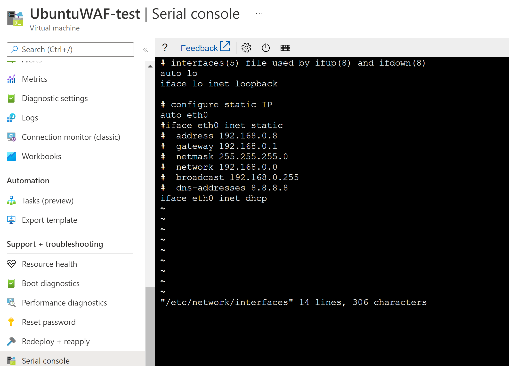
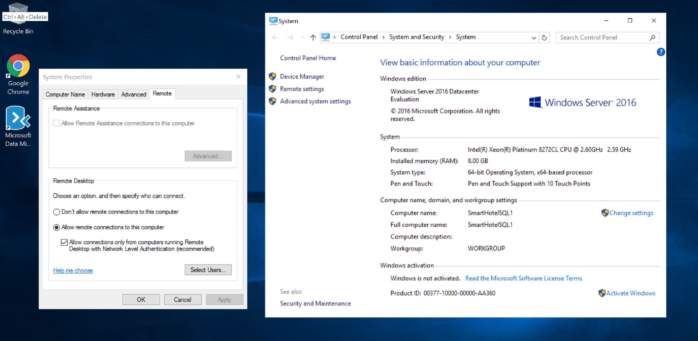

# Challenge 3: Prepare to Migrate to Azure - Coach's Guide

[< Previous Challenge](./02-discovery.md) - **[Home](./README.md)** - [Next Challenge >](./04-migrate.md)

## Notes and Guidance

-  Create storage account(s?) for use when enabling replication
    - Point out a (current, August 21) limitation of hyper-v that we can't migrate direct to a managed disk
    - type of storage account (standard vs premium) determines type of disk ultimately created
    - Q: is hyper-v migration directly to managed disks coming any time soon?
-  Register Hyper-V host with Azure Migrate: Server Migration
    - this often / previously took a while or was tricky somehow? Check when testing
-  Enable replication
    - <- save this time for Q&A / parking lot when replication is happening?
-  Test failover
    - Perhaps do one, rather than multiple?
    - Discuss limitations including connectivity, domain controllers, etc

## Solution Guide

You can use this script to create the required resources for replication and testing:

```bash
# Create resources required for migration
rg_onprem=migratefasthack-onprem
rg_azure_prod=migratefasthack-azure-prod
rg_azure_test=migratefasthack-azure-test
location=westeurope
# Storage account
az storage account create -n fasthack$RANDOM -g $rg_azure_prod --sku Premium_LRS --kind StorageV2 -l $location
# Prod VNet 
vnet_name=vnet-prod
az network vnet create -g $rg_azure_prod -n $vnet_name --address-prefix 172.16.0.0/16
az network vnet subnet create -g $rg_azure_prod --vnet-name $vnet_name --name WAF --address-prefix 172.16.1.0/24
az network vnet subnet create -g $rg_azure_prod --vnet-name $vnet_name --name web --address-prefix 172.16.2.0/24
az network vnet subnet create -g $rg_azure_prod --vnet-name $vnet_name --name db --address-prefix 172.16.3.0/24
# Test VNet
vnet_name=vnet-test
az network vnet create -g $rg_azure_test -n $vnet_name --address-prefix 172.16.0.0/16
az network vnet subnet create -g $rg_azure_test --vnet-name $vnet_name --name WAF --address-prefix 172.16.1.0/24
az network vnet subnet create -g $rg_azure_test --vnet-name $vnet_name --name web --address-prefix 172.16.2.0/24
az network vnet subnet create -g $rg_azure_test --vnet-name $vnet_name --name db --address-prefix 172.16.3.0/24
# Public IP addresses
az network public-ip create -g $rg_azure_prod --allocation-method Dynamic --sku Basic -n WAF-pip
az network public-ip create -g $rg_azure_prod --allocation-method Dynamic --sku Basic -n web1-pip
az network public-ip create -g $rg_azure_prod --allocation-method Dynamic --sku Basic -n web2-pip
az network public-ip create -g $rg_azure_prod --allocation-method Dynamic --sku Basic -n sql-pip
# Database (for a database modernization)
sql_server_name=sqlserver$RANDOM
sql_db_name=SmartHotelRegistration
sql_username=demouser
sql_password='demo!pass123'
az sql server create -n $sql_server_name -g $rg -l $location --admin-user "$sql_username" --admin-password "$sql_password"
az sql db create -n $sql_db_name -s $sql_server_name -g $rg -e Basic -c 5 --no-wait
```

- UbuntuWAF will not have connectivity when migrated, the  reason is that the VM is configured with a static IP address. You can modify the `/etc/network/interfaces` file as the following picture shows, by accessing the VM's console over the Azure portal (you might have to reboot the VM):



- smarthotelsql1 has RDP disabled. You might have to enable it in the source nested VM, and run Windows updates so that you can connect to it


