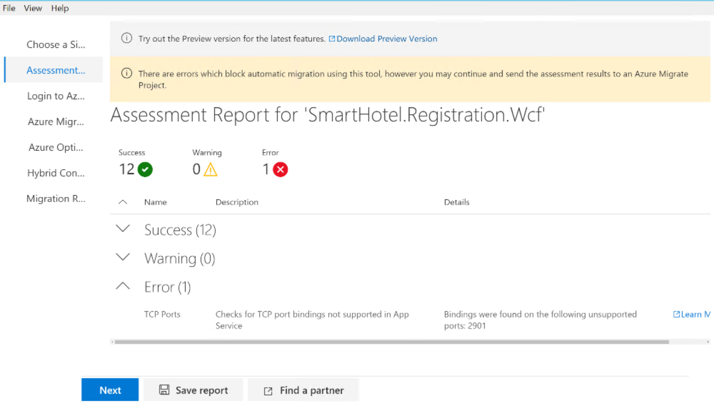

# Challenge 5: Modernise - Coach's Guide

[< Previous Challenge](./04-migrate.md) - **[Home](./README.md)**

## Notes and Guidance

- Consider these challenges as stretch, if there is any time remaining
- You could let the participant choose one of the options, if there are no times for all

## Solution Guide

- The Data Migration Assistant is pre-installed in the SQL Server nested VM (smarthotelsql1), but it is an old version. When you start it up, it will try to auto-aupgrade, but it will fail because the .NET 4.8 runtime is not installed. Download this prerequisite, and try to run (and autoupgrade) the Data Migration Assistant tool again
- To use the Azure App Service Assistant, you can browse its web page from each app server (smarthotelweb1 and smarthotelweb2): [https://azure.microsoft.com/en-us/services/app-service/migration-assistant/](https://azure.microsoft.com/en-us/services/app-service/migration-assistant/). After installing the assistant on each server, you can migrate the websites, including the creation of an App Service Plan (so no need to create it in advance).
- When migrating the web server (smarthotelweb1) you can use the Kudu tools (aka "advanced developer tools" or "SCM") to modify the `web.config` file so that it goes to the public IP of the VM where smarthotelweb2 was migrated 
- When assessing the app server (smarthotelweb2) you will see an error, so the application tier cannot be migrated to app services using this method:

- However, a PowerShell 5.1 is required for the app migration assistant, which you can install from [here](https://www.microsoft.com/en-us/download/details.aspx?id=54616). However that installation gets an error, probably because the OS in smarthotelweb2 (W2012 R2) is so outdated
