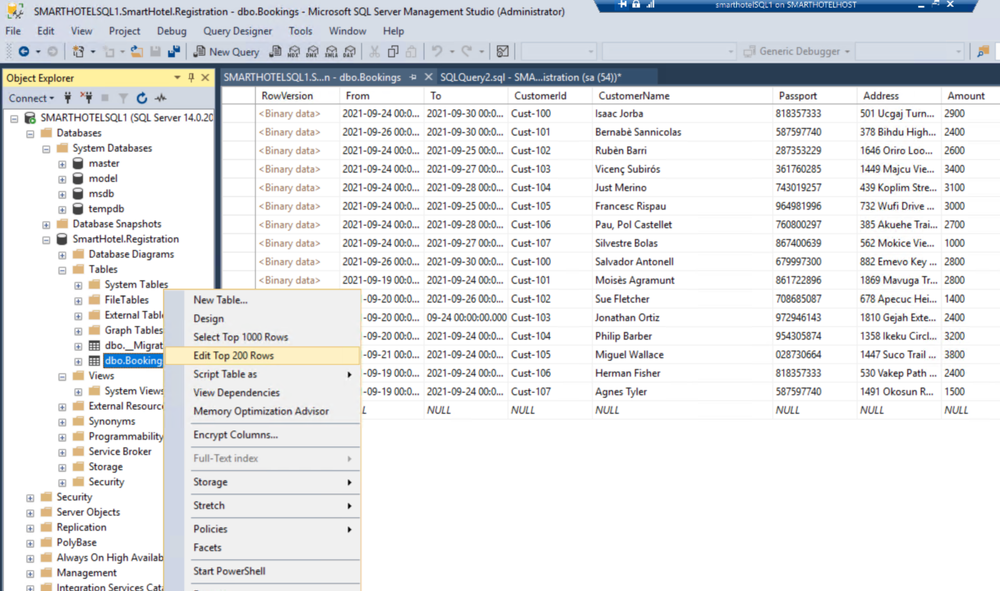

# What The Hack - Azure Migrate - Lab Deployment guide

## Introduction

This Hack involves migrating an existing workload to Azure.  As such, we need a test environment.  This can be built on a Hyper-V host running in Azure using the included scripts.  

## Deployment Steps

The build can be automated using the included scripts:
- Provision the host and workload running on it: [workload.azcli](./workload.azcli)
- Add the required users and limited permissions for those users to do the required migration tasks: [addusers.azcli](./addusers.azcli). 
- After the Hack is completed users and permissions can be removed using [removeusers.azcli](./removeusers.azcli)
- You should also create 3 Resource Groups to be used during the Hack, you may also choose to deploy the destination VNets ahead of the Hack:
    - OnPrem <- has the Hyper-V / on-prem environment
    - Target <- potentially has the target vnet
    - Test <- potentially another vnet to do test failovers to

## Post Deployment

Once the build has completed, you should be able to login to the Hyper V host and see 5 VMs on there (the build may still be running if you don't see these). 

Credentials:

- For the host Azure VM: `demouser`/`demo!pass123`
- For the Windows nested Hyper-V VMs: `Administrator`/`demo!pass123`
- For the Linux nested Hyper-V VM: `demouser`/`demo!pass123`

Check the SmartHotel appliction is running.  

To do this, open a browser tab and navigate to http://\<SmartHotelHostIP-Address\> (this is the IP for the HyperV host). You should see the SmartHotel application, which is running on nested VMs within Hyper-V on the SmartHotelHost. (The application doesn't do much: you can refresh the page to see the list of guests or select 'CheckIn' or 'CheckOut' to toggle their status.)

The SmartHotel application should look like this:

If there are no records shown in the UI, it could be because the database was deployed too long ago (a couple of days would be enough to make no records appear). To fix this, you can change the underlying database, so that records are shown:
1. RDP into the SQL VM
1. Open SQL Server Management Studio
1. Locate the database `SmartHotel.Registration`
1. In that database, locate the table `dbo.Bookings`
1. Right click, and select the command `Edit Top 200 Rows`
1. Change some checkin or checkout dates to today's date

## Troubleshooting

- You might want to take checkpoints of the nested VMs with Hyper-V manager, in case rollback is required (especially for the SQL1 one)
- Note that the SQL1 nested VM may reboot every hour due to an expired evaluation license. You can re-arm the evaluation with the command `Slmgr.vbs -rearm`. This should prevent reboots for some days.

The source for the lab is the github repo for [MCW line of business](https://github.com/microsoft/MCW-Line-of-business-application-migration).  There is step-by-step migration guidance there that may help with troubleshooting any other issues. 
