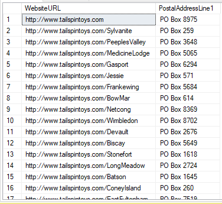

# Challenge 4: Create custom classifications

[< Previous Challenge](./Challenge3.md) - [Home](../readme.md) - [Next Challenge >](./Challenge5.md)

## Description

Users have started using the data catalog and have been happy with the out of the box classifications provided by Azure Purview. The assets scanned into from ADLS have some assets with data that are specific for Fabrikams business. These assets remain unclassfiied as the out of the box classifiers are unable to classify them. The users have requested these assets and attributes that are specific to Fabrikam needs to be classified based on their requirements.

## Introduction
In this challenge you will setup a custom classficiation that will ensure that future scans of the data lake will use the custom classifications that have been defined and perform a scan. Once the scan is completed ensure that the assets and attributes reported earlier are now successfully classfiied according to the classficiation rules that you have defined.

## Success Criteria
- Create a custom classification rule to classify the following columns in the Sales.Customers table in the WideWorldImporters database that was scanned in the previous challenge (WebsiteURL, PostalAddressLine)

- Ensure that you use the custom classification rules to perform a full scan.
- Confirm that the newly defined classification is applied on the assets.
- Confirm that the new classficiation can be used to filter the search results.

## Learning Resources
- https://docs.microsoft.com/en-us/azure/purview/create-a-custom-classification-and-classification-rule
- https://docs.microsoft.com/en-us/azure/purview/concept-best-practices-classification
