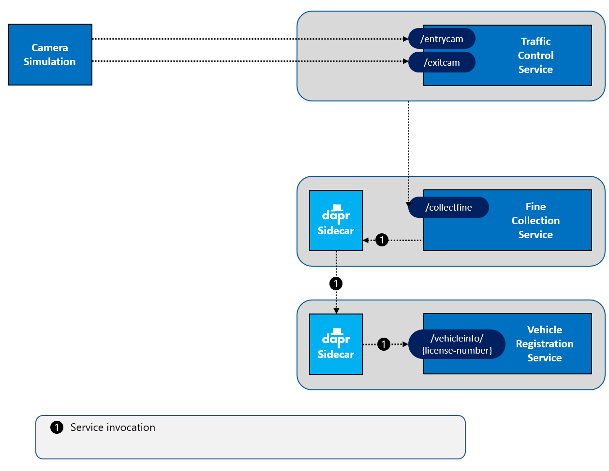

# Challenge 2 - Add Dapr service invocation

[< Previous Challenge](./Challenge-01.md) - **[Home](../README.md)** - [Next Challenge >](./Challenge-03.md)

## Introduction

In this assignment, you're going to add Dapr into the mix, using the Dapr **service invocation** building block.

## Description

While asynchronous communication across microservices is favored, some operations require an immediate response. For such use cases, one microservice effectively *queries* another for a response that is needed to complete the operation. Such scenarios often implement synchronous calls between services.

Operationally, it's important to not *hardcode* endpoints when implementing synchronous service calls. This practice becomes especially important in orchestrated environments, such as Kubernetes, where services are continually moved across cluster nodes and replaced with newer versions. The Dapr service invocation building block addresses service-to-service communication. Here is how it works:

In Dapr, every service is started with a unique Id (the *app-id*) which can be used to find it. What happens if Service A needs to call Service B?

1. Service A invokes the Dapr service invocation API (using HTTP or gRPC) on its Dapr sidecar and specifies the unique app-id of Service B.
1. Dapr discovers Service B's current location by using the name-resolution component configured for the hosting environment in which the solution is running.
1. Service A's Dapr sidecar forwards the message to Service B's Dapr sidecar.
1. Service B's Dapr sidecar forwards the request to Service B.  Service B executes the corresponding business logic.
1. Service B returns the response for Service A to its Dapr sidecar.
1. Service B's Dapr sidecar forwards the response to Service A's Dapr sidecar.
1. Service A's Dapr sidecar forwards the response to Service A.

> The service invocation building block offers many other features, such as security and load-balancing. Check out the [Dapr documentation](https://docs.dapr.io/developing-applications/building-blocks/service-invocation/service-invocation-overview/) later to learn more.

> Service Invocation is also covered in detail in the [Dapr for .NET Developers](https://docs.microsoft.com/dotnet/architecture/dapr-for-net-developers/service-invocation) guidance eBook.

For this hands-on assignment, you will decouple communication between two services.

## Success Criteria

To complete this assignment, you must achieve the following goals:

- The VehicleRegistrationService and FineCollectionService must each run with a Dapr sidecar.
- The FineCollectionService must use the Dapr service invocation building block to call the `/vehicleinfo/{licensenumber}` endpoint on the VehicleRegistrationService.

This assignment targets the operations labeled as **number 1** in the end-state setup:

## Tips

Look in the `044-Dapr/Student/Resources` directory for the source code to get started.

## Learning Resources

- https://docs.dapr.io/developing-applications/building-blocks/service-invocation/service-invocation-overview/
- https://docs.microsoft.com/dotnet/architecture/dapr-for-net-developers/service-invocation
