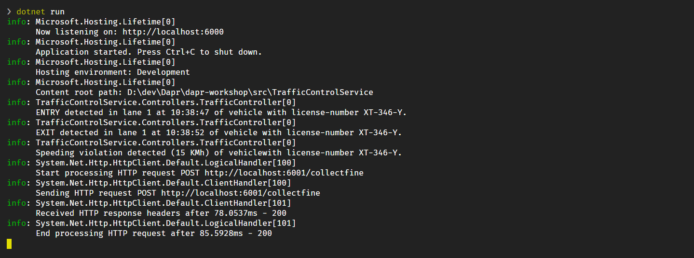

# Challenge 1 - Run the TrafficControl application - Coach's Guide

[< Previous Challenge](./Solution-00.md) - **[Home](./README.md)** - [Next Challenge>](./Solution-02.md)

## Notes & Guidance

In this challenge, you'll run the Traffic Control application to make sure everything works correctly. At this point, you'll be running the microservice application **without** any Dapr technology. As you work through the challenges, you'll add Dapr technology step-by-step.

## Step 1. Run the VehicleRegistration service

1. From the file explorer in VS Code, open the `Resources` folder.

   *Throughout the challenge you'll execute *all steps* in the **same instance** of VS Code.*

1. Open the terminal window in VS Code.

   _You can open it from the **Terminal** menu item on the top nav menu bar or by using the hotkey `` Ctrl-Shift-`  `` (Windows) or `` Shift-Ctrl-`  `` (macOS)._

1. In the terminal window, set your current folder to `Resources/VehicleRegistrationService`.

1. Start the service by typing in the `dotnet run` command in the terminal window.

   _If you receive an error here, please double-check whether or not you have installed all the [prerequisites](../README.md#Prerequisites)_

Now you can test whether you can call the `VehicleRegistrationService`. You can do this using a browser, CURL or some other HTTP client. But there is a convenient way of testing RESTful APIs directly from VS Code (using the REST Client extension VS Code):

1. Open the file `Resources/VehicleRegistrationService/test.http` in VS Code. The request in this file simulates retrieving the vehicle and owner information for a certain license-number.

1. Click on `Send request` link, located immediately above the GET request in the file and highlighted below in a _red box_, to send a request to the API:

   

1. The response of the request will be shown in a separate window on the right. It should be a response with HTTP status code `200 OK` and the body should contain some random vehicle and owner-information:

   ```json
   HTTP/1.1 200 OK
   Connection: close
   Date: Mon, 01 Mar 2021 07:15:55 GMT
   Content-Type: application/json; charset=utf-8
   Server: Kestrel
   Transfer-Encoding: chunked

   {
       "vehicleId": "KZ-49-VX",
       "brand": "Toyota",
       "model": "Rav 4",
       "ownerName": "Angelena Fairbairn",
       "ownerEmail": "angelena.fairbairn@outlook.com"
   }
   ```

1. Check the logging in the terminal window. It should look like this:

   

At this point, the Vehicle Registration microservice is up and running correctly!

## Step 2. Run the FineCollection service

1. Make sure the `VehicleRegistrationService` service is running (result of step 1).

1. Open a **new** terminal window in VS Code.

   _You can do this by using the hotkey (`` Ctrl-`  `` on Windows, `` Shift-Ctrl-`  `` on macOS) or clicking on the `+` button in the terminal window title bar (shown in a red box):_

   

1. In the terminal window, make sure the current folder is set to `Resources/FineCollectionService`.

1. Start the service using `dotnet run` in the terminal window.

1. Open the file `Resources/FineCollectionService/test.http` in VS Code. The request in this file simulates sending a detected speeding-violation to the `FineCollectionService`.

1. Click on `Send request` in the file to send a request to the API.

1. The response of the request will be shown in a separate window on the right. It should be a response with HTTP status code `200 OK` and no body.

1. Check the logging in the terminal window. It should look like this:

   

At this point, both the Vehicle Registration and Fine Collection microservices are up and running.

## Step 3. Run the TrafficControlService

1. Make sure the `VehicleRegistrationService` and `FineCollectionService` are running (results of step 1 and 2).

1. Open a **new** terminal window in VS Code and set the current folder to `Resources/TrafficControlService`.

1. Start the service using `dotnet run`.

1. Open the `test.http` file in the TrafficControl project folder in VS Code.

1. Click on `Send request` for both the _Registry Entry_ and _Register Exit_ requests in the file to send two requests to the API.

1. The response of the requests will be shown in a separate window on the right. Both requests should yield a response with HTTP status code `200 OK` and no body.

1. Check the logging in the terminal window. It should look like this:

   

1. Also inspect the logging of the `FineCollectionService`.

   _You can do this by selecting the prior terminal window using the dropdown in the title-bar of the terminal window:_
   

   You should see the speeding-violation being issued by the `FineCollectionService`:

   

At this point the three core microservices (`VehicleRegistrationService`, `FineCollectionService`, `TrafficControlService`) are up and running.

## Step 3. Run the simulation

You've tested the APIs directly by using a REST client. Now you're going to run the simulation microservice that simulates cars driving on the highway. The simulation will simulate 3 entry-cam and exit-cameras (one for each lane).

1. Open a new terminal window in VS Code and set the current folder to `Resources/Simulation`.

1. Start the service using `dotnet run`.

1. In the terminal window you should see something like this:

   

1. Also check the logging in the other Terminal windows. You should see all entry and exit events and any speeding-violations that were detected in the logging.

Now we know the application runs correctly. It's time to start adding Dapr to the application.

## Next challenge

Make sure you stop all running processes and close all the terminal windows in VS Code before proceeding to the next challenge. Stopping a service or the simulation is done by pressing `Ctrl-C` in the terminal window. To close the terminal window, enter the `exit` command.

_You can also close a terminal window by clicking on the trashcan icon in its title bar:_


