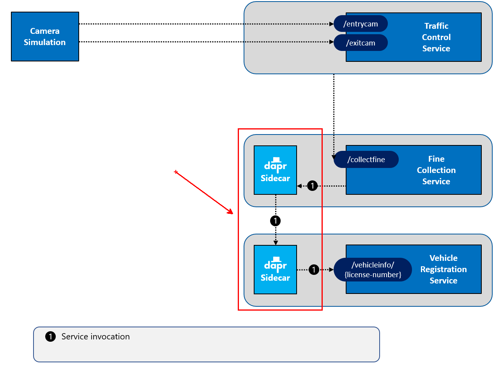
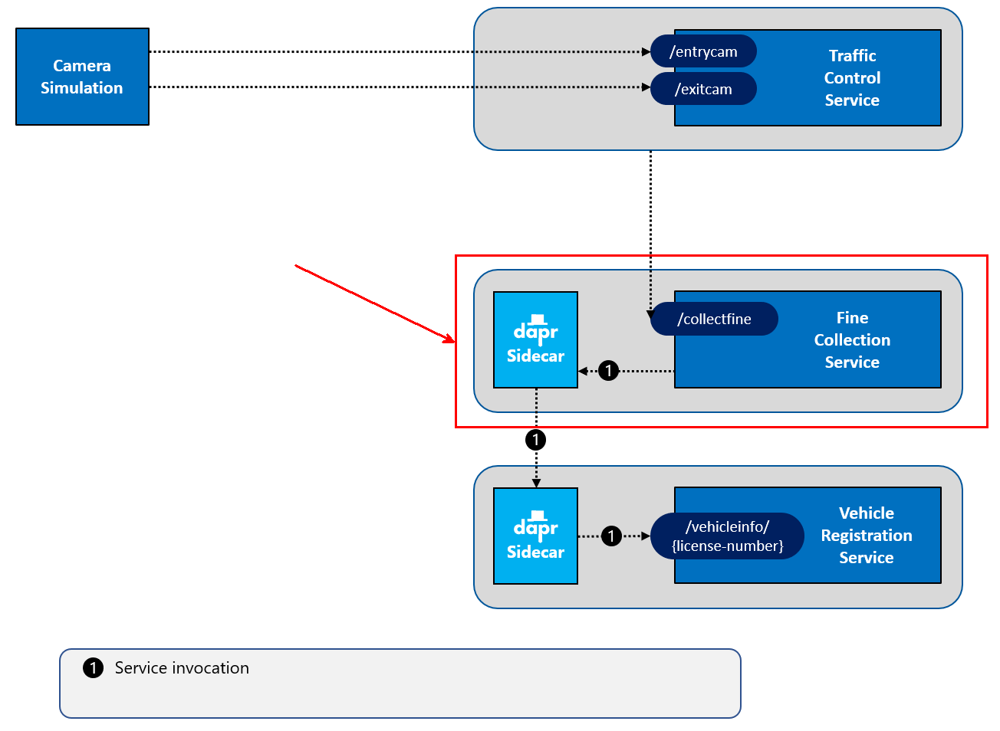
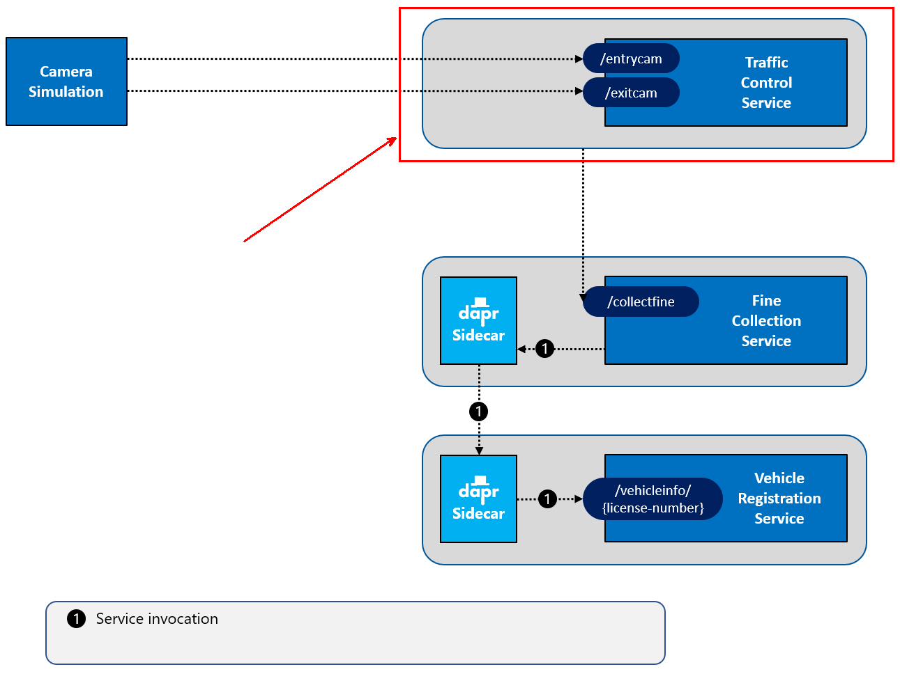
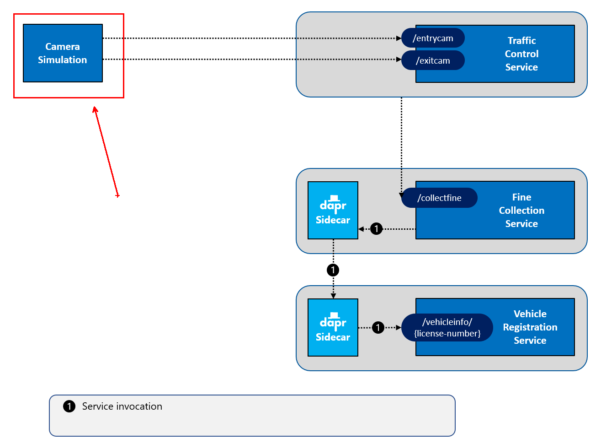

# Challenge 2 - Dapr Service Invocation - Coach's Guide

[< Previous Challenge](./Solution-01.md) - **[Home](./README.md)** - [Next Challenge>](./Solution-03.md)

## Notes & Guidance

_NOTE: This solution includes both the HTTP & .NET SDK versions of the code. You can choose to use either one._

### Step 1: Start the `VehicleRegistrationService` with Dapr

In challenge 1, you started all the services using `dotnet run` without using Dapr. The services then communicated among each other using direct HTTP calls. To evolve your application and use Dapr for service-to-service communication, you'll need the Dapr CLI to start Dapr sidecars for each service. The sidecars will then be responsible for cross-service communication. To do so, you'll need to provide values for a number of parameters:

- The service needs a unique id so that Dapr can find it. This is called the _app-id_ (or application Id). You specify this with the `--app-id` flag on the command-line.

- Each service listens for requests on a different HTTP port to prevent port collisions on localhost. You'll run the `VehicleRegistrationService` on port `6002`. You'll inform Dapr using the `--app-port` flag on the command-line. Doing so enables the Dapr sidecar to communicate with the service.

- The service can communicate with the Dapr sidecar using HTTP or gRPC. By default, Dapr sidecars listen on port `3500` and `50001`, respectively. But to prevent confusion, you'll use different port numbers in the challenges. To avoid port collisions on the local machine when running multiple services, you'll specify a unique HTTP and gRPC port per service. You specify this with the `--dapr-http-port` and `--dapr-grpc-port` flags on the command-line. Throughout the challenges, you will use the following ports:

  | Service                    | Application Port | Dapr sidecar HTTP port | Dapr sidecar gRPC port |
  | -------------------------- | ---------------- | ---------------------- | ---------------------- |
  | TrafficControlService      | 6000             | 3600                   | 60000                  |
  | FineCollectionService      | 6001             | 3601                   | 60001                  |
  | VehicleRegistrationService | 6002             | 3602                   | 60002                  |

- Finally you need to tell Dapr how to start the service. The services are .NET Core services which can be started with the command `dotnet run`.

You will use the Dapr CLI `run` command and specify all the options above on the command-line:

1.  Make sure you have started Docker Desktop on your machine and the Dapr CLI and runtime are installed (see the [prerequisites](../README.md#prerequisites)).

    If you haven't done so yet, you should now initialize Dapr on your local machine, too (here we won't be using your AKS cluster yet):

    ```shell
    dapr init
    ```

2.  Open the `Resources` folder in this repo in VS Code.

3.  Open the [terminal window](https://code.visualstudio.com/docs/editor/integrated-terminal) in VS Code and make sure the current folder is `Resources/VehicleRegistrationService`.

4.  Enter the following command to run the `VehicleRegistrationService` with a Dapr sidecar:

    ```shell
    dapr run --app-id vehicle-registration-service --app-port 6002 --dapr-http-port 3602 --dapr-grpc-port 60002 -- dotnet run
    ```

5.  Check the logs for any errors. If running correctly, you'll see both Dapr and application logging in the output.

Now you're running a 'Daprized' version of the `VehicleRegistrationService`. It's important to note that there were **no code changes** for this to work. The `VehicleRegistrationService` is still just a web API listening for requests. But now, you've started it with a Dapr sidecar running next door. The Dapr side car knows about and can communicate with the `VehicleRegistrationService`. As well, other services can use Dapr to call the `VehicleRegistrationService`. This is what you'll do in the next step.

### Step 2: Call the `VehicleRegistrationService` using Dapr service invocation

In this step, you're going to change the code of the `FineCollectionService` so it uses Dapr service invocation to call the `VehicleRegistrationService`. The following figure depicts the update:



First you're going to change the code so it calls the Dapr sidecar:

1.  Open the file `Resources/FineCollectionService/Controllers/CollectionController.cs` using the in VS Code [Explorer](https://code.visualstudio.com/docs/getstarted/userinterface#_explorer).

1.  Inspect the `CollectFine` method. Note how it contains a call to the `VehicleRegistrationServiceProxy` to retrieve the vehicle info:

    ```csharp
    // get owner info
    var vehicleInfo = await _vehicleRegistrationServiceProxy.GetVehicleInfo(speedingViolation.VehicleId);
    ```

    The `_vehicleRegistrationServiceProxy` is an instance of a proxy (helper class) that uses the .NET `HttpClient` to call the `VehicleRegistrationService`. You are going to change that proxy so it uses Dapr service invocation.

1.  Open the file `Resources/FineCollectionService/Proxies/VehicleRegistrationServiceProxy.cs` in VS Code.

1.  Inspect the `GetVehicleInfo` method. Note in the HTTP call how the URL of the `VehicleRegistrationService` (running on port 6002) is _hardcoded_.

1.  The Dapr API template for calling the service invocation building block on a Dapr sidecar is:

    ```http
    http://localhost:<daprPort>/v1.0/invoke/<appId>/method/<method-name>
    ```

    _Note that the Dapr API calls are platform agnostic. Any development language that supports HTTP calls can invoke a Dapr sidecar using with this HTTP call template structure._

    You can substitute the placeholders in the template URL with values for the `FineCollectionService`. Here's how the specific URL will look:

    ```http
    http://localhost:3601/v1.0/invoke/vehicle-registration-service/method/vehicleinfo/{licenseNumber}
    ```

    As you can see in this URL, the Dapr sidecar for the `FineCollectionService` will run on HTTP port `3601`.

1.  Replace the URL in the code with the new Dapr service invocation URL. The code should now look like this:

    ```csharp
    public async Task<VehicleInfo> GetVehicleInfo(string licenseNumber)
    {
        return await _httpClient.GetFromJsonAsync<VehicleInfo>(
            $"http://localhost:3601/v1.0/invoke/vehicle-registration-service/method/vehicleinfo/{licenseNumber}");
    }
    ```

    _It's important to grasp the [sidecar pattern](https://docs.dapr.io/concepts/overview/#sidecar-architecture) used by Dapr. The `FineCollectionService` calls the `VehicleRegistrationService` not directly, but **through its dapr sidecar**! The `FineCollectionService` no longer needs to know the endpoint of the `VehicleRegistrationService`. Its Dapr sidecar will locate the endpoint for `VehicleRegistrationService` based on the `app-id` specified in the URL. Once found, the sidecar for FineCollection will call the sidecar for `VehicleRegistrationService`. The `VehicleRegistrationService` sidecar will then invoke the `vehicleInfo` method on the `VehicleRegistrationService` service, passing in the license plate number._

1.  With the `VehicleRegistrationService` up and running, you'll now start the `FineCollectionService`:

    

1.  Open a **new** terminal window in VS Code and make sure the current folder is set to `Resources/FineCollectionService`.

1.  Check all your code-changes are correct by building the code:

    ```shell
    dotnet build
    ```

    If you see any warnings or errors, review the previous steps to make sure the code is correct.

1.  Enter the following command to run the `FineCollectionService` with a Dapr sidecar:

    ```shell
    dapr run --app-id fine-collection-service --app-port 6001 --dapr-http-port 3601 --dapr-grpc-port 60001 -- dotnet run
    ```

1.  Check the logs for any errors. As you can see, both Dapr and the application logging will be shown.

Now you're going to test the application from end-to-end:

First, start the `TrafficControlService`:



1.  Open a **new** terminal window in VS Code and set the current folder to `Resources/TrafficControlService`.

1.  Enter the following command to run the `TrafficControlService` with a Dapr sidecar:

    ```shell
    dapr run --app-id traffic-control-service --app-port 6000 --dapr-http-port 3600 --dapr-grpc-port 60000 --resources-path ../dapr/components -- dotnet run
    ```

    > The `TrafficControlService` does not need to run with a Dapr sidecar in this challenge. This is because it will still call the `FineCollectionService` over HTTP as before, but it doesn't hurt to go ahead and run it using Dapr so you are set up for the next challenge.

Finally, you're going start the traffic simulator:



1. Open a **new** terminal window in VS Code and set the current folder to `Resources/Simulation`.

1. Start the simulation:

   ```shell
   dotnet run
   ```

Recycle back through all the services running in the terminal. You should see similar logging as before when you ran the application. So, the functionality works the same, but now you use Dapr service invocation to communicate between the `FineCollectionService` and the `VehicleRegistrationService`.

### Step 3: Use Dapr service invocation with the Dapr SDK for .NET

In step 2, you used the Dapr HTTP API to call the Dapr Service Invocation building block. In this step, you're going to simplify the application by using the **Dapr SDK for .NET** to call the `VehicleRegistrationService`. The SDK provides a simple and intuitive way to invoke the Dapr sidecar APIs that tightly integrates with the .NET Core platform.

First stop the simulation:

1.  Open the terminal window in VS Code in which the Camera Simulation runs (the last service you started in the step 2).

1.  Stop the simulation by pressing `Ctrl-C` and close the terminal window by clicking the trashcan icon in its title bar (or typing the `exit` command).

1.  Open the terminal window in VS Code in which the `FineCollectionService` runs (the second service you started in step 2).

1.  Stop the service by pressing `Ctrl-C`, but do not close the terminal window. Keep this terminal window open and focused.

1.  In the `FineCollectionService` terminal window, add a reference to the Dapr ASP.NET Core integration library:

    ```shell
    dotnet add package Dapr.AspNetCore
    ```

    _The `Dapr.AspNetCore` package contains the `DaprClient` class, which is used to directly invoke the Dapr API as well as additional integrations with ASP.NET Core. Because the services are all ASP.NET Core web APIs, we'll use this package throughout the WhatTheHack._

Now you'll change the code in the `FineCollectionService` to use the Dapr SDK `HttpClient` integration to call the `VehicleRegistrationService`. The `HttpClient` integration allows you to use the .NET Core `HttpClient` object to make service calls, while the SDK ensures that calls are routed through the Dapr sidecar.

1.  Open the file `Resources/FineCollectionService/Startup.cs` in VS Code.

1.  Add a `using` statement in this file to make sure you can use the Dapr client:

    ```csharp
    using Dapr.Client;
    ```

1.  The `ConfigureServices` method, contains these two lines of code which register the .NET `HttpClient` and the `VehicleRegistrationServiceProxy` proxy (which uses the `HttpClient`) with dependency injection:

    ```csharp
    // add service proxies
    services.AddHttpClient();
    services.AddSingleton<VehicleRegistrationServiceProxy>();
    ```

1.  Replace these two lines with with the following lines:

    ```csharp
    // add service proxies
    services.AddSingleton<VehicleRegistrationServiceProxy>(_ =>
        new VehicleRegistrationServiceProxy(DaprClient.CreateInvokeHttpClient(
            "vehicle-registration-service", "http://localhost:3601")));
    ```

With this snippet, you use the `DaprClient` to create an `HttpClient` instance to implement service invocation. You specify the `app-id` of the service you want to communicate with. You also need to specify the address of the Dapr sidecar for the `FineCollectionService` as it's not using the default Dapr HTTP port (3500). The `HttpClient` instance created by Dapr is explicitly passed into the constructor of the `VehicleRegistrationServiceProxy` class.

_This is an example of the deep integration of Dapr with ASP.NET Core when using the `Dapr.AspNetCore` library. You can still use the `HttpClient` (and its rich feature-set) in your code, but under the hood it uses the Dapr service invocation building block to communicate._

1.  Open the file `Resources/FineCollectionService/Proxies/VehicleRegistrationServiceProxy.cs` in VS Code.

1.  Because the `HttpClient` passed into this class has already been created with a specific `app-id`, you can omit the host information from the request URL. Change the URL that is used in the `GetVehicleInfo` to `/vehicleinfo/{license-number}`. The method should now look like this:

    ```csharp
    public async Task<VehicleInfo> GetVehicleInfo(string licenseNumber)
    {
        return await _httpClient.GetFromJsonAsync<VehicleInfo>(
            $"/vehicleinfo/{licenseNumber}");
    }
    ```

Now the `FineCollectionService` is changed to use the Dapr SDK for service invocation. Let's test this.

1.  If you followed the instructions in this challenge, the VehicleRegistration and TrafficControl services are still running.

1.  Open the terminal window in VS Code in which the `FineCollectionService` was running.

1.  Execute the `dotnet build` to make sure the code is correct.

1.  Enter the following command to start the changed `FineCollectionService` again:

    ```shell
    dapr run --app-id fine-collection-service --app-port 6001 --dapr-http-port 3601 --dapr-grpc-port 60001 dotnet run
    ```

The services are up & running. Now you're going to test this using the simulation.

1.  Open a **new** terminal window (or the window you had used previously) in VS Code and change the current folder to `Resources/Simulation`.

1.  Start the simulation:

    ```shell
    dotnet run
    ```

You should see similar logging as before when you ran the application.

## Troubleshooting

### Unable to start Dapr services

If you have run this demo before, you may have extra files left over in your Dapr configuration that prevent your setup from running correctly.

You may also see errors like the following:

```shell
2022/10/11 22:31:07 failed to send the request: Post "http://localhost:9411/api/v2/spans": dial tcp [::1]:9411: connectex: No connection could be made because the target machine actively refused it.
```

You should run the Dapr uninstall & init commands to clean up your environment:

```shell
dapr uninstall
```

```shell
dapr init
```

### Service invocation fails

After modifying the `FineCollectionService` to use Dapr invocation, you may see the following error:

```shell
== APP ==       System.Net.Http.HttpRequestException: Response status code does not indicate success: 500 (Internal Server Error).
```

This is likely due to a mismatch between the case of the `--app-id` used to start the `VehicleRegistrationService` and the case of the `http` request in the `FineCollectionService`. Make sure they are spelled the same and use the same case (note the `--app-id` below is case-sensitive).

```shell
dapr run --app-id vehicle-registration-service --app-port 6002 --dapr-http-port 3602 --dapr-grpc-port 60002 -- dotnet run
```

```csharp
$"http://localhost:3601/v1.0/invoke/vehicle-registration-service/method/vehicleinfo/{licenseNumber}");
```

**IMPORTANT:** Use lowercase letters for the `app-id` of all Dapr services (some Dapr configurations don't support CamelCase)!
