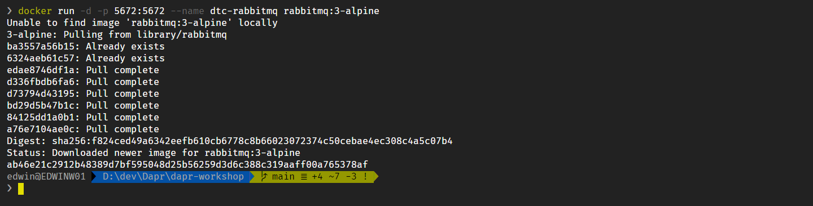
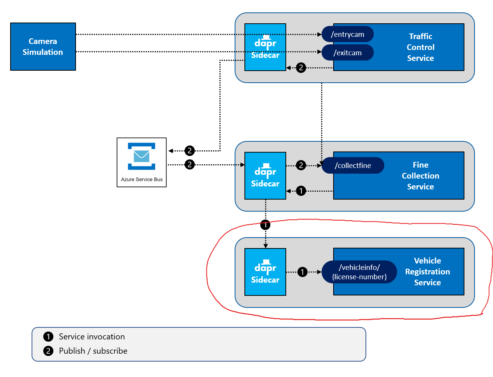
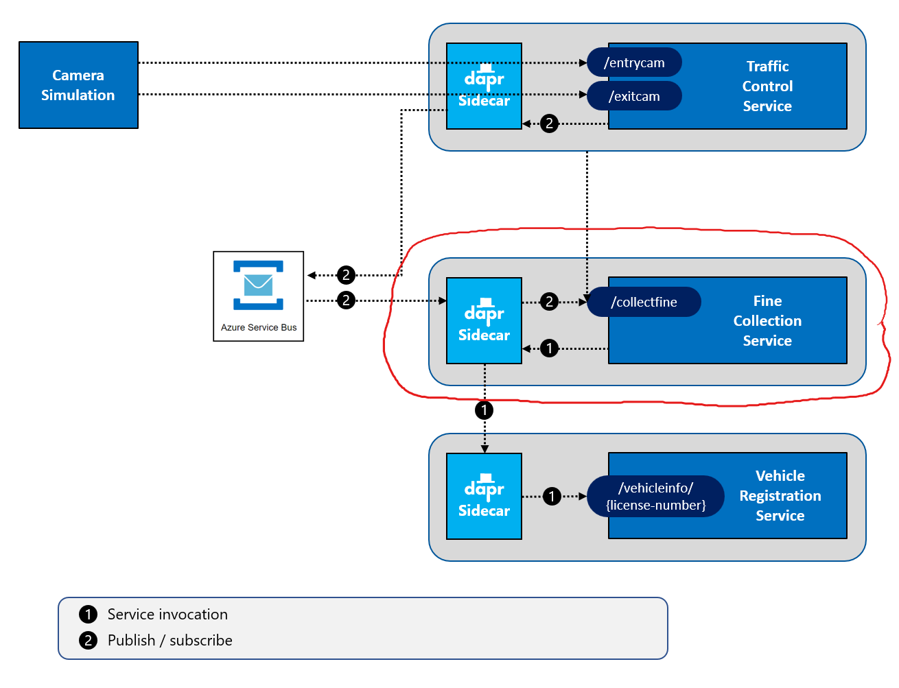
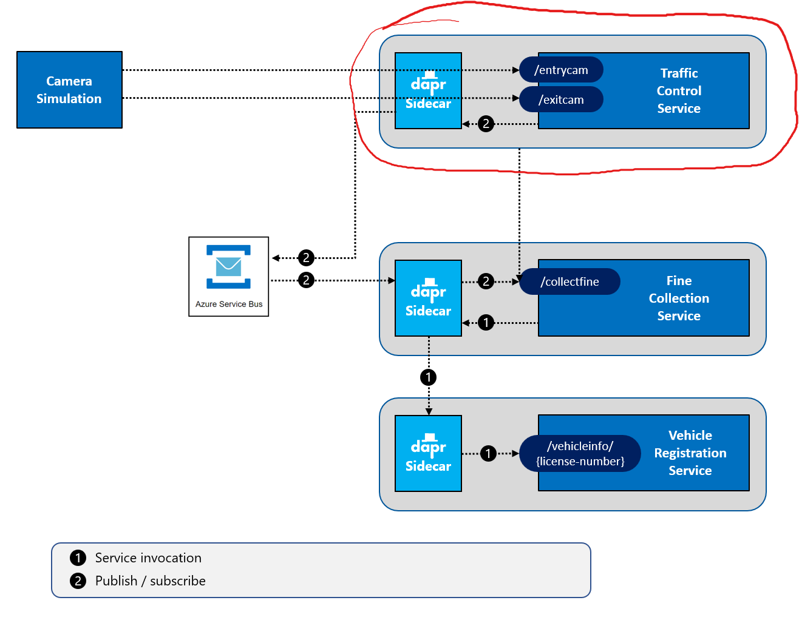
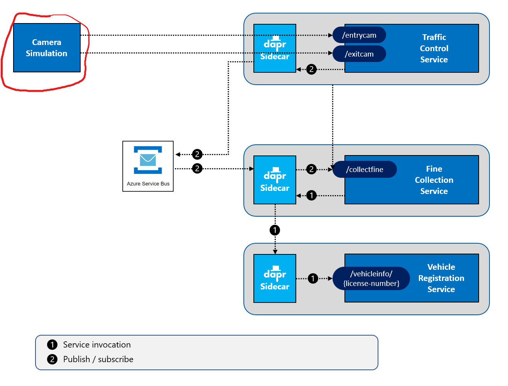
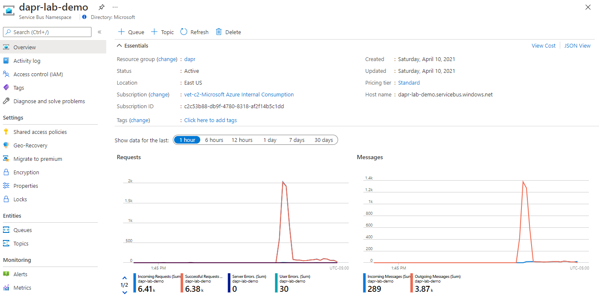

# Challenge 3 - Dapr Pub/Sub Messaging - Coach's Guide

[< Previous Challenge](./Solution-02.md) - **[Home](./README.md)** - [Next Challenge>](./Solution-04.md)

## Notes & Guidance

### Step 1: Run RabbitMQ as message broker

In the example, you will use RabbitMQ as the message broker for the Dapr pub/sub building block. You're going to pull a standard Docker image containing RabbitMQ to your machine and start it as a container.

1. Open the terminal window in VS Code.

1. Start a container instance of a RabbitMQ message broker by entering the following command:

   ```shell
   docker run -d -p 5672:5672 -p 15672:15672 --name dtc-rabbitmq rabbitmq:3-management
   ```

The command will pull the docker image `rabbitmq:3-alpine` from Docker Hub, copy it onto your machine, and start it. It'll name the container `dtc-rabbitmq`. The server will be listening for connections on port `5672` (which is the default port for RabbitMQ). It also exposes an an administrative port on `15672` which exposes a dashboard.

If all goes well, you should see some output like this:



_If you see any errors, make sure you have access to the Internet and are able to download images from Docker Hub. See [Docker Hub](https://hub.docker.com/) for more info._

The container will keep running in the background. If you want to stop it, enter the following command:

```shell
docker stop dtc-rabbitmq
```

You can later restart the container by entering the following command:

```shell
docker start dtc-rabbitmq
```

Later on, when you're done with this class, you can remove the running container by entering the following command:

```shell
docker rm dtc-rabbitmq -f
```

Warning: Once you remove container, it's gone. To use it, again, you'll need to start over with the `docker run` command shown at the beginning of this step.

_For your convenience, the `Resources/Infrastructure` folder contains PowerShell scripts for starting the infrastructural components you'll use throughout the WhatTheHack. Invoke the `Resources/Infrastructure/rabbitmq/start-rabbitmq.ps1` script to start the RabbitMQ container._

_If you want to start all the infrastructure containers at once (for this and the challenges to come), invoke the `Resources/Infrastructure/start-all.ps1` script._

_If you're using Bash, just copy/paste the docker command to the shell and run it._

### Step 2: Configure the pub/sub component

Until now, you have been using the default Dapr components installed on your machine. They include both a state management and pub/sub component. Under the covers, both use Redis server, which is also installed by default. The components are installed in the folder `%USERPROFILE%\.dapr\components` on Windows and `$HOME/.dapr/components` on Linux or Mac.

To change the message broker component from Redis to RabbitMQ, you'll create a local components folder and new component file. You'll then specify the new folder when starting services with the Dapr CLI. The `--components-path` flag will instruct Dapr where to find the new component folder and files.

1. Create a new folder `Resources/dapr/components`.

   *Note: Version 1.41+ of Visual Studio Code collapses embedded subfolders into a single child subfolder. This feature is called *compact folders*. You can disable this feature from the menu: File... Preferences... Settings... Explorer... CompactFolders.*

1. Create a new file `Resources/dapr/components/pubsub.yaml` in VS Code.

1. Inspect this file. The `type` field specifies the type of the message broker to use (`pubsub.redis`). The `metadata` section provides information on how to connect to the Redis server .

1. Change the content of this file to:

   ```yaml
   apiVersion: dapr.io/v1alpha1
   kind: Component
   metadata:
     name: pubsub
   spec:
     type: pubsub.rabbitmq
     version: v1
     metadata:
       - name: host
         value: "amqp://localhost:5672"
       - name: durable
         value: "false"
       - name: deletedWhenUnused
         value: "false"
       - name: autoAck
         value: "false"
       - name: reconnectWait
         value: "0"
       - name: concurrency
         value: parallel
   scopes:
     - trafficcontrolservice
     - finecollectionservice
   ```

You've now specified the Dapr **RabbitMQ** pub/sub component (`pubsub.rabbitmq`). In the `metadata` section, you instruct Dapr how to connect to the RabbitMQ container running on port `5672`. Ignore the other metadata for now. In the `scopes` section, you limit the usage of this component to the `TrafficControlService` and `FineCollectionService`.

### Step 3: Send messages from the `TrafficControlService`

With the Dapr pub/sub building block, you use a [topic](https://docs.microsoft.com/azure/service-bus-messaging/service-bus-dotnet-how-to-use-topics-subscriptions) to send and receive messages. The producer sends (or _publishes_) messages to the topic while one-to-many consumers subscribe to this topic to receive messages. First, you'll prepare the `TrafficControlService` to send or publish messages using Dapr pub/sub.

1. Open the file `Resources/TrafficControlService/Controllers/TrafficController.cs` in VS Code.

1. Near the end of the `VehicleExit` method, you find the code that sends a `SpeedingViolation` message to the `FineCollectionService` over HTTP:

   ```csharp
   // publish speedingviolation
   var message = JsonContent.Create<SpeedingViolation>(speedingViolation);
   await _httpClient.PostAsync("http://localhost:6001/collectfine", message);
   ```

   _Note how the endpoint `(http://localhost:6001)` of the subscriber (the `FineCollectionService`) is **hardcoded** in the call._

1. Dapr has a standard URI template for publishing a message using the Dapr Pub/Sub building block:

   ```csharp
   http://localhost:<daprPort>/v1.0/publish/<pubsub-name>/<topic>
   ```

1. You'll use this template to publish a message from the TrafficControlService to the `collectfine` topic in the `FineCollectionService`. The new call will instruct Dapr to use the newly-created pub/sub component named `pubsub`. The Dapr sidecar for the TrafficControlService will run on HTTP port `3600`. Replace the hardcoded URL in the `VehicleExit` method with the following call to the Dapr pub/sub API:

   ```csharp
   await _httpClient.PostAsync("http://localhost:3600/v1.0/publish/pubsub/collectfinetopic", message);
   ```

Keep in mind that `TrafficControlService` is no longer coupled to `FineCollectionService`. Instead, `TrafficControlService` publishes the message to its Dapr sidecar service on port 3600. The sidecar is then responsible for executing the publish command using the Dapr pub/sub building block and component.

1. Check all your code-changes are correct by building the code. Open the terminal window in VS Code, make sure the current folder is `Resources/TrafficControlService`, and execute the following command:

   ```shell
   dotnet build
   ```

   If you see any warnings or errors, review the previous steps to make sure the code is correct.

That's it. You now use Dapr pub/sub to publish a message to a message broker.

### Step 4: Receive messages in the `FineCollectionService` (_Declaratively_)

You are going to prepare the `FineCollectionService` so that it can receive messages using Dapr pub/sub. Consuming messages can be done in two ways: _declaratively_ (through configuration) or _programmatically_ (from code). First, you'll use the declarative approach. Later, you'll consume the message programmatically with the Dapr SDK for .NET.

1. Add a new file in the `Resources/dapr/components` folder named `subscription.yaml`.

1. Open this file in VS Code.

1. You're going to define a subscription for a topic and link it to a web API operation on the `FineCollectionService`. Paste this snippet into the file:

   ```yaml
   apiVersion: dapr.io/v1alpha1
   kind: Subscription
   metadata:
     name: collectfine-subscription
   spec:
     topic: collectfinetopic
     route: /collectfine
     pubsubname: pubsub
   scopes:
     - finecollectionservice
   ```

   _The `route` field tells Dapr to forward messages published to the `collectfinetopic` topic to the `/collectfine` endpoint. From there, the subscriber can handle each message. The `pubsubname` links the subscription.yaml file to the `pubsub` component. The `scopes` field restricts this subscription to only the service with the `finecollectionservice` app-id._

Now the `FineCollectionService` is ready to receive published messages through Dapr.

1. Open the terminal window in VS Code and make sure the current folder is `Resources/FineCollectionService`.

1. Check all your code-changes are correct by building the code. Execute the following command in the terminal window:

   ```shell
   dotnet build
   ```

   If you see any warnings or errors, review the previous steps to make sure the code is correct.

### Step 5: Test the application

You're going to start the application, service-by-service. While doing so, you'll specify the custom components folder with the `--components-path` flag. Dapr will use the configuration files located there.

_Pay close attention to the order in which you start the service and be sure not to miss any._

1. Make sure no services from previous tests are running (close the command-shell windows).

1. First, you'll start the `VehicleRegistrationService` shown below:



1. Open a **new** terminal window in VS Code and make sure the current folder is `Resources/VehicleRegistrationService`.

1. Enter the following command to run the `VehicleRegistrationService` with a Dapr sidecar:

   ```shell
   dapr run --app-id vehicleregistrationservice --app-port 6002 --dapr-http-port 3602 --dapr-grpc-port 60002 --components-path ../dapr/components dotnet run
   ```

   _Notice how the command specifies the custom components folder with the `--components-path` flag. By adding it, Dapr will use RabbitMQ for pub/sub._

1. Look for the following output:

   ```shell
   You're up and running! Both Dapr and your app logs will appear here.*
   ```

1. Next, you'll start the `FineCollectionService`:



1. Open a **second** new terminal window in VS Code and change the current folder to `Resources/FineCollectionService`.

1. Enter the following command to run the `FineCollectionService`, an accompanying Dapr sidecar, and the RabbitMQ component:

   ```shell
   dapr run --app-id finecollectionservice --app-port 6001 --dapr-http-port 3601 --dapr-grpc-port 60001 --components-path ../dapr/components dotnet run
   ```

1. Look for the following output:

   ```shell
   You're up and running! Both Dapr and your app logs will appear here.
   ```

1. Next, you'll start the `TrafficControlService`:



1. Open a **third** new terminal window in VS Code and change the current folder to `Resources/TrafficControlService`.

1. Enter the following command to run the `TrafficControlService` with a Dapr sidecar:

   ```shell
   dapr run --app-id trafficcontrolservice --app-port 6000 --dapr-http-port 3600 --dapr-grpc-port 60000 --components-path ../dapr/components dotnet run
   ```

1. Look for the following output:

   ```shell
   You're up and running! Both Dapr and your app logs will appear here.*
   ```

1. Finally, you'll start the Traffic Simulator:



1. Open a **fourth** new terminal window in VS Code and change the current folder to `Resources/Simulation`.

1. Start the simulation:

   ```shell
   dotnet run
   ```

You should see the same logs as before. As well, the application behavior is exactly the same. However, if you look closely at the Dapr logs for `FineCollectionService` (the _second_ terminal window), you should see something like this:

```shell
time="2021-02-27T16:46:02.5989612+01:00" level=info msg="app is subscribed to the following topics: [collectfine] through pubsub=pubsub" app_id=finecollectionservice instance=EDWINW01 scope=dapr.runtime type=log ver=1.0.0
```

This log entry shows that Dapr queried the topic specified by the service `collectfine` and created a corresponding subscription.

### Step 6: Receive messages in the `FineCollectionService` (_Programmatically_)

The other approach to subscribing to pub/sub events is to do it programmatically. Dapr can call a service on the well known endpoint `/dapr/subscribe` to retrieve the subscriptions for that service. You will implement this endpoint and return the subscription for the `collectfine` topic.

1. Stop the `FineCollectionService` (the _second_ terminal window) by navigating to its terminal window and pressing `Ctrl-C`. You can keep the other services running for now.

1. Open the file `Resources/FineCollectionService/Controllers/CollectionController.cs` in VS Code.

1. Add a new operation named `Subscribe` to the controller that will listen to the route `/dapr/subscribe`:

   ```csharp
   [Route("/dapr/subscribe")]
   [HttpGet()]
   public object Subscribe()
   {
     return new object[]
     {
       new
       {
         pubsubname = "pubsub",
         topic = "collectfinetopic",
         route = "/collectfine"
       }
     };
   }
   ```

1. Remove the file `Resources/dapr/components/subscription.yaml`. This file is no longer needed. You've replaced the _declarative_ YAML subscription file with a _programmatic_ call to the Subscribe method at runtime.

1. Go back to the terminal window in VS Code and make sure the current folder is `Resources/FineCollectionService`.

1. Check all your code-changes are correct by building the code. Execute the following command in the terminal window:

   ```shell
   dotnet build
   ```

   If you see any warnings or errors, review the previous steps to make sure the code is correct.

1. Start the updated `FineCollectionService`:

   ```shell
   dapr run --app-id finecollectionservice --app-port 6001 --dapr-http-port 3601 --dapr-grpc-port 60001 --components-path ../dapr/components dotnet run
   ```

1. After you've looked at the log output and confirmed that everything works, you can stop all the services.

### Step 7: Use Dapr publish / subscribe with the Dapr SDK for .NET

In this step, you'll simplify pub/sub messaging with the Dapr SDK for .NET. First you'll update the publisher that sends messages, the `TrafficControlService`.

1. Open the terminal window in VS Code and make sure the current folder is `Resources/TrafficControlService`.

1. Add a reference to the Dapr ASP.NET Core integration package:

   ```shell
   dotnet add package Dapr.AspNetCore
   ```

1. Open the file `Resources/TrafficControlService/Controllers/TrafficController.cs` in VS Code.

1. In this file, add a `using` statement for the Dapr client:

   ```csharp
   using Dapr.Client;
   ```

1. Add an argument named `daprClient` of type `DaprClient` that is decorated with the `[FromServices]` attribute to the `VehicleExit` method declaration:

   ```csharp
   public async Task<ActionResult> VehicleExit(VehicleRegistered msg, [FromServices] DaprClient daprClient)
   ```

   _The `[FromServices]` attribute injects the `DaprClient` into the method using the ASP.NET Core dependency injection system._

1. Near the end of the method, you'll find the code that publishes the `SpeedingViolation` message using `_httpClient`:

   ```csharp
   // publish speedingviolation
   var message = JsonContent.Create<SpeedingViolation>(speedingViolation);
   await _httpClient.PostAsync("http://localhost:3600/v1.0/publish/pubsub/collectfine", message);
   ```

1. Replace this code with a call to the Dapr pub/sub building block using the DaprClient:

   ```csharp
   // publish speedingviolation
   await daprClient.PublishEventAsync("pubsub", "collectfinetopic", speedingViolation);
   ```

1. Open the file `Resources/TrafficControlService/Startup.cs`.

1. As the service now uses the `DaprClient`, it needs to be registered with .NET Core dependency injection container. Add the following line to the `ConfigureServices` method to register the `DaprClient` with dependency injection:

   ```csharp
   services.AddDaprClient(builder => builder
             .UseHttpEndpoint($"http://localhost:3600")
             .UseGrpcEndpoint($"http://localhost:60000"));
   ```

   Note that the specified ports register the Dapr client with the sidecar service for `TrafficControlService`.

1. Open the terminal window in VS Code and make sure the current folder is `Resources/TrafficControlService`.

1. Check all your code-changes are correct by building the code. Execute the following command in the terminal window:

   ```shell
   dotnet build
   ```

   If you see any warnings or errors, review the previous steps to make sure the code is correct.

Next, you'll change the `FineCollectionService` that receives messages. The Dapr ASP.NET Core integration library offers an elegant way of linking an ASP.NET Core WebAPI method to a pub/sub topic. For every message sent to that topic, the WebAPI method is invoked and the payload of the message is delivered in a request body. You don't have to poll for messages on the message broker.

1. Open the file `Resources/FineCollectionService/Controllers/CollectionController.cs` in the VS Code.

1. Remove the entire `Subscribe` method from the controller.

1. Replace the `cloudevent` parameter of the `CollectFine` method with a parameter of type `SpeedingViolation` named `speedingViolaton`:

   ```csharp
   public async Task<ActionResult> CollectFine(SpeedingViolation speedingViolation)
   ```

1. Remove the code that parses the cloud event data at the beginning of the method:

   ```csharp
   var data = cloudevent.RootElement.GetProperty("data");
   var speedingViolation = new SpeedingViolation
   {
     VehicleId = data.GetProperty("vehicleId").GetString(),
     RoadId = data.GetProperty("roadId").GetString(),
     Timestamp = data.GetProperty("timestamp").GetDateTime(),
     ViolationInKmh = data.GetProperty("violationInKmh").GetInt32()
   };
   ```

1. Add a `using` statement in this file so you can use DaprClient:

   ```csharp
   using Dapr;
   ```

1. Add an attribute above the `CollectFine` method to link this method to a topic called `collectfine`:

   ```csharp
   [Topic("pubsub", "collectfine")]
   ```

   _The **"pubsub"** argument passed to this attribute refers to the name of the Dapr pub/sub component to use. _"collectfine"_ is the name of the topic._

Now you need to make sure that Dapr is aware of this controller and knows the pub/sub topics to which it subscribes. To do so, Dapr will call your service on a default endpoint to retrieve the subscriptions. To make sure your service handles this request and returns the correct information, you need to add some statements to the `Startup` class:

1. Open the file `Resources/FineCollectionService/Startup.cs` in VS Code.

1. Append `AddDapr` to the `AddControllers` line in the `ConfigureServices` method:

   ```csharp
   services.AddControllers().AddDapr();
   ```

   _The `AddDapr` method adds Dapr integration for ASP.NET MVC._

1. As you saw earlier, Dapr uses the _Cloud Event_ message-format standard when sending messages over pub/sub. To make sure cloud events are automatically unwrapped, add the following directive just after the call to `app.UseRouting()` in the `Configure` method:

   ```csharp
   app.UseCloudEvents();
   ```

   _The call to UseCloudEvents adds CloudEvents middleware into to the ASP.NET Core middleware pipeline. This middleware will unwrap requests that use the CloudEvents structured format, so the receiving method can read the event payload directly._

1. To register every controller that uses pub/sub as a subscriber, add a call to `endpoints.MapSubscribeHandler()` to the lambda passed into `app.UseEndpoints` in the `Configure` method. It should look like this:

   ```csharp
   app.UseEndpoints(endpoints =>
   {
     endpoints.MapSubscribeHandler();
     endpoints.MapControllers();
   });
   ```

   _The MapSubscriberHandler() extension automatically implements the `/dapr/subscribe` endpoint that you added earlier. It collects all controller methods decorated with the Dapr `Topic` attribute and returns the corresponding subscription._

1. Open the terminal window in VS Code and make sure the current folder is `Resources/FineCollectionService`.

1. Check all your code-changes are correct by building the code. Execute the following command in the terminal window:

   ```shell
   dotnet build
   ```

   If you see any warnings or errors, review the previous steps to make sure the code is correct.

Test the application again by executing the activities in step 5 again.

### Step 8: Dapr publish/subscribe with Azure Service Bus

_This step assumes you have created an Azure Service Bus namespace in [Challenge 00](../Student/Challenge-00.md#Step%202.%20Create%20Azure%20Resources)._

So far, in this challenge, you've used _RabbitMQ_ to publish and subscribe to messages. Interestingly, you didn't require an extensive understanding of this message broker. Using RabbitMQ required two steps:

- Adding Dapr pub/sub building block code
- A YAML configuration component

In a traditional microservice application, a large amount of development effort would be invested building plumbing code to consume the RabbitMQ libraries and SDKs.

Hopefully, you can easily see how Dapr building blocks and components abstract the complexity of building complex distributed applications.

With Dapr, how much work would be involved to switch message brokers, say, from RabbitMQ to Azure Service Bus?

The answer? Change the YAML configuration file. There are absolutely no code changes required. Let's do this right now.

1. Open the `pubsub.yaml` file in `Resources/dapr/components` folder.

1. Change the content of this file to:

   ```yaml
   apiVersion: dapr.io/v1alpha1
   kind: Component
   metadata:
     name: pubsub
     namespace: <name of you Azure Service Bus namespace>
   spec:
     type: pubsub.azure.servicebus
     version: v1
     metadata:
       - name: connectionString
         value: "<your Azure Service Bus connection string"
   scopes:
     - trafficcontrolservice
     - finecollectionservice
   ```

   _What changed? `namespace`, `type`, and the underlying `spec` metadata._

1. You need to provide a connection string for Azure Service Bus. Normally, you'd create a [Shared Access Secret or enable authentication/authorization with AAD](https://docs.microsoft.com/azure/service-bus-messaging/service-bus-authentication-and-authorization). For now, however, keep your focus on Dapr. In the Service Bus portal blade, click on `Shared access policies` and then the `RootManagerSharedAccessKey` Copy the connection string value from `Primary Connection String`' Close the SAS dialog box and paste the connection string into the `pubsub' YAML file.

   _Warnings: (1) Never use the RootManageSharedAccessKey in a real-world application. (2) Never expose the connection string in plain text. In a real-world application you'd create a custom shared access key and access it from a secure secret store. You'll do that in a later challenge._

   You can also use AZ CLI tool to get the connection string:

   ```shell
   az servicebus namespace authorization-rule keys list --namespace-name <service bus namespace> -g <resource group> --name RootManageSharedAccessKey --query "primaryConnectionString" -o tsv
   ```

1. Stop and restart the `TrafficControlService` and `FineCollectionService` (the second and third services from step 5).

1. Navigate to the Service Bus blade in the Azure Portal. After a few minutes, you'll see the message traffic between services in the dashboard.



https://docs.dapr.io/reference/components-reference/supported-pubsub/setup-azure-servicebus/

As you complete this challenge, hopefully you will see the value proposition of Dapr. By providing infrastructure plumbing, it dramatically simplifies your application. Equally important, you can plug in any pre-defined component without having to change your application code.
