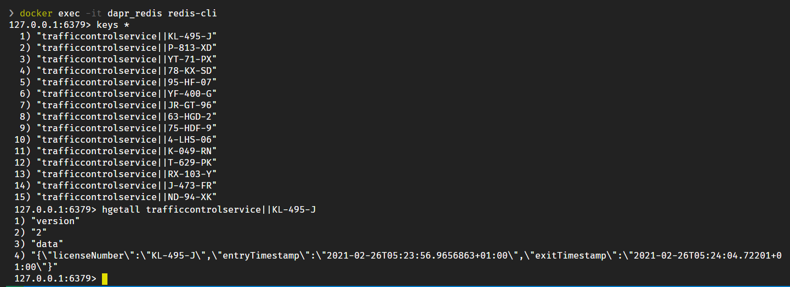
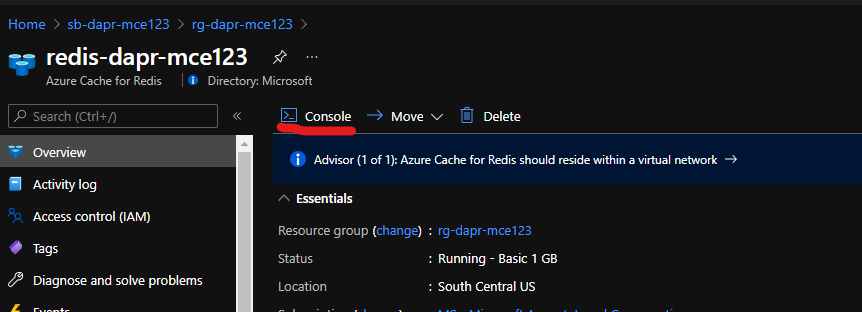
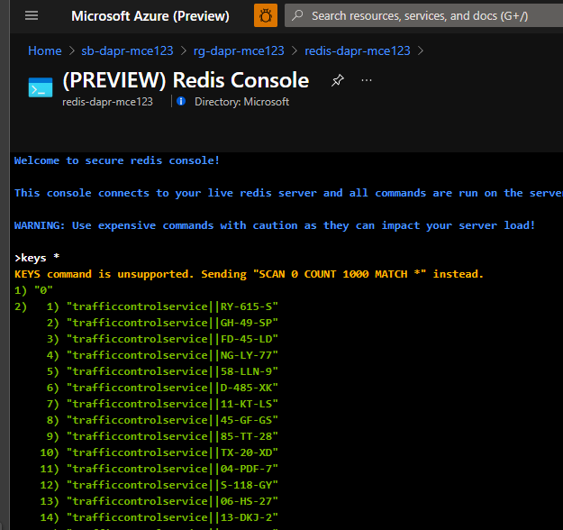

# Challenge 4 - Dapr Redis State Management - Coach's Guide

[< Previous Challenge](./Solution-03.md) - **[Home](./README.md)** - [Next Challenge>](./Solution-05.md)

## Notes & Guidance

_NOTE: This solution includes both the HTTP & .NET SDK versions of the code. You can choose to use either one._

### Step 1: Use the Dapr state management building block

First, you need to update the existing state management configuration file:

1.  Open the file `Resources/dapr/components/statestore.yaml` in VS Code.

1.  Add a `scopes` section to the configuration file that specifies that only the `TrafficControlService` can use the state management building block:

    ```yaml
    apiVersion: dapr.io/v1alpha1
    kind: Component
    metadata:
      name: statestore
    spec:
      type: state.redis
      version: v1
      metadata:
        - name: redisHost
          value: localhost:6379
        - name: redisPassword
          value: ""
    scopes:
      - traffic-control-service
    ```

Now you will add code to the `TrafficControlService` so that it uses the Dapr state management building block to store vehicle state:

1.  Open the file `Resources/TrafficControlService/Controllers/TrafficController.cs` in VS Code.

1.  Inspect the code in the `VehicleEntry` method of this controller. It uses `_vehicleStateRepository` (an injected implementation of the `IVehicleStateRepository` interface) to store vehicle state:

    ```csharp
    // store vehicle state
    var vehicleState = new VehicleState
    {
      LicenseNumber = msg.LicenseNumber,
      EntryTimestamp = msg.Timestamp
    };
    await _vehicleStateRepository.SaveVehicleStateAsync(vehicleState);
    ```

1.  Open the file `Resources/TrafficControlService/Repositories/InMemoryVehicleStateRepository.cs` in VS Code.

1.  This is the repository used by the `TrafficControlService`. Inspect the code. As you can see, it uses a simple in-memory dictionary to store the state. The license number of the vehicle is used as the key. You are going to replace this implementation with one that uses Dapr state management.

1.  Update the `DaprVehicleStateRepository` class in this file that implements the `IVehicleStateRepository` interface.

1.  The URL template for getting data using the Dapr state API is: `http://localhost:<daprPort>/v1.0/state/<statestore-name>/<key>`. You'll use this API to retrieve the VehicleState. Replace the implementation of the `GetVehicleStateAsync` method with the following code:

    ```csharp
    return await _httpClient.GetFromJsonAsync<VehicleState>(
        $"http://localhost:3600/v1.0/state/{DAPR_STORE_NAME}/{licenseNumber}");
    ```

1.  The URL template for saving data using the Dapr state API is: `http://localhost:<daprPort>/v1.0/state/<statestore-name>`. You'll use this API to store the VehicleState. In the new repository class, replace the implementation of the `SaveVehicleStateAsync` method with the following code:

    ```csharp
    var state = new[]
    {
        new {
            key = vehicleState.LicenseNumber,
            value = vehicleState
        }
    };

    await _httpClient.PostAsJsonAsync(
        $"http://localhost:3600/v1.0/state/{DAPR_STORE_NAME}",
        state);
    ```

    _As you can see, the data structure for saving state is an array of key/value pairs. In this example you use an anonymous type as payload._

1.  The code for the new repository should now look like this:

    ```csharp
    using System.Net.Http;
    using System.Net.Http.Json;
    using System.Threading.Tasks;
    using TrafficControlService.Models;

    namespace TrafficControlService.Repositories
    {
        public class DaprVehicleStateRepository : IVehicleStateRepository
        {
            private const string DAPR_STORE_NAME = "statestore";
            private readonly HttpClient _httpClient;

            public DaprVehicleStateRepository(HttpClient httpClient)
            {
                _httpClient = httpClient;
            }

            public async Task<VehicleState> GetVehicleStateAsync(string licenseNumber)
            {
                return await _httpClient.GetFromJsonAsync<VehicleState>(
                    $"http://localhost:3600/v1.0/state/{DAPR_STORE_NAME}/{licenseNumber}");
            }

            public async Task SaveVehicleStateAsync(VehicleState vehicleState)
            {
                var state = new[]
                {
                    new {
                        key = vehicleState.LicenseNumber,
                        value = vehicleState
                    }
                };

                await _httpClient.PostAsJsonAsync(
                    $"http://localhost:3600/v1.0/state/{DAPR_STORE_NAME}", state);
            }
        }
    }
    ```

Now you need to register the new repository with the .NET Core dependency-injection container.

1.  Open the file `Resources/TrafficControlService/Startup.cs`.

1.  In the `ConfigureServices` method, the old `IVehicleStateRepository` implementation is registered with dependency injection:

    ```csharp
    services.AddSingleton<IVehicleStateRepository, InMemoryVehicleStateRepository>();
    ```

1.  Replace the `InMemoryVehicleStateRepository` with your new `DaprVehicleStateRepository` concrete class:

    ```csharp
    //services.AddSingleton<IVehicleStateRepository, InMemoryVehicleStateRepository>();
    services.AddSingleton<IVehicleStateRepository, DaprVehicleStateRepository>();
    ```

1.  Open the terminal window in VS Code and make sure the current folder is `Resources/TrafficControlService`.

1.  Check that your code-changes are correct by building the code. Execute the following command in the terminal window:

    ```shell
    dotnet build
    ```

    _If you see any warnings or errors, review the previous steps to make sure the code is correct._

Now you're ready to test the application.

### Step 2a: Test the application

Now, you'll test the update by running the application from end-to-end.

1.  Make sure no services from previous tests are running (close the terminal windows)

1.  Make sure all the Docker containers introduced in the previous challenges are running (you can use the `Resources/Infrastructure/start-all.ps1` script to start them).

1.  Open a **new** terminal window in VS Code and make sure the current folder is `Resources/VehicleRegistrationService`.

1.  Enter the following command to run the `VehicleRegistrationService` with a Dapr sidecar:

    ```shell
    dapr run --app-id vehicle-registration-service --app-port 6002 --dapr-http-port 3602 --dapr-grpc-port 60002 --resources-path ../dapr/components -- dotnet run
    ```

1.  Open a **second** new terminal window in VS Code and change the current folder to `Resources/FineCollectionService`.

1.  Enter the following command to run the `FineCollectionService` with a Dapr sidecar:

    ```shell
    dapr run --app-id fine-collection-service --app-port 6001 --dapr-http-port 3601 --dapr-grpc-port 60001 --resources-path ../dapr/components -- dotnet run
    ```

1.  Open a **third** new terminal window in VS Code and change the current folder to `Resources/TrafficControlService`.

1.  Enter the following command to run the `TrafficControlService` with a Dapr sidecar:

    ```shell
    dapr run --app-id traffic-control-service --app-port 6000 --dapr-http-port 3600 --dapr-grpc-port 60000 --resources-path ../dapr/components -- dotnet run
    ```

1.  Open a **fourth** new terminal window in VS Code and change the current folder to `Resources/Simulation`.

1.  Start the simulation:

    ```shell
    dotnet run
    ```

You should see similar logging as before.

## Step 2b: Verify the state-store

The _behavior_ of the application hasn't changed. But are the VehicleState entries actually stored in the default Redis state-store? To confirm, you'll use the redis CLI inside the `dapr_redis` container that is used as the state-store in the default Dapr installation.

1.  Open a **new** terminal window in VS Code.

1.  Execute the following command to start the redis-cli inside the running `dapr_redis` container:

    ```shell
    docker exec -it dapr_redis redis-cli
    ```

    _Dapr originally installed the Redis container. Here you are hooking into the running container in interactive mode and invoking the Redis command line, redis-cli._

1.  In the redis-cli enter the following command to get the list of keys of items stored in the redis cache:

    ```shell
    keys *
    ```

    You should see a list of entries with keys with the format: `"trafficcontrolservice||<license-number>"`.

1.  Enter the following command in the redis-cli to get the data stored with this key (change the license-number to one in the list you see):

    ```shell
    hgetall trafficcontrolservice||KL-495-J
    ```

1.  You should see something similar to this:

    

As you can see, the data is actually stored in the redis cache. As you may have guessed, the Dapr state management building block supports a variety of state-stores through its component model. By specifying a different Dapr component configuration, you could use an entirely different storage mechanism. No code changes are required.

1.  Stop the running services (Ctrl+C) and close the terminal windows.

    _If you're up for it, try to swap-out Redis with another state provider. See [the list of available stores in the Dapr documentation](https://docs.dapr.io/operations/components/setup-state-store/supported-state-stores/)). To configure a different state-store, you need to change the file `Resources/dapr/components/statestore.yaml`._

## Step 3: Optional, use Dapr state management with the Dapr SDK for .NET

If you choose to do this step, you'll simplify state management with the Dapr SDK for .NET. You'll change the `DaprVehicleStateRepository`. Instead of calling the Dapr state management API directly over HTTP, you'll streamline the app using the `DaprClient` from the Dapr SDK for .NET.

1.  Open the file `Resources/TrafficControlService/Startup.cs` in VS Code.

1.  Add a `using` statement for `Dapr.Client`:

    ```csharp
    using Dapr.Client;
    ```

1.  Add the following code to the `ConfigureServices` method:

    ```csharp
    services.AddDaprClient();
    ```

1.  Open the file `Resources/TrafficControlService/Repositories/DaprVehicleStateRepository.cs` in VS Code.

1.  Add a `using` statement for `Dapr.Client`.

    ```csharp
    using Dapr.Client;
    ```

1.  Change all occurrences of `HttpClient` to `DaprClient` and rename the private field `_httpClient` to `_daprClient`.

1.  Replace the implementation of the `GetVehicleStateAsync` method with the following code:

    ```csharp
    return await _daprClient.GetStateAsync<VehicleState>(
        DAPR_STORE_NAME, licenseNumber);
    ```

1.  Replace the implementation of the `SaveVehicleStateAsync` method with the following code:

    ```csharp
    await _daprClient.SaveStateAsync(
        DAPR_STORE_NAME, vehicleState.LicenseNumber, vehicleState);
    ```

1.  The repository code should now look like this:

    ```csharp
    using System.Threading.Tasks;
    using Dapr.Client;
    using TrafficControlService.Models;

    namespace TrafficControlService.Repositories
    {
        public class DaprVehicleStateRepository : IVehicleStateRepository
        {
            private const string DAPR_STORE_NAME = "statestore";
            private readonly DaprClient _daprClient;

            public DaprVehicleStateRepository(DaprClient daprClient)
            {
                _daprClient = daprClient;
            }

            public async Task<VehicleState> GetVehicleStateAsync(string licenseNumber)
            {
                return await _daprClient.GetStateAsync<VehicleState>(
                    DAPR_STORE_NAME, licenseNumber);
            }

            public async Task SaveVehicleStateAsync(VehicleState vehicleState)
            {
                await _daprClient.SaveStateAsync(
                    DAPR_STORE_NAME, vehicleState.LicenseNumber, vehicleState);
            }
        }
    }
    ```

1.  Open the terminal window in VS Code and make sure the current folder is `Resources/TrafficControlService`.

1.  Check all your code-changes are correct by building the code. Execute the following command in the terminal window:

    ```shell
    dotnet build
    ```

    _If you see any warnings or errors, review the previous steps to make sure the code is correct._

Now you're ready to test the application. Just repeat steps 2a and 2b.

### Step 4: Use Azure Cache for Redis as state store

Now, you can also use Azure Cache for Redis instead of the default state store. This will require no code changes, similar to how replacing _RabbitMQ_ with Azure Service Bus in challenge 3 required no code changes either.

1.  Update the `Resources/dapr/components/statestore.yaml` file with the key/value pairs for your Azure Redis Cache instance. You can find these on the Overview blade of your Azure Redis Cache instance. Make sure you add the **6380** port number after the host URI.

    **Example:**

    ```yaml
    apiVersion: dapr.io/v1alpha1
    kind: Component
    metadata:
      name: statestore
    spec:
      type: state.redis
      version: v1
      metadata:
        - name: redisHost
          value: redis-dapr-ussc-demo.redis.cache.windows.net:6380
        - name: redisPassword
          value: qu4qw8bFakeKey7KVrBYFFakeKey+v3raFBNA3M=
        - name: enableTLS
          value: true
    scopes:
      - traffic-control-service
    ```

    _You can also obtain the Azure Redis Cache instance details using AZ CLI:_

    Host name and port:

    ```shell
    az redis show --name <redis cache name> -g <resource group> --query "[hostName,sslPort]"
    ```

    Redis password:

    ```shell
    az redis list-keys --name redis-dapr-mce123 -g rg-dapr-mce123 --query "primaryKey" -o tsv
    ```

    Now you're ready to test the application that is now using Azure Redis Cache. Just repeat steps 2a and 2b.

1.  You can now go on the Azure Portal and see that the key/value pairs are now stored in Azure Redis Cache:

    On the portal, select the Redis Cache resource and click on "Console"

    

    You should see the keys stored in Azure Redis Cache:

    
