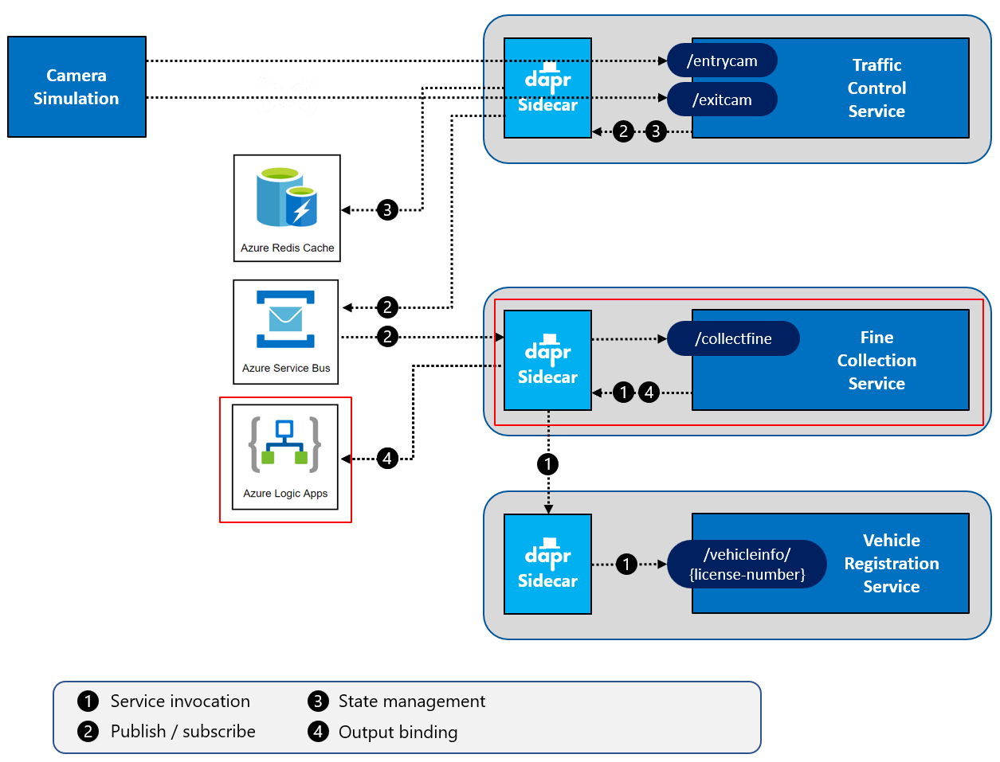

# Challenge 5 - Dapr SMTP Output binding - Coach's Guide

[< Previous Challenge](./Solution-04.md) - **[Home](./README.md)** - [Next Challenge>](./Solution-06.md)

## Notes & Guidance

In this challenge, you will use the open-source [MailDev](https://github.com/maildev/maildev) component, running inside in a container, as your SMTP server. This is a development SMTP server that doesn't actually send out emails (by default), but collects them and shows them in a built-in inbox. The tool extremely handy for test or demo scenarios. You will run this server as a Docker container.


Then you will repoint the output bindings to an Azure Logic App that will send out the emails.

### Step 1: Run the SMTP server

Start by running the SMTP server:

1.  Open the terminal window in VS Code.

1.  Start a MailDev SMTP server by entering the following command:

    ```shell
    docker run -d -p 4000:1080 -p 4025:1025 --name dtc-maildev maildev/maildev:latest
    ```

This will pull the docker image `maildev/maildev:latest` from Docker Hub and start it. The name of the container will be `dtc-maildev`. The server will be listening for connections on port `4025` for SMTP traffic and port `4000` for HTTP traffic. This last port is where the inbox web app will run for inspecting the emails.

If everything goes well, you should see some output like this:


> If you see any errors, make sure you have access to the Internet and are able to download images from Docker Hub. See [Docker Hub](https://hub.docker.com/) for more info.

The container will keep running in the background. If you want to stop it, enter the following command:

```shell
docker stop dtc-maildev
```

You can then start the container later by entering the following command:

```shell
docker start dtc-maildev
```

When you are done with the class, you can remove it by entering the following command:

```shell
docker rm dtc-maildev -f
```

Keep in mind that once you remove, it's gone. You'll need to start it again with the `docker run` command shown at the beginning of this step.

_For your convenience, the `Resources/Infrastructure` folder contains PowerShell scripts for starting the infrastructural components you'll use throughout the WhatTheHack. You can use the `Resources/Infrastructure/maildev/start-maildev.ps1` script to start the MailDev container._

_You can also start all the infrastructure containers at once (also for challenges to come) with the `Resources/Infrastructure/start-all.ps1` script._

## Step 2: Use the Dapr output binding in the `FineCollectionService`

You will enhance the `FineCollectionService` so that it uses the Dapr SMTP output binding to send fine notice emails to those driving at excessive speeds:


1.  Open the file `Resources/FineCollectionService/Controllers/CollectionController.cs` in VS Code.

1.  Inspect the code of the `CollectFine` method. There's a TODO comment at the end of the class. You'll add code to complete this TODO.

1.  Add a `using` statement in the `CollectionController` file so you can use the Dapr client:

    ```csharp
    using Dapr.Client;
    ```

1.  Add an argument named `daprClient` of type `DaprClient` that is decorated with the `[FromServices]` attribute to the `CollectFine` method :

    ```csharp
    public async Task<ActionResult> CollectFine(SpeedingViolation speedingViolation, [FromServices] DaprClient daprClient)
    ```

1.  Start by creating an email message body. It contains the details of the speeding violation and the fine. The service already has a helper method (the `../Helpers/EmailUtils` class)to create an HTML email body. Replace the `// TODO` in the `CollectFine` method with this code:

    ```csharp
    var body = EmailUtils.CreateEmailBody(speedingViolation, vehicleInfo, fineString);
    ```

1.  You'll also specify the sender, recipient, and subject of the email. With Dapr bindings, you specify these fields using a dictionary containing `metadata`. Add the following code right after the creation of the body:

    ```csharp
    var metadata = new Dictionary<string, string>
    {
        ["emailFrom"] = "noreply@cfca.gov",
        ["emailTo"] = vehicleInfo.OwnerEmail,
        ["subject"] = $"Speeding violation on the {speedingViolation.RoadId}"
    };
    ```

1.  Now you have everything you need to call the SMTP server using the Dapr output binding. Add the following code right after the creation of the metadata:

    ```csharp
    await daprClient.InvokeBindingAsync("sendmail", "create", body, metadata);
    ```

    _The first two parameters passed into `InvokeBindingAsync` are the name of the binding to use and the operation (in this case 'create' the email)._

1.  This method uses the `[FromServices]` attribute to inject the `DaprClient` class. You'll need to register `DaprClient` with the dependency injection container. Open the file `Resources/FineCollectionService/Startup.cs`. Add the following `using` statement to the file:

    ```csharp
    using System;
    ```

1.  Add the following code to the `ConfigureServices` method (just above the code to register the `VehicleRegistrationService` proxy) to register DaprClient:

    ```csharp
    services.AddDaprClient(builder => builder
        .UseHttpEndpoint($"http://localhost:3601")
        .UseGrpcEndpoint($"http://localhost:60001"));
    ```

1.  Go back to the terminal window in VS Code and make sure the current folder is `Resources/FineCollectionService`.

1.  Check that your code-changes are correct by building the code. Execute the following command in the terminal window:

    ```shell
    dotnet build
    ```

    If you see any warnings or errors, review the previous steps to make sure the code is correct

That's it! That's all the code you need to send an email over SMTP.

## Step 3: Configure the output binding

In this step you will add a Dapr binding component configuration file to connect to the SMTP server container you created in step 1. You'll add the file to the custom components folder you created in challenge 3.

1.  Add a new file in the `Resources/dapr/components` folder named `email.yaml`.

1.  Open this file in VS Code.

1.  Paste this snippet into the file:

    ```yaml
    apiVersion: dapr.io/v1alpha1
    kind: Component
    metadata:
      name: sendmail
    spec:
      type: bindings.smtp
      version: v1
      metadata:
        - name: host
          value: localhost
        - name: port
          value: 4025
        - name: user
          value: "_username"
        - name: password
          value: "_password"
        - name: skipTLSVerify
          value: true
    scopes:
      - finecollectionservice
    ```

As you can see, you specify the binding type (`bindings.smtp`) and describe how to connect to it in the `metadata` section. For now, you'll run on localhost on port `4025`. The other metadata can be ignored.

It's important to note the `name` of the binding. This name must be the same as that used in the call to the bindings API from step 2:

```csharp
daprClient.InvokeBindingAsync("sendmail", "create", body, metadata);
```

## Step 4: Test the application

You're going to start all the services now. Like before, you'll specify the custom components folder you've created using the `--components-path` flag:

1.  Make sure no services from previous tests are running (close the terminal windows)

1.  Make sure all the Docker containers introduced in the previous challenges are running (you can use the `Resources/Infrastructure/start-all.ps1` script to start them).

1.  Open a **new** terminal window in VS Code and make sure the current folder is `Resources/VehicleRegistrationService`.

1.  Enter the following command to run the `VehicleRegistrationService` with a Dapr sidecar:

    ```shell
    dapr run --app-id vehicleregistrationservice --app-port 6002 --dapr-http-port 3602 --dapr-grpc-port 60002 --components-path ../dapr/components dotnet run
    ```

1.  Open a **second** new terminal window in VS Code and change the current folder to `Resources/FineCollectionService`.

1.  Enter the following command to run the `FineCollectionService` with a Dapr sidecar:

    ```shell
    dapr run --app-id finecollectionservice --app-port 6001 --dapr-http-port 3601 --dapr-grpc-port 60001 --components-path ../dapr/components dotnet run
    ```

1.  Open a **third** new terminal window in VS Code and change the current folder to `Resources/TrafficControlService`.

1.  Enter the following command to run the TrafficControlService with a Dapr sidecar:

    ```shell
    dapr run --app-id trafficcontrolservice --app-port 6000 --dapr-http-port 3600 --dapr-grpc-port 60000 --components-path ../dapr/components dotnet run
    ```

1.  Open a **fourth** new terminal window in VS Code and change the current folder to `Resources/Simulation`.

1.  Start the simulation:

    ```shell
    dotnet run
    ```

You should see the same logs as before. You can also view the fine notification emails sent by the `FineCollectionService`:

1.  Open a browser and browse to [http://localhost:4000](http://localhost:4000).
1.  Wait for the first emails to come in.
1.  Click on an email in the inbox to see its content:

    

## Step 5: Use an Azure Logic App to send email



1. Open the Logic App that is deployed to your Azure Resource Group. You will need to initialize the Office 365 connector and copy the HTTP trigger endpoint.

   1. Click on the **Logic app designer** blade
   1. Click on the **Send an email (V2)** step and click **Create**. You will have to sign-in with your Office 365-enabled ID.
   1. Click on the **When a HTTP request is received** step and copy the **HTTP POST URL**. This is the endpoint the Dapr output binding will call to send an email.

1. Update the `Resources/dapr/components/email.yaml` file to use the Azure Logic App to send email. You will change the bindings from SMTP to HTTP and fill in the HTTP endpoint for the Logic App in Azure.

   **Example:**

   ```yaml
   apiVersion: dapr.io/v1alpha1
   kind: Component
   metadata:
     name: sendmail
   spec:
     type: bindings.http
     version: v1
     metadata:
       - name: url
         value: https://prod-18.southcentralus.logic.azure.com:443/workflows/e76d81048c3941f18638ab0055bba68a/triggers/manual/paths/invoke?api-version=2016-10-01&sp=%2Ftriggers%2Fmanual%2Frun&sv=1.0&sig=8z3TLKcgFakekeyf9HY_3pkViSk6fFR2m-db-BWobZFw
   scopes:
     - finecollectionservice
   ```

1. Add the package to your project.

   ```shell
   dotnet add package Newtonsoft.Json
   ```

1. Navigate to the `Resources/FineCollectionService` directory. Open the `Resources\FineCollectionService\Controllers\CollectionController.cs` file. Modify the **CollectFine** method to pass in a JSON object to the Logic App's HTTP endpoint.

   Add the following to the using statements at the top of the file.

   ```csharp
   using Newtonsoft.Json.Linq;
   ```

   Replace the line that starts with `var metadata = new Dictionary<string, string>` with the following.

   ```csharp
   dynamic email = new JObject();
   email.from = "noreply@cfca.gov";
   email.to = "<YOUR_EMAIL_ADDRESS_HERE>";
   email.subject = $"Speeding violation on the {speedingViolation.RoadId}";
   email.body = body;

   var jsonString = Newtonsoft.Json.JsonConvert.SerializeObject(email);

   await daprClient.InvokeBindingAsync("sendmail", "create", jsonString);
   ```

1. Rebuild your `FineCollectionService`.

   ```shell
   dotnet build
   ```

1. Re-run all services and the simulation application. You should begin to see emails in your inbox for speeding violations.
