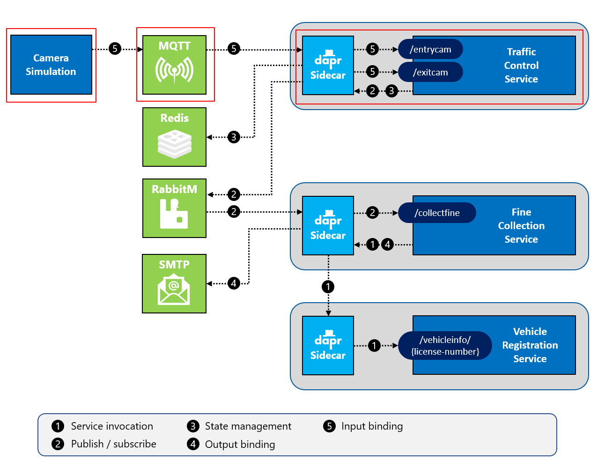
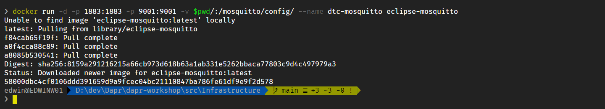
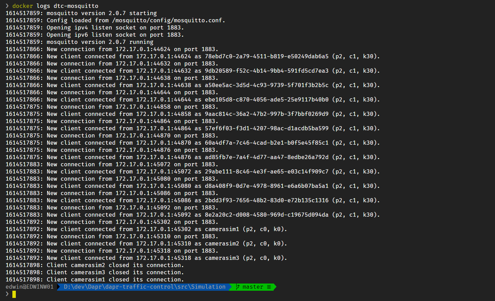
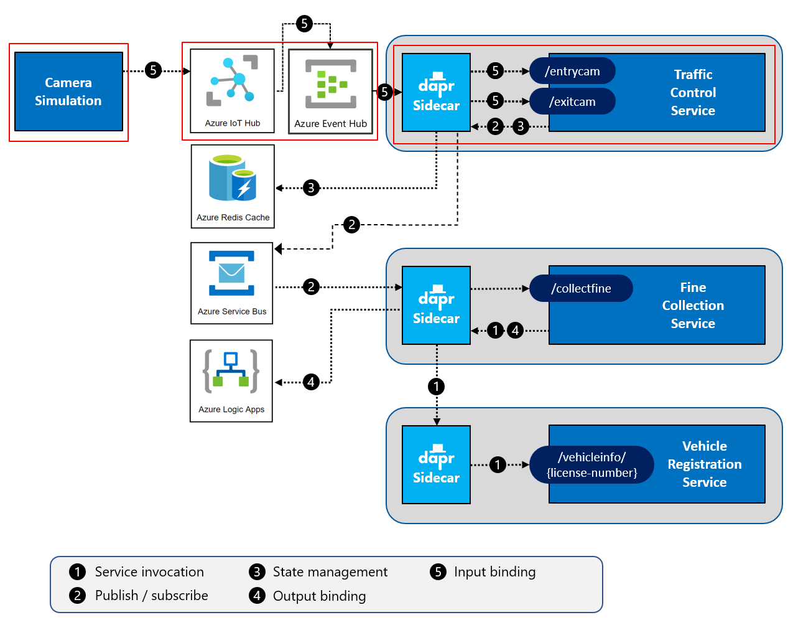

# Challenge 6 - Dapr MQTT Input Binding - Coach's Guide

[< Previous Challenge](./Solution-05.md) - **[Home](./README.md)** - [Next Challenge>](./Solution-07.md)

## Notes & Guidance

> Prior to running this challenge, please ensure the SMTP settings have been reverted to using Mail Dev to prevent the student from receiving hundreds of emails.  

You will add code to the `TrafficControlService` to leverage a Dapr input binding to send entry-cam and exit-cam messages. The following diagram depicts the scenario:



### Step 1: Use the Dapr input binding in the `TrafficControlService`

Start by inspecting vehicle entry and exit methods:

1.  Open the file `Resources/TrafficControlService/Controllers/TrafficController.cs` in VS Code.

1.  Inspect the `VehicleEntry` and `VehicleExit` methods.

And you're done! That's right, you don't need to change anything in order to use an input binding. The binding will invoke the web API operations across the `TrafficControlService` based on the binding name specified in the component configuration. The `TrafficControlService` will have no knowledge of Dapr binding. It's just another HTTP call.

### Step 2: Run the Mosquitto MQTT broker

You'll use [Mosquitto](https://mosquitto.org/), a lightweight MQTT broker, as the MQTT broker between the `Simulation` and `TrafficControlService`. You'll run Mosquitto from a Docker container.

In order to connect to Mosquitto, you need to pass in a custom configuration file when starting it. With Docker, you can pass a configuration file when starting a container using a _Volume mount_. The folder `Resources/Infrastructure/mosquitto` already contains a config file you can use.

1.  Open the terminal window in VS Code and make sure the current folder is `Resources/Infrastructure/mosquitto`.

1.  Start a Mosquitto MQTT container by entering the following command:
    **When running on Windows**:

    ```shell
    docker run -d -p 1883:1883 -p 9001:9001 -v $pwd/:/mosquitto/config/ --name dtc-mosquitto eclipse-mosquitto
    ```

    **When running on Mac or Linux**:

    ```shell
    docker run -d -p 1883:1883 -p 9001:9001 -v $(pwd)/:/mosquitto/config/ --name dtc-mosquitto eclipse-mosquitto
    ```

This will pull the docker image `eclipse-mosquitto` from Docker Hub and start it. The name of the container will be `dtc-mosquitto`. The server will be listening for connections on port `1883` for MQTT traffic.

The `-v` flag specifies a Docker volume mount. It mounts the current folder (containing the config file) as the `/mosquitto/config/` folder in the container. Mosquitto reads its config file from that folder.

If everything goes well, you should see some output like this:



_If you see any errors, make sure you have access to the Internet and are able to download images from Docker Hub. See [Docker Hub](https://hub.docker.com/) for more info._

The container will keep running in the background. If you want to stop it, enter the following command:

```shell
docker stop dtc-mosquitto
```

You can then start the container later by entering the following command:

```shell
docker start dtc-mosquitto
```

When you are done with the class, you can remove it by entering the following command:

```shell
docker rm dtc-mosquitto -f
```

Keep in mind that once you remove, it's gone. You'll need to start it again with the `docker run` command shown at the beginning of this step.

_For your convenience, the `Resources/Infrastructure` folder contains PowerShell scripts for starting the infrastructural components you'll use throughout the WhatTheHack. You can use the `Resources/Infrastructure/maildev/start-maildev.ps1` script to start the MailDev container._

_You can also start all the infrastructure containers at once (also for challenges to come) with the `Resources/Infrastructure/start-all.ps1` script._

### Step 3: Configure the input binding

In this step you will add two Dapr binding component configuration files to the custom components folder you created in challenge 3.

First, create an input binding for the `/entrycam` operation:

1.  Add a new file in the `Resources/dapr/components` folder named `entrycam.yaml`.

1.  Open the file in VS Code.

1.  Paste this snippet into the file:

    ```yaml
    apiVersion: dapr.io/v1alpha1
    kind: Component
    metadata:
      name: entrycam
    spec:
      type: bindings.mqtt
      version: v1
      metadata:
        - name: url
          value: mqtt://localhost:1883
        - name: topic
          value: trafficcontrol/entrycam
        - name: consumerID
          value: trafficcontrolservice-entrycam
    scopes:
      - traffic-control-service
    ```

    In this configuration file, you specify the binding type MQTT (`bindings.mqtt`). In the `metadata` section, you describe how to connect to Mosquitto server container running on `localhost` on port `1883` . Note also how the `topic` is configured in metadata: `trafficcontrol/entrycam`. In the `scopes` section, you specify that only the `TrafficControlService` should subscribe to the MQTT topic.

It's important to note the `name` of the binding. This name must be the same as that in the web API URL that'll be invoked on your service. In this example, it's `/entrycam`.

Next, create an input binding for the `/exitcam` operation:

1.  Add a new file in the `Resources/dapr/components` folder named `exitcam.yaml`.

1.  Open this file in VS Code.

1.  Paste this snippet into the file:

    ```yaml
    apiVersion: dapr.io/v1alpha1
    kind: Component
    metadata:
      name: exitcam
    spec:
      type: bindings.mqtt
      version: v1
      metadata:
        - name: url
          value: mqtt://localhost:1883
        - name: topic
          value: trafficcontrol/exitcam
        - name: consumerID
          value: trafficcontrolservice-exitcam
    scopes:
      - traffic-control-service
    ```

Now with input bindings configured, it's time to change the Camera Simulation so it'll send MQTT messages to Mosquitto.

### Step 4: Send MQTT messages from the Camera Simulation

In this step, you'll change the Camera Simulation so it sends MQTT messages instead of HTTP requests:

1.  Open the terminal window in VS Code and make sure the current folder is `Resources/Simulation`.

1.  Open the file `Resources/Simulation/CameraSimulation.cs` file in VS Code.

1.  Inspect the code in this file.

As you can see, the simulation receives an `ITrafficControlService` instance injected into its constructor. The simulation uses this proxy (i.e., helper class) to send entry-cam and exit-cam messages to the `TrafficControlService`.

1.  Open the file `Resources/Simulation/Proxies/HttpTrafficControlService.cs` in VS Code and inspect the code.

The proxy uses HTTP to send the message to the `TrafficControlService`. You will replace this now with an implementation that uses MQTT:

1.  Add a new file in the `Resources/Simulation/Proxies` folder named `MqttTrafficControlService.cs`.

1.  Paste the following code into this file:

    ```csharp
    using System.Net.Mqtt;
    using System.Text.Json;
    using Simulation.Events;
    using System.Text;
    using System.Threading.Tasks;

    namespace Simulation.Proxies
    {
      public class MqttTrafficControlService : ITrafficControlService
      {
        private IMqttClient _mqttClient;
        public MqttTrafficControlService(int cameraNumber)
        {
          var configuration = new MqttConfiguration()
          {
            KeepAliveSecs = 60,
            Port = 1883
          };

          _mqttClient = MqttClient.CreateAsync("localhost", configuration).Result;
          _mqttClient.ConnectAsync().Wait();
        }

        public async Task SendVehicleEntryAsync(VehicleRegistered vehicleRegistered)
        {
          var eventJson = JsonSerializer.Serialize(vehicleRegistered);
          var message = new MqttApplicationMessage("trafficcontrol/entrycam", Encoding.UTF8.GetBytes(eventJson));
          await _mqttClient.PublishAsync(message, MqttQualityOfService.AtLeastOnce);
        }

        public async Task SendVehicleExitAsync(VehicleRegistered vehicleRegistered)
        {
          var eventJson = JsonSerializer.Serialize(vehicleRegistered);
          var message = new MqttApplicationMessage("trafficcontrol/exitcam", Encoding.UTF8.GetBytes(eventJson));
          await _mqttClient.PublishAsync(message, MqttQualityOfService.AtLeastOnce);
        }
      }
    }
    ```

1.  Inspect the new code.

It now uses the `System.Net.Mqtt` library to connect and send messages to the MQTT broker.

It's time to wire up the new MQTT proxy to the Simulation service and remove the older HTTP implementation:

1.  Open the file `Resources/Simulation/Program.cs` in VS Code.

1.  Remove the first line of the `Main` method where an instance of the `HttpClient` instance is created.

1.  Replace the creation of a `HttpTrafficControlService` instance with the creation of a `MqttTrafficControlService` instance:

    ```csharp
    var trafficControlService = new MqttTrafficControlService(camNumber);
    ```

1.  Open the terminal window in VS Code and make sure the current folder is `Resources/Simulation`.

1.  Check all your code changes are correct by building the code. Execute the following command in the terminal window:

    ```shell
    dotnet build
    ```

If you see any warnings or errors, review the previous steps to make sure the code is correct.

Now you're ready to test the application.

### Step 5: Test the application

You're going to start all the services now. You specify the custom components folder you've created on the command-line using the `--resources-path` flag. By doing so, Dapr will use the configuration files inside the folder:

1.  Make sure no services from previous tests are running (close the terminal windows).

1.  Make sure all the Docker containers introduced in the previous challenges are running (you can use the `Resources/Infrastructure/start-all.ps1` script to start them).

1.  Open a **new** terminal window in VS Code and make sure the current folder is `Resources/VehicleRegistrationService`.

1.  Enter the following command to run the `VehicleRegistrationService` with a Dapr sidecar:

    ```shell
    dapr run --app-id vehicle-registration-service --app-port 6002 --dapr-http-port 3602 --dapr-grpc-port 60002 --resources-path ../dapr/components -- dotnet run
    ```

1.  Open a **second** new terminal window in VS Code and change the current folder to `Resources/FineCollectionService`.

1.  Enter the following command to run the `FineCollectionService` with a Dapr sidecar:

    ```shell
    dapr run --app-id fine-collection-service --app-port 6001 --dapr-http-port 3601 --dapr-grpc-port 60001 --resources-path ../dapr/components -- dotnet run
    ```

1.  Open a **third** new terminal window in VS Code and change the current folder to `Resources/TrafficControlService`.

1.  Enter the following command to run the `TrafficControlService` with a Dapr sidecar:

    ```shell
    dapr run --app-id traffic-control-service --app-port 6000 --dapr-http-port 3600 --dapr-grpc-port 60000 --resources-path ../dapr/components -- dotnet run
    ```

1.  Open a **fourth** new terminal window in VS Code and change the current folder to `Resources/Simulation`.

1.  Start the simulation:

    ```shell
    dotnet run
    ```

You should see the same logs as before.

To peak into the Mosquitto server, open a **new** terminal window and execute the following command:

```shell
docker logs dtc-mosquitto
```

You will connect to the server and see its logs:



**Stop all services before continuing.**

## Use Azure IoT Hub & EventHub



Azure IoT Hub can be set up as a [MQTT queue](https://docs.microsoft.com/en-us/azure/iot-hub/iot-hub-mqtt-support). However, to set up the input bindings, you will need to also stand up an Azure Event Hub to proxy the messages to your `TrafficControlService`.

1.  Run the following code to provision an IoT device identity to represent your simulation application as it writes to the IoT Hub. Change the "hub-name" to your IoT hub name

    ```shell
    az iot hub device-identity create --device-id simulation --hub-name <iot-hub-name>
    ```

1.  Get the connection string for this device.

    ```shell
    az iot hub device-identity connection-string show --device-id simulation --hub-name <iot-hub-name>
    ```

1.  Update the implementation of the `Resources/Simulation/Proxies/IotHubTrafficControlService.cs` class with similar code to below.

    ```csharp
    using Microsoft.Azure.Devices.Client;
    using System.Text;
    using System.Text.Json;
    using Simulation.Events;
    using System.Threading.Tasks;

    namespace Simulation.Proxies
    {
      public class IotHubTrafficControlService : ITrafficControlService
      {
        private readonly DeviceClient _client;

        public IotHubTrafficControlService(int camNumber)
        {
            _client = DeviceClient.CreateFromConnectionString("HostName=iothub-dapr-ussc-demo.azure-devices.net;DeviceId=simulation;SharedAccessKey=/cRA4cYbcyC7FakekeyNV6CrfugBe8Ka2z2m8=", TransportType.Mqtt);
        }

        public async Task SendVehicleEntryAsync(VehicleRegistered vehicleRegistered)
        {
          var eventJson = JsonSerializer.Serialize(vehicleRegistered);
          var message = new Message(Encoding.UTF8.GetBytes(eventJson));
          message.Properties.Add("trafficcontrol", "entrycam");
          await _client.SendEventAsync(message);
        }

        public async Task SendVehicleExitAsync(VehicleRegistered vehicleRegistered)
        {
          var eventJson = JsonSerializer.Serialize(vehicleRegistered);
          var message = new Message(Encoding.UTF8.GetBytes(eventJson));
          message.Properties.Add("trafficcontrol", "exitcam");
          await _client.SendEventAsync(message);
        }
      }
    }
    ```

1.  Update the `Resources/Simulation/Program.cs` file to use the new `IotHubTrafficControlService` class.

    ```csharp
    var trafficControlService = new IotHubTrafficControlService(camNumber);
    ```

1.  Get the connection strings for your event hubs (one for the `entrycam` EventHub & one for the `exitcam` Event Hub). Customize for your deployment.

    ```shell
    az eventhubs eventhub authorization-rule keys list --eventhub-name entrycam --namespace-name <event-hub-namespace> --resource-group <resource-group-name> --name listen --query primaryConnectionString

    az eventhubs eventhub authorization-rule keys list --eventhub-name exitcam --namespace-name <event-hub-namespace> --resource-group <resource-group-name> --name listen --query primaryConnectionString
    ```

1.  Get the storage account key for your storage account. Customize for your deployment

    ```shell
    az storage account keys list --account-name <storage-account-name> --resource-group <resource-group-name> --query [0].value
    ```

1.  Replace the implementation of the `Resources/dapr/components/entrycam.yaml` file with code similar to below.

    ```yaml
    apiVersion: dapr.io/v1alpha1
    kind: Component
    metadata:
      name: entrycam
    spec:
      type: bindings.azure.eventhubs
      version: v1
      metadata:
        - name: connectionString
          value: "Endpoint=sb://ehn-dapr-ussc-demo-trafficcontrol.servicebus.windows.net/;SharedAccessKeyName=listen;SharedAccessKey=IQrpNCFakekeykn5xkSVyn5y4uZCGerc=;EntityPath=entrycam"
        - name: consumerGroup
          value: "trafficcontrolservice"
        - name: storageAccountName
          value: "sadaprusscdemo"
        - name: storageAccountKey
          value: "IKJgQ4KAFakekeyhAmi4zSz2ehm1btpQXZ+l68ol7wJmg8TA0ClQChRK7sWnvMEVexgg=="
        - name: storageContainerName
          value: "trafficcontrol-entrycam"
    scopes:
      - traffic-control-service
    ```

1.  Replace the implementation of the `Resources/dapr/components/exitcam.yaml` file with code similar to above, making sure to replace the `connectionString` & `storageContainerName` with the appropriate ones for `exitcam`.

1.  Re-run all the services.

1.  Re-run the Simulation application.

## Troubleshooting

Make sure the `app-id` and scopes in the Dapr configuration and command line are all lower-case. Input bindings especially don't seem to support CamelCase.

Getting the input binding to the local MQTT queue is finicky.

Run dapr in debug logging mode to see more errors (note the `--log-level debug` flag):

```shell
dapr run --log-level debug --app-id traffic-control-service --app-port 6000 --dapr-http-port 3600 --dapr-grpc-port 60000 --resources-path ../dapr/components -- dotnet run
```

Error:

```shell
time="2022-10-12T16:44:02.462071-05:00" level=error msg="error reading from input binding entrycam: not currently connected and ResumeSubs not set" app_id=traffic-control-service
```
