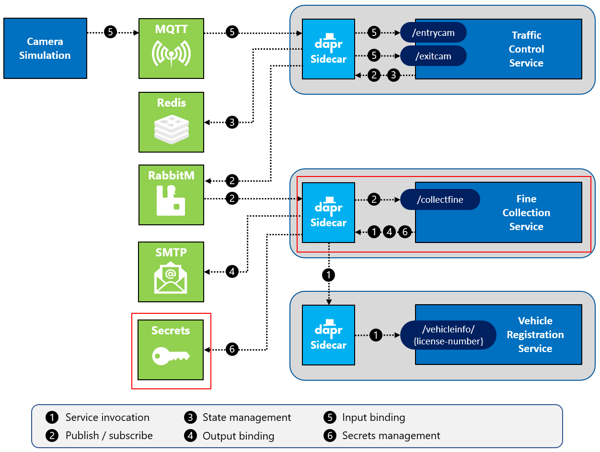
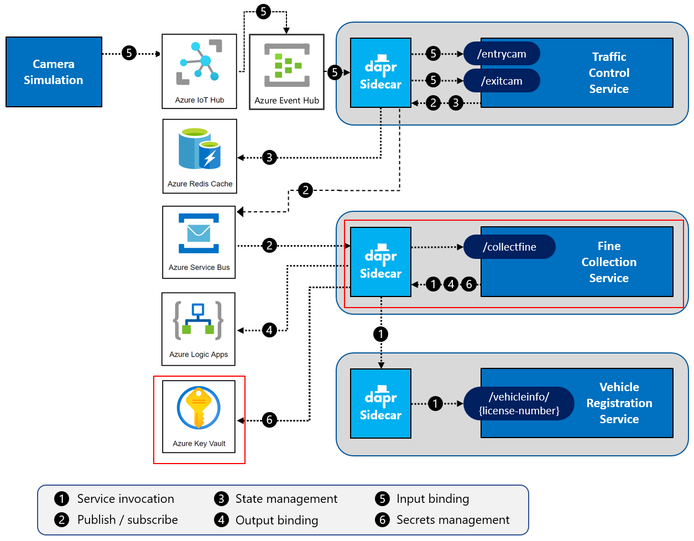

# Challenge 7 - Dapr Secrets Management - Coach's Guide

[< Previous Challenge](./Solution-06.md) - **[Home](./README.md)** - [Next Challenge>](./Solution-08.md)

## Notes & Guidance

This challenge will add the Dapr secrets building block to the `TrafficControlService`. The following figure depicts the enhancement:



### Step 1: Add a secret store component

First, you'll add a secrets management JSON configuration file to the solution:

1.  Add a new file in the `Resources/dapr/components` folder named `secrets.json`.

1.  Open this file in VS Code. The file will hold the secrets used in the application.

1.  Paste the following snippet into the file:

    ```json
    {
      "smtp":
      {        
        "user": "_username",
        "password": "_password"
      },
      "finecalculator":
      {
        "licensekey": "HX783-K2L7V-CRJ4A-5PN1G"
      }
    }
    ```

1.  Add a new file in the `Resources/dapr/components` folder named `secrets-file.yaml`.

1.  Open this file in VS Code.

1.  Paste the following snippet into the file:

    ```yaml
    apiVersion: dapr.io/v1alpha1
    kind: Component
    metadata:
      name: trafficcontrol-secrets
    spec:
      type: secretstores.local.file
      version: v1
      metadata:
      - name: secretsFile
        value: ../dapr/components/secrets.json
      - name: nestedSeparator
        value: "."
    scopes:
      - finecollectionservice   
    ```

    *Note the `type` element: The `local.file` secret store is specified. This file-based local secret store component is **only** for development or testing purposes. It's not suitable for production!*

    *Understand that if you specify a relative path to the `secretsFile` (as is the case here), this path must be specified relative to the folder where you start your service using the Dapr CLI. Because you start the services from their project folders, the relative path to the components folder is always `../dapr/components`.*

The `nestedSeparator` in the `metadata` section specifies the character that Dapr will use when it flattens the secret file's hierarchy. Each secret will be uniquely identifiable by one key. In this case, you're using the period (`.`) as that character. The convention means that secrets from the `secrets.json` file will be identified by the following keys:

- `smtp.user`
- `smtp.password`
- `finecalculator.licensekey`

Now you've configured the secrets management building block. Time to use the secrets.

### Step 2: Get the credentials for connecting to the SMTP server

As stated, you can reference secrets from other Dapr component configuration files.

1.  Open the file `Resources/dapr/components/email.yaml` in VS Code.

1.  Inspect the contents of the file. As you can see, it contains clear-text credentials (username and password). Replace the `user` and `password` fields in the `metadata` element. Provide secret references by adding references to the secrets management building block named `trafficcontrol-secrets`, configured in step 1. The resulting file should look like this:

    ```yaml
    apiVersion: dapr.io/v1alpha1
    kind: Component
    metadata:
      name: sendmail
    spec:
      type: bindings.smtp
      version: v1
      metadata:
      - name: host
        value: localhost
      - name: port
        value: 4025
      - name: user
        secretKeyRef:
          name: smtp.user
          key: smtp.user
      - name: password
        secretKeyRef:
          name: smtp.password
          key: smtp.password
      - name: skipTLSVerify
        value: true
    auth:
      secretStore: trafficcontrol-secrets
    scopes:
      - finecollectionservice  
    ```

Now the output binding for the SendMail component will use the `smtp.user` and `smtp.password` secrets from the secrets file at runtime.

### Step 3: Get the license key for the FineCalculator component

The `CollectionController` of the `FineCollectionService` uses an `IFineCalculator` implementation to calculate the fine for a certain speeding violation (check out the code). The calculator used is the `Resources/FineCollectionService/DomainServices/HardCodedFineCalculator.cs`. To demonstrate retrieving secrets, this calculator component expects a license key (also hard-coded, remember this is a sample application!).

You will now change the controller so it retrieves the license key from the Dapr secrets management building block:

1.  Open the file `Resources/FineCollectionService/Controllers/CollectionController.cs` in VS Code.

1.  Add a parameter named `daprClient` of type `DaprClient` to the constructor.

1.  Replace the line where the `_fineCalculatorLicenseKey` is set to a hard-coded value with the following code:

    ```csharp
    var secrets = daprClient.GetSecretAsync(
      "trafficcontrol-secrets", "finecalculator.licensekey").Result;
    _fineCalculatorLicenseKey = secrets["finecalculator.licensekey"];
    ```

    *Because the `_fineCalculatorLicenseKey` field is static, this code will execute only once. This is not a best practice, but fine for this sample app.*

1.  Go back to the terminal window in VS Code and make sure the current folder is `Resources/FineCollectionService`.

1.  Check all your code-changes are correct by building the code. Execute the following command in the terminal window:

    ```shell
    dotnet build
    ```

    *If you see any warnings or errors, review the previous steps to make sure the code is correct.*

Now you're ready to test the application.

### Step 4: Test the application

You're going to start all the services now. You specify the custom components folder you've created on the command-line using the `--components-path` flag so Dapr will use these config files:

1.  Make sure no services from previous tests are running (close the terminal windows).

1.  Make sure all the Docker containers introduced in the previous challenges are running (you can use the `Resources/Infrastructure/start-all.ps1` script to start them).

1.  Open a **new** terminal window in VS Code and make sure the current folder is `Resources/VehicleRegistrationService`.

1.  Enter the following command to run the `VehicleRegistrationService` with a Dapr sidecar:

    ```shell
    dapr run --app-id vehicleregistrationservice --app-port 6002 --dapr-http-port 3602 --dapr-grpc-port 60002 --components-path ../dapr/components dotnet run
    ```

1.  Open a **second** new terminal window in VS Code and change the current folder to `Resources/FineCollectionService`.

1.  Enter the following command to run the `FineCollectionService` with a Dapr sidecar:

    ```shell
    dapr run --app-id finecollectionservice --app-port 6001 --dapr-http-port 3601 --dapr-grpc-port 60001 --components-path ../dapr/components dotnet run
    ```

1.  Open a **third** new terminal window in VS Code and change the current folder to `Resources/TrafficControlService`.

1.  Enter the following command to run the `TrafficControlService` with a Dapr sidecar:

    ```shell
    dapr run --app-id trafficcontrolservice --app-port 6000 --dapr-http-port 3600 --dapr-grpc-port 60000 --components-path ../dapr/components dotnet run
    ```

1.  Open a **fourth** new terminal window in VS Code and change the current folder to `Resources/Simulation`.

1.  Start the simulation:

    ```shell
    dotnet run
    ```

You should see the same logs as before.

If you examine the Dapr logging, you should see a line in there similar to this:

```shell
time="2021-02-28T18:16:50.2936204+01:00" level=info msg="component loaded. name: trafficcontrol-secrets, type: secretstores.local.file/v1" app_id=finecollectionservice instance=EDWINW01 scope=dapr.runtime type=log ver=1.0.0
```

### Step 5: Validate secret store operation

To validate that the secrets management building block is actually used:

1.  Stop the Camera `Simulation` and the `FineCollectionService`.
1.  Change the `finecalculator.licensekey` secret in the file `Resources/dapr/components/secrets.json` to something different.
1.  Start the Camera `Simulation` and the `FineCollectionService` again as described in step 4.

Now you should see some errors in the logging because the `FineCollectionService` service is no longer passing the correct license key in the call to the `FineCalculator` component:

```shell
== APP ==       System.InvalidOperationException: Invalid or no license key specified.
== APP ==          at FineCollectionService.DomainServices.HardCodedFineCalculator.CalculateFine(String licenseKey, Int32 violationInKmh) in D:\dev\Dapr\dapr-workshop\src\FineCollectionService\DomainServices\HardCodedFineCalculator.cs:line 13
== APP ==          at FineCollectionService.Controllers.CollectionController.CollectFine(SpeedingViolation speedingViolation, DaprClient daprClient) in D:\dev\Dapr\dapr-workshop\src\FineCollectionService\Controllers\CollectionController.cs:line 45
```

Don't forget to change the license key in the secrets file back to the correct one!

### Step 6: Update to use Azure KeyVault for secrets management



1.  Create 3 Azure KeyVault secrets.

    ```shell
    az keyvault secret set --vault-name kv-dapr-demo --name smtp-username --value "_username"
    az keyvault secret set --vault-name kv-dapr-demo --name smtp-password --value "_password"
    az keyvault secret set --vault-name kv-dapr-demo --name finecalculator-licensekey --value "HX783-K2L7V-CRJ4A-5PN1G"
    ```

1.  Create a service principal to allow the Dapr service to retrieve secrets from KeyVault.

    ```shell
    az ad sp create-for-rbac --name <service-principal-name> --create-cert --cert <certificate-name> --keyvault <key-vault-name> --skip-assignment --years 1
    ```

    ```shell
    {
      "appId": "a4f90000-0000-0000-0000-00000011d000",
      "displayName": "<service-principal-name>",
      "name": "http://<service-principal-name>",
      "password": null,
      "tenant": "34f90000-0000-0000-0000-00000011d000"
    }
    ```

1.  Get the object id for your service principal.

    ```shell
    az ad sp show --id <service-principal-app-id> --query="objectId"
    ```

    ```shell
    "<service-principal-object-id>"
    ```

1.  Grant the service principal access to your KeyVault.

    ```shell
    az keyvault set-policy --name "<key-vault-name>" --object-id "<service-principal-object-id>" --secret-permissions get
    ```

1.  Download the certificate from your Azure KeyVault.

    ```shell
    az keyvault secret download --vault-name "<key-vault-name>" --name "<certificate-name>" --encoding base64 --file "<certificate-name>.pfx"
    ```

1.  Modify the `Resources/dapr/components/secrets-file.yaml` to use KeyVault instead.

    ```yaml
    apiVersion: dapr.io/v1alpha1
    kind: Component
    metadata:
      name: azurekeyvault
      namespace: default
    spec:
      type: secretstores.azure.keyvault
      version: v1
      metadata:
      - name: vaultName
        value: <key-vault_name>
      - name: spnTenantId
        value: "<service-principal-tenant-id>"
      - name: spnClientId
        value: "<service-principal-app-id>"
      - name: spnCertificateFile
        value : "<pfx-certificate-file-fully-qualified-local-path>"
    ```

1.  Modify references to secrets.

    KeyVault doesn't allow periods in the names of secrets. Therefore, you can update the references to the secrets to use dashes instead.

    - Resources/dapr/components/email.yaml (replace `smtp.username` & `smtp.password` with `smtp-username` & `smtp-password`)
    - Resources/FineCollectionService/Controllers/CollectionController.cs (replace `finecalculator.licensekey` with `finecalculator-licensekey`)

1.  Restart all services and test
