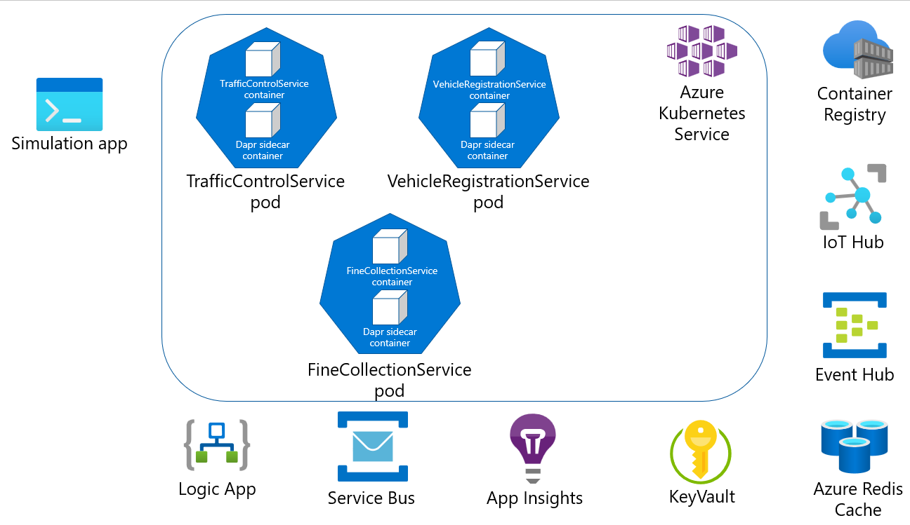

# Challenge 8 - Dapr-enabled Services running in Azure Kubernetes Service (AKS) - Coach's Guide

[< Previous Challenge](./Solution-07.md) - **[Home](./README.md)**

## Notes & Guidance

In this challenge, you're going to deploy the Dapr-enabled services you have written locally to an [Azure Kubernetes Service (AKS)](https://docs.microsoft.com/en-us/azure/aks/) cluster.



### Challenge goals

To complete this challenge, you must reach the following goals:

- Successfully deploy all 3 services (`VehicleRegistrationService`, `TrafficControlService` & `FineCollectionService`) to an AKS cluster.
- Successfully run the Simulation service locally that connects to your AKS-hosted services

### Step 1: Update all port numbers & host names

By default, Dapr sidecars run on port 3500 when deployed to AKS. This means you will need to change the port numbers in the `FineCollectionService` & `TrafficControlService` class files to port 3500 for the calls to Dapr when deploying to the AKS cluster.

Look in the following files and make changes as appropriate.

- `Resources/FineCollectionService/Proxies/VehicleRegistrationService.cs`
- `Resources/TrafficControlService/Controllers/TrafficController.cs`

Also update the host name for each service (in the `Program.cs` file) from `http://localhost` to `http://*` as this will allow the Kestrel server to bind to 0.0.0.0 instead of 127.0.0.1. This is needed to ensure the health probes work in Kubernetes.

- https://miuv.blog/2021/12/08/debugging-k8s-connection-refused/

### Step 2: Build container images for each service & upload to Azure Container Registry

You will need to build these services, create a Docker container image that has this source code baked into it and then upload to an Azure Container Registry. The easiest way to do that is to use [ACR tasks](https://docs.microsoft.com/en-us/azure/container-registry/container-registry-tasks-overview).

1.  Navigate to the `Resources/VehicleRegistrationService` directory & use the Azure Container Registry task to build your image from source.

    ```shell
    az acr build --registry <container-registry-name> --image vehicleregistrationservice:assignment08 .
    ```

1.  Navigate to the `Resources/TrafficControlService` directory & use the Azure Container Registry task to build your image from source.

    ```shell
    az acr build --registry <container-registry-name> --image trafficcontrolservice:assignment08 .
    ```

1.  Navigate to the `Resources/FineCollectionService` directory & use the Azure Container Registry task to build your image from source.

    ```shell
    az acr build --registry <container-registry-name> --image trafficcontrolservice:assignment08 .
    ```

### Step 4: Deploy container images to Azure Kubernetes Service

Now that your container images have been uploaded to the Azure Container Registry, you can deploy these images to your Azure Kubernetes Service. Deployment spec files have been added to each service to make this easier. You will need to customize them to reference your container registry path & AKS ingress.

_IMPORTANT: The Azure Container Registry has the **admin** account enabled to make this demo easier to deploy (doesn't require the deployer to have Owner access to the subscription or resource group the Azure resources are deployed to). **This is not a best practice!** In a production deployment, use a managed identity or service principal to authenticate between the AKS cluster & the ACR. See the [documentation](https://docs.microsoft.com/en-us/azure/container-registry/container-registry-authentication?tabs=azure-cli) for more about the options and how to set up._

1.  Deploy your new services to AKS. Navigate to the `Resources/Infrastructure/Helm/dapr-trafficcontrol` directory and run the following:

    ```shell
    cd Resources/Infrastructure/Helm/dapr-trafficcontrol
    helm upgrade --install dapr-trafficcontrol . --namespace dapr-trafficcontrol --atomic
    ```

1.  Verify your services are running (it may take a little while for all the services to finish starting up). Make sure the **READY** status for all pods says `2/2`.

    ```shell
    kubectl get pods
    ```

    ```shell
    NAME                                           READY   STATUS    RESTARTS   AGE
    fine-collection-service-55c7bfcf64-kqfvf       3/3     Running   0          11s
    traffic-control-service-64dc9cb676-2lcbz       3/3     Running   0          11s
    vehicle-registration-service-dd6fbbbc6-qvt4p   3/3     Running   0          11s
    zipkin-f5c696fb7-ns65k                         1/1     Running   0          11s
    ```

    If you pods are not running (their status is `CrashLoopBackOff`), you will need to look into the pod logs to see what is wrong.

    Remember, there are 3 containers in each pod, the actual service container, the `daprd` container & the `azwi-proxy` pod (which allows the use of workflow identity).

    Example:

    ```shell
    kubectl logs vehicle-registration-service-dd6fbbbc6-sxt4z vehicle-registration-service

    kubectl logs vehicle-registration-service-dd6fbbbc6-sxt4z daprd
    ```

### Step 7: Run Simulation application

Run the Simluation service, which writes to your IoT Hub's MQTT queue. You will begin to see fines get emailed to you as appropriate.

## Security note

To make this example as accesible as possible, SAS tokens and default AKS security settings are in place. In a production environment, a more secure option is to use managed identities for the various services to talk to each other in Azure (for instance, allowing Azure Kubernetes Service to pull from Azure Container Registry) & [AKS security baseline](https://github.com/mspnp/aks-fabrikam-dronedelivery).

## Troubleshooting

If the pods won't start completely, check to see if the health probes aren't passing. You can do this by running the following commands:

```shell
kubectl get pods
kubectl describe pod <pod-name>
```

Error

```shell
Warning  Unhealthy  24m (x5 over 24m)     kubelet            Liveness probe failed: Get "http://10.244.2.28:6000/healthz": dial tcp 10.244.2.28:6000: connect: connection refused
Warning  Unhealthy  4m47s (x42 over 24m)  kubelet            Readiness probe failed: Get "http://10.244.2.28:6000/healthz": dial tcp 10.244.2.28:6000: connect: connection refused
```

If the probes are failing, check to see if all 3 services host names were updated to use `*` instead of `localhost` (look in the `Program.cs` file for each service).

```csharp
public static IHostBuilder CreateHostBuilder(string[] args) =>
  Host.CreateDefaultBuilder(args)
      .ConfigureWebHostDefaults(webBuilder =>
      {
        webBuilder
                .UseUrls("http://*:6002")
                .UseStartup<Startup>();
      });
```
