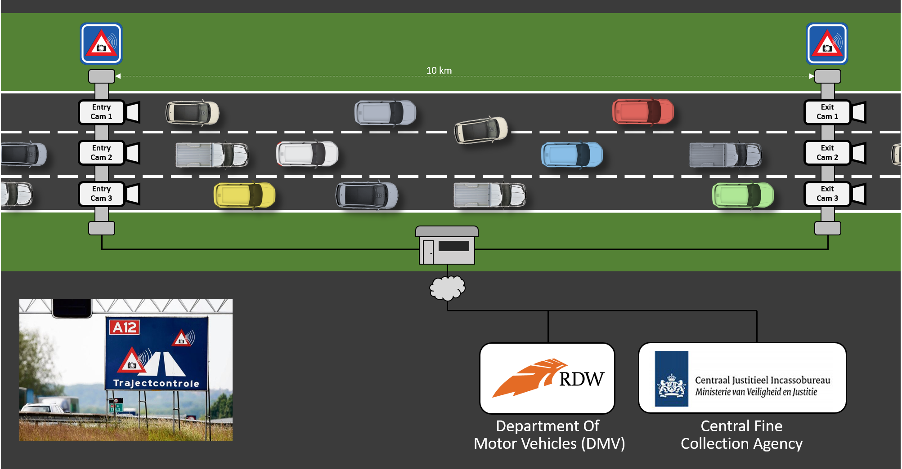

# What The Hack - Traffic Control with Dapr

## Introduction

This hack contains several hands-on challenges that will introduce you to [Dapr](https://dapr.io/). You will start with a simple ASP.NET Core application that is composed of several microservices. In each challenge, you'll enhance the application by adding Dapr building blocks and components. At the same time, you'll configure the application to consume Azure-based backing services. When complete, you'll have implemented the following Dapr building blocks:

- Service invocation
- State-management
- Publish / Subscribe
- Bindings
- Secrets management

As Dapr can run on a variety of hosts, you'll start by running Dapr in self-hosted mode on your computer. Then, you'll deploy the Dapr application to run in Azure Kubernetes Service.

## Learning Objectives

The challenges implement a traffic-control camera system that are commonly found on Dutch highways. Here's how the simulation works:

There's 1 entry-camera and 1 exit-camera per lane. When a car passes an entry-camera, a photo of the license plate is taken and the car and the timestamp is registered.

When the car passes an exit-camera, another photo and timestamp are registered. The system then calculates the average speed of the car based on the entry- and exit-timestamp. If a speeding violation is detected, a message is sent to the Central Fine Collection Agency (or CJIB in Dutch). The system retrieves the vehicle information and the vehicle owner is sent a notice for a fine.

## Challenges

- Challenge 0: **[Install local tools and Azure prerequisites](Student/Challenge-00.md)**
  - Install the prerequisites tools and software as well as create the Azure resources required.
- Challenge 1: **[Run the TrafficControl application](Student/Challenge-01.md)**
  - Run the Traffic Control application to make sure everything works correctly.
- Challenge 2: **[Dapr Service Invocation](Student/Challenge-02.md)**
  - Add Dapr into the mix, using the Dapr service invocation building block.
- Challenge 3: **[Dapr Pub/Sub Messaging](Student/Challenge-03.md)**
  - Add Dapr publish/subscribe messaging to send messages from the `TrafficControlService` to the `FineCollectionService`.
- Challenge 4: **[Dapr Redis State Management](Student/Challenge-04.md)**
  - Add Dapr state management in the `TrafficControlService` to store vehicle information.
- Challenge 5: **[Dapr SMTP Output binding](Student/Challenge-05.md)**
  - Use a Dapr output binding in the `FineCollectionService` to send an email.
- Challenge 6: **[Dapr MQTT Input Binding](Student/Challenge-06.md)**
  - Add a Dapr input binding in the `TrafficControlService`. It'll receive entry- and exit-cam messages over the MQTT protocol.
- Challenge 7: **[Dapr Secrets Management](Student/Challenge-07.md)**
  - Add the Dapr secrets management building block.
- Challenge 8: **[Dapr-enabled Services running in Azure Kubernetes Service (AKS)](Student/Challenge-08.md)**
  - Deploy the Dapr-enabled services you have written locally to an Azure Kubernetes Service (AKS) cluster.

## Contributors

- Jordan Bean
- Eldon Gormsen
- Sander Molenkamp
- Scott Rutz
- Marcelo Silva
- Rob Vettor
- Edwin van Wijk
- Chandrasekar B
