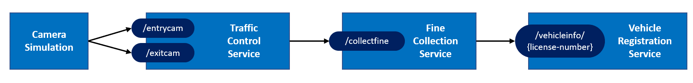

# Challenge 1 - Run the TrafficControl application

[< Previous Challenge](./Challenge-00.md) - **[Home](../README.md)** - [Next Challenge >](./Challenge-02.md)

## Introduction

In this challenge, you'll run the reference application to ensure that everything works correctly.

## Description

As mentioned in the introduction, the hackathon challenges are built upon an existing microservice reference app, entitled the **_Traffic Control Application_**. To start, you'll test the Traffic Control app to ensure that the application runs and your environment is configured correctly. You'll use Visual Studio Code to start each of the 4 microservices shown below:

Keep in mind that you'll be running the application **_without_** Dapr technology. As you work through the challenges, you'll add _Dapr-enable_ the application by adding Dapr Building Blocks and Components to it. Figure depicts the microservices in the reference application.

Run the Simulation application & associated services locally.

- Run the `VehicleRegistrationService`. It exposes a single endpoint that listens for requests for vehicle and owner information.
- Run the `FineCollectionService`. It exposes an endpoint that assigns a fine to a speeding vehicles. To generate a fine, the `FineCollectionService` must make a call to the `VehicleRegistrationService` to obtain driver information.
- Run the `TrafficControlService`. It exposes entry and exit endpoints that capture a vehicle's speed. When a motorist exceeds the speed limit, `TrafficControlService` will call the `FineCollectionService`.
- Run the `Simulation` application. It simulates vehicle traffic at varying speeds. It exposes entry and exit cameras that photograph the license plate of each vehicle. Vehicle telemetry is sent to the `TrafficControlService`.
  - The `Simulation` application is implemented as a Console application, the other services as API applications.

## Success Criteria

- Validate that you have successfully started each of the four microservices with no errors.
- Observe activity flow from the top-level simulation app all the way through the `FineCollectionService`.

## Tips

- Run the services in VS Code using a `dotnet run` command.
  - Using a single VS Code instance, open a [Terminal window](https://code.visualstudio.com/docs/editor/integrated-terminal) **for each service**.
- If you encounter an error, double-check to ensure that you have correctly installed all the [prerequisites](../README.md#Prerequisites)!

## Learning Resources

- [Visual Studio Code](https://code.visualstudio.com/)
- [VS Code Integrated Terminal](https://code.visualstudio.com/docs/editor/integrated-terminal)
- [Dotnet Command Line - Run](https://docs.microsoft.com/dotnet/core/tools/dotnet-run)
