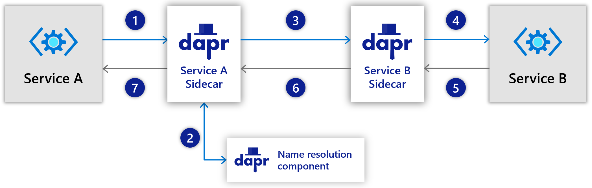
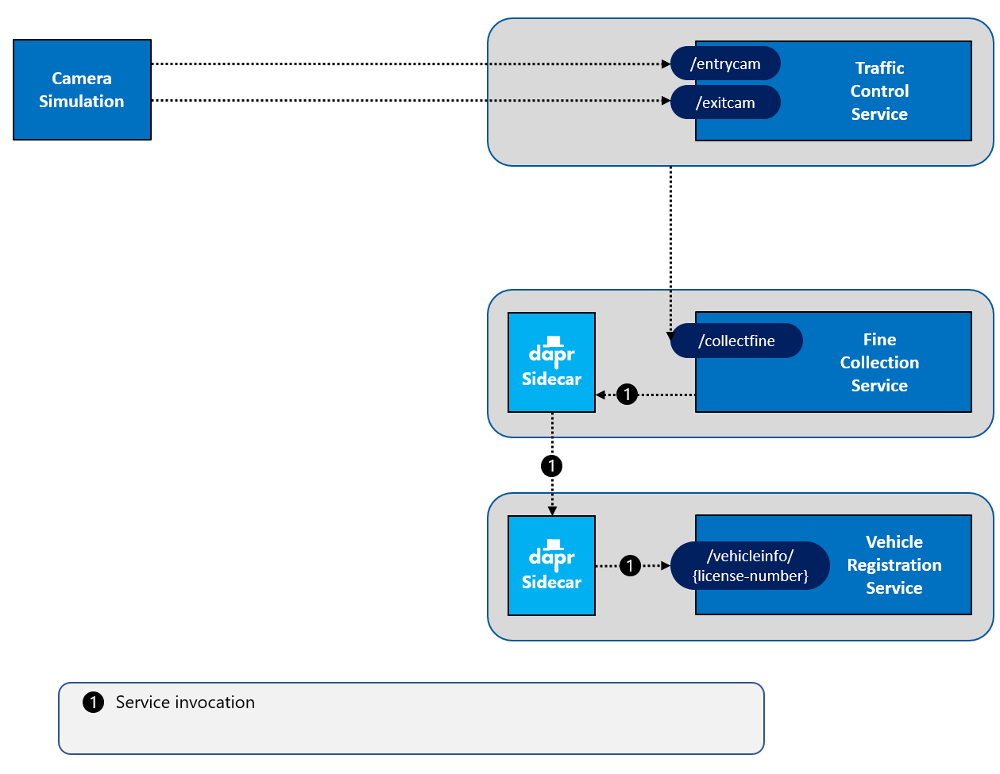
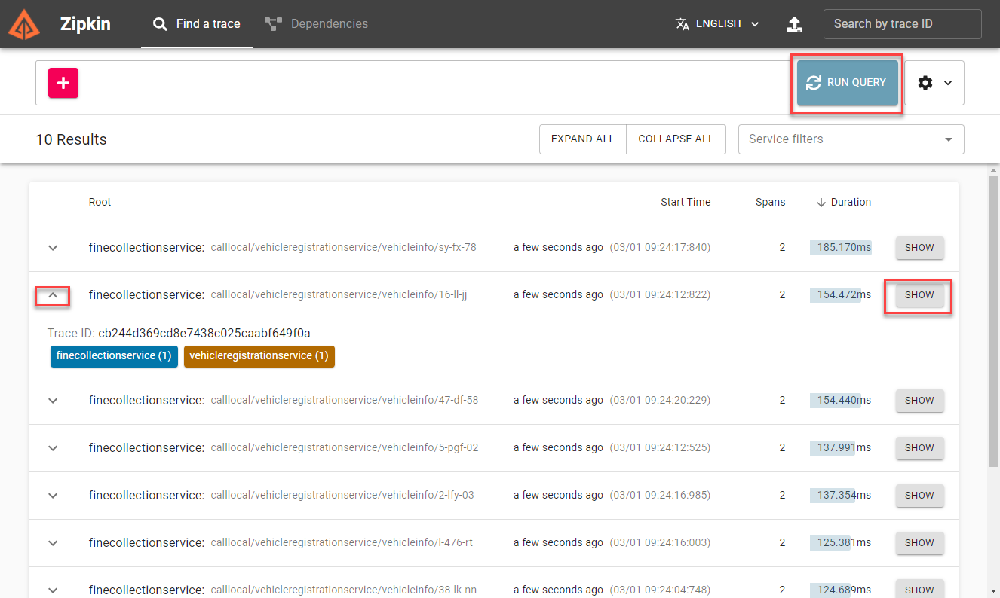
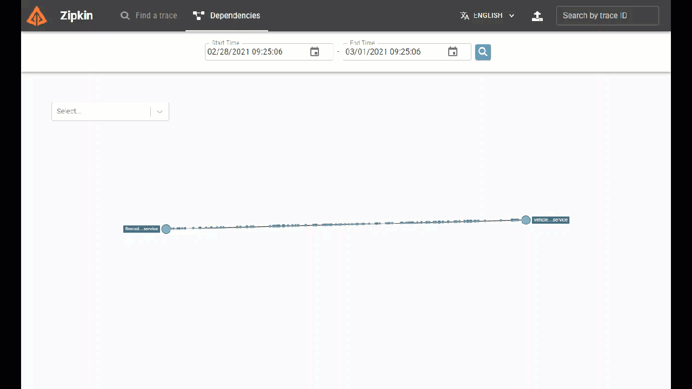

# Challenge 2 - Dapr Service Invocation

[< Previous Challenge](./Challenge-01.md) - **[Home](../README.md)** - [Next Challenge >](./Challenge-03.md)

## Introduction

In this challenge, you're going to add Dapr into the mix, using the Dapr **service invocation** building block.

## Description

While asynchronous communication across microservices is favored, some operations require an immediate response. For such use cases, one microservice effectively _queries_ another for a response that is needed to complete the operation. Such scenarios often implement synchronous calls between services.

Operationally, it's important to not _hardcode_ endpoints when implementing synchronous service calls. This practice becomes especially important in orchestrated environments, such as Kubernetes, where services are continually moved across cluster nodes and replaced with newer versions. The Dapr service invocation building block addresses service-to-service communication. Here is how it works:

In Dapr, every service is started with a unique Id (the _app-id_) which can be used to find it. What happens if Service A needs to call Service B?

1. Service A invokes the Dapr service invocation API (using HTTP or gRPC) on its Dapr sidecar and specifies the unique app-id of Service B.
1. Dapr discovers Service B's current location by using the name-resolution component configured for the hosting environment in which the solution is running.
1. Service A's Dapr sidecar forwards the message to Service B's Dapr sidecar.
1. Service B's Dapr sidecar forwards the request to Service B. Service B executes the corresponding business logic.
1. Service B returns the response for Service A to its Dapr sidecar.
1. Service B's Dapr sidecar forwards the response to Service A's Dapr sidecar.
1. Service A's Dapr sidecar forwards the response to Service A.

_The service invocation building block offers many other features, such as security and load-balancing. Check out the [Dapr documentation](https://docs.dapr.io/developing-applications/building-blocks/service-invocation/service-invocation-overview/) later to learn more._

_Service Invocation is also covered in detail in the [Dapr for .NET Developers](https://docs.microsoft.com/dotnet/architecture/dapr-for-net-developers/service-invocation) guidance eBook._

For this hands-on challenge, you will decouple communication between two services.

- Start up a Dapr sidecar for both the `VehicleRegistrationService` and the `FineCollectionService`.
- Modify the `FineCollectionService` (`VehicleRegistrationService` class) so that it uses the Dapr service invocation building block to call the `/vehicleinfo/{licensenumber}` endpoint on the `VehicleRegistrationService`.
- Restart all services & run the **Simulation** application.

## Success Criteria

This challenge targets the operations labeled as **number 1** in the end-state setup:

- Validate that the `VehicleRegistrationService` and `FineCollectionService` each run with a Dapr sidecar. You'll see both Dapr and application logging in the output.
- Validate that the `FineCollectionService` uses the Dapr service invocation building block to call the `/vehicleinfo/{licensenumber}` endpoint on the `VehicleRegistrationService`. The HTTP call should be to the _Dapr_ port number, not the _API_ port number.

### Use Dapr observability

So how can you check whether or not the call to the `VehicleRegistrationService` is handled by Dapr? Well, Dapr has some observability built in. You can look at Dapr traffic using Zipkin:

- Open a browser and go the this URL: [http://localhost:9411/zipkin](http://localhost:9411/zipkin).
- Click the `RUN QUERY` button in the top right of the screen to search for traces.
- You should see the calls between the `FineCollectionService` and the `VehicleRegistrationService`. You can expand and collapse each trace and click the `SHOW` button to get more details:
  
- If you click the dependencies button and search, you will see the services and the traffic flowing between them:
  

## Tips

- Look in the `Resources.zip` package provided by your coach for the source code to get started.
- Use the `dapr run` command to start up a Dapr sidecar & make sure and append the `dotnet run` command at the end of the command to ensure that both services are started at the same time.
- Refer to the [Prevent port collisions](./Resources/README.md#prevent-port-collisions) section to see what ports to use.
- Make sure you use the same spelling & case for the `app-id` of the `VehicleRegistrationService` as the one used in the `FineCollectionService` class.
  - **IMPORTANT:** Use lowercase letters for the `app-id` of all Dapr services (some Dapr configurations don't support CamelCase)!
- On a Mac, the ports may not be released if Dapr crashes (`port in use` error). Use the following commands to help find the offending process and kill it:
  - `lsof -i :<port>`
  - `ps -al | grep dapr`
  - `kill -9 <pid>`

## Learning Resources

- [Dapr Service Invocation](https://docs.dapr.io/developing-applications/building-blocks/service-invocation/service-invocation-overview/)
- [Dapr for .NET developers - Service Invocation](https://docs.microsoft.com/dotnet/architecture/dapr-for-net-developers/service-invocation)
