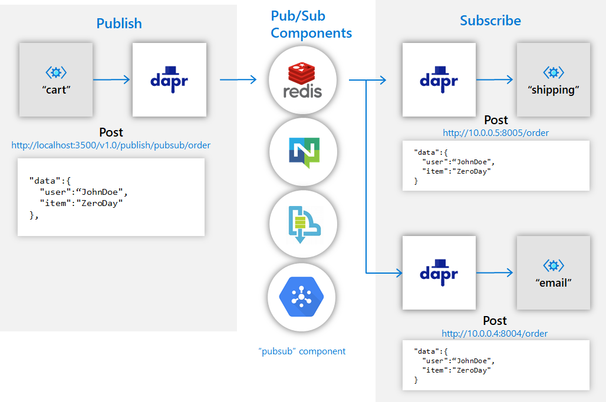
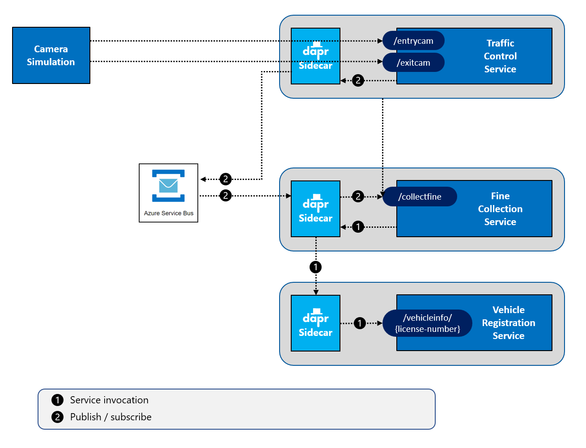
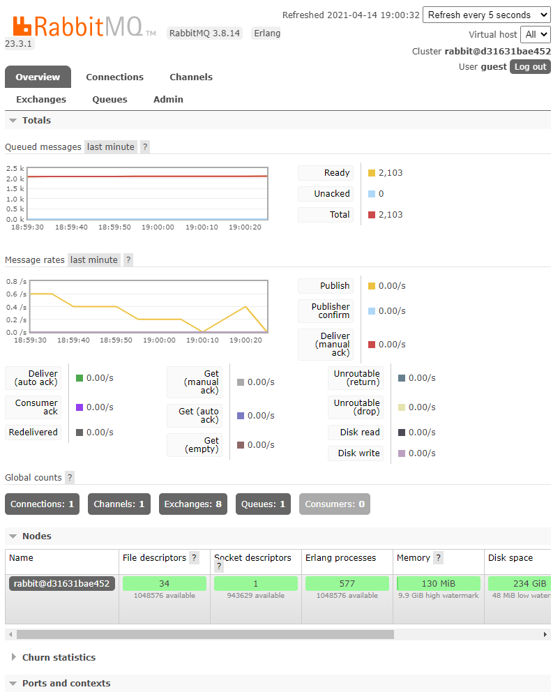

# Challenge 3 - Dapr Pub/Sub Messaging

[< Previous Challenge](./Challenge-02.md) - **[Home](../README.md)** - [Next Challenge >](./Challenge-04.md)

## Introduction

In this challenge, you're going to add Dapr **publish/subscribe** messaging to send messages from the `TrafficControlService` to the `FineCollectionService`.

## Description

In challenge 2, you implemented direct, synchronous communication between two microservices. This pattern is common when an immediate response is required. Communication between services doesn't always require an immediate response.

The publish/subscribe pattern allows your microservices to communicate asynchronously with each other purely by sending messages. In this system, the producer of a message sends it to a topic, with no knowledge of what service(s) will consume the message. A message can even be sent if there's no consumer for it.

Similarly, a subscriber or consumer will receive messages from a topic without knowledge of what producer sent it. This pattern is especially useful when you need to decouple microservices from one another. See the diagram below for an overview of how this pattern works with Dapr:



You will need to modify the services to use the Dapr pub/sub building block.

- Start up a RabbitMQ pub/sub message broker in a Docker container.
- Modify the `TrafficControlService` (`TrafficController` class) so it sends `SpeedingViolation` messages using the Dapr pub/sub building block.
- Modify the `FineCollectionService` (`CollectionController` class) so it receives `SpeedingViolation` messages using the Dapr pub/sub building block.
- Create a Dapr configuration file for specifying the pub/sub Dapr components.
- Restart all services & run the **Simulation** application.
- Once you have the above working, replace the RabbitMQ message broker with Azure Service Bus without code changes.

## Success Criteria

This challenge targets the operations labeled as **number 2** in the end-state setup:



- Validate that the RabbitMQ message broker is running.
- Validate that messages are being sent from the `TrafficControlService` to the `FineCollectionService` using Dapr, not direct service invocation.
- Validate that messages are being received & consumed from the Azure Service Bus.

## Tips

- Start a container instance of a RabbitMQ message broker by entering the following command:
   ```shell
   docker run -d -p 5672:5672 -p 15672:15672 --name dtc-rabbitmq rabbitmq:3-management
   ```
- RabbitMQ provides a built-in dashboard that presents messaging activity, logging, and performance metrics. Open a browser and navigate to [http://localhost:15672/](http://localhost:15672/). Both the login name is `guest` and the password is `guest`. Shown below, the dashboard is helpful for troubleshooting RabbitMQ anomalies:
  
- Put your Dapr configuration files in the `Resources/dapr/components` directory (you will see some existing files related to the Azure Kubernetes Service deployment in [Challenge-08](./Challenge-08.md), you can ignore these for now and put your files here as well)
- Default Dapr configuration files can be found in the following locations:
  - `%USERPROFILE%\.dapr\components\` on Windows
  - `$HOME/.dapr/components` on Linux or Mac
- Copy all the .yaml files from the default Dapr configuration file directory to the `Resources/dapr/components` folder to get started.
- You will need to specify the directory where you provide the custom Dapr configuration files when running the Dapr sidecars.
  ```shell
  dapr run ... --components-path ../dapr/components dotnet run
  ```
- Use Zipkin to observe the messages flow as specified in [Challenge-02](./Challenge-02#use-dapr-observability).
- You might want to create the Azure resources first as it takes some time for the resources to be ready.

## Learning Resources

- [Dapr documentation for publish / subscribe](https://github.com/dapr/docs)
- [Azure Service Bus Messaging - Overview](https://docs.microsoft.com/en-us/azure/service-bus-messaging/service-bus-messaging-overview)
- [Dapr and Azure Service Bus](https://docs.dapr.io/reference/components-reference/supported-pubsub/setup-azure-servicebus/)
- [Dapr and RabbitMQ](https://docs.dapr.io/reference/components-reference/supported-pubsub/setup-rabbitmq/)
- [Cloud Events](https://cloudevents.io/)
