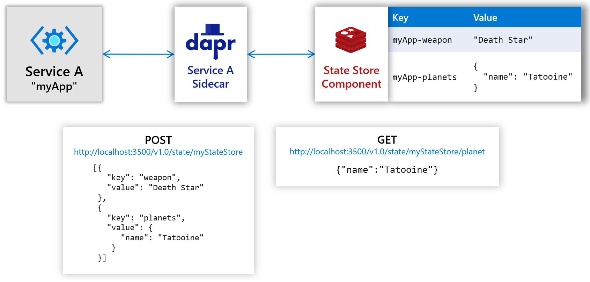
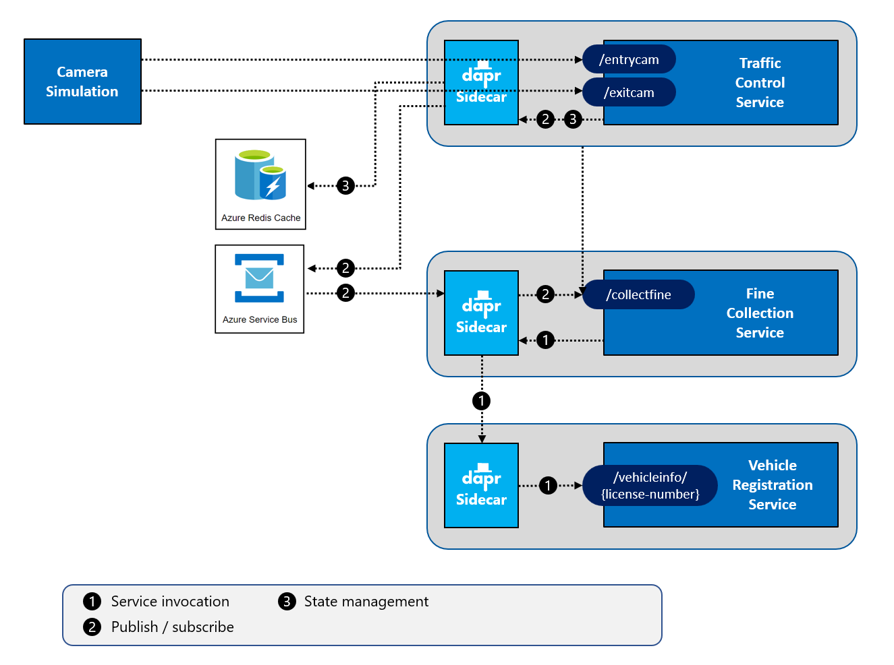

# Challenge 4 - Dapr Redis State Management

[< Previous Challenge](./Challenge-03.md) - **[Home](../README.md)** - [Next Challenge >](./Challenge-05.md)

## Introduction

In this challenge, you're going to add Dapr **state management** in the `TrafficControlService` to store vehicle information.

## Description

Dapr includes APIs that support stateful, long-running services with key/value storage. Services can use these APIs to leverage a variety of popular state stores, without adding or learning a third party SDK.

Furthermore, the Dapr state management building block provides several other features that would otherwise be complicated and error-prone to build yourself:

- Distributed concurrency and data consistency
- Retry policies
- Bulk CRUD operations

The following diagram shows the high level architecture:



Right now, this is all you need to know about this building block. If you want to get more detailed information, read [introduction to the state management building block](https://docs.dapr.io/developing-applications/building-blocks/state-management/).

You will need to modify the services to use the Dapr state management block.

- Create a Dapr configuration file for specifying the state management Dapr component.
- Modify the `TrafficControlService` (`TrafficController` class) so it saves the state of a vehicle (`VehicleState` class) using the Dapr state management building block after **vehicle entry**. Use the HTTP API to call your Dapr sidecar.
- Modify the `TrafficControlService` (`TrafficController` class) so it reads and updates the state of a vehicle using the Dapr state management building block after **vehicle exit**.
- Restart all services & run the `Simulation` application.
- Once you have the above working, modify the solution so that it uses Azure Cache for Redis as a state store instead of the default local Redis cache.

## Success Criteria

This challenge targets the operation labeled as **number 3** in the end-state setup:



- Validate that the `TrafficControlService` has been modified to use the Dapr state management building block when saving vehicle state on **vehicle entry**.
- Validate that the `TrafficControlService` has been modified to use the Dapr state management building block when reading & updating vehicle state on **vehicle exit**.
- Validate the state data is stored in the local Redis cache.
- Validate that state data is stored in Azure Redis cache.

## Tips

- Redis listens on **port 6379** by default.
- Use the redis CLI inside the `dapr_redis` container that is used as the state-store in the default Dapr installation.
  - Run the redis CLI locally:
    ```shell
    docker exec -it dapr_redis redis-cli
    ```
  - Use [Redis CLI commands](https://redis.io/topics/rediscli) like `keys` and `hgetall` to validate data inside the Redis cache store.
- Use [Azure CLI commands for Redis](https://docs.microsoft.com/en-us/cli/azure/redis?view=azure-cli-latest) to get the host, port & Redis password (primaryKey).
  ```shell
  az redis list-keys --name <redis-cache-name> -g <resource-group-name>
  ```
- Use the Azure portal & select the `Redis Cache` resource and click on `Console` to run similar commands as you did in the local Redis cache instance.

## Learning Resources

- [Introduction to the state management building block](https://docs.dapr.io/developing-applications/building-blocks/state-management/)
- [Dapr Redis State Store](https://docs.dapr.io/reference/components-reference/supported-state-stores/setup-redis/)
- [Redis CLI commands](https://redis.io/topics/rediscli)
- [Configure Azure Redis for cach in Dapr](https://docs.dapr.io/getting-started/configure-state-pubsub/#tabs-3-azure)
- [Azure CLI commands for Redis](https://docs.microsoft.com/en-us/cli/azure/redis?view=azure-cli-latest)
