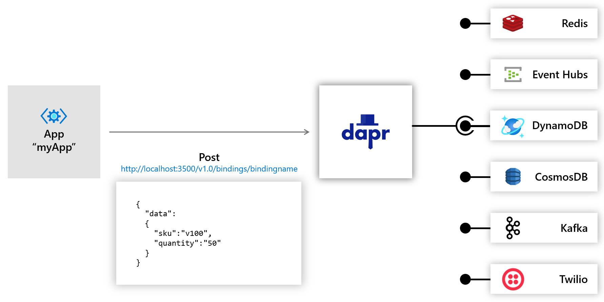
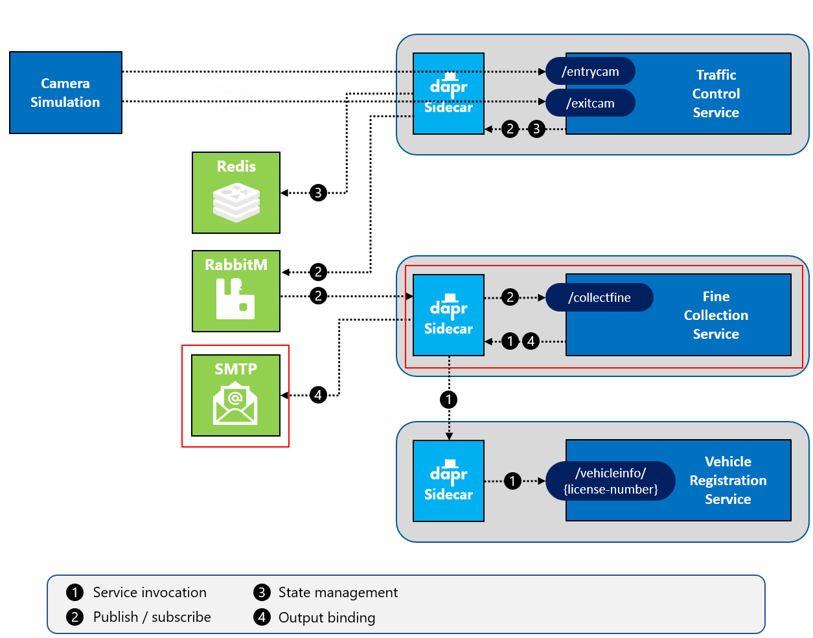
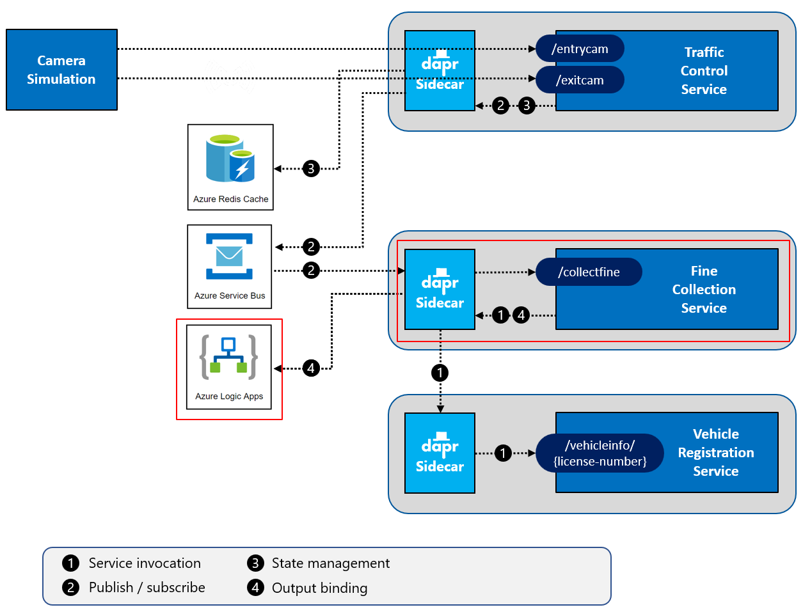

# Challenge 5 - Dapr SMTP Output binding

[< Previous Challenge](./Challenge-04.md) - **[Home](../README.md)** - [Next Challenge >](./Challenge-06.md)

## Introduction

In this challenge, you're going to use a Dapr **output binding** in the `FineCollectionService` to send an email.

## Description

Dapr offers a _bindings_ building block to easily interface with external systems. Bindings are divided into input bindings and output bindings. Input bindings trigger your services by picking up events from external systems. Output bindings are an easy way to invoke functionality of an external system. Both input and output bindings work without the developer having to learn the API or SDK of the external system. You only need to know the Dapr bindings API. See below for a diagram of how output bindings work:



For this hands-on challenge, you will add an output binding leveraging the Dapr binding building block. For detailed information, read the [introduction to this building block](https://docs.dapr.io/developing-applications/building-blocks/bindings/) in the Dapr documentation and the [bindings chapter](https://docs.microsoft.com/dotnet/architecture/dapr-for-net-developers/bindings) in the [Dapr for .NET developers](https://docs.microsoft.com/dotnet/architecture/dapr-for-net-developers/) guidance eBook.

You will need to modify the services to use the Dapr SMTP output bindings.

- Start up a development SMTP server that runs in a Docker container.
- Create a Dapr configuration file for specifying the Dapr SMTP output binding component.
- Modify the `FineCollectionService` (`CollectionController` class) so that it uses the Dapr SMTP output binding to send an email.
- Restart all services & run the `Simulation` application.
- After you get the application running locally, modify it to use an Azure Logic App _using HTTP bindings_ to send the same email instead of the local development SMTP server.

## Success Criteria

This challenge targets the operation labeled as **number 4** in the end-state setup:

**Local**



**Azure**



- Validate that your local development SMTP server is running.
- Validate that the `FineCollectionService` has been modified so that it uses the Dapr sidecar to send out email via an output binding.
- Validate that you receive **speeding violations** in your email when the simulation app runs.
- After modifying your Dapr code to use an Azure Logic App, verify you still receive speeding violation emails.

## Tips

- Use [MailDev](https://github.com/maildev/maildev) for the development SMTP server.
  ```shell
  docker run -d -p 4000:1080 -p 4025:1025 --name dtc-maildev maildev/maildev:latest
  ```
- You can observe the MailDev server locally by navigating to [http://localhost:4000](http://localhost:4000).
- The local SMTP server listens on **port 4025**
- Use the Dapr SDK for setting up the output bindings
  - You will need to add the Dapr client to the Inversion of Control (IoC) container in ASP.NET Core so you can use it in the controller
- Look in the `FineCollectionService/Helpers/EmailUtils.cs` file for a helper class to construct the email.
- Use an Azure Logic App to send out emails when deploying to Azure.
  - You will need to **Authorize** the Office365 connector in the Azure portal for the Logic App so it can send email.
- The SMTP output binding metadata has different casing than the HTTP output binding metadata (`emailFrom` vs. `EmailFrom`, `emailTo` vs. `EmailTo`, `subject` vs. `Subject`)

## Learning Resources

- [Dapr Bindings](https://docs.dapr.io/developing-applications/building-blocks/bindings/)
- [Dapr for .NET developers - bindings](https://docs.microsoft.com/dotnet/architecture/dapr-for-net-developers/bindings)
- [Maildev](https://github.com/maildev/maildev)
- [Smtp Output Bindings](https://docs.dapr.io/reference/components-reference/supported-bindings/smtp/)
- [Smtp Example](https://learn.microsoft.com/en-us/dotnet/architecture/dapr-for-net-developers/bindings#smtp-output-binding)
- [Add Dapr to ASP.NET Core](https://learn.microsoft.com/en-us/dotnet/architecture/dapr-for-net-developers/getting-started#add-dapr-service-invocation)
- [Dapr HTTP output bindings for calling Logic Apps](https://docs.dapr.io/reference/components-reference/supported-bindings/http/)
