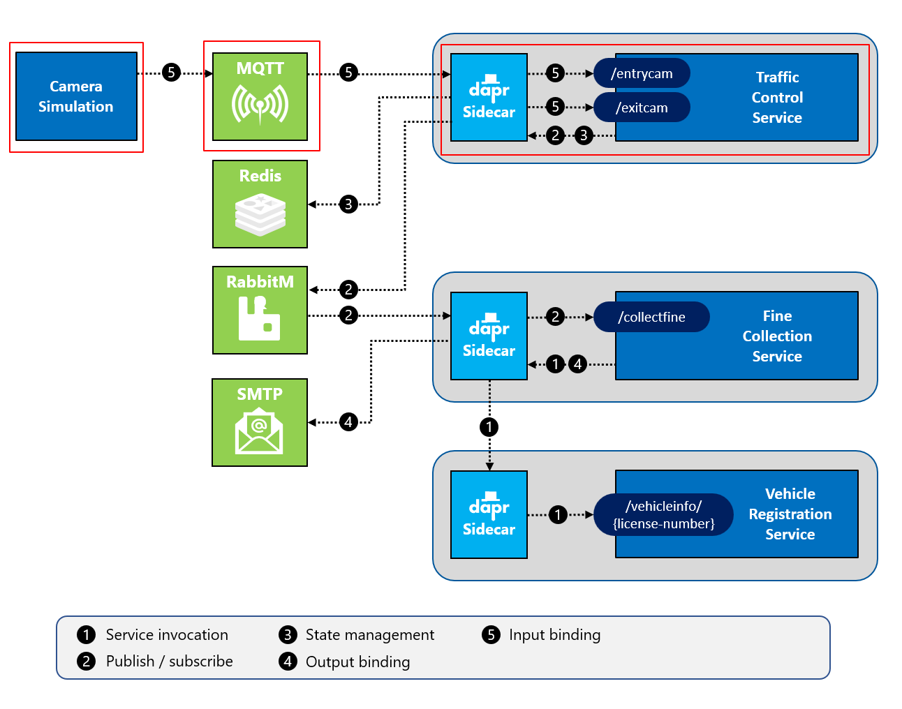

# Challenge 6 - Dapr MQTT Input Binding

[< Previous Challenge](./Challenge-05.md) - **[Home](../README.md)** - [Next Challenge >](./Challenge-07.md)

## Introduction

In this challenge, you're going to add a Dapr **input binding** in the TrafficControlService. It'll receive entry- and exit-cam messages over the MQTT protocol.

## Description

In this challenge you'll focus on Dapr input bindings. The following diagram depicts how input bindings work:


For this hands-on challenge, you will add an input binding leveraging the Dapr binding building block. In the previous challenge, you implemented a Dapr output binding.

- Stand up a Mosquitto MQTT message broker in a Docker container.
- Modify the `TrafficControlService` (`TrafficController` class) to use the Dapr MQTT input binding to receive entry-cam and exit-cam messages over the MQTT protocol.
- Modify the `Simulation` app to put `trafficcontrol/entrycam` & `trafficcontrol/exitcam` messages on the MQTT queue.
  - Create a new class called `MqttTrafficControlService` to do this (look at the `HttpTrafficControlService` as an example).
  - Modify the `Program` class to use this new service.
- Create a Dapr configuration file for specifying the Dapr SMTP input binding components.
- Restart all services & run the **Simulation** application.
- Once you have the solution running locally, modify the code to use Azure IoTHub & EventHub as the MQTT message broker.

## Success Criteria

This challenge targets the operation labeled as **number 5** in the end-state setup:

**Local**



**Azure**


- Validate that the Mosquitto MQTT message broker service is running locally.
- Validate that the `TrafficControlService` receives messages via its Dapr component.
- Validate that the **Simulation** application publishes entry-cam and exit-cam messages to the MQTT broker.
- Validate that messages are being sent through the Azure IoT Hub & EventHub.

### DIY instructions

- Use MQTT broker [Mosquitto](https://mosquitto.org/) for local development.
- In order to connect to Mosquitto, you need to pass in a custom configuration file when starting it. With Docker, you can pass a configuration file when starting a container using a _Volume mount_. The folder `Resources/Infrastructure/mosquitto` already contains a config file you can use.

  1.  Open a terminal window in VS Code and make sure the current folder is `Resources/Infrastructure/mosquitto`.

  1.  Start a Mosquitto MQTT container by entering the following command:
      **When running on Windows**:

      ```shell
      docker run -d -p 1883:1883 -p 9001:9001 -v $pwd/:/mosquitto/config/ --name dtc-mosquitto eclipse-mosquitto
      ```

      **When running on Mac or Linux**:

      ```shell
      docker run -d -p 1883:1883 -p 9001:9001 -v $(pwd)/:/mosquitto/config/ --name dtc-mosquitto eclipse-mosquitto
      ```

  This will pull the docker image `eclipse-mosquitto` from Docker Hub and start it. The name of the container will be `dtc-mosquitto`. The server will be listening for connections on port `1883` for MQTT traffic.

  The `-v` flag specifies a Docker volume mount. It mounts the current folder (containing the config file) as the `/mosquitto/config/` folder in the container. Mosquitto reads its config file from that folder.

- To peak into the Mosquitto server, open a **new** terminal window and execute the following command:

  ```shell
  docker logs dtc-mosquitto
  ```

- Add the following MQTT configuration flags when connecting to the Mosquitto MQTT queue.
  ```csharp
  var configuration = new MqttConfiguration()
  {
    KeepAliveSecs = 60,
    Port = 1883
  };
  ```
- Use [Azure IoT Hub](https://docs.microsoft.com/en-us/azure/iot-hub/) & EventHub for deployments to Azure.

  - Create a IoT Device in Azure IoT Hub to represent your Simulation app.

    ```shell
    az iot hub device-identity create --device-id simulation --hub-name <iot-hub-name>
    ```

  - Get the IoT Hub Connection String for the device you just created.

    ```shell
    az iot hub device-identity connection-string show --device-id simulation --hub-name <iot-hub-name>
    ```

  - Use the `Microsoft.Azure.Devices.Client` NuGet package to connect to the IoT Hub instead of the local MQTT broker.

## Learning Resources

- [Introduction to this building block](https://docs.dapr.io/developing-applications/building-blocks/bindings/)
- [Bindings chapter](https://docs.microsoft.com/dotnet/architecture/dapr-for-net-developers/bindings)
- [Dapr for .NET developers](https://docs.microsoft.com/dotnet/architecture/dapr-for-net-developers/)
- [Azure IoT Hub](https://docs.microsoft.com/en-us/azure/iot-hub/)
